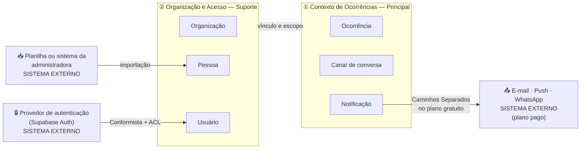
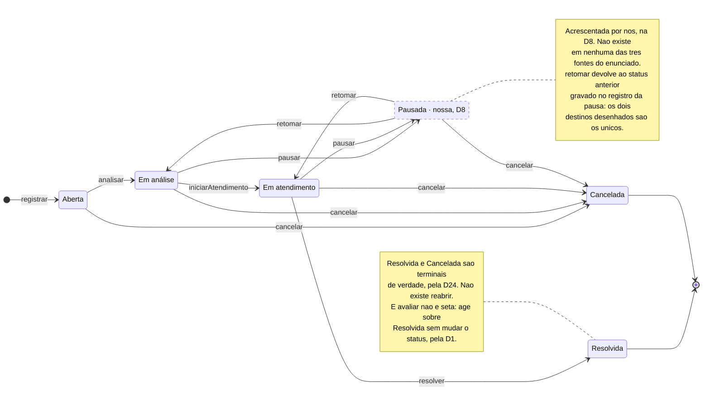
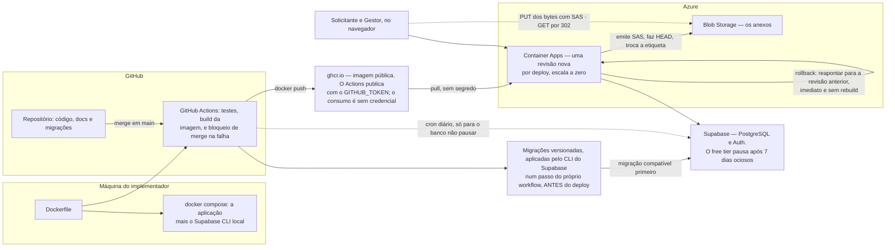

# Arquitetura da Solução — Resolve Aí

Este documento tem duas partes. A **Parte I** é o design estratégico: subdomínios, contextos delimitados,
mapa de contexto, o agregado central e as camadas. A **Parte II** é o requisito técnico da solução, em dez
tópicos, do que a solução é até como ela é validada.

**A prova de conceito não foi feita, e foi decisão consciente.** O que uma POC de deploy exigiria — criar
o projeto, conectar o banco, escrever a primeira migração, montar o `Dockerfile`, publicar — é o esqueleto
do projeto, e não trabalho descartável: seria feito de qualquer forma no primeiro dia. E o instrumento
existe para reduzir incerteza técnica, que aqui é baixa, porque a stack escolhida já foi usada pelo
implementador em outro projeto entregue. No lugar dela, o pipeline de deploy foi a primeira tarefa de
implementação, antes de qualquer código de domínio, para que "está publicado" fosse verdade desde o
primeiro commit.

---

# Parte I — Design Estratégico

## 1. Subdomínios

A classificação diz **onde gastar as poucas horas de modelagem**.

| Subdomínio | Tipo | Por quê |
|---|---|---|
| Ciclo de vida da ocorrência e auditoria das transições | **Principal** | É o que o enunciado destaca, ao exigir que cada transição de status seja auditável, e o que diferencia o produto do grupo de WhatsApp. Todo o esforço de modelagem vai aqui |
| Autenticação | **Genérico** | Problema resolvido, sem diferencial competitivo. Comprado de terceiro |
| Organização, pessoas e vínculos; categorias e áreas; notificação | **Suporte** | Necessários para o Principal funcionar, sem valor próprio. Implementação simples e direta |

## 2. Contextos delimitados

Contexto e subdomínio não são a mesma coisa: o limite de um contexto não é definido pelo subdomínio. O
de-para aqui é de três subdomínios para dois contextos.

| Contexto | Agregados | Subdomínios que abriga |
|---|---|---|
| ① Ocorrências | `Ocorrência`, `Canal de conversa`, `Notificação` | Principal, e parte do Suporte |
| ② Organização e Acesso | `Organização`, `Pessoa`, `Usuário` | Suporte, e o Genérico |

**Por que dois e não seis.** Um contexto delimitado é sempre trabalhado por um time, e aqui há um
implementador: fatiar mais seria arquitetura de enfeite. A fronteira entre ① e ② coincide com o evento que
troca de fase `Ocorrência registrada`, identificado no [Event Storming](event-storming.md), e evento de
troca de fase é indicador de contexto.

**`Notificação` fica em ① e é o candidato natural a extração** se o produto crescer: hoje todos os
gatilhos dela são eventos de ocorrência, e ela não tem nada de específico do domínio.

**`Vínculo` não é um sétimo agregado: ele pertence a `Organização`.** Ele tem comportamento, porque
`vinculo.pode(permissao)` é a única pergunta de autorização do sistema, e comportamento precisa de casa no
Domínio. O critério é o limite de consistência: o `Vínculo` é escopado por `organizacao_id`, é criado e
revogado por um Gestor daquela Organização, e não existe fora dela, então quem decide se ele é válido é a
Organização. A `Pessoa` é o contrário, sendo global, sobrevivendo à revogação e existindo sem vínculo
nenhum, e é por isso que ela é agregado e o `Vínculo` não. Uma raiz própria custaria cerimônia para um
objeto que nunca é carregado sozinho.

## 3. Mapa de contexto e padrões de integração



Três padrões de integração dão conta do desenho, e nomear outros seria vocabulário sem função.

**Conformista**, para o provedor de autenticação. Não há como negociar para que ele se adeque às nossas
necessidades: com custo zero, usa-se auth de terceiro e aceita-se o contrato dele.

**Camada anticorrupção**, entre o provedor e o núcleo. Ela existe para que o subdomínio principal não seja
corrompido pelo formato de um sistema que não controlamos, e traduz-se numa regra de fronteira concreta e
testável: **o agregado `Ocorrência` não conhece formato de token nem claim**. A tradução acontece no ponto
único que resolve o contexto da requisição
([ADR-0003](adr/0003-isolamento-de-tenant-na-camada-de-aplicacao.md)).

**Caminhos Separados**, para justificar o que não integramos: no plano gratuito a notificação não sai do
sistema, e não há integração com monitoramento externo.

**Kernel compartilhado foi descartado**, e é a justificativa para não criar uma biblioteca comum entre os
dois contextos: compartilhar modelo entre contextos viola o princípio que os separa.

## 4. O agregado `Ocorrência`

O mecanismo central da solução, decidido na
[ADR-0001](adr/0001-historico-de-transicoes-como-conceito-de-dominio.md). A premissa é a **consistência
forçada**: somente a lógica do agregado altera o próprio estado.

**Dentro do limite:**

| Elemento | Natureza |
|---|---|
| `Ocorrência` | Entidade raiz |
| `HistoricoTransicao` | Objeto de valor imutável, e a imutabilidade *é* o requisito de auditoria |
| `Localizacao` | Objeto de valor: referência a uma `Área` mais complemento em texto |
| `Avaliacao` | Objeto de valor, opcional, preenchido após `Resolvida` |
| `Adesões` | Lista de pessoas que aderiram |
| Referência à ocorrência original, quando cancelada por duplicidade | Identificador |

**Fora do limite, referenciados por identificador:** `Canal de conversa`, `Notificação`, `Pessoa`,
`Organização`, `Área` e `Categoria`.

**Por que `Canal` fica fora:** mensagem é evento de alto volume e carregaria o agregado inteiro a cada
envio; e nenhuma invariante transacional atravessa os dois, porque a regra de que o canal da atribuição
existe enquanto a atribuição existe é garantida por política, e não por transação.

### Tabela de transições permitidas

Nenhuma outra transição existe. Comandos que não transicionam estão listados abaixo da tabela.

| De | Comando | Para | Quem pode |
|---|---|---|---|
| — | `registrar` | `Aberta` | Solicitante |
| `Aberta` | `analisar` | `Em análise` | Gestor |
| `Aberta` | `cancelar` | `Cancelada` | Solicitante autor, Gestor |
| `Em análise` | `iniciarAtendimento` | `Em atendimento` | Gestor |
| `Em análise` | `pausar` | `Pausada` | Gestor |
| `Em análise` | `cancelar` | `Cancelada` | Solicitante autor, Gestor |
| `Em atendimento` | `resolver` | `Resolvida` | Gestor apenas |
| `Em atendimento` | `pausar` | `Pausada` | Gestor, responsável atribuído |
| `Em atendimento` | `cancelar` | `Cancelada` | Gestor apenas |
| `Pausada` | `retomar` | o `status anterior` do registro de pausa | Gestor |
| `Pausada` | `cancelar` | `Cancelada` | Gestor |

A tabela diz **quem pode**; o diagrama abaixo diz **que forma o grafo tem**. São o mesmo argumento em duas
metades, e por isso ficam juntos: uma transição nova que entre num e não no outro fica visivelmente errada.



**O que este diagrama afirma:** a máquina tem dois poços e nenhum caminho de volta. De `Resolvida` e de
`Cancelada` não se sai, e `Pausada` é o único desvio que retorna, sempre para o estado de onde saiu. O
enunciado desenha os cinco estados sem o desvio, então tudo o que está tracejado é acréscimo nosso.

Os cinco estados e as setas entre eles vêm do enunciado. `Pausada`, as duas setas de `pausar`, as duas de
`retomar` e a seta `Pausada → Cancelada` são nossas (D8, D12). A seta inicial é a premissa P1. A análise
completa de origem e a comparação com as três fontes do enunciado estão em
[`fluxos-e-diagramas.md`](fluxos-e-diagramas.md).

**`Resolvida` e `Cancelada` são terminais de verdade, e não existe `reabrir`** (D24). Problema que volta é
nova ocorrência vinculada à original, reusando o vínculo que a D17 criou para duplicidade. Isso preserva a
D6, que congela a prioridade em estado terminal para o dashboard ser reproduzível, e o sinal não se perde:
"voltou a acontecer" é recorrência, o indicador central da D19.

**Comandos que não transicionam:** `alterarPrioridade`, `atribuirResponsavel`, `reatribuir`,
`recusarAtribuicao`, `reportarExecucaoConcluida`, `registrarSolucaoAplicada`, `avaliar` e `aderir`.

**Não transicionar não é poder ser chamado de qualquer estado**, e a tabela acima não responde por eles,
porque ela tem uma coluna `Para`. O `contrato-de-api.md` delega a resposta para cá: o
`409 TRANSICAO_NAO_PERMITIDA` vale para todo par de status atual e comando fora da tabela.

| Comando | Admitido em | Recusado em | De onde vem |
|---|---|---|---|
| `alterarPrioridade` | `Aberta`, `Em análise`, `Em atendimento`, `Pausada` | `Resolvida`, `Cancelada` | invariante 7 (D6) |
| `avaliar` | `Resolvida` | os cinco demais | invariante 8 (D1) |
| `atribuirResponsavel` | `Aberta`, `Em análise`, `Em atendimento`, `Pausada` | `Resolvida`, `Cancelada` | decidido em 22/08/2026 |
| `registrarSolucaoAplicada` | `Em atendimento`, `Pausada` | `Aberta`, `Em análise`, `Resolvida`, `Cancelada` | decidido em 22/08/2026 |

**A linha de `atribuirResponsavel` cobre a reatribuição:** é um endpoint só, e qual dos dois comandos
aconteceu é derivado do estado, e não da intenção do cliente.

**Por que `atribuir` já em `Aberta`.** A auto-atribuição do Gestor acontece na triagem, a partir do detalhe
da ocorrência, onde ela normalmente está `Aberta`. Proibir ali transformaria um comando em dois, porque o
Gestor precisaria de `analisar` e depois `atribuir`. **Atribuir não é triar: é dizer de quem é.** A conta é
de comandos, e não de toques de tela; medido dentro do detalhe, o fluxo real em `Aberta` é de quatro
toques, porque ali há três comandos renderizáveis e o destaque é `analisar`.

**Os outros três** — `recusarAtribuicao`, `reportarExecucaoConcluida` e `aderir` — não têm endpoint na
primeira entrega, e por isso não têm linha aqui: a regra deles nasce junto com o endpoint. A tabela está
completa de propósito, e não por esquecimento.

**`registrarSolucaoAplicada` recusado em `Resolvida` é uma porta de mão única, e é deliberada.** O caminho
normal não passa por este comando: `/resolver` aceita `solucaoAplicada` no mesmo corpo, com o campo em foco
e pré-preenchido, para que a solução seja escrita no ato (D22). A consequência é que uma ocorrência
resolvida com o campo vazio fica sem solução aplicada para sempre, e é o mesmo congelamento que a
invariante 7 impõe à prioridade, pela mesma razão: o que se lê de um estado terminal tem de ser o que era
verdade quando ele foi alcançado.

### Invariantes

**As oito primeiras são do agregado**, porque dependem só do estado da própria `Ocorrência`, e por isso são
testáveis sem banco. **As duas últimas são do comando de aplicação**, porque atravessam outra tabela no
momento em que o comando roda. A numeração é estável e não muda: `invariante 9` continua sendo a mesma
coisa em todos os documentos que a citam.

O critério que separa as duas famílias: regra que depende do estado do próprio objeto fica na entidade;
regra que coordena vários objetos é do caso de uso. O `modelo-de-dados.md` §8.2 já classificava as
invariantes 9 e 10 como garantidas pela aplicação, com a razão certa. Esta seção é a que concilia os dois
documentos, e não muda comportamento nenhum: muda onde o teste procura a regra.

**Do agregado:**

1. `status` nunca é escrito de fora, e a única porta são os comandos acima.
2. Toda transição produz exatamente um `HistoricoTransicao`, na mesma operação. Não existe transição sem
   registro nem registro sem transição.
3. O histórico é append-only. Registro de auditoria que pode ser editado não é auditoria.
4. A criação gera o primeiro registro, com `status anterior` nulo (premissa P1).
5. `pausar` e `cancelar` exigem motivo estruturado, e a `observação` é obrigatória neles; nas demais
   transições ela é opcional (D23). O princípio: exigir texto onde há decisão a justificar, e não onde é
   avanço rotineiro, porque campo obrigatório em momento rotineiro é preenchido com "ok" e o dado morre.
6. `retomar` usa o `status anterior` do registro de pausa como alvo, e não há campo extra para isso.
7. `prioridade` é imutável em `Resolvida` e `Cancelada` (D6), para que o dashboard seja reproduzível.
8. `avaliar` só é aceito em `Resolvida`, e só do Solicitante autor.

**Do comando de aplicação:**

9. `iniciarAtendimento` exige responsável atribuído (D21), com auto-atribuição em um comando, porque "quem
   está fazendo" é o que o Gestor não sabe hoje. Depende de `atribuicoes`.
10. `resolver` não exige solução aplicada por regra do sistema (D22): ela é induzida por interface, com um
    interruptor por organização para quem precisar exigir. Depende da configuração da `Organização`.

## 5. As quatro camadas e a regra de dependência

As camadas são adotadas como **organização e regra de dependência**, e não como discussão arquitetural.

| Camada | O que pode | O que **não** pode |
|---|---|---|
| Interface (route handlers, telas) | Traduzir HTTP, validar formato | Conter regra de negócio; tocar o banco |
| Aplicação | Resolver o contexto da requisição, orquestrar, transacionar | Conter regra de negócio |
| Domínio | Todas as regras, incluindo a máquina de estados | Persistir; conhecer HTTP, token ou SQL |
| Infraestrutura | Persistência, storage, envio externo | Decidir regra |

**Esta é a regra que protege a ADR-0001.** Se o Domínio não persiste e a Aplicação não tem regra, a lógica
de transição não pode vazar para o handler nem para o repositório, que é onde ela vaza sob pressão de
prazo.

**Uma simplificação comum que aqui não é exercível.** Há arquiteturas em que a camada de Aplicação não
existe e é integrada à de Interface. Aqui isso não cabe, e a razão está na §5 do `contrato-de-api.md`:
existem dois transportes para a mesma leitura, o route handler e o Server Component, e por isso a
autorização vive no serviço de aplicação. Se a checagem estivesse no handler, a estrada direta a
contornaria, e a decisão inteira cairia.

### 5.1 O de-para com os quatro anéis da Clean Architecture

As quatro camadas acima vêm do vocabulário de DDD. A Clean Architecture tem quatro anéis com nomes
próprios — `Entities`, `Use Cases`, `Interface Adapters` e `Frameworks & Drivers` —, e o mapeamento não é
um para um. A diferença está nas duas pontas.

| Nossa camada | Anéis correspondentes | O que a fusão esconde |
|---|---|---|
| Interface | `Frameworks & Drivers`, que é onde o `route.ts` vive, mais `Interface Adapters` na metade de entrada | O route handler não é adaptador: é o anel mais externo. O *Controller* da Clean Architecture é outro objeto, e não existe como objeto no nosso desenho, porque o trabalho dele está dividido entre o handler e a função de aplicação |
| Aplicação | `Use Cases` | Nada. Mapeia bem |
| Domínio | `Entities` | Nada de estrutural |
| Infraestrutura | `Interface Adapters`, no papel de Gateway, mais `Frameworks & Drivers`, com cliente de banco, ORM e storage | **É a fusão que custava.** Nada obrigava o repositório a devolver agregado em vez de linha, e esse vazamento é erro estrutural. Fechado pela [ADR-0005](adr/0005-regra-de-dependencia-por-inversao.md) |

**Por que não renomeamos.** Trocar `Interface` e `Infraestrutura` pelos nomes dos anéis atingiria
referências cruzadas em seis documentos e numa ADR. **O custo de renomear é maior que o de explicar.** O
que a distinção exigia era uma regra, e não um nome, e a regra está na §5.2. A
[ADR-0006](adr/0006-organizacao-de-modulos.md) torna as duas fusões visíveis na árvore de diretórios, sem
renomear camada nenhuma.

**"Agregado" não existe no vocabulário da Clean Architecture:** ela tem `Entities` e `Use Cases`, e nada
entre os dois. O nosso `Ocorrência` é agregado pelo vocabulário de DDD, e o termo sustenta o glossário, a
ADR-0001, o modelo de dados e duas ADRs. O termo fica, e a ausência é lacuna de um vocabulário, e não
excesso do outro. O conceito tem cobertura mesmo sem o nome: regra sobre o próprio estado fica na entidade,
e regra que coordena vários objetos sobe para o caso de uso.

### 5.2 A regra de dependência: inversão é a estrutura, lint é o alarme

**A camada que consome um recurso externo declara a interface; a camada externa implementa e entrega.
Nenhuma camada interna constrói infraestrutura.** Decidida na
[ADR-0005](adr/0005-regra-de-dependencia-por-inversao.md), com três consequências:

1. **A porta é da Aplicação.** Ela declara a interface do repositório, e a Infraestrutura a implementa. O
   Domínio não declara porta nenhuma, porque ele não persiste e quem carrega o agregado é a Aplicação.
2. **A montagem é do anel externo.** O route handler constrói o cliente, monta o repositório escopado e o
   entrega. Nenhuma função de aplicação chama fábrica de infraestrutura.
3. **O que atravessa a porta é agregado ou objeto de leitura declarado, nunca linha de banco.** Uma porta
   bem desenhada tem assinatura em que entra entidade e sai entidade.

**E o lint continua, mais estreito:** nada fora de `infraestrutura/clientes/` importa um SDK, seja de
banco, storage ou autenticação. A redação anterior falava só em cliente de banco e autorizava uma camada
inteira; esta autoriza um diretório e cobre os três SDKs.

**Por que as duas coisas, e não uma.** São garantias de naturezas diferentes: a inversão é estrutura,
porque a camada interna não tem o que importar; o lint é alarme, porque avisa quando alguém reintroduz o
que a estrutura tirou. O lint sozinho não alcança três casos que a ADR-0005 enumera, e o Definition of Done
registra um quarto, o da consulta que parte de `pessoas` em vez de `vinculos`. É a mesma lógica das ADR-0001
e 0003, com a garantia primária agora sendo estrutural.

### 5.3 A organização de módulos

Decidida na [ADR-0006](adr/0006-organizacao-de-modulos.md): **camada no primeiro nível, agregado no
segundo**.

```
app/                              ← Interface, metade externa (imposta pelo Next.js)
  api/<recurso>/route.ts            traduz HTTP, valida formato, monta e entrega
  (rotas de tela)/                  as telas

src/
  interface/                      ← Interface, metade adaptadora
    schemas/                        zod: valida o campo E gera o openapi.yaml
    projecoes/                      agregado → os formatos de resposta (§5.5)
  aplicacao/<agregado>/           ← Aplicação: um arquivo por comando, mais portas.ts
  dominio/<agregado>/             ← Domínio: a raiz, os comandos, as invariantes
  infraestrutura/
    repositorios/<agregado>/        implementam as portas; devolvem agregado
    clientes/                       banco, storage, auth — o único lugar com SDK
    contexto/                       o ponto único de resolução de escopo (ADR-0003)
  composicao/                     ← monta o grafo de objetos; não decide regra
```

**As duas fusões da §5.1 aparecem aqui como diretórios:** `app/` mais `src/interface/` são a camada
Interface; `infraestrutura/repositorios/` mais `infraestrutura/clientes/` são a camada Infraestrutura. A
fronteira que a Clean Architecture desenha por dentro delas fica visível sem renomear camada nenhuma.

**As regras de importação vivem em `eslint.config.mjs`, que é a fonte da verdade delas.** As três primeiras
são de camada e nasceram com a ADR-0006; as demais o esqueleto descobriu serem necessárias para que a §5.2
fosse estrutura, e não convenção. Este documento não conta quantas são, porque o número já mudou duas
vezes.

- **1 · Só para dentro.** De `app/` e `src/interface/` para `aplicacao/`, e de `aplicacao/` para
  `dominio/`. Nunca ao contrário.
- **2 · `infraestrutura/` é importada apenas por `composicao/`.** Nem a Aplicação a importa: ela declara a
  porta e recebe a implementação.
- **2b · `composicao/` é importada apenas pelos caminhos declarados no `eslint.config.mjs`**, hoje
  `src/interface/http/`, `src/interface/acoes/` e `semente/`. Somada à 2, é o que fecha o caminho: `app/`
  não alcança infraestrutura nem composição, então um `route.ts` que não passe pelo ajudante `comContexto`
  não tem porta, não tem consulta e não tem cliente, e não tem *como* falar com o banco. É a defesa
  estrutural do risco número 1 da
  [ADR-0003](adr/0003-isolamento-de-tenant-na-camada-de-aplicacao.md), porque deixa de depender de o
  desenvolvedor lembrar. Acrescentar um consumidor é uma linha escrita de propósito naquele arquivo.
- **3 · Entre módulos da mesma camada, só pela superfície pública**, pelo `index.ts`.
- **A lista fechada, que não é regra de camada:** `semOrganizacao` só é importável nos quatro `route.ts` do
  `contrato-de-api.md` §4.4. O quinto endpoint que tentar não passa no lint, e acrescentá-lo à lista passa a
  ser alteração da ADR-0003 com o caminho do endpoint escrito na configuração.

**Módulo novo passa por dois testes:** é **útil**, com limites e responsabilidade definidos, e é
**competente**, fazendo inteiro o que faz. Pasta vazia por simetria falha os dois, e por isso, dos seis
agregados, só os que têm comportamento na primeira entrega ganham diretório.

### 5.4 A camada de Aplicação: funções, não objetos de caso de uso

**Cada comando de domínio é uma função**, agrupada por agregado, e não uma classe por caso de uso. Casos de
uso devem funcionar de forma independente, sem dividir estado, então uma classe por caso de uso só faria
sentido como grupo de métodos estáticos. A trava é agrupar por agregado, e nunca tudo numa classe só.

O que isso evita é concreto: são onze comandos de domínio, e um objeto por comando multiplicaria a
cerimônia por onze sem mover decisão nenhuma. E o custo por comando já é baixo por desenho, porque com a
ADR-0001 a regra mora no agregado, e a função de aplicação é sempre a mesma sequência: resolver contexto,
carregar o agregado pelo repositório escopado, invocar o comando, persistir na mesma unidade de trabalho, e
devolver.

**Um caso de uso pode chamar outro, de forma explícita.** É o que `atribuir-responsavel` faz: ele realiza
dois comandos, e `Reatribuir` encerra a atribuição vigente antes de criar a nova.

### 5.5 Quem monta a resposta

O contrato de API define três formatos de ocorrência. Montá-los é trabalho de **projeção**, e ele tem dono:
a metade adaptadora da camada de Interface, em `src/interface/projecoes/`.

Não é do Domínio, porque ele não conhece HTTP. E não é do route handler, por duas razões: a tabela de
camadas só lhe permite traduzir HTTP e validar formato; e há dois transportes, então uma projeção que
morasse no handler não existiria para o Server Component, e as duas estradas deixariam de produzir a mesma
resposta.

Na Clean Architecture isso é o **Presenter**, que prepara os dados para o retorno no modelo que o cliente
entende, e é só saída. **Adotado com a redução que o próprio padrão autoriza:** quando os dois lados falam
a mesma língua, e para o TypeScript o JSON é um tipo nativo, o adaptador fica implícito. Então são funções
de projeção puras, e não classes. O que se adota é o lugar e a responsabilidade, e não a cerimônia.

### 5.6 Onde o SOLID aparece

As decisões deste projeto já o aplicam; esta tabela é o rastro, para que a correspondência seja verificável
em vez de alegada.

| Princípio | Onde já está | Decisão |
|---|---|---|
| **S**, responsabilidade única | A tabela de camadas, e sobretudo a coluna "o que não pode": é ela que dá o motivo único a cada camada | §5 |
| **O**, aberto-fechado | Entrega de notificação plugável: a POL-07 é o único ponto que consulta o plano comercial, e um canal novo entra por trás dela sem alterar quem a chama | §6 |
| **L**, substituição de Liskov | O repositório em memória substituindo o real nos testes de aplicação. É o princípio no uso literal, e é o que a ADR-0005 tornou possível | §7, ADR-0005 |
| **I**, segregação de interface | As checagens perguntam `vinculo.pode(X)`, nunca `vinculo.papel == GESTOR`: depende-se do comportamento autorizado, e não do papel concreto | Tópico 5 |
| **D**, inversão de dependência | O ponto único de escopo recebe o contexto resolvido em vez de descobri-lo, e a Aplicação recebe o repositório em vez de fabricá-lo | ADR-0003, ADR-0005 |

### 5.7 De qual camada é cada recusa

O catálogo de códigos de erro do `contrato-de-api.md` põe os quarenta códigos num espaço só, e nenhum
documento dizia de qual camada cada um é. Três da mesma tabela mostram por que a pergunta existe:
`TRANSICAO_NAO_PERMITIDA` é recusa do agregado; `SEM_ORGANIZACAO_ATIVA` é recusa da resolução de contexto;
`CORPO_NAO_SUPORTADO` é transporte.

Isso importa por uma razão só, e é a regra desta seção: **o `status` HTTP não pode viajar junto com o
código**, porque a tabela de camadas proíbe o Domínio de conhecer HTTP. O contrato mostra `codigo` e
`status` lado a lado porque é contrato; o código-fonte não pode copiar essa tabela para dentro do Domínio.

| Natureza da recusa | Quem a produz | Onde nasce |
|---|---|---|
| Regra de negócio: o estado atual não permite, a invariante recusa | Domínio | `src/dominio/erros/` |
| Sessão e escopo: não há sessão, organização ativa ou vínculo ativo na organização pedida | Aplicação | `src/aplicacao/contexto/erros.ts` |
| Transporte: `Content-Type` não suportado, schema violado, cabeçalho divergente | Interface | `src/interface/http/problema.ts`, que é também onde vive o de-para de `codigo` para `status` |

**O `codigo` é o contrato; o `status` é a tradução dele.** É isso que permite que a recusa nasça numa camada
que não conhece HTTP e ainda assim chegue ao cliente como `403`. É a divisão de trabalho da §5.5 aplicada ao
caminho de erro em vez do de sucesso, e o que se adota é o lugar e a responsabilidade, não uma hierarquia de
tipos por camada: o tipo-base é um só, e o que muda é quem o constrói.

Duas fronteiras que a tabela não resolve sozinha:

- **`NAO_AUTENTICADO` é sessão, e não transporte.** O `401` faz parecer transporte, e não é: quem descobre
  que não há sessão válida é quem resolve o contexto, no ponto único da ADR-0003. O código nasce onde a
  descoberta acontece.
- **`PERMISSAO_INSUFICIENTE` mora em `dominio/erros/`, e isso não move autorização para o Domínio.** O que é
  do Domínio é o vocabulário, ou seja, quais permissões um papel tem, respondido por `vinculo.pode(X)`. A
  checagem por comando continua sendo da Aplicação. Um erro definido numa camada pode ser levantado pela de
  fora; o contrário é que não vale.

### 5.8 O carimbo de atualização é do banco, não da aplicação

**Decidido em 22/08/2026, e deliberadamente ainda não implementado.** O `atualizado_em` é mantido por
gatilho `BEFORE UPDATE`, e nenhum comando o escreve.

O argumento é o que sustenta metade da §8 do `modelo-de-dados.md`: **num esquema cuja razão de existir é
auditabilidade, garantia que um script administrativo escapa não é garantia.** Um `UPDATE` de manutenção
por `psql`, que é o caminho que a ADR-0001 nomeia como o que escapa do histórico, deixa o carimbo mentindo
se quem o escreve é a aplicação. E isto não abre exceção na tabela de camadas: o carimbo é forma do dado, e
o gatilho não decide regra nenhuma, apenas registra que a linha mudou, o que é fato sobre a linha e não
sobre o domínio.

**Não entra agora, e isso é parte da decisão.** Nenhuma das tabelas da primeira migração recebe `UPDATE`. O
gatilho entra na primeira migração que precisar, e a linha correspondente entra na §8.1 do
`modelo-de-dados.md` nesse dia, porque antes disso ela seria uma garantia que o esquema não tem. O registro
existe para que aquele dia não comece por uma discussão.

**Uma exceção, e ela é nominal: `ocorrencias.atualizada_em` continua escrita pelo agregado.** Ela não quer
dizer "esta linha mudou", e sim "houve atividade nesta ocorrência", o que inclui mensagem nova, que é
`INSERT` em outra tabela. Um gatilho `BEFORE UPDATE ON ocorrencias` erraria nos dois sentidos: não veria o
`INSERT` em `mensagens`, e carimbaria escritas que não são atividade. É o único carimbo de tempo do esquema
com significado de domínio, e por isso é o único que a regra acima não alcança.

---

# Parte II — Requisito Técnico da Solução

## 1. Descrição Detalhada da Solução

Aplicação **Next.js** única, em TypeScript, empacotada em container e executada no **Azure Container
Apps**, com **Supabase** para PostgreSQL e autenticação, **Azure Blob Storage** para os anexos, e **PWA**
para leitura offline. Internamente organizada em quatro camadas (Parte I, §5) e dois contextos delimitados
(Parte I, §2), com o agregado `Ocorrência` (§4) como centro.

**O container que é construído é o que roda em produção**, pela
[ADR-0004](adr/0004-execucao-em-container-no-azure.md), que substituiu parcialmente a escolha original de
plataforma para eliminar a divergência entre o `Dockerfile` e o ambiente publicado.

O fluxo de uma operação, de ponta a ponta: o cliente chama um route handler; a camada de aplicação resolve
o contexto da requisição, com usuário, pessoa, organização e papel, num ponto único
([ADR-0003](adr/0003-isolamento-de-tenant-na-camada-de-aplicacao.md)); carrega o agregado por um
repositório já escopado à organização; executa um comando de domínio, que valida a transição e emite o
registro de histórico na mesma operação; persiste; e as políticas in-process reagem ao evento, sem nunca
escrever no agregado `Ocorrência`.

**Quais políticas de fato rodam na primeira entrega.** São onze políticas, e **duas rodam**: a POL-01, que
semeia categorias e áreas ao registrar a Organização, e a POL-11, que estabelece o vínculo ao aprovar o
pedido de entrada. As nove restantes dependem de convite, dos canais 2 e 3, de notificação, de plano pago
ou de alarme por tempo, todos evolução prevista, e a POL-08 não escreve nada por desenho.

A consequência é contraintuitiva: **nenhuma política reage a uma transição de status na primeira entrega.**
As duas que rodam reagem a eventos de cadastro, e não do ciclo de vida. O parágrafo acima descreve o
desenho completo; na primeira entrega a operação termina em "persiste".

Duas notas de precisão que decorrem disso. A ressalva de que nenhuma política escreve no agregado vale para
o agregado `Ocorrência`, porque a POL-01 escreve `Categoria` e `Área`, que estão dentro do agregado
`Organização`, e é o trabalho dela. E o único encadeamento previsto entre política e comando, a POL-04
arquivando o canal da atribuição ao reatribuir, não tem canal para arquivar hoje, porque o canal da
atribuição é evolução prevista.

### A arquitetura de referência que não adotamos, componente a componente

Uma arquitetura de referência corrente para aplicações deste tipo tem nove componentes. Registrar o que
entra e o que não entra é mais informativo que descrever só o que foi construído.

| # | Componente | Entra? | Por quê |
|---|---|---|---|
| 1 | Front-end | Sim | Next.js e React, comunicando com o backend por APIs REST próprias |
| 2 | Back-end | Sim | Route handlers do Next.js, mais as camadas de aplicação e domínio |
| 3 | Banco de dados | Sim | PostgreSQL, relacional porque o domínio é relacional e a auditoria exige integridade |
| 4 | Serviços de autenticação | Sim | Supabase Auth, integrado como Conformista com camada anticorrupção |
| 5 | API Gateway | Não | Um único serviço, um único ponto de entrada. Gateway existe para rotear entre serviços |
| 6 | Microsserviços em cloud | Cloud sim, microsserviços não | O serviço roda em nuvem, num container. Microsserviços não, porque são dois contextos e um implementador |
| 7 | Filas e mensageria | Não | Nenhuma operação assíncrona pesada. As políticas são in-process |
| 8 | Monitoramento e log | Parcial | Logs do Container Apps e do banco. Sem ELK nem Prometheus, por Caminhos Separados |
| 9 | Segurança | Sim | Tópico 5 |

## 2. Tecnologias e Ferramentas Utilizadas

Decisão e alternativas rejeitadas em [ADR-0002](adr/0002-stack-e-plataforma.md), com a plataforma de
execução revista pela [ADR-0004](adr/0004-execucao-em-container-no-azure.md) e a camada de interface
decidida pela [ADR-0007](adr/0007-camada-de-interface-com-shadcn-ui.md). Cada escolha justificada contra um
requisito:

| Tecnologia | Justificativa, contra qual requisito |
|---|---|
| Next.js com TypeScript | Deploy único, sem CORS nem tipos duplicados. Um implementador em cerca de seis semanas, que é o risco técnico, o mais alto do projeto |
| PWA com service worker | RNF7, a leitura offline para o Encarregado, sem app nativo; e ajuda o RNF6 em rede ruim |
| Route handlers próprios | As APIs como entregável, e o consumo pelo PWA |
| PostgreSQL | O RNF2, de auditabilidade, exige integridade transacional entre a transição e o registro |
| Supabase Auth | Subdomínio genérico: comprado, e não construído. Prazo |
| Azure Blob Storage | RNF8. Remove o teto de arquivo que o free tier anterior impunha, por cerca de US$ 1 ao ano no nosso volume |
| Azure Container Apps | Deploy em cloud e custo zero: franquia mensal permanente com escala a zero. E é o que faz a conteinerização deixar de ser apenas ambiente local |
| `ghcr.io` | Registro da imagem. Gratuito para imagem pública, e o `GITHUB_TOKEN` do Actions já autentica, sem recurso nem segredo novo |
| Docker com Supabase CLI | A conteinerização que o enunciado exige. Ambiente local completo, incluindo a aplicação em container, e o mesmo `Dockerfile` que vai para produção |
| Tailwind CSS | Pré-requisito do shadcn/ui. Estilo no próprio componente elimina a folha de estilo global como lugar onde regras colidem, que é o modo de falha mais provável de CSS mantido por uma pessoa só |
| shadcn/ui | O risco de usabilidade, o mais alto do projeto, e o RNF6: controles de formulário com foco, teclado e ARIA corretos sem construí-los. O CLI copia o código para o repositório, então nada quebra numa atualização não pedida, e em troca o código é nosso para manter. A integração de formulário é `react-hook-form` com `zod`, e é isso que fecha o círculo, porque o schema que valida o campo é o mesmo que gera o `openapi.yaml`. Detalhes e ressalvas na ADR-0007 |
| Vitest | O RNF2 e a máquina de estados testáveis sem banco, em milissegundos |
| Playwright | Caminho crítico de ponta a ponta, e verificação do RNF1 por fora |
| ESLint com regra de fronteira | Torna mecânica a regra de dependência (Parte I, §5) e o ponto único da ADR-0003 |

## 3. Integrações e Dependências

| Sistema externo | Direção | Como é gerenciada |
|---|---|---|
| Supabase Auth | entra | Conformista: aceitamos o contrato dele. A camada anticorrupção no ponto de resolução de contexto traduz sessão em usuário, pessoa, organização e papel. O domínio nunca vê token |
| Azure Blob Storage | sai e entra | O cliente sobe direto para o Blob, com credencial de escrita temporária e restrita emitida pelo servidor. A chave da conta nunca sai do servidor, e os bytes nunca passam pelo contêiner, o que preserva a franquia de vCPU-s. O objeto só vale depois de reivindicado no registro da ocorrência, e o abandonado é recolhido por regra de ciclo de vida |
| `ghcr.io` | sai | O GitHub Actions publica a imagem, e o Container Apps a consome. Imagem pública, sem credencial de leitura |
| E-mail, push e WhatsApp | sai | Fora da primeira entrega. A POL-07 é o único ponto que consulta o plano, e a entrega é plugável por trás dela. A API do WhatsApp é cobrada por mensagem, e é o canal que mais pressiona o modelo comercial |
| Fonte da carga de pessoas | entra | Importação de arquivo, validada e transformada na camada de aplicação |
| Meio de pagamento | sai | Fora da primeira entrega |

**Dependência de plataforma, declarada:** a solução depende de três provedores, com GitHub para código e
esteira, Azure para execução e storage, e Supabase para banco e autenticação. É uma superfície de
configuração maior que a de um provedor único, e cada peça tem razão própria registrada na
[ADR-0004](adr/0004-execucao-em-container-no-azure.md).

O acoplamento está concentrado na camada de Infraestrutura e na camada anticorrupção de autenticação:
trocar de provedor de banco, de storage ou de auth é trabalho localizado. **Trocar o provedor de execução
deixou de ser caro**, porque a aplicação é um container, e container roda em qualquer lugar. Foi um dos
ganhos da ADR-0004.

## 4. Estratégias de Implementação e Desenvolvimento

**Tópico deliberadamente não desenvolvido.** Arquitetura de software existe e se sustenta
independentemente do processo que a implementa, e metodologia, cerimônias e organização de trabalho não
pertencem à descrição da solução. A numeração é preservada para que a correspondência com o formato
permaneça verificável.

O que este tópico teria de conteúdo técnico está onde ele de fato pertence: a integração contínua e o
bloqueio de merge por falha de teste estão no tópico 7; ambientes, rollout e rollback estão no tópico 9; e
a ausência de revisão de código por pares, consequência de haver um único implementador, está declarada no
Definition of Done.

## 5. Segurança e Conformidade

**Isolamento entre organizações**, que é o risco número um do produto, porque atender várias organizações
na mesma instância é a adição mais cara do projeto. O mecanismo está na
[ADR-0003](adr/0003-isolamento-de-tenant-na-camada-de-aplicacao.md): escopo aplicado num ponto único na
camada de aplicação, e RLS ligada com outra responsabilidade, a de negar acesso direto do cliente ao banco,
forçando todo tráfego pelo servidor.

**Autorização orientada a permissão, e não a papel.** As checagens perguntam `vinculo.pode(X)`, e não
`vinculo.papel == GESTOR`. O mapa de papel para permissões é constante em código, e não há RBAC
configurável na primeira entrega. A migração para permissões em banco, se um dia necessária, não toca
nenhum ponto de checagem.

**Autenticação** delegada, com camada anticorrupção impedindo que formato de token vaze para o domínio.

**Dados pessoais e LGPD** (RNF10): o produto guarda foto e localização de pessoas. Acesso restrito à
organização do vínculo, e exclusão de conta preserva a trilha de auditoria com o autor anonimizado, porque
apagar o histórico destruiria o requisito central do enunciado. Ocorrência em unidade privativa é visível
apenas ao autor e aos Gestores.

**Segredos** em variáveis de ambiente, nunca no repositório, com `.env*` no `.gitignore`. Upload sempre por
URL assinada emitida pelo servidor.

**Fora de escopo, declarado:** pentest, WAF, criptografia em nível de coluna, e auditoria de acesso de
leitura.

## 6. Escalabilidade e Manutenibilidade

**Não foi projetada para escalar: foi projetada para mudar.** É uma escolha, e o número justifica, porque o
RNF3 pede 50 organizações e 2.000 ocorrências. Qualquer stack atende isso com folga, então otimizar para
escala seria otimizar para um problema que não temos.

O que está projetado para mudar:

- **Dois contextos com fronteira nomeada**, e a `Notificação` pode ser extraída sem tocar o domínio.
- **Ponto único de isolamento**, que é um lugar só para mudar se o modelo evoluir.
- **Entrega de notificação plugável**, com a POL-07 como único ponto que consulta o plano comercial.
- **Auditoria como conceito de domínio**, porque o registro de transição já tem formato de evento, o que
  mantém o caminho para event sourcing aberto por custo quase zero.
- **Permissão como conceito**, e RBAC configurável entra trocando a fonte do mapa, sem mexer nas checagens.

**Teto conhecido: o banco.** São 500 MB no free tier, o que comporta cerca de 55.000 ocorrências, quase
trinta vezes o alvo do RNF3. **O storage deixou de ser restrição** com a
[ADR-0004](adr/0004-execucao-em-container-no-azure.md): no Azure Blob, o limite prático na nossa escala é o
custo, e o custo é da ordem de US$ 1 por ano. Enquanto o arquivo vivia no free tier anterior, o gargalo era
o storage, e ele apertava cerca de vinte vezes antes do banco; a restrição que ditava o número do RNF3 era
essa, e ela não existe mais.

## 7. Testes

Plano organizado pelo que cada tipo **protege**, e não por meta de cobertura.

| Tipo | O que protege | Ferramenta | Sem banco? |
|---|---|---|---|
| Unitário de domínio | A máquina de estados e a invariante de auditoria: toda transição gera exatamente um registro, transição ilegal é rejeitada, e `retomar` volta ao `status anterior` | Vitest | Sim |
| Unitário de aplicação | Autorização por comando: quem pode cancelar em cada estado, quem pode resolver. E as invariantes 9 e 10, que atravessam outra tabela e por isso não cabem no teste de domínio | Vitest | Sim, com repositório em memória substituído pela porta ([ADR-0005](adr/0005-regra-de-dependencia-por-inversao.md)), e não por *mock* de módulo |
| Integração de repositório | O ponto único de isolamento (RNF1): consulta em nome da organização A nunca retorna dado de B. É uma suíte compartilhada aplicada a cada consulta escopada, e não um teste escrito do zero por consulta (§7.1) | Vitest com o Postgres do Supabase CLI | Não |
| Ponta a ponta | Caminho crítico: registrar, analisar, atribuir, atender, resolver e avaliar, com histórico conferido na interface, mais a troca de organização no meio do percurso. É um só, para sempre ([ADR-0008](adr/0008-a-suite-de-testes-segue-a-garantia.md)), roda contra o `docker compose` e não é portão por push | Playwright | Não |
| Verificação de fronteira | A regra de dependência da §5.2, com as regras de importação declaradas no `eslint.config.mjs`. É o alarme onde a garantia é estrutural, e é a própria garantia da lista fechada do `contrato-de-api.md` §4.4, que estrutura nenhuma alcança | ESLint | — |
| Verificação de contrato | Que o `docs/api/openapi.yaml` corresponda aos schemas de validação, e que as regras mecânicas da §15 do `contrato-de-api.md` passem | `ferramentas/verificadores/openapi.mjs`, mais o passo do pipeline | — |
| Verificação de diagrama | Que todo bloco Mermaid do repositório tenha sintaxe válida, porque diagrama que não renderiza é documentação que não existe | `mermaid.parse()` sobre os blocos, em Node | — |
| Verificação de referências | Que todo link relativo de `docs/` resolva e que todo `§N` aponte para uma seção que existe. A referência que aponta para o lugar errado é idêntica à que aponta para o certo até alguém clicar, e a banca clica | `ferramentas/verificadores/referencias.mjs` | — |
| Verificação de tom | Que os documentos já reescritos não recaiam nos padrões de densidade e de aparato que a reescrita removeu | `ferramentas/verificadores/tom.mjs` | — |

**A forma da suíte está decidida na [ADR-0008](adr/0008-a-suite-de-testes-segue-a-garantia.md):** a
quantidade de teste segue a natureza da garantia, e não o nível de uma pirâmide. As duas primeiras linhas
crescem por caso, e é onde o volume vai. A de integração cresce por entrada, e não por arquivo. As
verificações não ganham artefato quando uma funcionalidade entra, porque rodam sobre o que existir. E a de
ponta a ponta não cresce.

### 7.1 A suíte de isolamento, e por que ela não é escrita por consulta

O item de Definition of Done que exige que a organização A não veja dado de B é cobrado toda vez que uma
tarefa toca consulta, e são muitas. Se cumpri-lo custar remontar o cenário, ele passa a ser **marcado sem
ser cumprido**, que é pior do que não existir, porque é um portão que aparenta segurar.

Então ele é uma suíte compartilhada aplicada a uma consulta. Ela recebe três coisas:

| O que a consulta declara | Forma |
|---|---|
| como chamá-la já escopada | `(organizacaoId) => …` |
| como ler a organização de uma linha do resultado | `(linha) => …` |
| o que ela precisa que exista, nas duas organizações | a semente do seu próprio agregado |

E gera sempre os mesmos casos: escopada em A devolve só A, escopada em B não contém nada de A, e toda linha
devolvida carrega a organização pedida. **Custo por consulta nova: uma entrada.**

**A armadilha que a suíte tem de preservar é o que decide a forma dela.** O critério A4 do tópico 10 já a
nomeia: semente com pessoas distintas por organização não detecta o erro, porque o vazamento aparece
quando a Pessoa é global e a consulta parte dela. Por isso a suíte é dona das pessoas e das organizações, e
cada entrada semeia apenas o seu próprio agregado. Uma entrada que criasse a própria Pessoa passaria no
teste sem exercer a razão de ele existir.

**O que a suíte não cobre, e continua sendo caso escrito à mão:** o mesmo critério A4 exige um caso próprio
para as duas escritas que rodam fora do funil, ou seja, que pedido de entrada criado com o Código da
Organização A não produza linha escopada em B. São escritas, e não consultas escopadas, e a suíte não as
alcança por desenho, porque ela pergunta o que uma consulta devolve. As duas são caso individual, e são
duas para sempre, porque a lista da ADR-0003 é fechada.

### 7.2 O cenário de teste tem dono

Há dois mundos de teste, em duas linguagens: linhas de SQL no de integração, e objetos em memória no de
aplicação. Com o de ponta a ponta seriam três, e três cópias divergem.

**Um mundo declarado, dois desenhistas.** O mundo é dado puro: duas organizações, a mesma Pessoa vinculada
às duas com papéis diferentes, e uma Pessoa em só uma delas. É o cenário do síndico profissional, e é o
único que detecta o vazamento. Quem o escreve no Postgres é o semeador da integração, e quem o rende em
memória são os duplos da camada de aplicação, que já recebem exatamente essa forma.

**A regra que impede a divergência: um teste pode acrescentar ao mundo, e nunca alterá-lo.** Precisa de uma
área a mais, acrescenta. Precisa de uma terceira organização, ou de outro papel para a Pessoa
compartilhada, monta o seu mundo à parte e diz por quê. Alterar o mundo compartilhado é como o ajuste de um
teste desarma em silêncio a armadilha de outro.

**Integração ao ciclo de vida:** o pipeline roda em todo push, e falha bloqueia merge. E o Definition of
Done exige, por funcionalidade, teste do caminho feliz e de ao menos uma transição inválida, mais transição
gerando histórico verificado em teste. É a defesa processual da auditabilidade, complementar à defesa
estrutural do agregado.

**Fora de escopo, declarado:** teste de desempenho e de segurança automatizados. O RNF4 e o RNF5 são
verificados manualmente no deploy.

## 8. Documentação

| Documento | Onde | Público |
|---|---|---|
| Este documento | `docs/arquitetura.md` | Banca, e o próprio implementador |
| Índice da documentação | `docs/README.md` | Quem abre a pasta |
| Glossário da linguagem ubíqua | `docs/glossario.md` | Todo o grupo: é o contrato de vocabulário |
| Documentação da Demanda | `docs/documentacao-da-demanda.md` | Banca |
| Escopo, o produto e o recorte da entrega | `docs/escopo.md` | Banca, e quem prioriza |
| Event Storming | `docs/event-storming.md` | Banca, e quem quiser ver de onde o modelo saiu |
| Modelo de dados | `docs/modelo-de-dados.md` | Quem for implementar |
| Contrato das APIs | `docs/contrato-de-api.md` e `docs/api/openapi.yaml` | Consumidor da API |
| Fluxos e diagramas | `docs/fluxos-e-diagramas.md` | Quem for implementar, e a banca |
| Inventário de telas | `docs/inventario-de-telas.md` | Quem for implementar a interface |
| Protótipo low-fi | `docs/prototipo-low-fi.md` e `docs/prototipo/telas.html` | Quem for implementar a interface |
| Registros de decisão | `docs/adr/` | Banca, e quem mantiver o código depois |
| Definition of Done e Definition of Ready | `docs/definition-of-done.md` | O grupo |
| Premissas e questões abertas | `docs/premissas-e-questoes-abertas.md` | Banca |
| README com como rodar local | raiz | Quem clonar |

Esta tabela é o de-para de **público**. A lista completa e na ordem de leitura é a do
[`README.md`](README.md) da pasta, para que esta não vire uma segunda fonte que envelhece sozinha.

**Como o contrato de API deixa de ser verdade, e o que impede isso.** Route handlers do Next.js não geram
OpenAPI sozinhos, porque não há decorator nem reflexão. Hoje o `docs/api/openapi.yaml` é escrito à mão, e o
que impede a divergência é o `npm run verificar:openapi`: ele lê o YAML, lê os `app/api/**/route.ts` e
compara, aplicando as regras mecânicas da §15 do `contrato-de-api.md`.

**A decisão de gerar a especificação a partir dos schemas de validação não foi revogada**, e continua sendo
o destino descrito naquela §15. É **dívida declarada, com o portão que a cobre nomeado**. Não deixar isso
por conta de quem implementa segue o mesmo princípio das ADR-0001 e 0003, que recusaram depender de boa
vontade. O que a geração não cobre também está declarado: ela garante forma, e não semântica, porque se o
handler devolver `200` onde a especificação diz `409` nenhuma ferramenta reclama, e quem cobre é o teste de
transição inválida que o Definition of Done exige por funcionalidade.

**Diretriz de operação e manutenção:** o README cobre subir o ambiente local em Docker, rodar migrações e
executar os testes. O plano de implantação está no tópico 9.

**A documentação mora no próprio repositório**, e não em wiki externa, porque wiki externa vira artefato
órfão depois da entrega.

## 9. Plano de Implantação

| Ambiente | Onde | Para quê |
|---|---|---|
| Local | Docker, com a aplicação mais o Supabase CLI | Desenvolvimento e testes de integração |
| Produção | Azure Container Apps, projeto Supabase e Azure Blob Storage | Revisão funcional, demonstração e entrega |

**A cadeia de entrega:** merge em `main`, o GitHub Actions constrói a imagem, publica no `ghcr.io`, e o
Container Apps cria uma revisão nova e passa a servir por ela.



**O que este diagrama afirma:** o `Dockerfile` que roda na máquina do implementador é o mesmo artefato que
serve em produção, e a única seta que não passa pelo contêiner da aplicação é a dos bytes da imagem, que o
usuário escreve direto no storage. **O rollback da aplicação é imediato; o do banco não é, e é por isso que
a migração vai primeiro.**

**Quem aplica a migração é o próprio workflow**, num passo que roda antes de o Container Apps receber a
imagem nova. A alternativa era comando manual antes do merge, e ela foi recusada pelo mesmo motivo das
ADR-0001 e 0003: com ela, a ordem segura passa a depender de alguém lembrar. O passo falhando interrompe a
cadeia e o deploy não acontece, que é o comportamento desejado, porque código novo sobre esquema velho é o
modo de falha que a ordem existe para evitar.

**Região `chilecentral`, com o Supabase em São Paulo, e latência entre app e banco de cerca de 40 ms**,
medida em 23/08/2026. Não é escolha nossa: a assinatura de estudante restringe as regiões permitidas a
cinco, e `brazilsouth` não está entre elas; `chilecentral` é a mais próxima. Nenhum documento deste pacote
prometia app e banco na mesma região, então isto é registro, e não correção. E o tamanho importa: 40 ms
contra o orçamento de 60 s do RNF6 é ruído, e o número que pesa na experiência é o cold start da escala a
zero, que não vem da região. Fica escrito para que ninguém gaste uma tarde tentando mover para o Brasil.

**Rollback:** o Container Apps mantém revisões anteriores e permite redirecionar o tráfego para uma delas,
de forma imediata e sem rebuild. Migrações de banco são versionadas em arquivo e aplicadas pelo CLI, e
migração não é reversível automaticamente, então mudança destrutiva de esquema exige script de volta
escrito à mão. Como o rollback da aplicação é instantâneo e o do banco não é, **a ordem segura é migração
compatível primeiro, código depois**.

### O modo de revisões é precondição do rollback

O parágrafo acima promete redirecionar o tráfego para uma revisão anterior, de forma imediata e sem
rebuild, e **isso só existe no modo de revisões múltiplas**, que não é o padrão do Container Apps. No modo
padrão a única volta é publicar de novo apontando para a etiqueta antiga: cria revisão nova, leva dezenas
de segundos, e não é redirecionar tráfego.

**Decidido: o ambiente roda em modo múltiplo.** Não é preferência operacional, e sim a precondição de uma
garantia que o [`definition-of-done.md`](definition-of-done.md) usa para tirar a revisão funcional do
portão. O argumento de lá, o de que o custo de descobrir tarde é um redirecionamento, só é verdadeiro neste
modo. Provisionado no padrão, a garantia não existiria, e ninguém descobriria até precisar dela, que é o
pior momento possível. **Uma garantia cuja precondição não está escrita é a classe de defeito que este
pacote mais encontrou.**

**E o modo múltiplo traz uma armadilha que o padrão não tem: a revisão nova nasce com peso de tráfego
zero.** Sem alguém apontar, o deploy fica verde e inerte, com a esteira dizendo "publicado" enquanto a URL
continua servindo o código anterior. Por isso o emprego de implantação executa
`az containerapp ingress traffic set --revision-weight latest=100`. Não é detalhe de comando: é o que
impede o modo múltiplo de transformar todo deploy numa mentira silenciosa.

A primeira publicação real de código, em 23/08/2026, mostrou as duas coisas ao mesmo tempo: a revisão
`ca-resolve-ai--0000003` ativa com peso 0, que é o alvo do rollback existindo de verdade, e a
`ca-resolve-ai--0000004` ativa com peso 100, servindo. **A linha de peso zero é a prova de que o caminho de
volta tem alvo.** No modo simples ela não existiria.

### Duas notas operacionais que custaram uma execução vermelha cada

**O `subject` da credencial federada é o formato imutável.** A credencial de deploy foi criada com o
formato que a documentação usa como exemplo, `repo:<dono>/<repositorio>:environment:producao`, e o que o
GitHub apresenta é outro:

```
repo:<dono>@<idNumericoDoDono>/<repositorio>@<idNumericoDoRepositorio>:environment:producao
```

Ele embute os identificadores numéricos para que o vínculo sobreviva a renomeações. O erro foi
`AADSTS700213: No matching federated identity record found`, que não diz nada disso. As duas formas ficam
registradas no aplicativo: a imutável, que é a que funciona, e a nomeada, como rede se a configuração do
GitHub mudar. A lição de método está na [ADR-0004](adr/0004-execucao-em-container-no-azure.md): o `subject`
se descobre lendo o log de uma execução real, e não escrevendo o que se espera.

**O `504` depois de um deploy não é cold start, e o número é outro.** Publicada uma revisão nova, a
primeira requisição respondeu `504`, e o `200` veio cerca de 6 s adiante. Essa janela inclui puxar a imagem
e ativar a revisão, e o gateway desiste antes de a aplicação responder. É consequência de deploy, e não de
ociosidade, e por isso não entra no RNF5, que mede a plataforma acordando do zero: seria outro número com o
mesmo nome. A consequência é de calendário, e vale ao lado do banco que pausa: para a demonstração, acordar
a aplicação antes e não publicar nas horas anteriores.

**O que se perdeu na troca de plataforma, declarado.** Não há mais ambiente de preview por branch, porque a
plataforma anterior gerava URL por branch automaticamente e o Container Apps não faz isso de forma nativa.
A revisão funcional passa a acontecer no ambiente único, com o que isso implica: código não validado chega
ao mesmo lugar que a demonstração. A mitigação é o portão do Definition of Done, e não a infraestrutura.

**Risco de calendário:** o projeto Supabase free pausa após sete dias de inatividade. Se houver demonstração
ao vivo, o banco precisa ser acordado antes. Mitigação: cron diário no GitHub Actions, que faz uma consulta
trivial ao banco.

A mitigação era semanal até 13/09/2026, e falhou: o banco pausou e derrubou a migração da esteira. Sete dias
de janela contra sete dias de intervalo dão margem zero, e o agendador do GitHub é de melhor esforço —
execuções atrasam sob carga. O intervalo diário dá sete tentativas dentro de cada janela.

## 10. Critérios de Aceitação e Validação

**Critérios de solução**, ou seja, o que precisa ser verdade para a solução estar completa.

**Nenhum critério depende de outra pessoa para ser marcado.** Portão que quem faz o trabalho não pode
fechar não é portão: é espera, e ou fica marcado assim mesmo, ou o item fica aberto, e os dois desfechos
são piores que não ter o portão. Onde havia dependência de terceiro, ou a verificação passou para a
esteira, ou o viés ficou declarado, ou o objeto da conferência é um documento e não uma pessoa. O segundo
par de olhos continua existindo, fora do portão, no `definition-of-done.md`.

| # | Critério | Como é validado |
|---|---|---|
| A1 | Os cinco status e as transições da tabela da Parte I, §4, e nenhuma outra | Teste unitário de domínio, incluindo transições ilegais |
| A2 | 100% das transições com os cinco campos do histórico | Teste unitário mais inspeção na interface |
| A3 | Histórico imutável: não existe caminho de escrita que o altere | Revisão da API do agregado, e ausência de operação de update no repositório |
| A4 | Nenhum dado atravessa organizações | Teste de integração no repositório escopado, com duas organizações semeadas e a mesma Pessoa vinculada às duas. Semente com pessoas distintas por organização não detecta o erro, porque o vazamento aparece quando a Pessoa é global e a consulta parte dela. Mais um caso próprio para as duas escritas que rodam fora do funil ([ADR-0003](adr/0003-isolamento-de-tenant-na-camada-de-aplicacao.md)): pedido de entrada criado com o Código da Organização A não produz linha escopada em B |
| A5 | Solicitante e Gestor cumprem todas as capacidades do enunciado | Teste de ponta a ponta do caminho crítico, mais conferência contra o inventário de requisitos. O objeto da conferência é documento, e não pessoa: as capacidades estão escritas e numeradas, e conferir é percorrer a lista |
| A6 | Sobe com `docker compose`, do zero | A esteira sobe o compose num runner limpo e bate na aplicação por HTTP. É o que a linha sempre quis provar, que não há estado local escondido, e prova melhor: não pode ser esquecido, reverifica a cada push, e falha onde o defeito nasceu |
| A7 | Publicado em cloud, acessível por URL | Medido em 23/08/2026, na primeira publicação real: URL no ar, esteira verde nos cinco estágios. Escala do zero em 20,7 s, que é o número do RNF5, contra 0,30 s com a aplicação quente, na mesma revisão. O método é o que torna o número repetível: esperar o `cooldownPeriod` de 300 s e a contagem de réplicas cair a zero antes de cronometrar |
| A8 | Registro de ocorrência pelo celular em menos de 1 minuto (RNF6) | Cronometrado em rede móvel, por quem implementa, em três medições, registrando a mediana e as três. **Aqui não há mecânica possível**, porque celular real em rede móvel não se automatiza, então o viés fica declarado em vez de embutido: quem construiu a tela sabe onde tocar sem procurar e mede um tempo melhor que o de um morador. As três medições e a mediana são o instrumento que sobra contra ele. Procedimento no [`definition-of-done.md`](definition-of-done.md) |
| A9 | Lista de atribuições do Encarregado abre sem rede (RNF7) | **Evolução prevista, e não vale para a primeira entrega.** O critério volta a valer quando o RNF7 entrar, e é verificado com o modo offline do navegador |

**A primeira entrega é validada por A1 a A8.** O A9 está na lista para não se perder, e não para ser
cobrado agora. É dele que vem a ressalva: **critério que valida capacidade fora do escopo é linha morta no
meio de uma lista viva.**

**Validação de produto:** os objetivos O1 a O6 da Documentação da Demanda, com a ressalva já declarada lá
de que não há linha de base. O O6, de auditabilidade em 100%, é o único que não é meta e sim consequência
estrutural do desenho, e é validado por A2 e A3.

O **Definition of Done** por funcionalidade está em [`definition-of-done.md`](definition-of-done.md), e é
ele que impede que testes, container, deploy e documentação fiquem para a última semana.
