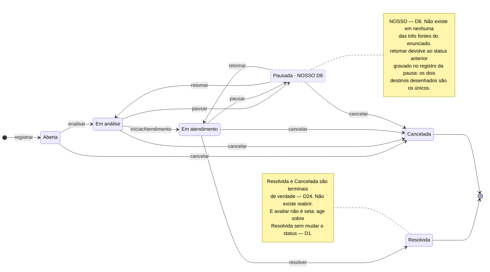
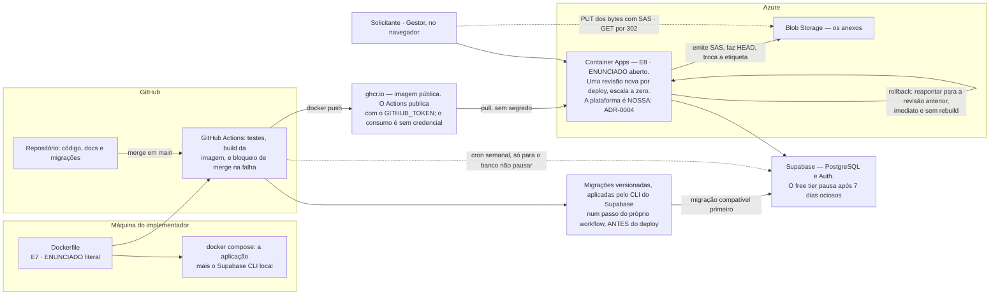

# Arquitetura da Solução — Resolve Aí

Este documento tem duas partes. A **Parte I** é o design estratégico de DDD (aulas 1 a 6): subdomínios,
contextos delimitados, mapa de contexto e o agregado central. A **Parte II** segue o **Documento de
Requisito Técnico da Solução** da aula 8 (p.7–9), nos seus dez tópicos, com os títulos do professor.

> ⚠️ **Pré-requisito do template, e por que divergimos dele.** O professor introduz o template dizendo:
> *"**com as Provas de Conceito (POCs) realizadas e a Arquitetura da solução já desenhada**, o
> preenchimento do requisito técnico é realizado..."* (p.7–8). A arquitetura está desenhada; **a POC não
> foi feita, e foi uma decisão consciente.**
>
> O motivo: o que uma POC de deploy exigiria — criar o projeto, conectar o banco, escrever a primeira
> migração, montar o `Dockerfile`, publicar — **é o esqueleto do projeto, não trabalho descartável**.
> Seria feito de qualquer forma no primeiro dia de implementação. E o instrumento existe para reduzir
> incerteza técnica, que aqui é baixa: a stack escolhida já foi usada pelo implementador em outro
> projeto entregue. Aplicá-lo com força seria correto se a escolha fosse, por exemplo, Java em free tier.
>
> **O que fica no lugar:** o pipeline de deploy é a **primeira tarefa de implementação**, antes de
> qualquer código de domínio — para que "está publicado" seja verdade desde o primeiro commit. Os pontos
> marcados **`⟨a medir no primeiro deploy⟩`** são metas declaradas que se fecham ali, sem exercício
> dedicado.

---

# Parte I — Design Estratégico

## 1. Subdomínios

Taxonomia da aula 1 (Principal, Genérico e de Suporte). A classificação diz **onde gastar as poucas
horas de modelagem**.

| Subdomínio | Tipo | Por quê |
|---|---|---|
| **Ciclo de vida da ocorrência e auditoria das transições** | **Principal** | É o que o enunciado destaca (*"cada transição de status deve ser auditável"*) e o que diferencia o produto do grupo de WhatsApp. Todo o esforço de modelagem vai aqui |
| **Autenticação** | **Genérico** | Problema resolvido, sem diferencial competitivo. Comprado de terceiro (Supabase Auth) |
| **Organização, pessoas e vínculos** · **categorias e áreas** · **notificação** | **Suporte** | Necessários para o Principal funcionar, sem valor próprio. Implementação simples e direta |

## 2. Contextos delimitados

O curso é explícito em que contexto e subdomínio **não são a mesma coisa** — são *"limites que **não**
são definidos pelos subdomínios"* (aula 3, p.8). Nosso de-para é **3 subdomínios → 2 contextos**:

| Contexto | Agregados | Subdomínios que abriga |
|---|---|---|
| **① Ocorrências** | `Ocorrência` · `Canal de conversa` · `Notificação` | Principal + parte do Suporte |
| **② Organização e Acesso** | `Organização` · `Pessoa` · `Usuário` | Suporte + Genérico |

**Por que dois e não seis.** A aula 3 (p.9) autoriza: *"podem existir casos de contextos delimitados que
englobem a solução inteira — **se a solução for muito pequena isso é possível**"*. Somado à regra de que
um contexto é sempre trabalhado por **um time**, e havendo **um implementador**, fatiar mais seria
arquitetura de enfeite. A fronteira entre ① e ② coincide com o evento pivotal `Ocorrência registrada`,
identificado no passo 4 do Event Storming — o professor descreve eventos pivotais como *"importantes
indicadores de contextos delimitados"* (aula 6, p.8), e foi o que se confirmou.

**`Notificação` fica em ① mas é o candidato natural a extração** se o produto crescer: hoje todos os seus
gatilhos são eventos de ocorrência, mas ela não tem nada de específico do domínio.

> **`Vínculo` não é um sétimo agregado: ele pertence ao agregado `Organização` — 22/08/2026.** A tabela
> acima lista seis agregados e o `Vínculo` não está entre eles. Só que ele **tem comportamento** —
> `vinculo.pode(permissao)` é a única pergunta de autorização do sistema (§5.6; `contrato-de-api.md` §4.5) —, e
> comportamento precisa de casa no Domínio. Nenhum documento dizia qual, e o esqueleto teve de escrever a
> classe antes de a pergunta ter resposta.
>
> **O critério é o limite de consistência.** O `Vínculo` é escopado por `organizacao_id`, é criado e
> revogado por um Gestor **daquela** Organização e não existe fora dela: quem decide se ele é válido é a
> Organização. A `Pessoa` é o contrário — **global**, sobrevive à revogação e existe sem vínculo nenhum
> (`modelo-de-dados.md` §6.2) —, e é por isso que ela é agregado e o `Vínculo` não. Uma raiz própria custaria cerimônia
> para um objeto que nunca é carregado sozinho.

## 3. Mapa de contexto e padrões de integração


Dos nove padrões que a aula 4 ensina, **usamos três** — e nomear os outros seis seria vocabulário sem
função:

**Conformista** — para o provedor de autenticação. O exemplo do professor é literalmente OAuth 2.0:
*"não temos como negociar para que ele se adeque às nossas necessidades... temos que nos conformar"*
(aula 4, p.9). Com custo zero, usamos auth de terceiro; nomear a decisão com o termo do curso é preciso
e barato.

**Anticorruption Layer (ACL)** — entre o provedor e o núcleo. O caso 1 da lista do professor (p.12) é
*"quando o contexto Cliente contém um subdomínio principal — isso evita que se corrompa ou interfira na
implementação da solução principal"*. Traduz-se numa regra de fronteira concreta e testável: **o agregado
`Ocorrência` não conhece formato de token nem claim**. A tradução acontece no ponto único que resolve o
contexto da requisição (ADR-0003).

**Caminhos Separados** — para justificar o que **não** integramos. O professor cita "Sistemas de
Autenticação" e "Sistemas de Log" como casos típicos (p.15). Aqui: no plano gratuito, a notificação
**não sai** do sistema; e não há integração com monitoramento externo.

> **Kernel Compartilhado descartado com a fonte:** o próprio professor o desencoraja — *"esse tipo de
> modelo é desencorajado... teoricamente viola todo o princípio dos contextos delimitados"* (aula 4,
> p.6–7). É a justificativa para **não** criar uma "lib comum" entre os dois contextos.

## 4. O agregado `Ocorrência`

O mecanismo central da solução, decidido na [ADR-0001](adr/0001-historico-de-transicoes-como-conceito-de-dominio.md).
A premissa é a **consistência forçada** (aula 5, p.9): *"somente a lógica do agregado pode alterar o seu
estado"*.

**Dentro do limite:**

| Elemento | Natureza |
|---|---|
| `Ocorrência` | Entidade raiz |
| `HistoricoTransicao` | **Objeto de valor imutável** — a imutabilidade *é* o requisito de auditoria |
| `Localizacao` | Objeto de valor (referência a uma `Área` + complemento em texto) |
| `Avaliacao` | Objeto de valor, opcional, preenchido após `Resolvida` |
| `Adesões` | Lista de pessoas que aderiram |
| Referência à ocorrência original, quando cancelada por duplicidade | Identificador |

**Fora do limite, referenciados por id:** `Canal de conversa` · `Notificação` · `Pessoa` ·
`Organização` · `Área` · `Categoria`.

**Por que `Canal` fica fora:** mensagem é evento de alto volume e carregaria o agregado inteiro a cada
envio; e **nenhuma invariante transacional atravessa os dois** — a regra "o canal da atribuição existe
enquanto a atribuição existe" é garantida por política, não por transação.

### Tabela de transições permitidas

Nenhuma outra transição existe. Comandos que **não** transicionam estão listados abaixo da tabela.

| De | Comando | Para | Quem pode |
|---|---|---|---|
| — | `registrar` | `Aberta` | Solicitante |
| `Aberta` | `analisar` | `Em análise` | Gestor |
| `Aberta` | `cancelar` | `Cancelada` | Solicitante autor · Gestor |
| `Em análise` | `iniciarAtendimento` | `Em atendimento` | Gestor |
| `Em análise` | `pausar` | `Pausada` | Gestor |
| `Em análise` | `cancelar` | `Cancelada` | Solicitante autor · Gestor |
| `Em atendimento` | `resolver` | `Resolvida` | **Gestor apenas** |
| `Em atendimento` | `pausar` | `Pausada` | Gestor · responsável atribuído |
| `Em atendimento` | `cancelar` | `Cancelada` | **Gestor apenas** (D12) |
| `Pausada` | `retomar` | **o `status anterior` do registro de pausa** | Gestor |
| `Pausada` | `cancelar` | `Cancelada` | Gestor |

A tabela diz **quem pode**; o diagrama abaixo diz **que forma o grafo tem**. São o mesmo argumento em duas
metades, e por isso ficam juntos: uma transição nova que entre num e não no outro fica visivelmente errada.



> **O que este diagrama afirma:** a máquina tem **dois poços e nenhum caminho de volta** — de `Resolvida`
> e de `Cancelada` não se sai, e `Pausada` é o único desvio que retorna, sempre para o estado de onde
> saiu. O enunciado desenha os cinco estados sem o desvio: **tudo o que está tracejado é nosso**.

Os cinco estados e as setas entre eles são `ENUNCIADO · literal` (fluxo principal, p.3 do PDF, e o
`fluxograma-2`). `Pausada`, as duas setas de `pausar`, as duas de `retomar` e a seta
`Pausada → Cancelada` são `NOSSO` (D8, D12). A seta inicial `[*] → Aberta` é a premissa **P1**. A análise
completa de origem e a comparação com as três fontes do enunciado estão em
[`fluxos-e-diagramas.md`](fluxos-e-diagramas.md).

**`Resolvida` e `Cancelada` são terminais de verdade — não existe `reabrir`** (D24). Problema que volta é
**nova ocorrência vinculada à original**, reusando o vínculo que a D17 criou para duplicidade. Isso
preserva a D6, que congela a prioridade em estado terminal para o dashboard ser reproduzível, e o sinal
não se perde: "voltou a acontecer" é **recorrência**, o indicador central da D19.

**Comandos que não transicionam:** `alterarPrioridade` · `atribuirResponsavel` · `reatribuir` ·
`recusarAtribuicao` · `reportarExecucaoConcluida` · `registrarSolucaoAplicada` · `avaliar` · `aderir`.

**Não transicionar não é poder ser chamado de qualquer estado**, e a tabela acima não responde por eles —
ela tem uma coluna `Para`. O `contrato-de-api.md` delega a resposta para cá: o `409
TRANSICAO_NAO_PERMITIDA` vale *"para todo par (status atual, comando) fora da tabela"*. Onde a regra já
existia, ela é invariante; onde não existia, foi **decidida em 22/08/2026**:

| Comando | Admitido em | Recusado em | De onde vem |
|---|---|---|---|
| `alterarPrioridade` | `Aberta` · `Em análise` · `Em atendimento` · `Pausada` | `Resolvida` · `Cancelada` | **invariante 7** (D6) |
| `avaliar` | `Resolvida` | os cinco demais | **invariante 8** (D1) |
| `atribuirResponsavel` | `Aberta` · `Em análise` · `Em atendimento` · `Pausada` | `Resolvida` · `Cancelada` | decidido em 22/08/2026 |
| `registrarSolucaoAplicada` | `Em atendimento` · `Pausada` | `Aberta` · `Em análise` · `Resolvida` · `Cancelada` | decidido em 22/08/2026 |

**A linha de `atribuirResponsavel` cobre a reatribuição**: é um endpoint só, e qual dos dois comandos
aconteceu é **derivado do estado** — existe atribuição vigente? —, não da intenção do cliente (§5.4).

**Por que `atribuir` já em `Aberta`.** A auto-atribuição do Gestor em um clique acontece na lista de
triagem, onde a ocorrência normalmente está `Aberta`; proibir ali transformaria um clique em dois.
**Atribuir não é triar — é dizer de quem é.**

**Os outros três** — `recusarAtribuicao`, `reportarExecucaoConcluida` e `aderir` — **não têm endpoint na
primeira entrega**, e por isso não têm linha aqui: a regra deles nasce junto com o endpoint. A tabela está
completa de propósito, não por esquecimento.

> **`registrarSolucaoAplicada` recusado em `Resolvida` é uma porta de mão única, e é deliberada.** O caminho
> normal não passa por este comando: `/resolver` aceita `solucaoAplicada` **no mesmo corpo**, com o campo em
> foco e pré-preenchido, exatamente para que a solução seja escrita **no ato** (D22). A consequência é que
> uma ocorrência resolvida com o campo vazio fica **sem solução aplicada para sempre** — e é o mesmo
> congelamento que a invariante 7 já impõe à prioridade, pela mesma razão: o que se lê de um estado terminal
> tem de ser o que era verdade quando ele foi alcançado.

### Invariantes

**As oito primeiras são do agregado** — dependem só do estado da própria `Ocorrência`, e por isso são
testáveis sem banco. **As duas últimas são do comando de aplicação**, porque atravessam outra tabela no
momento em que o comando roda. A numeração é estável e não muda: `invariante 9` continua sendo a mesma
coisa em todos os documentos que a citam.

> **Por que a distinção existe.** A Clean Architecture da Fase 5 dá o critério (aula 3, p.8–9): regra que
> depende **do estado do próprio objeto** fica na entidade; regra que **coordena vários objetos** é do caso
> de uso — *"essas informações não estão definidas nas entidades, porque não estão relacionadas diretamente
> ao estado delas, e sim a uma regra complexa definida como um Caso de Uso"*. O `modelo-de-dados.md` §8.2
> já classificava as invariantes 9 e 10 como *"garantidas pela aplicação"*, com a razão certa — *"atravessa
> duas tabelas no momento do comando"* e *"depende de configuração de outra tabela"*. Os dois documentos
> estavam certos em separado e discordavam sobre a mesma linha. **Esta é a linha que os concilia**, e não
> muda comportamento nenhum: muda onde o teste procura a regra.

**Do agregado** — dependem só do estado da própria `Ocorrência`:

1. `status` **nunca** é escrito de fora — a única porta são os comandos acima.
2. Toda transição produz **exatamente um** `HistoricoTransicao`, na mesma operação. Não existe transição
   sem registro nem registro sem transição.
3. O histórico é **append-only**. Registro de auditoria que pode ser editado não é auditoria.
4. A criação gera o primeiro registro, com `status anterior` nulo (**premissa P1**).
5. `pausar` e `cancelar` exigem **motivo estruturado**, e a `observação` é **obrigatória** neles; nas
   demais transições ela é **opcional** (D23). O princípio: exigir texto onde há decisão a justificar, não
   onde é avanço rotineiro — campo obrigatório em momento rotineiro é preenchido com "ok" e o dado morre.
6. `retomar` usa o `status anterior` do registro de pausa como alvo — **não há campo extra para isso**.
7. `prioridade` é imutável em `Resolvida` e `Cancelada` (D6), para que o dashboard seja reproduzível.
8. `avaliar` só é aceito em `Resolvida`, e só do Solicitante autor.

**Do comando de aplicação** — atravessam outra tabela, e por isso não cabem no agregado:

9. **`iniciarAtendimento` exige responsável atribuído** (D21), com auto-atribuição em um clique — "quem
   está fazendo" é exatamente o que o Gestor não sabe hoje. Depende de `atribuicoes`.
10. **`resolver` não exige solução aplicada por regra do sistema** (D22): ela é induzida por UX, com um
    interruptor por organização para quem precisar exigir. Depende da configuração da `Organização`.

## 5. As quatro camadas e a regra de dependência

> **Convenção de citação, válida nesta seção.** Aqui convivem duas disciplinas com aulas de mesmo número.
> **`DDD aula N`** é a Fase 1; **`CA aula N`** é Clean Architecture, da Fase 5. No resto do documento,
> `aula N` sem prefixo continua sendo DDD.

Camadas do **DDD aula 5 (p.5–7)**, adotadas como **organização e regra de dependência** — não como
discussão arquitetural.

| Camada | O que pode | O que **não** pode |
|---|---|---|
| **Interface** (route handlers, telas) | Traduzir HTTP, validar formato | Conter regra de negócio; **tocar o banco** |
| **Aplicação** | Resolver o contexto da requisição, orquestrar, transacionar | Conter regra de negócio |
| **Domínio** | Todas as regras, incluindo a máquina de estados | **Persistir**; conhecer HTTP, token ou SQL |
| **Infraestrutura** | Persistência, storage, envio externo | Decidir regra |

**Esta é a regra que protege a ADR-0001.** Se o Domínio não persiste e a Aplicação não tem regra, a
lógica de transição não pode vazar para o handler nem para o repositório — que é exatamente onde ela vaza
sob pressão de prazo.

> **Uma permissão do material que não exercemos.** O DDD aula 5 (p.5) autoriza simplificar: *"em algumas
> arquiteturas, essa camada [Aplicação] não existe, ela é integrada à camada de interface de usuário"*.
> **Aqui ela não é exercível**, e a razão está na §5 do `contrato-de-api.md`: existem **dois transportes** para
> a mesma leitura — o route handler e o Server Component —, e por isso a autorização vive no serviço de
> aplicação, não no handler. *"Se a checagem estivesse no handler, a estrada direta a contornaria, e a
> decisão inteira cairia."* A citação está correta; a simplificação é que não cabe neste projeto.

### 5.1 O de-para com os quatro anéis da Clean Architecture

As quatro camadas acima vêm do DDD. A Clean Architecture (Fase 5) tem **quatro anéis com nomes próprios**
— `Entities` · `Use Cases` · `Interface Adapters` (Controllers, Gateways, Presenters) · `Frameworks &
Drivers` —, e o mapeamento **não é um para um**. A diferença está **nas duas pontas**:

| Nossa camada | Anel(éis) da Clean Architecture | O que a fusão esconde |
|---|---|---|
| **Interface** | `Frameworks & Drivers` (o `route.ts` — *"é nesta camada que fazemos a implementação das rotas da nossa API"*, CA aula 5, p.6) **+** `Interface Adapters` na metade de entrada | O route handler **não é adaptador**: é o anel mais externo. O *Controller* da Clean Architecture é outro objeto, e **não existe como objeto no nosso desenho** — o trabalho dele está dividido entre o handler e a função de aplicação |
| **Aplicação** | `Use Cases` | Nada. Mapeia bem |
| **Domínio** | `Entities` | Nada de estrutural. Ver a ressalva sobre "agregado", abaixo |
| **Infraestrutura** | `Interface Adapters` (o **Gateway**) **+** `Frameworks & Drivers` (cliente de banco, ORM, storage) | **É a fusão que custava.** Nada obrigava o repositório a devolver **agregado** em vez de **linha** — o vazamento que a CA aula 3 (p.6–7) chama de *"erro estrutural"*. Fechado pela [ADR-0005](adr/0005-regra-de-dependencia-por-inversao.md) |

**Por que não renomeamos.** Trocar `Interface` e `Infraestrutura` pelos nomes dos anéis atingiria
referências cruzadas em `contrato-de-api.md`, `modelo-de-dados.md`, `definition-of-done.md`,
`fluxos-e-diagramas.md`, `inventario-de-telas.md` e na ADR-0003. **O custo de renomear é maior que o de
explicar** — e o vocabulário atual tem a virtude de vir da mesma disciplina de onde vem o resto do
vocabulário do projeto. O que a distinção exigia era uma **regra**, não um nome, e a regra está na §5.2. A
[ADR-0006](adr/0006-organizacao-de-modulos.md) torna as duas fusões visíveis na árvore de diretórios, sem
renomear camada nenhuma.

> **"Agregado" não existe na Clean Architecture.** Ela tem `Entities` e `Use Cases`, e **nada entre os
> dois**. Nosso `Ocorrência` é agregado pelo DDD (aula 5, p.9), e o termo sustenta o glossário, a ADR-0001,
> o modelo de dados e duas ADRs. **Mantemos o termo** — e registramos que a ausência é lacuna da disciplina
> da Fase 5, não excesso nosso. A CA aula 3 (p.8–9 e transcrição 01) dá cobertura ao conceito sem o nome:
> regra sobre o próprio estado fica na entidade (*"uma venda zerada não existe... é responsabilidade da
> venda cuidar disso"*); regra que coordena vários objetos sobe para o caso de uso.

### 5.2 A regra de dependência: inversão é a estrutura, lint é o alarme

> **A camada que consome um recurso externo declara a interface; a camada externa implementa e entrega.
> Nenhuma camada interna constrói infraestrutura.**

É a regra 1 da **CA aula 8, p.8**: *"os componentes internos devem sempre definir uma interface para
'receber' este componente externo"*. Decidida na
[ADR-0005](adr/0005-regra-de-dependencia-por-inversao.md), com três consequências:

1. **A porta é da Aplicação.** Ela declara a interface do repositório; a Infraestrutura a implementa. O
   **Domínio não declara porta nenhuma** — ele não persiste, e quem carrega o agregado é a Aplicação.
2. **A montagem é do anel externo.** O route handler constrói o cliente, monta o repositório escopado e o
   entrega. Nenhuma função de aplicação chama fábrica de infraestrutura.
3. **O que atravessa a porta é agregado ou objeto de leitura declarado — nunca linha de banco.** O Gateway
   da CA aula 5 (p.8–9) tem assinatura `obterEstudantePorPessoa(PessoaEntity): EstudanteEntity`: entra
   entidade, sai entidade.

**E o lint continua, mais estreito:** *nada fora de `infraestrutura/clientes/` importa um SDK* — banco,
storage ou autenticação. A redação anterior falava só em "cliente de banco" e autorizava uma camada
inteira; esta autoriza **um diretório** e cobre os três SDKs.

**Por que as duas coisas, e não uma.** São garantias de naturezas diferentes: a **inversão é estrutura** —
a camada interna não tem o que importar; o **lint é alarme** — avisa quando alguém reintroduz o que a
estrutura tirou. O lint sozinho não alcança três casos que a ADR-0005 enumera, e o Definition of Done já
registra um quarto que ele não alcança (a consulta que parte de `pessoas` em vez de `vinculos`). É a mesma
lógica das ADR-0001 e 0003 — garantia mecânica em vez de boa vontade —, com a garantia primária agora
sendo estrutural.

### 5.3 A organização de módulos

Decidida na [ADR-0006](adr/0006-organizacao-de-modulos.md): **camada no primeiro nível, agregado no
segundo**. É a organização da estrutura de referência da CA aula 8 (transcrição 01), com o critério de
agrupamento por agregado da CA aula 7 (transcrição 02).

```
app/                              ← Interface, metade externa (imposta pelo Next.js)
  api/<recurso>/route.ts            traduz HTTP, valida formato, monta e entrega
  (rotas de tela)/                  as dez telas

src/
  interface/                      ← Interface, metade adaptadora
    schemas/                        zod: valida o campo E gera o openapi.yaml
    projecoes/                      agregado → os formatos de resposta (§5.5)
  aplicacao/<agregado>/           ← Aplicação: um arquivo por comando, mais portas.ts
  dominio/<agregado>/             ← Domínio: a raiz, os comandos, as invariantes
  infraestrutura/
    repositorios/<agregado>/        implementam as portas; devolvem agregado
    clientes/                       banco, storage, auth — o único lugar com SDK
    contexto/                       o ponto único de resolução de escopo (ADR-0003)
  composicao/                     ← monta o grafo de objetos; não decide regra
```

**As duas fusões da §5.1 aparecem aqui como diretórios:** `app/` mais `src/interface/` são a camada
Interface; `infraestrutura/repositorios/` mais `infraestrutura/clientes/` são a camada Infraestrutura. A
fronteira que a Clean Architecture desenha por dentro delas fica visível **sem renomear camada nenhuma**.

**Cinco regras de importação.** As três primeiras são de camada e nasceram com a ADR-0006; as duas últimas
o esqueleto descobriu serem necessárias para que a §5.2 fosse **estrutura** e não convenção, e entraram por
emenda de 22/08/2026. Todas vivem em `eslint.config.mjs`.

- **1 · Só para dentro** — `app/` e `src/interface/` → `aplicacao/` → `dominio/`. Nunca ao contrário.
- **2 · `infraestrutura/` é importada apenas por `composicao/`.** Nem a Aplicação a importa: ela declara a
  porta e recebe a implementação.
- **2b · `composicao/` é importada apenas por `src/interface/http/`.** Somada à 2, é o que fecha o caminho:
  **`app/` não alcança infraestrutura nem composição**, então um `route.ts` que não passe pelo ajudante
  `comContexto` não tem porta, não tem consulta e não tem cliente — não tem *como* falar com o banco. É a
  defesa estrutural do risco nº 1 da [ADR-0003](adr/0003-isolamento-de-tenant-na-camada-de-aplicacao.md):
  deixa de depender de o desenvolvedor lembrar.
- **3 · Entre módulos da mesma camada, só pela superfície pública** (`index.ts`).
- **A lista fechada, que não é regra de camada** — `semOrganizacao` só é importável nos **quatro `route.ts`
  do `contrato-de-api.md` §4.4**. O quinto endpoint que tentar não passa no lint, e acrescentá-lo à lista passa a ser
  emenda à ADR-0003 **com o caminho do endpoint escrito na configuração**.

**Módulo novo passa por dois testes** (CA aula 6, p.5): é **útil** — limites e responsabilidade definidos —
e é **competente** — faz inteiro o que faz. Pasta vazia por simetria falha os dois: dos seis agregados, só
os que têm comportamento na primeira entrega ganham diretório.

### 5.4 A camada de Aplicação: funções, não objetos de caso de uso

**Cada comando de domínio é uma função**, agrupada por agregado — não uma classe por caso de uso. É a regra
da **CA aula 4, p.7**:

> *"Os casos de uso podem ser agrupados em classes e módulos/bibliotecas/pacotes... **No caso do uso de uma
> classe, precisamos implementar isso como um grupo de métodos estáticos, uma vez que os casos de uso devem
> funcionar de forma independente, sem dividir estado.**"*

Com a única trava da CA aula 7 (transcrição 02): agrupar por agregado, **nunca tudo numa classe só**.

O que isso evita é concreto: são **onze comandos de domínio**, e um objeto por comando multiplicaria a
cerimônia por onze sem mover decisão nenhuma. E o custo por comando já é baixo por desenho — com a
ADR-0001 a regra mora no agregado, então a função de aplicação é sempre a mesma sequência: **resolver
contexto → carregar o agregado pelo repositório escopado → invocar o comando → persistir na mesma unidade
de trabalho → devolver**.

**Um caso de uso pode chamar outro, de forma explícita** (CA aula 4, p.7). É o que `atribuir-responsavel`
faz: ele realiza dois comandos, e `Reatribuir` encerra a atribuição vigente antes de criar a nova.

### 5.5 Quem monta a resposta

O contrato de API define **três formatos de ocorrência** (`contrato-de-api.md` §8.8). Montá-los é trabalho de **projeção**, e
ele tem dono: a metade adaptadora da camada de Interface, em `src/interface/projecoes/`.

Não é do Domínio — ele não conhece HTTP. E não é do route handler, por duas razões: a tabela acima só lhe
permite *traduzir HTTP e validar formato*; e **há dois transportes** (`contrato-de-api.md` §5), então uma projeção que
morasse no handler não existiria para o Server Component, e as duas estradas deixariam de produzir a mesma
resposta.

Na Clean Architecture isso é o **Presenter** (CA aula 5, p.8): *"preparar os dados para o retorno ao
cliente... retornar **no modelo que o cliente consegue entender**"*, e é **só saída**.

**Adotado com a redução que a própria disciplina autoriza.** A CA aula 8 (transcrição 02) dispensa o
componente quando os dois lados falam a mesma língua: *"eu não estou usando adapter... o cliente conversa
em JSON nos dois sentidos, e para o TypeScript o JSON é um tipo nativo... **a gente sabe onde precisa
usar**, mas nesse momento o meu adapter **está implícito**."* É o nosso caso literal. Então: **funções de
projeção puras, não classes** — o que se adota é o lugar e a responsabilidade, não a cerimônia.

### 5.6 Onde o SOLID aparece

A Clean Architecture apresenta o SOLID como *"a base para toda essa arquitetura"* (CA aula 8, p.10). As
decisões deste projeto já o aplicam; esta tabela é o rastro, para que a correspondência seja verificável em
vez de alegada.

| Princípio | Onde já está | Decisão |
|---|---|---|
| **S** — responsabilidade única *"um único motivo para mudar"* (CA aula 1, p.7) | A tabela de camadas, e sobretudo a coluna **"o que não pode"** — é ela que dá o motivo único a cada camada | §5 |
| **O** — aberto-fechado (CA aula 1, p.8) | Entrega de notificação **plugável**: a POL-07 é o único ponto que consulta o plano comercial, e um canal novo entra por trás dela sem alterar quem a chama | §6 |
| **L** — substituição de Liskov (CA aula 1, p.8) | O **repositório em memória** substituindo o real nos testes de aplicação. É o princípio no seu uso literal, e é o que a ADR-0005 tornou possível | §7 · ADR-0005 |
| **I** — segregação de interface, *"referir-se ao comportamento, não à forma"* (CA aula 1, p.9) | As checagens perguntam **`vinculo.pode(X)`**, nunca `vinculo.papel == GESTOR` — depende-se do comportamento autorizado, não do papel concreto | Tópico 5 · `contrato-de-api.md` §4.5 |
| **D** — inversão de dependência (CA aula 1, p.9) | O ponto único de escopo **recebe** o contexto resolvido em vez de descobri-lo, e a Aplicação **recebe** o repositório em vez de fabricá-lo | ADR-0003 · ADR-0005 |

### 5.7 De qual camada é cada recusa

O catálogo de códigos de erro do `contrato-de-api.md` (§6.4) põe **os quarenta códigos num espaço só**, e nenhum
documento dizia de qual camada cada um é. Três da mesma tabela mostram por que a pergunta existe:
`TRANSICAO_NAO_PERMITIDA` é recusa do **agregado**; `SEM_ORGANIZACAO_ATIVA` é recusa da **resolução de
contexto**; `CORPO_NAO_SUPORTADO` é **transporte**.

Isso importa por uma razão só, e é a regra desta seção: **o `status` HTTP não pode viajar junto com o
código**, porque a tabela de camadas proíbe o Domínio de conhecer HTTP. O contrato mostra `codigo` e
`status` lado a lado porque é contrato; o código-fonte não pode copiar essa tabela para dentro do Domínio.

| Natureza da recusa | Quem a produz | Onde nasce |
|---|---|---|
| **Regra de negócio** — o estado atual não permite, a invariante recusa (`TRANSICAO_NAO_PERMITIDA`, `AVALIACAO_EXIGE_RESOLVIDA`, `JA_AVALIADA`) | Domínio | `src/dominio/erros/` |
| **Sessão e escopo** — não há sessão, não há organização ativa, não há vínculo ativo na organização pedida (`NAO_AUTENTICADO`, `SEM_ORGANIZACAO_ATIVA`, `SEM_VINCULO_NA_ORGANIZACAO`) | Aplicação | `src/aplicacao/contexto/erros.ts` |
| **Transporte** — `Content-Type` não suportado, schema violado, cabeçalho divergente (`CORPO_NAO_SUPORTADO`, `FORMATO_INVALIDO`, `ORGANIZACAO_DIVERGENTE`) | Interface | `src/interface/http/problema.ts` — que é **também** onde vive o de-para `codigo` → `status` |

**O `codigo` é o contrato; o `status` é a tradução dele.** É isso que permite que a recusa nasça numa camada
que não conhece HTTP e ainda assim chegue ao cliente como `403`. É a divisão de trabalho da §5.5 aplicada ao
caminho de erro em vez do de sucesso — e, como lá, o que se adota é **o lugar e a responsabilidade**, não
uma hierarquia de tipos por camada: o tipo-base é um só, e o que muda é quem o constrói.

Duas fronteiras que a tabela não resolve sozinha, e que por isso ficam ditas:

- **`NAO_AUTENTICADO` é sessão, não transporte.** O `401` faz parecer transporte, e não é: quem descobre que
  não há sessão válida é **quem resolve o contexto**, no ponto único da ADR-0003. O código nasce onde a
  descoberta acontece.
- **`PERMISSAO_INSUFICIENTE` mora em `dominio/erros/`, e isso não move autorização para o Domínio.** O que é
  do Domínio é o **vocabulário** — quais permissões um papel tem, respondido por `vinculo.pode(X)`. **A
  checagem por comando continua sendo da Aplicação**, como o tópico 7 da Parte II e a §8.2 do
  `modelo-de-dados.md` já diziam. Um erro definido numa camada pode ser levantado pela de fora; o contrário é que não vale.

### 5.8 O carimbo de atualização é do banco, não da aplicação

**Decidido em 22/08/2026, e deliberadamente ainda não implementado.** `atualizado_em` é mantido por
**gatilho `BEFORE UPDATE`**; nenhum comando o escreve.

O argumento é o que sustenta metade da §8 do `modelo-de-dados.md`: **num esquema cuja razão de existir é
auditabilidade, garantia que um script administrativo escapa não é garantia.** Um `UPDATE` de manutenção por
`psql` — o caminho que a ADR-0001 nomeia como o que *"escapa do histórico"* — deixa o carimbo mentindo se
quem o escreve é a aplicação. E isto **não abre exceção na tabela de camadas**: pela classificação da §8 do
`modelo-de-dados.md`, o carimbo é **classe A**, forma do dado. O gatilho não decide regra nenhuma; ele registra que a linha
mudou, que é fato sobre a linha e não sobre o domínio.

**Não entra agora, e isso é parte da decisão.** Nenhuma das três tabelas da migração 001 recebe `UPDATE`
nesta fatia. O gatilho entra na **primeira migração que precisar**, e a linha correspondente entra na §8.1 do
`modelo-de-dados.md` **nesse dia** — antes disso ela seria uma garantia que o esquema não tem. O registro existe para que
aquele dia não comece por uma discussão.

> **Uma exceção, e ela é nominal: `ocorrencias.atualizada_em` continua escrita pelo agregado.** É a
> desnormalização §7.4 do `modelo-de-dados.md`, e ela **não quer dizer "esta linha mudou"** — quer dizer *"houve atividade
> nesta ocorrência"*, o que **inclui mensagem nova, que é `INSERT` em outra tabela**. Um gatilho
> `BEFORE UPDATE ON ocorrencias` erraria nos dois sentidos: não veria o `INSERT` em `mensagens`, e
> carimbaria escritas que não são atividade. É o único carimbo de tempo do esquema com significado de
> domínio, e por isso é o único que a regra acima não alcança.

---

# Parte II — Documento de Requisito Técnico da Solução

## 1. Descrição Detalhada da Solução

Aplicação **Next.js** única, em TypeScript, empacotada em **container** e executada no **Azure Container
Apps**, com **Supabase** para PostgreSQL e autenticação, **Azure Blob Storage** para os anexos, e **PWA**
para leitura offline. Internamente organizada em quatro camadas (Parte I, §5) e dois contextos
delimitados (Parte I, §2), com o agregado `Ocorrência` (§4) como centro.

**O container que é construído é o que roda em produção** — ver
[ADR-0004](adr/0004-execucao-em-container-no-azure.md), que substituiu parcialmente a escolha original de
plataforma justamente para eliminar a divergência entre o `Dockerfile` e o ambiente publicado.

O fluxo de uma operação, de ponta a ponta: o cliente chama um **route handler**; a **camada de aplicação**
resolve o contexto da requisição — usuário, pessoa, organização, papel — num **ponto único**
([ADR-0003](adr/0003-isolamento-de-tenant-na-camada-de-aplicacao.md)); carrega o agregado por um
**repositório já escopado** à organização; executa um **comando de domínio**, que valida a transição e
emite o registro de histórico na mesma operação; persiste; e as **políticas** in-process reagem ao evento
— **sem nunca escrever no agregado `Ocorrência`**.

> **Quais políticas de fato rodam na primeira entrega.** Das dez do passo 6 do Event Storming, **três**:
> a POL-01 (semear categorias e áreas ao registrar a Organização), a POL-02 (estabelecer vínculo ao
> aceitar convite) e a **POL-11**, acrescentada em 20/08/2026 (estabelecer vínculo ao aprovar pedido de
> entrada). As sete restantes dependem de notificação, dos canais 2 e 3 ou de alarme por tempo, que são
> evolução prevista.
>
> A consequência é contraintuitiva e vale dizer: **nenhuma política reage a uma transição de status na
> primeira entrega.** As três que rodam reagem a eventos de cadastro, não do ciclo de vida. A frase acima
> descreve o desenho completo; na primeira entrega a operação termina em *"persiste"*.
>
> Duas notas de precisão que decorrem disso. A ressalva *"sem nunca escrever no agregado"* vale para o
> agregado **`Ocorrência`** — a POL-01 escreve `Categoria` e `Área`, que o passo 9 põe dentro do agregado
> `Organização`, e é justamente o trabalho dela. E o único encadeamento previsto entre política e comando
> — a POL-04 arquivando o canal da atribuição ao reatribuir — **não tem canal para arquivar hoje**, porque
> o canal 3 é fatia 2.

### A arquitetura de referência da aula 8 como checklist de decisão

O professor apresenta nove componentes, com o condicional *"a arquitetura da solução **poderia** ficar
como"* (p.6) — é exemplo, não prescrição. Registramos componente a componente:

| # | Componente | Entra? | Por quê |
|---|---|---|---|
| 1 | Front-end | **Sim** | Next.js/React. Comunicação com o backend por APIs REST próprias |
| 2 | Back-end | **Sim** | Route handlers Next.js + camadas de aplicação e domínio |
| 3 | Banco de dados | **Sim** | PostgreSQL (Supabase). Relacional, porque o domínio é relacional e a auditoria exige integridade |
| 4 | Serviços de autenticação | **Sim** | Supabase Auth, integrado como **Conformista + ACL** |
| 5 | API Gateway | **Não** | Um único serviço, um único ponto de entrada. Gateway existe para rotear entre serviços |
| 6 | Microsserviços em cloud | **Cloud sim, microsserviços não** | O serviço roda em nuvem, num container no Azure Container Apps. **Microsserviços não**: são dois contextos e um implementador, e a aula 3 autoriza poucos contextos em solução pequena |
| 7 | Filas e mensageria | **Não** | Nenhuma operação assíncrona pesada no MVP. As dez políticas são in-process |
| 8 | Monitoramento e log | **Parcial** | Logs do Container Apps e do banco (Supabase). Sem ELK nem Prometheus — **Caminhos Separados** |
| 9 | Segurança | **Sim** | Tópico 5 |

## 2. Tecnologias e Ferramentas Utilizadas

Decisão e alternativas rejeitadas em [ADR-0002](adr/0002-stack-e-plataforma.md), com a plataforma de execução revista pela [ADR-0004](adr/0004-execucao-em-container-no-azure.md) e a camada de interface decidida pela [ADR-0007](adr/0007-camada-de-interface-com-shadcn-ui.md). Cada escolha justificada
contra um requisito, como o tópico pede:

| Tecnologia | Justificativa — contra qual requisito |
|---|---|
| **Next.js + TypeScript** | Deploy único, sem CORS nem tipos duplicados. Um implementador em ~6 semanas (risco técnico, o mais alto na análise de Cagan) |
| **PWA / service worker** | **RNF7** (leitura offline para o Encarregado) sem app nativo; ajuda o **RNF6** em rede ruim |
| **Route handlers próprios** | **E3** (APIs como entregável) e o consumo pelo PWA |
| **PostgreSQL** | **RNF2** (auditabilidade) exige integridade transacional entre a transição e o registro |
| **Supabase Auth** | Subdomínio **Genérico** — comprado, não construído. Prazo |
| **Azure Blob Storage** | **RNF8**. Remove o teto de arquivo que o free tier anterior impunha, por cerca de US$ 1 ao ano no nosso volume |
| **Azure Container Apps** | **E8** e **custo zero**: franquia mensal permanente com escala a zero. E é o que faz o **E7** deixar de ser apenas ambiente local |
| **`ghcr.io`** | Registro da imagem. Gratuito para imagem pública, e o `GITHUB_TOKEN` do Actions já autentica — sem recurso nem segredo novo. ACR foi considerado e recusado (ADR-0004) |
| **Docker + Supabase CLI** | **E7**, literal no enunciado. Ambiente local completo, incluindo a aplicação em container — e **o mesmo `Dockerfile` que vai para produção** |
| **Tailwind CSS** | Pré-requisito do shadcn/ui, abaixo. Estilo no próprio componente elimina a folha de estilo global como lugar onde regras colidem — o modo de falha mais provável de CSS mantido por uma pessoa só |
| **shadcn/ui** | **Risco de usabilidade**, o mais alto da análise de Cagan, e o **RNF6**: controles de formulário com foco, teclado e ARIA corretos **sem** construí-los. Não é dependência — o CLI **copia o código para o repositório**, então nada quebra numa atualização não pedida, e em troca o código é nosso para manter. A integração de formulário recomendada é `react-hook-form` + `zod`, e é isso que fecha o círculo: **o schema que valida o campo é o mesmo que gera o `openapi.yaml`** (§15 do `contrato-de-api.md`). Duas ressalvas levantadas ao conferir o catálogo em 21/08/2026: o projeto oferece **mais de uma base de primitivos**, então a base é escolha explícita por componente e não um padrão herdado — e ela passou a ter nome em 22/08/2026, o meta-pacote `radix-ui`, que é o que o CLI instala (emenda à ADR-0007); e o componente de gráfico **traz uma biblioteca de terceiro de verdade**, sendo a única exceção à frase *"o CLI copia o código"* — por isso ele **não entra na primeira entrega** |
| **Vitest** | **RNF2** e a máquina de estados testáveis **sem banco**, em milissegundos |
| **Playwright** | Caminho crítico de ponta a ponta; e verificação do **RNF1** por fora |
| **ESLint com regra de fronteira** | Torna mecânica a regra de dependência (Parte I, §5) e o ponto único da ADR-0003 |

## 3. Integrações e Dependências

Levantadas no passo 8 do Event Storming.

| Sistema externo | Direção | Como é gerenciada |
|---|---|---|
| **Supabase Auth** | entra | **Conformista**: aceitamos o contrato dele. **ACL** no ponto de resolução de contexto traduz sessão em `{usuário, pessoa, organização, papel}`. O domínio nunca vê token |
| **Azure Blob Storage** | sai/entra | **O cliente sobe direto para o Blob**, com credencial de escrita temporária e restrita emitida pelo servidor. A chave da conta nunca sai do servidor, e os bytes nunca passam pelo contêiner — o que preserva a franquia de vCPU-s da ADR-0004. O objeto só vale depois de reivindicado no registro da ocorrência; o abandonado é recolhido por regra de ciclo de vida |
| **`ghcr.io`** | sai | O GitHub Actions publica a imagem; o Container Apps a consome. Imagem pública, sem credencial de leitura |
| **E-mail · Push · WhatsApp** | sai | **Fora do MVP.** POL-07 é o único ponto que consulta o plano; a entrega é plugável por trás dela. A API do WhatsApp é **cobrada por mensagem** — é o canal que mais pressiona o modelo comercial da D13 |
| **Fonte da carga de pessoas** | entra | Importação de arquivo, validada e transformada na camada de aplicação. Persona 1A traz planilha; 1B, o sistema da administradora |
| **Meio de pagamento** | sai | Fora do MVP. Decorre da D13 |

**Dependência de plataforma, declarada:** a solução depende de **três provedores** — GitHub para código e
esteira, Azure para execução e storage, Supabase para banco e autenticação. É uma superfície de
configuração maior que a de um provedor único, e cada peça tem razão própria registrada na
[ADR-0004](adr/0004-execucao-em-container-no-azure.md).

O acoplamento está concentrado na camada de Infraestrutura e no ACL de autenticação: trocar de provedor de
banco, de storage ou de auth é trabalho localizado. **Trocar o provedor de execução deixou de ser caro** —
a aplicação é um container, e container roda em qualquer lugar. Foi um dos ganhos da ADR-0004: a
portabilidade que o modelo serverless anterior não tinha.

## 4. Estratégias de Implementação e Desenvolvimento

> **Tópico deliberadamente não desenvolvido.** O template da aula 8 pede aqui a metodologia de
> desenvolvimento e as práticas de equipe. Entendemos que **arquitetura de software existe e se sustenta
> independentemente do processo que a implementa** — metodologia, cerimônias e organização de trabalho
> não pertencem à descrição da solução. A numeração original do template é preservada para que a
> correspondência com ele permaneça verificável.
>
> O que este tópico teria de conteúdo **técnico** está nos tópicos onde ele de fato pertence: a
> integração contínua e o bloqueio de merge por falha de teste estão no **tópico 7**; ambientes, rollout
> e rollback estão no **tópico 9**; e a ausência de revisão de código por pares — consequência de haver
> um único implementador — está declarada no Definition of Done.

## 5. Segurança e Conformidade

**Isolamento entre organizações** — o risco número um do produto, porque multi-tenancy é a adição `NOSSO`
mais cara. Mecanismo em [ADR-0003](adr/0003-isolamento-de-tenant-na-camada-de-aplicacao.md): escopo
aplicado num **ponto único** na camada de aplicação; **RLS** ligada com outra responsabilidade — negar
acesso direto do cliente ao banco, forçando todo tráfego pelo servidor.

**Autorização orientada a permissão, não a papel.** As checagens perguntam `vinculo.pode(X)`, não
`vinculo.papel == GESTOR`. O mapa papel→permissões é constante em código; não há RBAC configurável no
MVP. A migração para permissões em banco, se um dia necessária, **não toca nenhum ponto de checagem**.

**Autenticação** delegada (subdomínio Genérico), com **ACL** impedindo que formato de token vaze para o
domínio.

**Dados pessoais e LGPD** (RNF10) — o produto guarda **foto e localização** de pessoas. Acesso restrito à
organização do vínculo; exclusão de conta **preserva a trilha de auditoria com o autor anonimizado**,
porque apagar o histórico destruiria o requisito central do enunciado. Ocorrência em unidade privativa é
visível apenas ao autor e aos Gestores (D10).

**Segredos** em variáveis de ambiente, nunca no repositório; `.env*` no `.gitignore`. Upload sempre por
URL assinada emitida pelo servidor.

**Fora de escopo, declarado:** pentest, WAF, criptografia em nível de coluna, auditoria de acesso de
leitura.

## 6. Escalabilidade e Manutenibilidade

**Não foi projetada para escalar — foi projetada para mudar.** É uma escolha, e o número justifica: o
**RNF3** pede 50 organizações e 2.000 ocorrências. Qualquer stack atende isso com folga, então otimizar
para escala seria otimizar para um problema que não temos.

O que **está** projetado para mudar:

- **Dois contextos com fronteira nomeada** — `Notificação` pode ser extraída sem tocar o domínio.
- **Ponto único de isolamento** — um lugar para mudar se o modelo de tenancy evoluir (por exemplo, se
  voltar a hierarquia acima da organização, rejeitada na D3).
- **Entrega de notificação plugável** — POL-07 é o único ponto que consulta o plano comercial.
- **Auditoria como conceito de domínio** — o registro de transição já tem formato de evento, o que mantém
  o caminho para event sourcing aberto por custo quase zero.
- **Permissão como conceito** — RBAC configurável entra trocando a fonte do mapa, sem mexer nas checagens.

**Teto conhecido: o banco.** São 500 MB no free tier do Supabase, o que comporta cerca de **55.000
ocorrências** — quase trinta vezes o alvo declarado no RNF3. **O storage deixou de ser restrição** com a
[ADR-0004](adr/0004-execucao-em-container-no-azure.md): no Azure Blob, o limite prático na nossa escala é
o custo, e o custo é da ordem de **US$ 1 por ano**.

Vale registrar o que essa troca resolveu: enquanto o arquivo vivia no free tier anterior, o gargalo era o
storage, e ele apertava cerca de vinte vezes antes do banco. A restrição que ditava o número do RNF3 era
essa — e ela não existe mais.

**⟨a medir no primeiro deploy⟩** Cold start com escala a zero, e p95 reais.

## 7. Testes

Plano organizado pelo que cada tipo **protege**, e não por meta de cobertura.

| Tipo | O que protege | Ferramenta | Sem banco? |
|---|---|---|---|
| **Unitário de domínio** | A máquina de estados e a invariante de auditoria: toda transição gera exatamente um registro; transição ilegal é rejeitada; `retomar` volta ao `status anterior` | Vitest | **Sim** |
| **Unitário de aplicação** | Autorização por comando: quem pode cancelar em cada estado (D12), quem pode resolver. E as **invariantes 9 e 10** (Parte I, §4), que atravessam outra tabela e por isso não cabem no teste de domínio | Vitest | Sim (repositório em memória, substituído **pela porta** — [ADR-0005](adr/0005-regra-de-dependencia-por-inversao.md), não por *mock* de módulo) |
| **Integração de repositório** | **O ponto único de isolamento (RNF1)**: consulta em nome da organização A **nunca** retorna dado de B. É uma **suíte compartilhada aplicada a cada consulta escopada** — não um teste escrito do zero por consulta (§7.1) | Vitest + Postgres do Supabase CLI | Não |
| **Ponta a ponta** | Caminho crítico: registrar → analisar → atribuir → atender → resolver → avaliar, com histórico conferido na interface, mais a **troca de organização** no meio do percurso. **É um só, para sempre** ([ADR-0008](adr/0008-a-suite-de-testes-segue-a-garantia.md)); roda contra o `docker compose` e **não é portão por push** | Playwright | Não |
| **Verificação de fronteira** | A regra de dependência (Parte I, §5.2): **nada fora de `infraestrutura/clientes/` importa um SDK** — banco, storage ou autenticação —, `infraestrutura/` só é importada por `composicao/`, e `composicao/` só por `interface/http/` (as cinco regras da §5.3). É o **alarme** onde a garantia é estrutural (ADR-0005), e é a **própria** garantia da lista fechada do `contrato-de-api.md` §4.4, que estrutura nenhuma alcança | ESLint | — |
| **Verificação de contrato** | Que `docs/api/openapi.yaml` corresponda aos schemas de validação, e que as três regras mecânicas da §15 do `contrato-de-api.md` passem | Passo do pipeline | — |
| **Verificação de diagrama** | Que todo bloco Mermaid do repositório tenha sintaxe válida — diagrama que não renderiza é documentação que não existe | `mermaid.parse()` sobre os blocos, em Node | — |
| **Verificação de referências** | Que todo link relativo de `docs/` resolva e que todo `§N` aponte para uma seção que existe. **A referência que aponta para o lugar errado é idêntica à que aponta para o certo** até alguém clicar — e a banca clica | `ferramentas/verificadores/referencias.mjs`, em Node | — |

**A forma da suíte está decidida na [ADR-0008](adr/0008-a-suite-de-testes-segue-a-garantia.md):** a
quantidade de teste segue **a natureza da garantia**, não o nível de uma pirâmide. As duas primeiras linhas
da tabela crescem **por caso**, e é onde o volume vai. A de integração cresce **por entrada, não por
arquivo** (§7.1). As quatro verificações **não ganham artefato quando uma funcionalidade entra** — rodam
sobre o que existir. E a de ponta a ponta **não cresce**.

### 7.1 A suíte de isolamento, e por que ela não é escrita por consulta

O item de Definition of Done *"organização A não vê dado de B"* é cobrado **toda vez que uma tarefa toca
consulta**, e são muitas. Se cumpri-lo custar remontar o cenário, ele passa a ser **marcado sem ser
cumprido** — que é pior do que não existir, porque é um portão que aparenta segurar.

Então ele é **uma suíte compartilhada aplicada a uma consulta**. Ela recebe três coisas:

| O que a consulta declara | Forma |
|---|---|
| como chamá-la **já escopada** | `(organizacaoId) => …` |
| como ler a organização de uma linha do resultado | `(linha) => …` |
| o que ela precisa que exista, **nas duas organizações** | a semente do seu próprio agregado |

E gera sempre os mesmos casos: escopada em A devolve **só** A · escopada em B **não contém** nada de A ·
**toda** linha devolvida carrega a organização pedida. **Custo por consulta nova: uma entrada.**

> **A armadilha que a suíte tem de preservar — e é ela que decide a forma.** O critério **A4** do tópico 10
> já a nomeia: *"seed com pessoas distintas por organização **não detecta** o erro"*, porque o vazamento
> aparece justamente quando a Pessoa é global e a consulta parte dela. Por isso **a suíte é dona das pessoas
> e das organizações**, e cada entrada semeia **apenas o seu próprio agregado**. Uma entrada que criasse a
> própria Pessoa passaria no teste sem exercer a razão de ele existir.

**O que a suíte não cobre, e continua sendo caso escrito à mão:** o mesmo critério A4 exige *"um caso próprio
para as duas escritas que rodam fora do funil"* — pedido de entrada criado com o Código da Organização A não
produz linha escopada em B. **São escritas, não consultas escopadas**, e a suíte não as alcança por desenho:
ela pergunta *o que esta consulta devolve*. As duas são caso individual, e são duas para sempre — a lista da
[ADR-0003](adr/0003-isolamento-de-tenant-na-camada-de-aplicacao.md) é fechada.

### 7.2 O cenário de teste tem dono

Hoje há **dois mundos** de teste, em duas linguagens: linhas de SQL no de integração, objetos em memória no
de aplicação. Com o de ponta a ponta seriam três — e três cópias divergem.

**Um mundo declarado, dois desenhistas.** O mundo é **dado puro**: duas organizações, a mesma Pessoa
vinculada às duas **com papéis diferentes**, e uma Pessoa em só uma delas. É o cenário da Persona 1B, e é o
único que detecta o vazamento. Quem o escreve no Postgres é o semeador da integração; quem o rende em
memória são os duplos da camada de aplicação, que já recebem exatamente essa forma.

**A regra que impede a divergência: um teste pode acrescentar ao mundo; nunca alterá-lo.** Precisa de uma
área a mais, acrescenta. Precisa de uma terceira organização, ou de outro papel para a Pessoa compartilhada,
**monta o seu mundo à parte e diz por quê** — porque alterar o mundo compartilhado é como o ajuste de um
teste desarma em silêncio a armadilha de outro.

**Integração ao ciclo de vida:** o pipeline roda em todo push e **falha bloqueia merge**. E o
Definition of Done exige, por funcionalidade, *teste do caminho feliz **e de ao menos uma transição
inválida***, mais *transição gerando histórico, verificado em teste*. É a **defesa processual** da
auditabilidade, complementar à defesa estrutural do agregado.

**Fora de escopo, declarado:** teste de desempenho e de segurança automatizados. O RNF4 e o RNF5 são
verificados manualmente no primeiro deploy.

## 8. Documentação

| Documento | Onde | Público |
|---|---|---|
| Este documento | `docs/arquitetura.md` | Banca, e o próprio implementador |
| Glossário da linguagem ubíqua | `docs/glossario.md` | Todo o grupo — é o contrato de vocabulário |
| Documentação da Demanda | `docs/documentacao-da-demanda.md` | Banca |
| Escopo — o produto e o recorte da entrega | `docs/escopo.md` | Banca, e quem prioriza |
| Modelo de dados | `docs/modelo-de-dados.md` | Quem for implementar |
| Registros de decisão (ADR) | `docs/adr/` | Banca, e quem mantiver o código depois |
| Definition of Done e Definition of Ready | `docs/definition-of-done.md` | O grupo |
| Premissas e questões abertas | `docs/premissas-e-questoes-abertas.md` | Banca |
| Event Storming curado | `docs/event-storming.md` | Banca |
| README com como rodar local | raiz | Quem clonar |
| Contrato das APIs | `docs/contrato-de-api.md` e `docs/api/openapi.yaml` | Consumidor da API |

**Como o contrato de API deixa de ser verdade, e o que impede isso.** Route handlers do Next.js **não
geram OpenAPI sozinhos** — não há decorator nem reflexão, como haveria em NestJS ou Spring. Enquanto não
existe código, `docs/api/openapi.yaml` é escrito à mão e é a fonte da verdade. Quando o código chegar, a
especificação passa a ser **gerada a partir dos schemas de validação** que a camada de Interface já
precisa ter — validar formato é a única coisa que a §5 permite a ela fazer —, e um passo do pipeline
regenera e falha se o resultado divergir do arquivo versionado.

Não deixar isso por conta da disciplina de quem implementa segue o mesmo princípio das ADR-0001 e 0003:
as duas recusaram depender de boa vontade e puseram a garantia numa invariante e numa regra de lint. Um
contrato mantido à mão é exatamente o que essas decisões recusaram em outro lugar. O que a geração
**não** cobre está declarado na §15 do contrato: ela garante forma, não semântica — se o handler
devolver `200` onde a especificação diz `409`, nenhuma ferramenta reclama, e quem cobre é o teste de
transição inválida que o DoD já exige por funcionalidade.

**Diretriz de operação e manutenção:** o README cobre subir o ambiente local em Docker, rodar migrações e
executar os testes. O plano de implantação está no tópico 9.

**A estrutura de `docs/` no próprio repositório**, em vez de wiki externa, veio da aula 3 (p.7–8), que
lista "link para o repositório GitHub com código e documentação". Wiki externa vira artefato órfão depois
da entrega.

## 9. Plano de Implantação

| Ambiente | Onde | Para quê |
|---|---|---|
| **Local** | Docker: aplicação + Supabase CLI (Postgres, Auth, Storage) | Desenvolvimento e testes de integração |
| **Produção** | Azure Container Apps + projeto Supabase + Azure Blob Storage | Revisão funcional, demonstração e entrega |

**A cadeia de entrega:** merge em `main` → GitHub Actions constrói a imagem → publica no `ghcr.io` →
Container Apps cria uma **revisão** nova e passa a servir por ela.



> **O que este diagrama afirma:** o `Dockerfile` que roda na máquina do implementador é o mesmo artefato
> que serve em produção — é o que faz E7 e E8 serem satisfeitos pela mesma coisa —, e a única seta que não
> passa pelo contêiner da aplicação é a dos bytes da imagem, que o usuário escreve direto no storage.
> **O rollback da aplicação é imediato; o do banco não é, e é por isso que a migração vai primeiro.**

**Quem aplica a migração: o próprio workflow do Actions**, num passo que roda **antes** de o Container
Apps receber a imagem nova. A alternativa era comando manual antes do merge, e ela foi recusada pelo mesmo
motivo das ADR-0001 e 0003: com ela, a ordem segura passa a depender de alguém lembrar. O passo falhando
interrompe a cadeia, e o deploy não acontece — que é o comportamento desejado, porque **código novo sobre
esquema velho é o modo de falha que a ordem existe para evitar**. A análise de origem do diagrama está em
[`fluxos-e-diagramas.md`](fluxos-e-diagramas.md).

**Rollback:** o Container Apps mantém revisões anteriores e permite redirecionar o tráfego para uma delas
— imediato, sem rebuild. **Migrações de banco** são versionadas em arquivo e aplicadas pelo CLI do
Supabase; **migração não é reversível automaticamente**, então mudança destrutiva de esquema exige script
de volta escrito à mão. Como o rollback da aplicação é instantâneo e o do banco não é, **a ordem segura é
migração compatível primeiro, código depois**.

> **O que se perdeu na troca de plataforma, declarado.** Não há mais **ambiente de preview por branch** —
> a plataforma anterior gerava URL por branch automaticamente, e o Container Apps não faz isso de forma
> nativa. **A revisão funcional passa a acontecer no ambiente único**, com o que isso implica: código não
> validado chega ao mesmo lugar que a demonstração. A mitigação é o portão do Definition of Done, não a
> infraestrutura.

**Ambiente de desenvolvimento e produção rodam o mesmo `Dockerfile`.** É o que faz E7 e E8 serem
satisfeitos pelo mesmo artefato, e foi a razão da [ADR-0004](adr/0004-execucao-em-container-no-azure.md).

**Risco de calendário:** o projeto Supabase free **pausa após 7 dias de inatividade**. Se houver
demonstração ao vivo, o banco precisa ser acordado antes. Mitigação: cron semanal no GitHub Actions.

## 10. Critérios de Aceitação e Validação

**Critérios de solução** — o que precisa ser verdade para a solução estar completa:

| # | Critério | Como é validado |
|---|---|---|
| A1 | Os 5 status e as transições da tabela da Parte I, §4 — e **nenhuma outra** | Teste unitário de domínio, incluindo transições ilegais |
| A2 | **100% das transições** com os 5 campos do histórico | Teste unitário + inspeção na interface (E2E) |
| A3 | Histórico **imutável**: não existe caminho de escrita que o altere | Revisão da API do agregado + ausência de operação de update no repositório |
| A4 | **Nenhum dado atravessa organizações** | Teste de integração no repositório escopado, com **duas organizações semeadas e a mesma Pessoa vinculada às duas** — o cenário da Persona 1B. Seed com pessoas distintas por organização **não detecta** o erro, porque o vazamento aparece justamente quando a Pessoa é global e a consulta parte dela. **Mais um caso próprio para as duas escritas que rodam fora do funil** ([ADR-0003](adr/0003-isolamento-de-tenant-na-camada-de-aplicacao.md), emenda de 20/08): pedido de entrada criado com o Código da Organização A **não** produz linha escopada em B |
| A5 | Solicitante e Gestor cumprem todas as capacidades do enunciado (S1–S10, G1–G8) | E2E do caminho crítico + revisão funcional contra o inventário de requisitos |
| A6 | Sobe com `docker compose` local, do zero | Executado em outra máquina, por quem não implementou |
| A7 | Publicado em cloud, acessível por URL | ⟨a medir no primeiro deploy — que é a primeira tarefa de implementação⟩ |
| A8 | Registro de ocorrência pelo celular em **menos de 1 minuto** (RNF6) | Cronometrado em rede móvel, por **uma pessoa que não implementou**, em **três medições**, registrando a mediana e as três. O procedimento — quem, com o quê, o que se anota e onde fica — está no [`definition-of-done.md`](definition-of-done.md), e o cenário na linha do RNF6 da [`documentacao-da-demanda.md`](documentacao-da-demanda.md) §5.2 |
| A9 | Lista de atribuições do Encarregado abre **sem rede** (RNF7) | **Evolução prevista — não vale para a primeira entrega.** Acesso próprio do Encarregado e leitura offline são os dois ⬜ da Q11; o critério volta a valer quando o RNF7 entrar, e é verificado com o modo offline do navegador |

**A primeira entrega é validada por A1 a A8.** O A9 está na lista para não se perder, não para ser cobrado
agora — e é dele que vem a ressalva: **critério que valida capacidade fora do escopo é linha morta no meio
de uma lista viva.**

**Validação de produto** — os objetivos O1 a O6 da Documentação da Demanda. Com a ressalva já declarada
lá: **não há linha de base**, porque a jornada atual não mede nada. O6 (auditabilidade em 100%) é o único
que não é meta e sim consequência estrutural do desenho — e é validado por A2 e A3.

**Definition of Done** por funcionalidade em `docs/definition-of-done.md`; é ele que impede que testes,
Docker, deploy e documentação fiquem para a última semana.
