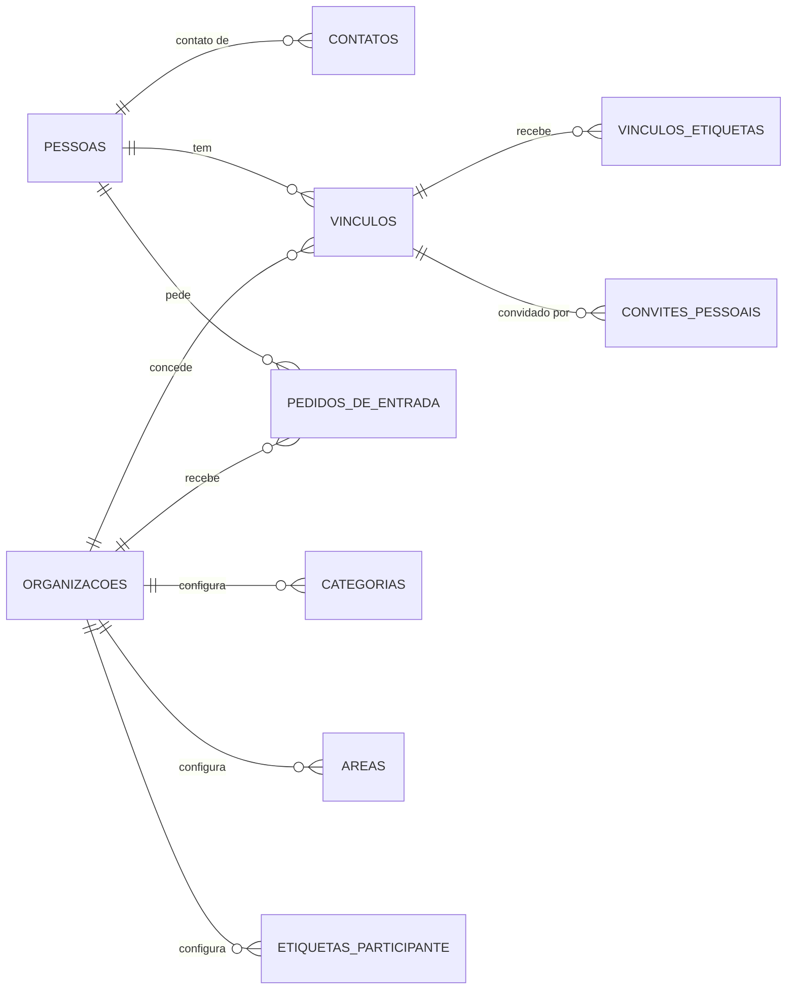
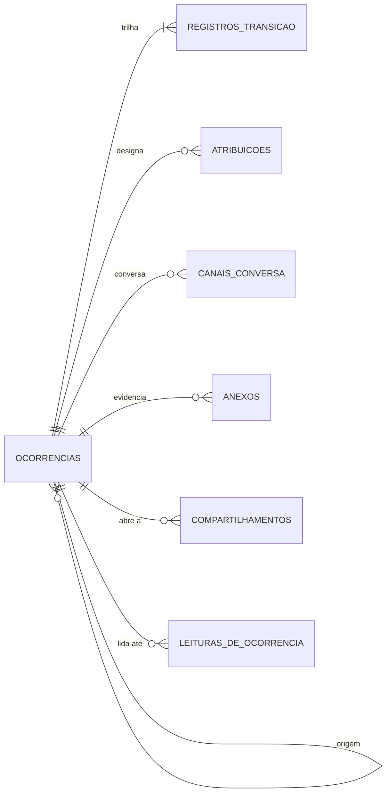

# Banco de dados

PostgreSQL, vinte e uma tabelas, migrações versionadas em arquivo e aplicadas pela esteira antes de a imagem
nova subir. O esquema não é um espelho do código: ele carrega garantias próprias, e as que ele carrega são
as que não dependem de ninguém lembrar.

## As vinte e uma tabelas

| Tabela | O que guarda |
|---|---|
| `pessoas` | o ser humano no sistema: nome, e a ligação opcional com uma conta |
| `contatos` | os telefones e e-mails de uma pessoa, com finalidade e ordem de tentativa |
| `organizacoes` | o condomínio, a empresa ou o bairro, com o código público de entrada, e as regras do atendimento |
| `vinculos` | a ligação entre pessoa, organização e papel. É a chave do isolamento |
| `pedidos_de_entrada` | quem apresentou o código e aguarda decisão do Gestor |
| `categorias` | a natureza da ocorrência, configurável por organização |
| `areas` | a subdivisão do lugar, comum ou privativa |
| `ocorrencias` | o objeto central, com estado, prioridade, solução aplicada e avaliação |
| `registros_transicao` | a trilha de auditoria: um registro por mudança de estado |
| `mudancas_de_configuracao` | cada mudança de uma regra da organização, com o valor anterior, o novo, quem e quando |
| `rotulos_de_status` | o texto com que quem abriu lê cada ponto do ciclo nesta organização, quando ela o customizou |
| `atribuicoes` | quem é o responsável por uma ocorrência, e desde quando |
| `canais_conversa` | o canal de mensagens de uma ocorrência |
| `mensagens` | o texto trocado dentro de um canal |
| `anexos` | a imagem reivindicada por uma ocorrência, com a miniatura |
| `compartilhamentos` | quem, além do autor e dos Gestores, pode ler uma ocorrência |
| `leituras_de_ocorrencia` | até onde cada pessoa leu cada ocorrência, que é de onde o sino tira o que está não lido |
| `etiquetas_participante` | os rótulos livres que o Gestor dá aos participantes, uma lista por organização |
| `vinculos_etiquetas` | quais etiquetas cada participante tem, quem atribuiu e quando |
| `convites_pessoais` | o link pessoal de quem o Gestor cadastrou sem conta, quem o gerou e como terminou |
| `autorizacoes_de_upload` | o livro-caixa das credenciais de upload emitidas, para conter abuso |

**Quem é quem, e onde.** A metade que responde antes de existir ocorrência:



**A ocorrência, e o que gira em volta dela.** Todas as tabelas abaixo são escopadas à organização, e a
ocorrência ainda aponta para a categoria e para a área do desenho de cima:



As mensagens penduram no canal de conversa, e não na ocorrência. A tabela do livro-caixa de autorizações
de upload não aparece em nenhum dos dois desenhos: ela é global, ligada apenas à pessoa que pediu a
credencial, e existe para conter abuso.

## O escopo, garantido pelo esquema

Toda tabela dentro do limite de uma organização carrega `organizacao_id`. As três que ficam fora dele são
`pessoas`, `contatos` e `autorizacoes_de_upload`, porque uma pessoa existe antes de pertencer a qualquer
organização e pode pertencer a várias.

O que impede uma ocorrência de apontar para a categoria de outra organização não é disciplina de consulta:
é a **chave estrangeira composta**. Cada tabela escopada tem uma chave única em `(id, organizacao_id)`, e
quem a referencia carrega as duas colunas:

```sql
categoria_id uuid not null,
foreign key (categoria_id, organizacao_id)
  references categorias (id, organizacao_id) on delete restrict
```

Como o `organizacao_id` da ocorrência é o mesmo das duas pontas, uma linha que cruzasse organizações não
tem como ser gravada. O banco recusa antes de qualquer código opinar, e o mesmo padrão vale para área,
atribuição, canal, mensagem, anexo e registro de transição.

O escopo também é aplicado na camada de aplicação, num ponto único, que é o mecanismo primário descrito em
[Segurança](seguranca.md). Este aqui é a segunda camada.

## A trilha não pode ser alterada

`registros_transicao` é append-only, e isso está escrito em dois lugares.

O mecanismo primário é o agregado: o repositório não expõe atualização nem exclusão para essa tabela. A
defesa em profundidade é um gatilho que recusa com erro todo `update`, e todo `delete` fora de uma única
transação nomeada:

```sql
create trigger registros_transicao_append_only_tg
  before update or delete on registros_transicao
  for each statement execute function registros_transicao_append_only();
```

A exceção existe para apagar a demonstração, e só ela a usa. A transação que remove as duas organizações de
demonstração declara `resolveai.remocao_da_demonstracao` com `set_config(..., true)`, e o gatilho aceita o
`delete` enquanto essa transação durar. O valor some no `commit` ou no `rollback`, o gatilho nunca é
desligado, e nenhuma outra sessão ganha a exceção. A remoção só alcança organização com o nome de uma das
duas da demonstração e fundada por uma das contas dela, então a trilha de qualquer outra organização
continua fora de alcance.

Isso não contradiz a decisão de manter a auditoria no domínio, registrada na
[ADR-0001](adr/0001-historico-de-transicoes-como-conceito-de-dominio.md): aquela decisão recusa o gatilho
como **mecanismo de captura**, porque a diferença entre duas linhas nunca produz a observação escrita por
quem executou o comando. Este gatilho não captura nada: ele apenas proíbe.

Cada registro carrega uma `sequencia`, única por ocorrência, que é o que dá ordem estável à leitura sem
depender do relógio.

As mudanças de configuração têm a mesma defesa, e uma diferença: quem as escreve é um gatilho de
`organizacoes`, que dispara quando uma regra muda de valor e copia o anterior da própria linha. Aqui não
há observação a produzir, e a linha travada pelo `update` garante que duas mudanças seguidas registrem
cada uma o valor que encontrou.

São três regras, uma coluna cada em `organizacoes`: se a solução aplicada é exigida ao resolver, até onde
quem registrou cancela a própria ocorrência, e quantos dias sem atividade até a ocorrência contar como
parada. A terceira é um inteiro com padrão 7, e o banco recusa fora da faixa de 1 a 90 — a aplicação recusa
antes, com a mensagem no campo, e o `check` existe para quem chega por fora dela. A listagem lê essa coluna
na mesma instrução que devolve a página, então não há valor guardado que possa ficar velho entre a mudança
da regra e a leitura seguinte.

Os textos de quem abriu entram na mesma trilha por outro caminho: eles moram em tabela própria, e quem
grava a linha é a aplicação, dentro da mesma transação da escrita e com a linha da organização travada.
É o que registra quem apagou um texto, informação que a linha apagada não carrega.

## O relógio de atualização é do banco

Seis tabelas carregam o par `criado_em` e `atualizado_em`: `pessoas`, `organizacoes`, `vinculos`,
`categorias`, `areas` e `contatos`. Quem move o segundo é um gatilho `before update`, um por tabela,
todos chamando a mesma função. A aplicação não escreve essa coluna em lugar nenhum, e a
[ADR-0016](adr/0016-o-relogio-de-atualizacao-passa-a-ser-do-banco.md) registra por quê.

O relógio de `ocorrencias` fica de fora, e por nome. Ele responde outra pergunta, houve atividade nesta
ocorrência, o que inclui uma mensagem nova numa tabela vizinha, e quem o escreve é o agregado, com o
instante do comando.

O gatilho de `pessoas` é o único com guarda: ele só dispara quando a linha muda de valor. A resolução do
primeiro login grava a mesma linha de volta para poder devolvê-la, e sem a guarda todo acesso carimbaria
a pessoa.

`vinculos.atualizado_em` é anulável, e nulo quer dizer que nenhuma alteração foi registrada desde a
migração que criou a coluna. A tela que mostra a última atualização de um participante lê a maior das
duas datas, a da pessoa e a do vínculo. **O relógio da pessoa é global:** quem troca o próprio nome move
essa data em toda organização onde participa, e nenhuma tela diz quem mexeu.

## Os tipos enumerados

Catorze tipos `enum` fixam no banco os conjuntos que o domínio fecha: os papéis, o tipo da área, a
situação do pedido de entrada, o tipo e a finalidade do contato, a prioridade, o status, os motivos de
pausa e de cancelamento, o vínculo entre ocorrências, o tipo e a fonte do anexo, o motivo de encerramento
de uma atribuição, e o tipo do canal.

Valor fora da lista é recusado pelo banco, e acrescentar um valor novo é uma migração — que é o custo
desejado, porque cada um desses conjuntos é decisão de domínio e não configuração.

## Os índices, um por consulta

Não há índice criado por precaução. Cada um existe porque uma consulta da aplicação o pede:

| Índice | A consulta que o justifica |
|---|---|
| ocorrências por organização e data de registro | o corte da listagem, que é sempre em data de registro, e as contagens do painel |
| ocorrências por organização e status | a fila de triagem, que é o filtro mais usado do Gestor |
| ocorrências por organização e autor | a lista de quem abriu, que é a tela inicial do Solicitante |
| registros por organização e data | a trilha e o tempo de resolução do painel |
| registros por ocorrência, do mais recente ao mais antigo | o sino, que busca a última mudança de cada ocorrência sem varrer a trilha da organização |
| etiqueta por nome, única por organização, sem distinguir maiúscula | impede duas etiquetas com a mesma grafia; acento conta |
| atribuição vigente, única por ocorrência | garante que não existam dois responsáveis ao mesmo tempo |
| canal por tipo, único por ocorrência | garante um canal de cada tipo por ocorrência |
| compartilhamentos por organização e quem recebe | a aba *Compartilhadas comigo* do Solicitante |
| pedido pendente, único por pessoa e organização | impede dois pedidos abertos, e permite refazer um recusado |

Os três últimos são índices únicos parciais: eles não aceleram uma consulta, garantem uma regra. O da
etiqueta também garante uma regra, mas é único sobre uma expressão, e não parcial.

## As duas pontas do compartilhamento

A tabela `compartilhamentos` diz que uma ocorrência pode ser lida por uma pessoa a mais. Ela tem três
chaves estrangeiras compostas, e as três carregam `organizacao_id`: uma linha que ligasse a ocorrência de
uma organização ao vínculo de outra não grava. A chave primária é o par ocorrência e pessoa, e é ela que
faz o pedido repetido terminar com uma linha só.

As duas pontas que apontam para `vinculos` se comportam de forma diferente, e a diferença é a definição de
rastro. Remover um vínculo sem histórico leva com ele o que a pessoa **recebeu**, porque receber não deixa
rastro: a chave apaga em cascata. O que ela **compartilhou** aparece nomeado na tela de quem olha a
ocorrência, então conta como histórico, a chave recusa a remoção, e o caminho é revogar — que é uma
atualização e não apaga linha nenhuma. É o que faz a pessoa readmitida voltar a ver o que já estava
compartilhado com ela.

A tabela não guarda se quem recebeu já abriu a ocorrência. A leitura mora em `leituras_de_ocorrencia`, a
mesma que o sino lê, e a ocorrência compartilhada está *não vista* quando não há leitura dela depois de
compartilhada. Refazer o compartilhamento grava uma data nova, mais nova que qualquer leitura, e devolve o
selo sem nenhuma escrita a mais. A tabela não tem outro estado e não tem trilha: desfazer apaga a linha.

`leituras_de_ocorrencia` segue o mesmo padrão de chaves: as duas compostas carregam `organizacao_id`, e a
que aponta para o vínculo apaga em cascata, porque ler não é rastro e não pode impedir a remoção de um
vínculo. Ela fica fora do agregado: não muda status e não grava trilha. Abrir, agir e marcar como lida
gravam o instante; marcar como não lida apaga a linha.

## As etiquetas dos participantes

Uma etiqueta é um rótulo livre que o Gestor dá a um participante, como eletricista ou contratado. Ela
pertence ao vínculo, porque a chave é do vínculo: `vinculos` não tem coluna `id`, e a junção carrega o par
pessoa e organização inteiro, pelo mesmo padrão de chave composta do resto do esquema. Uma etiqueta de uma
organização não se liga ao vínculo de outra, e o banco recusa a linha antes de qualquer código opinar.

As duas pontas que apontam para `vinculos` repetem a lógica do compartilhamento. Quem recebeu a etiqueta
apaga em cascata, porque receber não é rastro. Quem atribuiu fica gravado com a data, a chave recusa a
remoção, e é isso que sustenta a regra de que a responsabilidade por uma etiqueta é de quem a deu.

Revogar o vínculo apaga as etiquetas da pessoa. Ao contrário do compartilhamento, o vínculo readmitido
volta sem nenhuma: a linha de `vinculos` sobrevive à revogação, e a limpeza é escrita no comando de
revogar.

A unicidade do nome desce a caixa pela colação ICU, e não pela do banco. Na colação `C`, uma letra
acentuada maiúscula não desceria, e duas grafias da mesma palavra virariam duas etiquetas. Acento continua
contando: ICU muda a caixa, não tira o acento.

## O convite pessoal

`convites_pessoais` guarda o link pessoal de um participante que o Gestor cadastrou sem conta. A linha
pertence ao vínculo, pela chave composta de pessoa e organização, e guarda quem gerou, quando, e como
terminou: invalidada, quando o Gestor gera outro link ou revoga o vínculo, ou aceita. Os dois desfechos são
exclusivos, e um índice único parcial permite um convite vivo por vínculo. Nenhuma linha é apagada pelo
código.

O token fica em claro, porque o Gestor recupera o link já gerado. Ele não concede acesso novo: liga uma
conta a um vínculo que o Gestor já aprovou ao cadastrar. As duas pontas que apontam para `vinculos`
repetem a lógica das etiquetas: quem gerou é rastro, e a chave recusa a remoção; o convite recebido apaga
em cascata, porque remover um participante sem rastro não pode ser recusado por um link que ninguém usou.

Quando quem aceita já tem conta, e com ela uma pessoa própria, as duas se fundem numa transação. O vínculo
da conta nasce com o papel e a unidade do cadastro, ou volta a valer, se tinha sido revogado. Depois, a
responsabilidade pelas ocorrências, os compartilhamentos, as etiquetas, os convites e os contatos passam
para a pessoa da conta, e só então o vínculo cadastrado é apagado. A ordem é a garantia: três chaves para
`vinculos` apagam em cascata, e uma linha esquecida não daria erro, sumiria. A trilha não é tocada, porque
ela aponta para quem fez, e a pessoa cadastrada sem conta nunca fez nada.

Um teste lê o catálogo do banco e confere que toda chave estrangeira para `vinculos` e para `pessoas`
está classificada: reapontada pela fusão, o próprio vínculo, ou coluna de quem fez. Uma tabela nova que
pendure no vínculo ou na pessoa sem passar por essa decisão reprova o teste, nomeando a tabela.

A pessoa cadastrada fica no banco, sem vínculo e sem conta, depois da fusão.

## As contas ficam fora

O produto não guarda senha. A tabela `pessoas` tem uma coluna que aponta para o usuário do provedor de
autenticação, anulável, porque uma pessoa cadastrada pelo Gestor existe antes de ter conta.

Essa é a única ligação entre o esquema do produto e o do provedor, e é o que mantém a troca de provedor
como um problema de uma coluna.

## Só o servidor fala com o banco

Todas as tabelas têm Row Level Security ligada e nenhuma política escrita, o que no PostgreSQL é negação
total para os papéis anônimo e autenticado. Quem fala com o banco é o servidor.

## Volume

O alvo declarado em [O produto](produto.md) é de 50 organizações, 2.000 ocorrências e 200 pessoas por
organização. O teto da franquia gratuita comporta cerca de 55.000 ocorrências, quase trinta vezes isso,
então o banco não é a restrição desta entrega.

A especificação completa de cada coluna está nas migrações, em `supabase/migrations/`, que são a fonte da
verdade e o que a esteira aplica.
