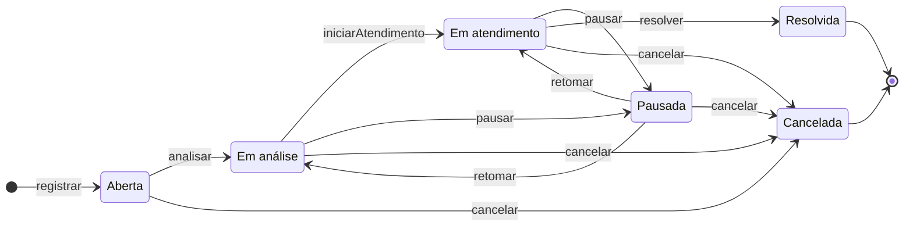

# Domínio e regras

O coração do produto é uma coisa só: a `Ocorrência`, com o seu ciclo de vida e a trilha imutável do que
aconteceu com ela. Todo o resto existe para que ela funcione.

## O agregado `Ocorrência`

A `Ocorrência` é a raiz de um agregado de consistência forçada: **nada de fora escreve o estado dela.** A
única porta são comandos nomeados — `analisar`, `iniciarAtendimento`, `pausar`, `retomar`, `resolver`,
`cancelar` —, e cada comando grava o registro de transição na mesma operação que muda o estado.

É essa escolha que torna a auditabilidade uma propriedade da estrutura, e não uma convenção do time: não
existe caminho de escrita capaz de mudar o estado sem deixar rastro, porque o estado não é um campo que se
edita. A decisão, com as alternativas rejeitadas, está na
[ADR-0001](adr/0001-historico-de-transicoes-como-conceito-de-dominio.md).

Dentro do limite do agregado vivem o registro de transição, que é imutável, e a atribuição de responsável.
Fora dele ficam a `Organização`, a `Pessoa` e o vínculo entre elas, que respondem por quem é quem.

## A máquina de estados

Nenhuma outra transição existe. A tabela diz quem pode executar cada uma:

| De | Comando | Para | Quem pode |
|---|---|---|---|
| — | `registrar` | `Aberta` | Solicitante |
| `Aberta` | `analisar` | `Em análise` | Gestor |
| `Aberta` | `cancelar` | `Cancelada` | o autor, ou o Gestor |
| `Em análise` | `iniciarAtendimento` | `Em atendimento` | Gestor |
| `Em análise` | `pausar` | `Pausada` | Gestor |
| `Em análise` | `cancelar` | `Cancelada` | o autor, ou o Gestor |
| `Em atendimento` | `pausar` | `Pausada` | Gestor, ou o responsável atribuído |
| `Em atendimento` | `resolver` | `Resolvida` | Gestor |
| `Em atendimento` | `cancelar` | `Cancelada` | Gestor |
| `Pausada` | `retomar` | o estado anterior à pausa | Gestor |
| `Pausada` | `cancelar` | `Cancelada` | Gestor |

**Quatro comandos não transicionam**, e por isso não aparecem no diagrama: alterar a prioridade, atribuir o
responsável, registrar a solução aplicada e avaliar. Cada um tem a sua própria regra de quando é aceito.

**O cliente não guarda uma cópia desta tabela.** Toda resposta que traz uma ocorrência traz também a lista
de ações disponíveis para quem está lendo, já cruzada com o estado e com as permissões. A interface desenha
botões a partir do que o domínio respondeu, e uma segunda cópia da máquina de estados nunca chega a
existir.

## O histórico

Toda transição grava um registro com cinco campos: **o estado anterior, o novo estado, a data e a hora,
quem fez, e a observação.**

- O registro é **imutável**: não há como alterá-lo nem apagá-lo, nem pela API nem pela aplicação.
- A **criação da ocorrência também gera registro**, com o estado anterior vazio. Quem lê a trilha vê de
  onde a ocorrência veio, e não só o que aconteceu depois.
- **Pausar e cancelar exigem observação**, porque são os dois momentos em que há uma decisão a justificar.
  Nas demais transições ela é opcional. Exigir texto num avanço rotineiro produz "ok" no campo, e o dado
  morre.
- **Retomar devolve a ocorrência ao estado anterior à pausa**, lido do próprio registro da pausa.

A trilha tem tela própria, separada da linha do tempo que o Solicitante lê: a linha do tempo conta a
história em linguagem de gente, e a trilha mostra os campos crus, para conferência.

## As regras que o desafio deixou em aberto

| A pergunta | A regra |
|---|---|
| De quais estados se pode cancelar? | De `Aberta`, `Em análise` e `Em atendimento`, e também de `Pausada`, que é uma espera dentro do atendimento |
| A avaliação é um sexto estado? | Não. É uma ação do autor sobre uma ocorrência `Resolvida`, com nota de 1 a 5 e comentário opcional, aceita uma vez só |
| Quem pode cancelar? | O autor cancela a própria enquanto ela não entrou em atendimento; o Gestor cancela qualquer uma, em qualquer estado não terminal |
| Quem é o responsável? | A pessoa com vínculo na organização a quem a ocorrência foi atribuída. O papel não restringe quem pode ser: o Gestor pode atribuir a si mesmo |
| Reabrir existe? | Não. `Resolvida` e `Cancelada` são terminais, e problema que volta é ocorrência nova ligada à original |
| Quais categorias existem? | As sete do desafio nascem com a organização, e o Gestor as edita. Categoria é configuração, não código |

## As invariantes

O que o sistema garante, e onde cada garantia mora. As oito primeiras dependem apenas do estado da própria
ocorrência, e por isso são testáveis sem banco.

1. O estado nunca é escrito de fora: a única porta são os comandos.
2. Toda transição produz exatamente um registro, na mesma operação. Não existe transição sem registro nem
   registro sem transição.
3. O histórico só recebe linhas novas. Registro de auditoria que se edita não é auditoria.
4. A criação gera o primeiro registro, com o estado anterior vazio.
5. Pausar e cancelar exigem motivo escolhido numa lista e observação escrita.
6. Retomar usa o estado anterior à pausa, lido do registro, e não um campo à parte.
7. A prioridade não muda depois que a ocorrência é resolvida ou cancelada, para que o painel seja
   reproduzível.
8. Avaliar só é aceito em `Resolvida`, e só do autor.
9. Iniciar o atendimento exige um responsável atribuído, porque *quem está fazendo* é o que falta hoje.
10. Resolver não exige a solução aplicada por regra do sistema: ela é induzida pela interface, com um
    interruptor por organização para quem precisar exigi-la.

As duas últimas atravessam outra tabela no momento em que o comando roda, e por isso são garantidas pelo
comando de aplicação, e não pela entidade.

## O modelo que saiu da descoberta

O domínio foi levantado num workshop de *event storming*, e o que ficou dele é o modelo:

**Os eventos que importam** — ocorrência registrada, analisada, atribuída, atendimento iniciado, pausado,
retomado, solução registrada, resolvida, cancelada, avaliada, comentada. Cada um deles é o efeito de um
comando, e cada comando tem um ator que pode dispará-lo.

**As políticas** são as reações automáticas: a organização recém-criada nasce com as sete categorias e com
um conjunto inicial de áreas, porque uma organização vazia não deixa ninguém registrar nada; o pedido de
entrada aprovado cria o vínculo; e a ocorrência registrada abre o canal de conversa com quem gere.

**Os modelos de leitura** são as perguntas que cada ator faz ao sistema: *o que está parado*, para quem
tria; *em que pé está a minha*, para quem abriu; *onde é, exatamente*, para quem vai executar; e *o que
aconteceu com esta ocorrência*, para quem audita. Cada um deles virou um endereço da API, e a
[referência da API](/documentacao/api/referencia) mostra qual.

**Os agregados** que saíram dali são seis: `Ocorrência`, `Organização`, `Pessoa`, `Usuário`, `Canal de
conversa` e `Notificação`. Os dois últimos existem modelados e entram em uso parcial nesta versão.

## O vocabulário

O produto, o código, a API e a interface usam as mesmas palavras. Uma divergência de termo entre o
documento e o código é defeito, não estilo. Os termos com definição estão no [glossário](glossario.md), e
três valem a pena aqui:

- **Organização** é o lugar em si: o condomínio, a empresa, o bairro. A palavra não designa um cliente do
  sistema.
- **Área** é a subdivisão do lugar: o bloco B, a garagem, o apartamento 302. Ela é comum ou privativa, e a
  visibilidade da ocorrência deriva do tipo da área no momento em que a ocorrência foi registrada.
- **Vínculo** é a ligação entre uma pessoa e uma organização, com um papel. Quem tem papel é o vínculo, e
  não a pessoa: a mesma pessoa pode ser Gestora num lugar e Solicitante em outro.
