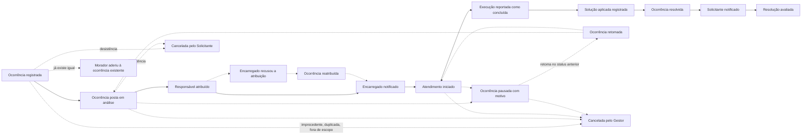

# Event Storming — Resolve Aí

Este documento é o resultado do workshop de descoberta do domínio: os eventos que acontecem no produto,
os comandos que os produzem, quem os dispara, o que o sistema faz sozinho, o que cada ator precisa olhar
antes de decidir, e como tudo isso se agrupa em agregados e contextos.

**Uma diferença de formato, declarada:** não houve workshop presencial com um time diverso. O material foi
produzido em conversa, a partir do relato de um integrante do time que é síndico do condomínio onde mora,
e revisado por ele. O que se perde é a diversidade de ponto de vista.

Os pontos de atenção levantados aqui não são repetidos neste documento: eles vivem em
[premissas-e-questoes-abertas.md](premissas-e-questoes-abertas.md), que é onde são mantidos.

---

## 1. O ciclo da ocorrência

O caminho ideal está em linha contínua; as exceções, tracejadas.

**O caminho ideal tem dois segmentos que só existem quando o Encarregado tem conta:** *Encarregado
notificado* e *Execução reportada como concluída*. Removidos os dois, sobra o cenário em que o Gestor
registra, analisa, prioriza, atribui, confere e fecha. É esse o cenário desta entrega, e o acesso
próprio do Encarregado é a evolução prevista.

**A pausa é o único laço que volta para trás** dentro do caminho normal. É também a maior dor relatada nas
duas variantes da persona do Gestor: *"acabo me perdendo e a ocorrência some dentre outras"*.

**Entre o registro e a análise não acontece nada**, só passa tempo. É onde a política de tempo sem
primeira resposta se conecta.

**Um achado que economizou um campo.** A pausa precisa saber para onde voltar quando destrava, e não
precisa de campo novo: o registro de histórico da pausa já grava o `status anterior`, que é o alvo do
retorno. A trilha de auditoria serve à máquina de estados de graça, e é o primeiro de quatro dividendos
que a [ADR-0001](adr/0001-historico-de-transicoes-como-conceito-de-dominio.md) pagou ao longo deste
workshop.

### Eventos que não entraram na linha

Cinco acontecem em qualquer momento e não cabem em ponto nenhum: comentário, nota interna, alteração de
prioridade, reatribuição e mensagem na atribuição. Eles ficaram registrados como transversais, e a
limitação está no PA-21.

E um foi removido por não ser evento: *transição de status registrada no histórico* é o efeito
inseparável de toda transição, e virou invariante do agregado em vez de post-it.

---

## 2. Comandos e atores, por fase

O padrão é `[Ator] → [Comando] → [Evento]`. Comando sem ator não é erro: é sinal de política, e as
políticas estão na seção 3.

### Preparação

| Comando | Ator | Evento |
|---|---|---|
| `Registrar organização` | Quem cria, virando Gestor inicial | Organização registrada |
| `Semear categorias e áreas padrão` | política | Categorias criadas, estrutura de áreas definida |
| `Criar categoria`, `Desativar categoria` | Gestor | Categoria criada ou desativada |
| `Definir áreas do local` | Gestor | Estrutura de áreas definida |
| `Cadastrar pessoa`, `Importar pessoas` | Gestor | Pessoa cadastrada, pessoas importadas em lote |
| `Convidar pessoa` | Gestor | Convite enviado |
| `Aceitar convite` | Pessoa convidada | Convite aceito |
| `Criar conta`, `Autenticar-se` | Solicitante | Conta criada, usuário autenticou-se |
| `Pedir entrada` | Pessoa com conta, portando o código público | Pedido de entrada registrado |
| `Aprovar pedido de entrada`, `Recusar pedido de entrada` | Gestor | Pedido aprovado ou recusado |
| — | política | Vínculo estabelecido, por aceitar convite ou por aprovação |
| `Revogar vínculo` | Gestor | Vínculo revogado |

### Triagem

| Comando | Ator | Evento |
|---|---|---|
| `Registrar ocorrência` | Solicitante | Ocorrência registrada |
| `Aderir à ocorrência` | Solicitante observador | Morador aderiu à ocorrência |
| `Analisar` | Gestor | Ocorrência posta em análise |
| `Alterar prioridade` | Gestor | Prioridade alterada |
| `Atribuir responsável` | Gestor | Responsável atribuído |
| — | política | Canal da atribuição aberto, Encarregado notificado |

### Execução

| Comando | Ator | Evento |
|---|---|---|
| `Recusar atribuição` | Encarregado, e exige conta | Encarregado recusou a atribuição |
| `Reatribuir` | Gestor | Ocorrência reatribuída |
| — | política | Canal da atribuição anterior arquivado |
| `Iniciar atendimento` | Gestor ou Encarregado, conforme a persona | Atendimento iniciado |
| `Reportar execução concluída` | Encarregado | Execução reportada como concluída |
| `Pausar`, com motivo obrigatório | Gestor ou Encarregado | Ocorrência pausada |
| `Retomar` | Gestor | Ocorrência retomada |
| — | política | Relógio ativo pausado ou retomado |

### Fechamento

| Comando | Ator | Evento |
|---|---|---|
| `Registrar solução aplicada` | Gestor | Solução aplicada registrada |
| `Resolver` | Gestor, sempre | Ocorrência resolvida |
| — | política | Solicitante notificado |
| `Avaliar resolução` | Solicitante autor | Resolução avaliada |

### Transversais

| Comando | Ator | Evento |
|---|---|---|
| `Cancelar`, com motivo estruturado | Solicitante até `Em análise`; Gestor em qualquer estado não terminal | Ocorrência cancelada |
| `Enviar mensagem no canal` | Solicitante, Gestor ou Encarregado, conforme o canal | Mensagem enviada no canal |

### O que esta seção revelou

**O ator de `Iniciar atendimento` muda por persona:** o Gestor onde o Encarregado não tem conta, e o
próprio Encarregado onde tem. O comando é o mesmo, e quem dispara muda. É consequência direta da regra de
que, para agir no sistema, o vínculo precisa de Usuário, e é o PA-07 visto de outro ângulo.

**`Resolver` tem um único ator possível, o Gestor.** Apareceu idêntico nas duas variantes da persona, e é
a regra de autorização mais firme do produto.

**Dez comandos ficaram sem ator**, e cada um virou uma política.

**Uma lacuna que a rastreabilidade pegou pelo caminho inverso.** Os três comandos de pedido de entrada não
estavam aqui, porque este levantamento é anterior à decisão que criou o caminho do código público. A falta
apareceu na revisão do contrato de API, que encontrou três endpoints realizando uma capacidade do escopo
sem comando de origem. Percorrer a rastreabilidade do comando para o endpoint fechava; foi o sentido
inverso que mostrou o buraco.

---

## 3. As políticas

Uma para cada comando que ficou sem ator. O padrão é
`[Comando] → [Evento] → [Política] → [Comando] → [Evento]`, e a política pode ter um critério que a
condiciona.

| # | Política | Evento que a ativa | Comando que dispara | Critério limitante |
|---|---|---|---|---|
| POL-01 | Semear categorias e áreas padrão | Organização registrada | Criar categorias e áreas semente | — |
| POL-02 | Estabelecer vínculo | Convite aceito | Estabelecer vínculo | — |
| POL-03 | Abrir canal da atribuição | Responsável atribuído | Abrir o canal | Só se o Encarregado tiver Usuário: sem conta, ninguém lê do outro lado |
| POL-04 | Arquivar canal da atribuição anterior | Ocorrência reatribuída | Arquivar o canal | Arquiva, nunca apaga |
| POL-05 | Notificar o Encarregado | Qualquer transição da ocorrência atribuída a ele | Criar notificação | Só se ele tiver Usuário |
| POL-06 | Notificar o Solicitante | Qualquer transição de status | Criar notificação | — |
| POL-07 | Entregar por canal externo | Notificação criada | Enviar por e-mail, push ou WhatsApp | Só se a organização estiver em plano pago |
| POL-08 | Pausar e retomar o relógio ativo | Ocorrência pausada ou retomada | — derivado do histórico, nada é escrito | — |
| POL-09 | Alarmar ocorrência parada | Ocorrência pausada | Notificar o Gestor dentro do app | Se continua pausada há mais de N, com N em aberto no PA-11 |
| POL-10 | Sinalizar envelhecimento | Ocorrência registrada | Destacar na lista e no dashboard | Se passou da faixa de envelhecimento, e nunca altera prioridade |
| POL-11 | Estabelecer vínculo | Pedido de entrada aprovado | Estabelecer vínculo, com o papel escolhido na aprovação | — |

**Duas rodam nesta entrega**, a POL-01 e a POL-11. A POL-02 não roda, porque reage a *convite
aceito* e o convite é evolução prevista. Nenhuma das duas reage a transição de status.

### O que esta seção revelou

**Notificação são duas políticas em cadeia, e não uma.** A POL-05 e a POL-06 criam a notificação, sempre e
dentro do app. A POL-07 a entrega por canal externo, e só no plano pago. Separar as duas é o que faz o
modelo comercial caber sem espalhar condicional de plano pelo domínio: existe um único ponto onde o plano
é consultado.

**A POL-08 não escreve nada.** O tempo ativo é derivado da trilha de auditoria, somando os intervalos entre
pausar e retomar. É o segundo dividendo da ADR-0001.

**E o achado maior: nenhuma das políticas escreve no agregado `Ocorrência`.** Todas criam notificação,
abrem ou arquivam canal, semeiam configuração, sinalizam ou derivam. As invariantes do agregado seguem
inteiramente dirigidas por comando, o que mantém a ADR-0001 intacta e simplifica a implementação.

---

## 4. Modelos de leitura

Uma visão de dados que um ator consulta para decidir. A pergunta feita em cada comando foi: *o que essa
pessoa precisa olhar para decidir fazer isso?*

### Do Solicitante

| Modelo de leitura | Precede o comando |
|---|---|
| Estado da minha ocorrência, ou seja, a diferença entre *ninguém viu* e *o síndico está tratando* | nenhum |
| *"Estão esperando você"*, quando a ocorrência está pausada aguardando informação dele | `enviar mensagem` |
| *"Última atualização há X"*, que substitui a previsão de conclusão, que ninguém tem | nenhum |
| Linha do tempo da ocorrência: transições, mensagens e atribuições | nenhum |
| Quem é o responsável | nenhum, e constrói confiança |
| Ocorrências de área comum do meu local | `aderir` |
| Convite para avaliar, quando resolvida | `avaliar resolução` |

### Do Gestor, na operação do dia

| Modelo de leitura | Precede o comando |
|---|---|
| Não triadas: chegaram e ninguém olhou | `analisar` |
| Pausadas esperando o Gestor, e não pausadas em geral: as que ele destrava, por autorização ou orçamento | `retomar` |
| Faixas de envelhecimento: 0 a 2 dias, 3 a 5, 6 ou mais | `alterar prioridade`, cobrar |
| Alta prioridade, e atualizadas nos últimos N dias | vários |
| Sino, com as transições relevantes ao meu vínculo | vários |

### Do Gestor, na gestão do mês

O dashboard deixa de competir com a lista e passa a responder o que a lista não responde: padrão e
tendência, e não item individual.

| Indicador | O que ele muda |
|---|---|
| Volume por categoria e por área, a recorrência | **A que mais muda comportamento:** oito vazamentos no mesmo bloco em três meses não são oito ordens de serviço, são uma obra. É o único número que tira o Gestor do reativo |
| Tempo médio de resolução, mês a mês | Se está subindo, o problema é estrutural: gente, fornecedor, orçamento |
| Tempo de calendário contra tempo ativo | O que ele defende na assembleia ou perante a imobiliária |
| Média das avaliações | Única métrica de qualidade que o produto tem |

### Do Encarregado com conta

| Modelo de leitura | Precede o comando |
|---|---|
| Só o que é meu, na ordem que o Gestor definiu, porque ele não escolhe prioridade | `iniciar atendimento` |
| Onde é, exatamente: descrição, foto, localização precisa. *"Vazamento na garagem" faz andar a garagem toda* | `iniciar atendimento` |
| O que já me falaram, no canal da atribuição | `enviar mensagem` |
| Ação rápida de pausa com motivo, porque de pé na garagem ninguém escreve parágrafo | `pausar` |

### O que esta seção revelou

**Os dois extremos no mesmo produto.** A tela do Encarregado é a que melhor obedece à regra de que um
modelo de leitura precede um comando: quase tudo que ele olha leva a uma ação. A tela do Solicitante é o
oposto, e existe em boa parte para ele **não** agir: não perguntar, não cobrar, não abrir duplicada.

**E aí a regra não descreve o nosso caso.** Os itens *estado da minha ocorrência* e *última atualização há
X* não precedem comando nenhum, e são o núcleo do valor do produto: a dor declarada é *"dificuldade de
deixar os condôminos a par do que está sendo feito"*. Resolver isso é entregar informação que não leva a
ação. Fica registrado como limitação do método, e não como falha do modelo.

**Um requisito que veio da descoberta, e não do enunciado: leitura offline para o Encarregado.** Zelador
trabalha em subsolo, casa de máquinas e garagem, sem sinal. Chegar no lugar e não conseguir abrir o que
tem para fazer é o pior caso, e leitura offline importa mais que escrita.

**Rótulo exibido não é o nome interno do estado.** *"Em análise"* é jargão nosso, e o morador lê e não sabe
se é bom ou ruim. Os nomes dos estados vêm do enunciado e não podem ser trocados; o rótulo apresentado ao
Solicitante pode. É apresentação, e não conceito.

**O achado maior: nenhum dos vinte modelos de leitura acrescenta uma entidade, atributo ou estado ao
modelo.** Todos são visões sobre dado que já existe. Boa parte disso é consequência da trilha de auditoria:
"última atualização há X", faixas de envelhecimento, tempo ativo, linha do tempo e o próprio sino são
derivados do histórico. É o quarto dividendo da ADR-0001, e o maior deles.

---

## 5. Os eventos que trocam de fase, e os dois relógios

Três eventos marcam troca de fase, dividindo o processo em quatro:

| Evento | Separa | O que muda ao atravessar |
|---|---|---|
| `Ocorrência registrada` | Preparação e Triagem | Sai da configuração, que acontece uma vez e só com o Gestor, e entra na operação, que acontece todo dia e com todos os atores |
| `Responsável atribuído` | Triagem e Execução | O trabalho muda de mão. Antes o Gestor decide o quê e quem; depois alguém executa. É onde nasce o canal da atribuição, e onde, na prática relatada, o meio muda: o Gestor sai do sistema e vai para a reunião presencial ou o WhatsApp |
| `Ocorrência resolvida` | Execução e Fechamento | Acaba o trabalho e começa a medição. A ocorrência congela, e a prioridade trava a partir daqui |

**A pausa não é troca de fase.** Um evento que troca de fase segue adiante; a pausa é um laço que volta
para a mesma fase. O trabalho não muda de natureza: é a mesma execução, interrompida. A prática de mercado
concorda, ao classificar itens bloqueados como tecnicamente ativos e mantê-los na mesma faixa para não
distorcer os gráficos.

**O que muda na pausa não é a fase: é o relógio.** É daí que saem os dois tempos que o dashboard mede:

| Relógio | O que mede | Para quem |
|---|---|---|
| Tempo de calendário, do registro à resolução, incluindo pausas | O que o morador sente; ele não quer saber que faltou peça | Solicitante |
| Tempo ativo, excluindo pausas | O trabalho do Gestor e do Encarregado | Gestão |

**A diferença entre os dois é ela mesma um indicador**, porque mostra quanto do atraso é externo. Se o
dashboard usar só o tempo de calendário, pune o Gestor pela demora do fornecedor.

---

## 6. Sistemas externos

| Sistema externo | Direção | Ligado a |
|---|---|---|
| Provedor de autenticação | entra, porque a identidade nasce fora | `Criar conta`, `Autenticar-se` |
| Serviço de e-mail | sai | POL-07, plano pago |
| Serviço de push | sai | POL-07, plano pago |
| WhatsApp, pela API de negócios | sai | POL-07, plano pago. A API é cobrada por mensagem, e é o canal que mais pressiona o modelo comercial |
| Fonte da carga de pessoas: planilha do síndico ou sistema da administradora | entra | `Importar pessoas` |
| Meio de pagamento | sai | Futuro |

**O storage de imagem não é sistema externo.** O critério é estar além do domínio que se está explorando, e
storage não tem domínio nem regra de negócio própria: é infraestrutura. Confundir os dois inflaria o mapa
de contexto com caixas que não são contexto.

**Um futuro registrado:** receber ocorrência por WhatsApp, como entrada, seria um sistema externo novo. É
o caminho de adoção mais óbvio para o condomínio cuja rotina de hoje já é o grupo de WhatsApp, e está fora
desta entrega.

---

## 7. Agregados

Aplicando a heurística de identificar o objeto principal de cada comando, sobram seis:

| Agregado | Comandos que recebe | O que vive dentro do limite |
|---|---|---|
| `Ocorrência` | registrar, aderir, analisar, alterar prioridade, atribuir, recusar, reatribuir, iniciar atendimento, reportar concluído, pausar, retomar, registrar solução, resolver, avaliar, cancelar | `HistoricoTransicao`, objeto de valor imutável; `Avaliação`; `Adesões`; `Localização`; e a referência à duplicada original |
| `Canal de conversa` | abrir, arquivar, enviar mensagem | `Mensagem`. Referencia Ocorrência e atribuição por identificador |
| `Organização` | registrar, designar gestor inicial, criar e desativar categoria, definir áreas, semear | `Categoria` e `Área`, com o tipo comum ou privativa |
| `Pessoa` | cadastrar, importar, convidar, revogar vínculo | `Vínculo`, que carrega papel e organização |
| `Usuário` | criar conta, autenticar-se | a credencial |
| `Notificação` | criar, marcar como lida, entregar | estado de leitura e de entrega |

**Por que `Canal` fica fora de `Ocorrência`.** Seria tentador colocá-lo dentro, já que o canal é escopado à
ocorrência. Mas mensagem é evento de alto volume, e cada uma carregaria e travaria o agregado inteiro. E
nenhuma invariante transacional atravessa os dois: a regra de que o canal da atribuição existe enquanto a
atribuição existe é garantida por política, e não por transação. Agregado pequeno, referência por
identificador.

**Por que `Usuário` fica fora de `Pessoa`.** A regra de que, para agir, o vínculo precisa de Usuário
atravessa os dois, e é verificação de leitura, não invariante de escrita. E os ciclos de vida são
independentes: Pessoa existe sem conta, e a credencial vem de fora.

---

## 8. Contextos delimitados

Dois contextos, mais uma fronteira com sistema externo.

**① Contexto de Ocorrências**, com `Ocorrência`, `Canal de conversa` e `Notificação`. A conexão é forte por
política: o canal é aberto e arquivado por eventos da Ocorrência, e toda notificação é disparada por
transição de status. Os três compartilham a linguagem ubíqua da ocorrência. **É o subdomínio principal**,
onde está a auditabilidade, que é o requisito central do enunciado.

**② Contexto de Organização e Acesso**, com `Organização`, `Pessoa` e `Usuário`. A conexão é forte por
vínculo: o `Vínculo` amarra Pessoa a Organização com um papel, e Usuário é a credencial desse vínculo. É
subdomínio de suporte, com a parte de autenticação tendendo a genérico.

**③ A fronteira com o provedor de autenticação**, que não é contexto nosso. O padrão é o Conformista: não
há como negociar para que ele se adeque às nossas necessidades. Com uma camada anticorrupção entre ele e o
núcleo, para que `Ocorrência` não conheça formato de token nem claims.

**Dois contextos é decisão, e não economia de esforço.** Um contexto delimitado é sempre trabalhado por um
time, e aqui há um implementador. Fatiar mais seria arquitetura de enfeite. A `Notificação` fica no
contexto ① e é o candidato natural a extração se o produto crescer, porque todos os gatilhos dela são
eventos de ocorrência hoje, e ela não tem nada de específico do domínio.

**Os contextos confirmaram parcialmente os eventos de troca de fase**, e isso era o esperado. O
`Ocorrência registrada` é fronteira de contexto de verdade, porque separa a Preparação, que vive inteira no
contexto ②, do ciclo, que vive no ①. Já `Responsável atribuído` e `Ocorrência resolvida` são fases internas
ao contexto ①, e não fronteiras. Evento que troca de fase é indicador de contexto, e não equivalência.

---

## 9. Para onde foi cada saída

| Saída | Destino |
|---|---|
| Eventos, comandos, políticas e modelos de leitura | este documento |
| Vocabulário do domínio, com as colisões detectadas | [glossario.md](glossario.md) |
| Os seis agregados, os dois contextos e os padrões de integração | [arquitetura.md](arquitetura.md) |
| Os pontos de atenção e as premissas | [premissas-e-questoes-abertas.md](premissas-e-questoes-abertas.md) |
| Personas, jornada atual e princípio de produto | [documentacao-da-demanda.md](documentacao-da-demanda.md) |
| Modelos de leitura por ator | insumo do protótipo e do recorte desta entrega |
