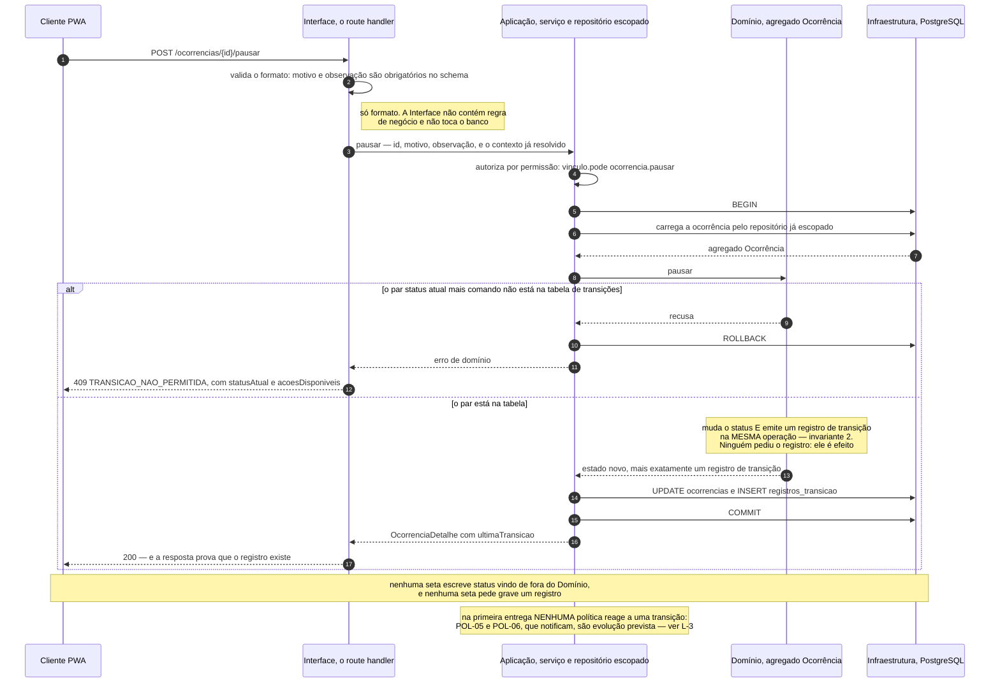
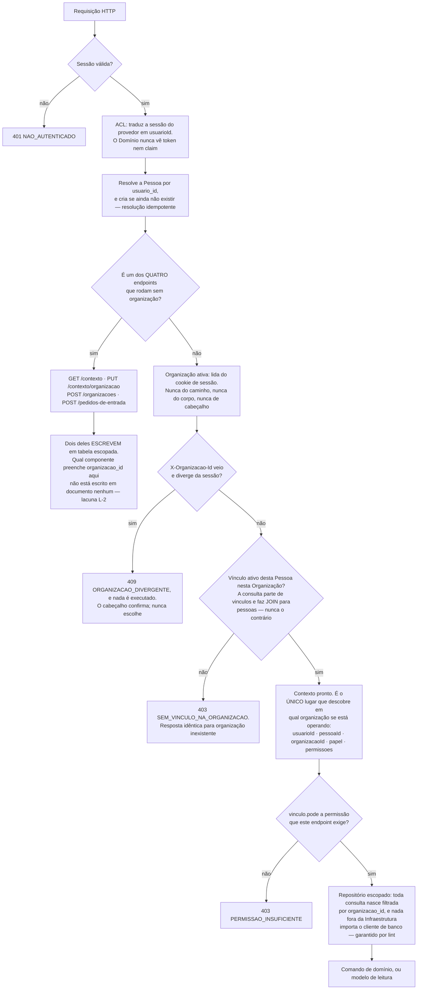
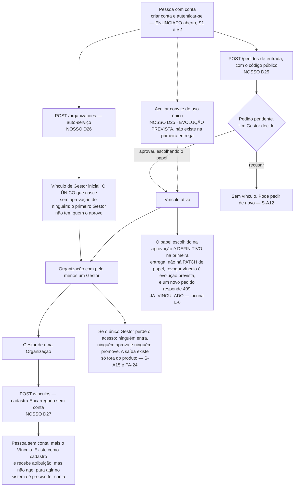
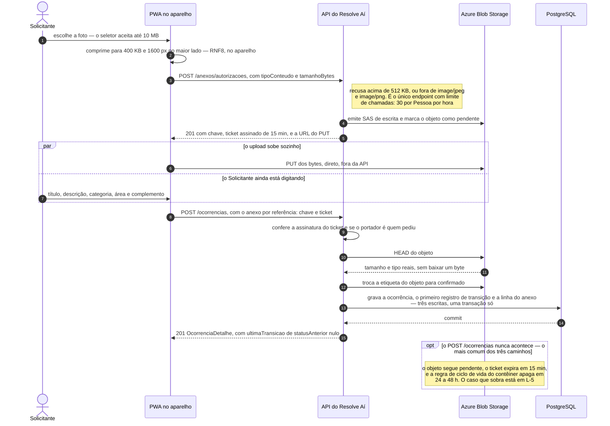

# Fluxos e Diagramas — Resolve Aí

Este documento tem **seis diagramas** e a lista dos **doze candidatos que foram pesados para chegar a
eles**. A segunda parte é tão conteúdo quanto a primeira: um pacote de documentação sem diagrama nenhum
é suspeito, mas um pacote com doze diagramas corretos e nenhuma escolha declarada é pior — não dá para
saber se alguém decidiu ou se alguém desenhou tudo o que deu.

Deriva de [escopo.md](escopo.md) (as 42 capacidades da primeira entrega),
[arquitetura.md](arquitetura.md) (o agregado, as camadas e o plano de implantação),
[contrato-de-api.md](contrato-de-api.md) (os 37 endpoints), [modelo-de-dados.md](modelo-de-dados.md)
(as tabelas e as invariantes), [glossario.md](glossario.md) — **todo rótulo de nó saiu daqui** — e das
três fontes de `refs/`, que são os fluxogramas do próprio enunciado.

---

## 1. Como ler, e por que estes seis

### O critério de aceitação

> Um diagrama ganha o lugar dele quando mostra o que o texto mostra pior: uma **topologia** (quem fala
> com quem), uma **ordem no tempo** (quem chama quem, em que sequência), um **espaço de estados** (o que
> pode virar o quê) ou uma **travessia de fronteira** (onde um dado sai de um lugar e entra em outro).

E o corolário, que foi o que mais recusou:

> **Diagrama que reescreve uma tabela é pior que a tabela** — custa manutenção, não acrescenta
> informação, e no dia em que a tabela mudar ele passa a mentir com autoridade visual.

**Resultado: seis aceitos e doze recusados** — os seis restantes da lista de candidatos, mais seis que
levantamos aqui e recusamos também.

| # | Diagrama | Tipo | O que ele mostra que o texto mostra pior |
|---|---|---|---|
| **DG-1** | Máquina de estados da `Ocorrência` | `stateDiagram-v2` | O **espaço de estados**: quais são poços sem saída, que `Pausada` é um desvio que volta, e o delta contra o ciclo de vida do enunciado |
| **DG-2** | Um comando de transição, de ponta a ponta | `sequenceDiagram` | A **ordem no tempo** que prova a ADR-0001: o registro de histórico é efeito dentro do agregado, não chamada de fora |
| **DG-3** | Resolução de contexto e autorização | `flowchart` | O **ponto de estrangulamento** do RNF1 — e as duas escritas que passam por fora dele |
| **DG-4** | Entrada na organização | `flowchart` | A **topologia dos caminhos** até um Vínculo, e os dois becos que ela contém |
| **DG-5** | Registro da ocorrência com anexo | `sequenceDiagram` | A **travessia de fronteira**: os bytes nunca tocam a aplicação |
| **DG-6** | Cadeia de implantação | `flowchart` | A **topologia de execução**: três provedores, um `Dockerfile`, e onde a migração de banco entra |

### Duas regras que valem para todos

**Toda frase que acompanha um diagrama é uma afirmação, não uma legenda.** Se o Mermaid não renderizar,
a informação sobrevive na frase. E se a frase não pudesse ser escrita, o diagrama não teria tese e não
estaria aqui.

**Todo diagrama declara a origem do que desenha** — `ENUNCIADO · literal`, `ENUNCIADO · aberto` ou
`NOSSO`. Onde um diagrama mistura os três, a distinção está **no desenho**: rótulo do nó, traço
tracejado ou nota. É o caso do DG-1, do DG-4 e do DG-6.

### Notação, e de onde ela vem

**[FONTE EXTERNA]** — nenhuma das nove aulas de DDD ensina notação de diagrama. Não há C4, BPMN nem UML
aqui: os tipos usados (`stateDiagram-v2`, `sequenceDiagram`, `flowchart`, e o `erDiagram` que já existe
no modelo de dados) são recursos do próprio Mermaid, e as palavras *ator*, *participante* e *mensagem*
aparecem no sentido corrente, não como vocabulário de uma dessas notações. O que **é** do curso está
citado como `aula N, p.X`.

**Mermaid em bloco de código, dentro de Markdown.** Não SVG, não PNG, não ferramenta externa: renderiza
no GitHub, é texto e portanto diferenciável em *pull request*, e é o formato que as fontes de `refs/`
já são. **Sem emoji nos nossos diagramas** — as fontes do enunciado usam, é o estilo delas; em rótulo,
emoji atrapalha leitor de tela e não sobrevive a copiar e colar.

### Os dois diagramas que já existem, e não se refazem

| Diagrama | Onde | Por que não é refeito aqui |
|---|---|---|
| **Mapa de contexto** — contextos delimitados e padrões de integração | [`arquitetura.md` §3](arquitetura.md) | É o desenho do design estratégico de DDD (aulas 3 e 4). Um segundo desenho das mesmas caixas seria a segunda cópia a manter |
| **Diagrama Entidade-Relacionamento** — o esquema físico inteiro, mais `auth.users` | [`modelo-de-dados.md` §3](modelo-de-dados.md) | É o esquema físico. O DG-4 e o DG-5 apontam para ele em vez de repetir colunas |

**A regra que isso serve: um diagrama, um lugar.** Nunca o mesmo diagrama em dois arquivos — duplicata
diverge, e diagrama divergente é pior que diagrama ausente. Dois dos seis aceitos moram em
`arquitetura.md` — o DG-1 e o DG-6. A §5 diz quais, onde, quando e por quê.

---

## 2. As três fontes do enunciado, e o que fazemos com cada uma

`refs/` é fonte, não rascunho. Os três `.mmd` são conteúdo verbatim do desafio, extraídos dos links
`mermaid.live` embutidos no PDF. A relação entre eles e o que desenhamos precisa ser explícita, porque
**o avaliador tem o enunciado na mão e vai comparar**.

| Fonte | O que ela mostra | O nosso equivalente | Divergência, e por decisão de quem |
|---|---|---|---|
| **`fluxograma-1`** — perfis e responsabilidades | Solicitante (10 capacidades) e Gestor (8) ligados a um bloco `OCORRÊNCIA` com nove atributos | **Nenhum diagrama.** As capacidades estão em [`escopo.md` §1](escopo.md); as permissões, na tabela de [`contrato-de-api.md` §4.5](contrato-de-api.md); os atributos, no ER de [`modelo-de-dados.md` §3](modelo-de-dados.md) | Ele desenha as capacidades como **sequência encadeada** (`S1 → S2 → … → S10`), o que não é fluxo — é lista desenhada como fluxo por conveniência visual, e já está registrado assim em [`premissas-e-questoes-abertas.md` §4](premissas-e-questoes-abertas.md). **Não repetimos o encadeamento.** Ele também **não lista "Solução aplicada"** entre os atributos, enquanto a imagem renderizada na p.2 do PDF lista — **premissa P4: o PDF manda**. E o nosso terceiro papel, o `Encarregado`, não existe nele: é `NOSSO` (D27) |
| **`fluxograma-2`** — ciclo de vida | Os cinco estados; `Cancelada` a partir dos três primeiros; **todos os cinco** ligados ao bloco *Histórico da alteração* | **DG-1** | Acrescentamos **`Pausada`** (`NOSSO`, D8, autorizado pelo *"no mínimo"* do enunciado) e o estado inicial `[*] → Aberta`. A ligação de **todos** os estados ao histórico é o que sustenta a **premissa P1** — a criação gera o primeiro registro, com status anterior nulo |
| **`fluxograma-3`** — fluxo geral | Os mesmos cinco estados, com *"registra histórico"* **apenas nas transições** | **DG-1** (os estados) e **DG-2** (o mecanismo do registro) | É a outra metade da divergência acima, **resolvida pela P1**: a criação também registra. O DG-1 **não desenha o bloco de histórico** — ele é o assunto inteiro do DG-2, e desenhá-lo nos dois seria a duplicata que a regra proíbe |

**Uma quarta relação, que não é divergência e sim acréscimo:** `Pausada` **não existe em nenhuma das
três fontes**. É `NOSSO` (D8), e no DG-1 está visualmente distinguível — traço tracejado, sufixo
`NOSSO D8` no rótulo, e nota própria.

**A divergência da avaliação, e uma correção de citação que apareceu ao conferir.** A imagem do ciclo de
vida traz um nó *"Avaliação do solicitante"* depois de `Resolvida`, que a lista textual (p.3) e o
`fluxograma-2` não têm — resolvido pela **D1**: avaliação é ação sobre `Resolvida`, não sexto estado.
Conferindo o PDF página a página para escrever esta seção, apareceu que **só a imagem da p.2 (bloco ②)
tem esse nó**: a imagem da p.4 (bloco ④, *"Fluxo principal da ocorrência"*) tem os cinco estados e nada
mais. A documentação citava *"p.2 e p.4"*, e **a citação foi corrigida em 20/08/2026**. A correção
**reforça a D1** em vez de enfraquecê-la — são três fontes contra uma, e não duas contra duas. Detalhe em
§6, **L-8**.

---

## 3. Os diagramas

### DG-1 · Máquina de estados da `Ocorrência`

> **Este diagrama mudou-se para [`arquitetura.md`, Parte I §4](arquitetura.md), logo abaixo da tabela de
> transições permitidas** (§5). O motivo: a tabela diz **quem pode** e o
> diagrama diz **que forma o grafo tem**; são duas metades de um argumento só, e uma transição nova que
> entre num e não no outro fica visivelmente errada quando os dois estão juntos. Separados, não fica.
>
> **Um diagrama, um lugar.** Ele não é reproduzido aqui: duplicata diverge, e diagrama divergente é pior
> que diagrama ausente. O que fica nesta seção é a análise que não cabe ao lado do desenho — a origem de
> cada elemento e a comparação com as três fontes do enunciado.

**O que ele afirma:** a máquina tem **dois poços e nenhum caminho de volta** — de `Resolvida` e de
`Cancelada` não se sai, e `Pausada` é o único desvio que retorna, sempre para o estado de onde saiu. O
enunciado desenha os cinco estados sem o desvio: **tudo o que está tracejado é nosso**.

**Origem dos elementos.** Os cinco estados e as setas entre eles são `ENUNCIADO · literal` (fluxo
principal, p.3 do PDF, e o `fluxograma-2`). `Pausada`, as duas setas de `pausar`, as duas de `retomar`
e a seta `Pausada → Cancelada` são `NOSSO` (D8, D12). A seta inicial `[*] → Aberta` é a **premissa
P1**. A ausência de `reabrir` é a **D24**; a ausência de um sexto estado de avaliação é a **D1**.

**O que ele deliberadamente não mostra:**

- **Quem pode disparar cada comando.** É a coluna *"Quem pode"* da tabela de transições em
  [`arquitetura.md` §4](arquitetura.md), e repeti-la aqui criaria a segunda cópia da regra de
  autorização. **O diagrama mostra a forma do grafo; a tabela mostra as permissões** — é essa divisão
  que impede que ele seja a tabela redesenhada.
- **Os oito comandos que não transicionam** — `alterarPrioridade`, `atribuirResponsavel`, `avaliar` e
  os demais. Desenhá-los como laço no próprio estado sugeriria transição, e transição gera registro de
  histórico. Sugerir isso seria mentir sobre o requisito central do desafio.
- **As precondições que não são de status:** `iniciarAtendimento` exige responsável atribuído
  (invariante 9, D21); `pausar` e `cancelar` exigem motivo estruturado e observação (invariante 5,
  D23). Estão nas invariantes do agregado.
- **O registro de histórico.** É o DG-2 inteiro.

**Onde ver o desenho:** [`arquitetura.md`, Parte I §4](arquitetura.md), imediatamente após a tabela de
transições permitidas.

---

### DG-2 · Um comando de transição, de ponta a ponta



> **O que este diagrama afirma:** não existe caminho em que o status muda sem que o registro de
> transição nasça na mesma operação, porque **quem muda o status é o mesmo objeto que emite o
> registro** — e nenhuma seta vinda de fora do Domínio pede qualquer uma das duas coisas. É a ADR-0001
> desenhada: a auditabilidade não é convenção do time, é invariante do agregado.

**Origem dos elementos.** Que *"cada transição de status deve ser auditável"* e que o registro tem cinco
campos é `ENUNCIADO · literal` (F4–F6). **Todo o resto do desenho é mecanismo `NOSSO`**: as quatro
camadas vêm da aula 5 (p.5–7) via [`arquitetura.md` §5](arquitetura.md); a consistência forçada do
agregado, da aula 5 (p.9) via
[ADR-0001](adr/0001-historico-de-transicoes-como-conceito-de-dominio.md); o verbo no caminho
(`POST /ocorrencias/{id}/pausar`) é a decisão da [§3.3 do contrato](contrato-de-api.md); o
`409 TRANSICAO_NAO_PERMITIDA` com `acoesDisponiveis`, a §8.4.

**O que ele deliberadamente não mostra:**

- **A resolução de contexto**, que já aconteceu antes da primeira seta. É o DG-3 — e desenhar as duas
  coisas no mesmo diagrama produziria dez participantes e nenhuma tese.
- **Os outros nove comandos.** A forma é idêntica; o que muda é o schema de entrada e o par
  (status, comando) validado. `pausar` foi escolhido porque é o único que exige motivo **e** observação,
  o que deixa a D23 visível já na segunda linha.
- **A `Ocorrência` sendo criada.** `registrar` é o DG-5, que tem quatro participantes a mais.

**Uma consequência que o desenho torna visível.** A última nota não é decoração: em
[`arquitetura.md` Parte II §1](arquitetura.md) o fluxo de ponta a ponta termina com *"as políticas
in-process reagem ao evento, criando notificação ou abrindo canal"*. **Na primeira entrega esse último
passo é vazio para todo comando de transição** — as políticas que reagiriam são todas ⬜. Ver **L-3**.

---

### DG-3 · Resolução de contexto e autorização



> **O que este diagrama afirma:** existe **um** lugar no sistema que decide em qual organização se está
> operando, e todo o resto herda a decisão — o cliente nunca nomeia uma organização, exceto no corpo de
> um único `PUT`. Quatro endpoints passam por fora do funil, **dois deles escrevendo**, e é essa lista
> curta que a verificação automatizada do RNF1 tem de cobrir.

**Origem dos elementos.** **Tudo aqui é `NOSSO`** — o enunciado não trata de multi-tenancy, e nenhuma
das nove aulas de DDD também não (**[FONTE EXTERNA]**, coerente com o que
[`premissas-e-questoes-abertas.md` §5](premissas-e-questoes-abertas.md) já declara). O funil é a
[ADR-0003](adr/0003-isolamento-de-tenant-na-camada-de-aplicacao.md) (D2, D3, RNF1); o ACL é o par
Conformista + *Anticorruption Layer* da aula 4 (p.9 e p.12); a regra *"a consulta parte de
`vinculos`"* é a [§4.3 do modelo de dados](modelo-de-dados.md); a lista dos quatro endpoints e o papel
do `X-Organizacao-Id` são as [§4.2 e §4.4 do contrato](contrato-de-api.md); a autorização por permissão
e não por papel, a §4.5.

**O que ele deliberadamente não mostra:**

- **A troca de organização ativa** — o candidato 5 da lista, recusado como diagrama próprio (§4). Ela é
  o nó `ORG` visto por trás: `PUT /contexto/organizacao` é o único ponto do produto inteiro em que um
  `organizacaoId` viaja do cliente para o servidor, e ele valida o vínculo antes de gravar o cookie.
- **A RLS**, que está ligada com outra responsabilidade — negar acesso direto do cliente ao banco — e
  não participa da decisão de escopo (ADR-0003).
- **Onde o Encarregado para.** Um vínculo `encarregado` com conta atravessa o funil inteiro e chega ao
  losango de permissão com `permissoes: []`, levando `403` em todo endpoint de negócio. É estado
  declarado (contrato, S-A6), não acidente — mas é um caminho que termina em nada, e a **L-6** mostra
  que chegar nele por engano pode ser irreversível.

---

### DG-4 · Entrada na organização



> **O que este diagrama afirma:** todo Vínculo nasce de uma decisão de um Gestor — **exceto o primeiro
> de cada organização, que não tem quem o decida**. Essa exceção é o bootstrap da D26, e é também a
> razão dos dois becos: o grafo não tem nenhuma aresta que crie um Gestor novo sem um Gestor já dentro.

**Origem dos elementos.** *Criar conta* e *autenticar-se* são `ENUNCIADO · aberto` (S1, S2) — e nem
sequer são endpoints deste produto, porque autenticação é subdomínio **Genérico**, comprado do provedor
(aula 1; [`arquitetura.md` §1](arquitetura.md)). **Todo o resto é `NOSSO`**: auto-serviço (D26), código
público e pedido de entrada (D25), convite (D25, evolução prevista), cadastro de Encarregado (D27). **O que está
tracejado é evolução prevista.**

**O que ele deliberadamente não mostra:** os campos de cada requisição, que estão no
[contrato §8.2](contrato-de-api.md); e a tabela `pessoas` — global e sem `organizacao_id` —, que é a
razão de `POST /vinculos` **sempre criar uma Pessoa nova em vez de procurar por e-mail** (S-A2):
procurar seria exatamente a consulta global que a regra do vínculo primeiro proíbe.

**Dois achados que o desenho produziu**, ambos na §6: **L-6** (aprovar com o papel errado é
irreversível) e **L-9** (a enumeração de [`escopo.md` §1.5](escopo.md) — *"ou porque ele convidou, ou
porque aprovou um pedido"* — não menciona o cadastro de Encarregado, que é o terceiro caminho até um
Vínculo e um dos dois que existem inteiros na primeira entrega).

---

### DG-5 · Registro da ocorrência com anexo



> **O que este diagrama afirma:** o anexo nunca passa pelo servidor da aplicação — o cliente escreve
> direto no storage com credencial temporária, e a API só emite a credencial e **valida a
> reivindicação**, com um `HEAD` que lê tamanho e tipo reais sem baixar nada. A validação não acontece
> no upload: acontece na hora de reivindicar.

**Origem dos elementos.** *Anexar uma imagem* é `ENUNCIADO · aberto` (S6) — o desafio exige a
capacidade e não diz nada sobre o como. **Todo o mecanismo é `NOSSO`**: a compressão no aparelho é o
RNF8; o paralelismo do passo do meio é o que faz o registro caber no RNF6; e URL assinada, ticket
assinado e etiqueta de índice do objeto são **[FONTE EXTERNA]**, sem nenhuma aula que os trate. A
decisão inteira está na [§10 do contrato](contrato-de-api.md); a coluna que guarda a chave opaca, na
[§2.8 do modelo](modelo-de-dados.md).

**O que ele deliberadamente não mostra:**

- **A leitura do anexo.** `GET /ocorrencias/{id}/anexos/{anexoId}` responde `302` para uma URL assinada
  de 10 minutos, com URL estável para o cache do PWA. É simétrico ao que está desenhado; o segundo desenho não
  acrescentaria fronteira nova.
- **O ciclo de vida do objeto no storage** (`pendente → confirmado`, ou `pendente → apagado`) como
  espaço de estados próprio: são três estados e duas setas, e as duas já aparecem aqui como passos.
- **As camadas internas da API.** É o DG-2.

**Verificação que o desenho obrigou.** A [§10 do contrato](contrato-de-api.md) e a
[§2.8 do modelo de dados](modelo-de-dados.md) foram conferidas uma contra a outra: **concordam**. A
coluna guarda uma chave opaca; o contrato grava exatamente essa chave; e a §10.3 recusa a variante de
prefixo citando a §2.8 pelo nome. Não há contradição a reportar — mas há uma lacuna no caminho de
falha, que é a **L-5**.

---

### DG-6 · Cadeia de implantação

> **Este diagrama mudou-se para [`arquitetura.md`, Parte II §9](arquitetura.md), dentro do plano de
> implantação** (§5). O motivo: ele é o parágrafo *"a cadeia de entrega"* com os
> outros dois provedores e a migração no lugar, e quem lê um plano de implantação é exatamente quem precisa
> dele. **Um diagrama, um lugar** — ele não é reproduzido aqui.
>
> **Uma seta mudou na mudança.** Aqui ela era tracejada, com a lacuna L-4 escrita no rótulo: *"quem dispara
> a migração não está definido"*. A resposta veio — **um passo do próprio workflow do Actions, antes do
> deploy** — e na versão que mora na arquitetura a seta é firme e nomeada. **O achado sobreviveu ao
> conserto**: fica registrado no L-4 da §6, porque o rastro de como a lacuna foi encontrada vale mais que a
> seta.

**O que ele afirma:** o `Dockerfile` que roda na máquina do implementador é o mesmo artefato que serve em
produção — é o que faz E7 e E8 serem satisfeitos pela mesma coisa —, e a única seta que não passa pelo
contêiner da aplicação é a dos bytes da imagem, que o usuário escreve direto no storage. **O rollback da
aplicação é imediato; o do banco não é, e é por isso que a migração vai primeiro.**

**Origem dos elementos.** **Docker é `ENUNCIADO · literal`** (E7) e **deploy em nuvem é
`ENUNCIADO · aberto`** (E8) — os dois estão marcados dentro do desenho, porque é essa a distinção que
importa: o enunciado exige que existam, e a escolha de Azure Container Apps, `ghcr.io` e Blob Storage é
`NOSSO`, justificada na [ADR-0004](adr/0004-execucao-em-container-no-azure.md). **[FONTE EXTERNA]** — a
cadeia de container em nuvem vem da disciplina de DevOps da Fase 5 (aulas 5, 6 e 9), não das nove aulas
de DDD.

**O que ele deliberadamente não mostra:** o conteúdo do pipeline, que está em
[`arquitetura.md` §7](arquitetura.md); as variáveis de ambiente e os segredos; e o ambiente de
*preview* por branch — **que não existe**, e cuja ausência é consequência declarada da ADR-0004.

**Referência cruzada:** o plano de implantação em prosa está em
[`arquitetura.md` Parte II §9](arquitetura.md) — que é exatamente onde o desenho passou a morar. Ver §5.

---

## 4. Os candidatos recusados

Doze recusas. Cada uma tem o motivo, porque **recusa sem motivo é indistinguível de esquecimento**.

| # | Candidato | Recusado porque |
|---|---|---|
| 2 | **Ciclo de vida com atores em raias** | O ator de cada transição é uma **coluna** da tabela de `arquitetura.md` §4, não uma topologia. Some-se que o Mermaid **não tem raias**: forjá-las com `subgraph` produz travessias cruzadas ilegíveis assim que um estado é alcançável por dois papéis — que é o caso de `cancelar` |
| 5 | **Sequência da troca de organização ativa** | São três mensagens e nenhuma ordem surpreendente. O que importa não é a sequência, é a **regra** — a organização vem da sessão, e `X-Organizacao-Id` confirma sem nunca escolher. **Reformulado e absorvido pelo DG-3**, onde é o nó `ORG` e o losango do cabeçalho |
| 8 | **Contexto de sistema, com os externos** | São mesmo coisas diferentes do mapa de contexto de DDD — mas as caixas de runtime e as setas entre elas **já estão no DG-6**, inclusive a do cliente escrevendo direto no storage. Um terceiro desenho das mesmas caixas seria o terceiro lugar a atualizar quando um provedor mudar. **Recusado por duplicação com o DG-6, não com a §3 da arquitetura** |
| 9 | **As quatro camadas e a regra de dependência** | Quatro caixas e setas todas no mesmo sentido: é o caso-escola do diagrama que reescreve uma tabela. E o que a tabela mostra pior — a regra **acontecendo** — está no DG-2, que mostra a Interface validando só formato e o Domínio nunca persistindo |
| 10 | **Jornada atual × jornada da solução** | A jornada da solução **já é** a estrutura de raias da Fig. 3 da aula 7, em tabela, na Documentação da Demanda: `ETAPA · PERSONA · SISTEMA`. Redesenhá-la reproduz a ordem das linhas e não acrescenta nada. E a comparação "antes × depois" é retórica, não estrutura: é material de **apresentação**, e o lugar dela é o material de apresentação da equipe, não `docs/` |
| 12 | **As nove atividades como fluxo** | Elas são a **espinha de um mapa de histórias**, e agrupamento não é sequência: 0 e 1 acontecem uma vez, 3 a 6 são o ciclo de vida que o DG-1 já desenha, e 7 e 8 são contínuas. Desenhar como fluxo faria o leitor inferir que "Gerir" acontece depois de "Acompanhar". **É exatamente o erro que o `fluxograma-1` do enunciado comete** com as capacidades do Solicitante, e que já registramos como erro — repeti-lo depois de tê-lo apontado seria o pior resultado possível |

**Seis candidatos que levantamos aqui, e também recusamos:**

| Candidato | Recusado porque |
|---|---|
| **Ciclo de vida do objeto no storage** (`pendente → confirmado → apagado`) | Três estados e duas setas, e as duas já são passos do DG-5. Um `stateDiagram-v2` com três nós é uma frase escrita de forma cara |
| **Anonimização de uma Pessoa (LGPD, RNF10)** | Os cinco passos já estão numerados em `modelo-de-dados.md` §10.1, em ordem, com a camada de cada um. O que interessa ali é o que **não** é alcançado — texto livre e imagem —, e isso é prosa, não seta |
| **Trilha de auditoria × linha do tempo** | A diferença é de recorte e vocabulário, e está numa tabela de quatro linhas no contrato §8.5. Não há topologia nem ordem |
| **Os três canais de conversa** | Dois dos três são evolução prevista. Desenhar uma máquina de canais na primeira entrega mostraria dois nós inalcançáveis — foi por essa mesma razão que o contrato recusou expor `canais/{tipo}` |
| **Modelo de leitura do dashboard** | Cinco indicadores num endpoint. É um schema de resposta, e ele já está escrito |
| **Mapa de navegação de telas** | **Não é nosso.** É do inventário de telas. Desenhá-lo aqui criaria a duplicata antes mesmo de o original existir — e o original **já existe**: [`inventario-de-telas.md`](inventario-de-telas.md) §3 |

---

## 5. Onde cada diagrama mora

Dois destes seis ficam melhor dentro de um documento existente, e a razão é a mesma nos dois casos: **um
diagrama que precisa concordar com uma tabela deve estar ao lado dela**, porque distância é como a
divergência começa. **Os dois foram movidos em 20/08/2026** — as âncoras abaixo são onde eles estão, não
onde deveriam estar.

| Diagrama | Mora em | Âncora exata | Por que lá é melhor |
|---|---|---|---|
| **DG-1** — máquina de estados | `docs/arquitetura.md` | **Parte I, §4**, logo após a tabela *"Tabela de transições permitidas"* e antes do parágrafo *"`Resolvida` e `Cancelada` são terminais de verdade"* | A tabela e o diagrama são **um argumento só**: a tabela diz quem pode, o desenho diz que forma o grafo tem. Separados, o dia em que uma transição mudar só um dos dois muda |
| **DG-6** — cadeia de implantação | `docs/arquitetura.md` | **Parte II, §9**, logo após o parágrafo que começa em *"**A cadeia de entrega:** merge em `main` → …"* | O diagrama é aquele parágrafo com os outros dois provedores e a migração no lugar. O leitor do plano de implantação é exatamente quem precisa dele |

**Este documento ficou com a referência cruzada e com a análise de origem e de divergência** — que é
conteúdo daqui de qualquer forma, porque é a relação com as três fontes do enunciado. Os quatro restantes
(DG-2, DG-3, DG-4, DG-5) não têm tabela correspondente em outro documento e ficam aqui.

**Nenhum dos dois é reproduzido nas duas casas.** A regra é *um diagrama, um lugar*: duplicata diverge, e
diagrama divergente é pior que diagrama ausente.

---

## 6. O que desenhar revelou

Nove itens. Nenhum foi resolvido *aqui* — **ambiguidade se registra, não se resolve em silêncio**, e
quatro deles tocavam decisões de produto, que não são deste documento.

**Os nove foram respondidos em 20/08/2026**, e a tabela abaixo é o que aconteceu com cada um. As seções
seguintes preservam o achado como foi encontrado, porque **o rastro vale mais que a conclusão**: o que
importa para quem for manter isto é que os nove apareceram ao desenhar, não em revisão de texto — e três
deles existiam havia semanas em documentos já revisados.

| # | O que era | O que virou |
|---|---|---|
| **L-1** | A ADR-0003 punha a resolução de contexto no *handler*; a arquitetura §5 proíbe a Interface de tocar o banco | Corrigida a **redação** da ADR-0003 — *"a camada de aplicação, invocada uma vez por requisição"*. A decisão não mudou; a palavra apontava para a camada errada |
| **L-2** | Duas escritas em tabela escopada rodam fora do repositório escopado, sem que nada dissesse de onde vinha o `organizacao_id` | **Emenda à ADR-0003** com a regra fechada: o `organizacao_id` entra por dois caminhos e não existe um terceiro; as duas operações com licença estão **enumeradas**, e um terceiro caso é emenda à ADR, não decisão de código. Caso próprio no critério A4 |
| **L-3** | Nenhuma política reage a transição na primeira entrega, mas três documentos sugeriam que sim | Declarado na `arquitetura.md`: das **onze** políticas, **duas** rodam, e nenhuma reage a transição. Criada a **POL-11** que faltava no passo 6. Notas no contrato onde a POL-04 promete arquivar um canal que ainda não existe. *(Esta célula dizia "três rodam" até **30/08/2026**; a tabela da L-3 logo abaixo sempre disse "POL-02 — Não, convite é ⬜", e era a contagem que estava errada, nos dois lugares. Corrigida junto com a Parte II §1 da `arquitetura.md`, item 7 da fila da frente de documentação.)* |
| **L-4** | A migração de banco não tinha dono na cadeia de implantação | **Passo do próprio workflow do Actions, antes do deploy.** Recusado o comando manual, pelo motivo das ADR-0001 e 0003: com ele, a ordem segura depende de alguém lembrar |
| **L-5** | O objeto de imagem pode ficar confirmado e órfão se a transação falhar | Declarado como **terceiro caso residual** na §10.3 do contrato, com o argumento de por que a ordem atual é a mais segura das duas |
| **L-6** | Aprovar pedido de entrada com o papel errado é irreversível | **PA-25**, com o conserto decidido: um **desfazer estreito** — anular a aprovação enquanto o vínculo não tiver histórico —, e não *revogar vínculo*. Escopo e contrato entram juntos numa próxima rodada |
| **L-7** | O modelo de dados classificava a recorrência como adiada | Justificativa corrigida. A decisão de não indexar continua valendo pelo argumento da agregação, que não dependia do prazo |
| **L-8** | A citação *"p.2 e p.4 do PDF"* atribuía o nó de avaliação a duas imagens | Corrigida para **p.2**, nas premissas. O erro **enfraquecia a própria premissa**, ao transformar 3 a 1 em 2 a 2 |
| **L-9** | Dois textos enumeravam caminhos de entrada e deixavam um de fora | `escopo.md` §1.5 passou a listar os **três** caminhos, e a arquitetura passou a dizer *"no agregado `Ocorrência`"* onde generalizava |

### L-1 · A camada que resolve o contexto tem dois donos diferentes em dois documentos

A [`ADR-0003`](adr/0003-isolamento-de-tenant-na-camada-de-aplicacao.md) dizia, no ponto 1 da Decisão:
*"**O handler** que valida a sessão lê o usuário autenticado, **busca o vínculo ativo** e monta um
contexto"*. Mas a [`arquitetura.md`](arquitetura.md) (Parte I, §5) proíbe a camada de **Interface** — que
é onde o *route handler* vive — de **tocar o banco**, e a Parte II §1 atribui a resolução à camada de **Aplicação**:
*"a camada de aplicação resolve o contexto da requisição"*.

Desenhar o DG-3 obrigou a escolher de quem é o passo, e as duas leituras têm consequência: se o ponto
único vive na Interface, ele viola a regra de dependência que a ADR-0001 e a ADR-0003 declaram proteger.
**Assumimos a leitura da `arquitetura.md`** (Aplicação) e declaramos a suposição em §7.
**Proposta:** trocar *"o handler"* por *"a camada de aplicação, invocada uma vez por
requisição"* na ADR-0003. É redação, não decisão — mas é redação sobre a fronteira mais cara do projeto.

### L-2 · Duas escritas em tabela escopada acontecem fora do repositório escopado

[`contrato-de-api.md` §4.4](contrato-de-api.md) lista **quatro** endpoints que *"não passam pelo
repositório escopado"*. Dois deles **escrevem**:

- `POST /pedidos-de-entrada` insere em `pedidos_de_entrada`, que
  [`modelo-de-dados.md` §4.1](modelo-de-dados.md) classifica como **escopada**;
- `POST /organizacoes` cria a organização, o vínculo de Gestor e — pela **POL-01** — as categorias e as
  áreas semente, todas escopadas.

Nenhum documento diz **qual componente preenche `organizacao_id` nessas escritas**, nem como o
`codigoPublico` vira `organizacao_id` sem passar pelo funil. Não é defeito: é passo sem dono declarado,
e está exatamente no mecanismo que existe para tornar o vazamento impossível por engano.
**Proposta:** nomear o mecanismo (por exemplo, *"a resolução por código público produz um contexto de
escrita restrito àquela organização, e é o quinto e último ponto que conhece um `organizacao_id` fora
do funil"*) e acrescentar caso de teste próprio ao critério **A4**.

### L-3 · Na primeira entrega, nenhuma política reage a uma transição de status

A [`arquitetura.md`](arquitetura.md), Parte II §1, descreve o fluxo de ponta a ponta terminando
em *"as **políticas** in-process reagem ao evento, criando notificação ou abrindo canal"*. Cruzando as
dez políticas do passo 6 do Event Storming com o recorte do [`escopo.md`](escopo.md):

| Política | Roda na primeira entrega? |
|---|---|
| POL-01 semear categorias e áreas | **Sim** |
| POL-02 estabelecer vínculo ao aceitar convite | Não — convite é ⬜ |
| POL-03 e POL-04 abrir e arquivar o canal 3 | Não — canais 2 e 3 são ⬜ |
| POL-05 e POL-06 notificar responsável e solicitante | Não — notificação é ⬜ |
| POL-07 entregar por canal externo | Não — plano pago |
| POL-08 pausar o relógio ativo | Não escreve nada, por desenho |
| POL-09 e POL-10 alarme e envelhecimento | Não — ⬜ |

**Sobra uma**, mais a que foi acrescentada ao aprovar a Q-API-1 (*vínculo estabelecido ao aprovar
pedido de entrada*) — e **essa não está na tabela do passo 6**: o passo 5 foi atualizado em 20/08/2026
e o passo 6 não. Duas consequências: a frase da arquitetura descreve um passo que na primeira entrega é
vazio para **todo** comando de transição; e o contrato afirma, em §3.4 e §8.4, que reatribuir
*"dispara a POL-04, que arquiva o canal 3"* — um canal que ainda não existe.
**Proposta:** uma linha em cada um dos três lugares dizendo quais políticas de fato rodam agora.

### L-4 · A migração de banco não tem dono na cadeia de implantação

A [`arquitetura.md`](arquitetura.md), Parte II §9, diz: *"**Migrações de banco** são versionadas em arquivo e
aplicadas pelo CLI do Supabase"*, e a ordem segura é *"migração compatível primeiro, código depois"*.
**Quem executa o CLI, e em que momento da cadeia, não está escrito** — desenhar o DG-6 obrigou a
escolher a origem de uma seta, e ela ficou tracejada com a lacuna no rótulo.

O detalhe importa porque a regra de ordem só é verificável se houver um lugar onde ela é aplicada: se a
migração for manual e o deploy automático, **a ordem depende de a pessoa lembrar** — que é precisamente
o tipo de garantia que a ADR-0001 e a ADR-0003 recusaram em outros pontos.
**Recomendação:** um passo do próprio workflow do Actions, antes do passo de deploy.

### L-5 · O objeto do anexo pode ficar órfão e imortal

A [§10.2 do contrato](contrato-de-api.md) ordena a reivindicação assim: confere o ticket, faz `HEAD`,
**marca o objeto como confirmado** e só então grava a ocorrência. Se a transação do banco falhar depois
da troca da etiqueta, o objeto fica `confirmado` **sem nenhuma linha que o referencie** — e a regra de
ciclo de vida do contêiner só recolhe o que está `pendente`. Ele fica fora do banco e fora da faxina,
para sempre.

**A ordem documentada é a mais segura das duas** — inverter (gravar e depois etiquetar) trocaria um
objeto órfão de 400 KB por uma ocorrência real cujo anexo some em 24 a 48 h, que é perda de dado. Não
há defeito a corrigir; há um caminho de falha que a §10.3 descreve para dois casos (o feliz e o
abandonado) e não descreve para o terceiro. **Proposta:** declarar o caso residual, com o custo, ao
lado dos outros dois.

> **E apareceu um quarto caminho, que não existia quando este achado foi escrito — 21/08/2026.** A
> imagem virou a tabela `anexos`, e o `UNIQUE (chave)` dela faz o banco recusar a **segunda**
> reivindicação do mesmo objeto. Isso encosta na **S-T7** do inventário de telas, que manda a tela
> reenviar a mesma `chave` quando o `POST /ocorrencias` cai por rede: se a primeira chamada tiver
> comitado e só a resposta se perdido, o reenvio agora recebe **`409 ANEXO_JA_REIVINDICADO`**.
>
> **Antes, esse reenvio criava em silêncio uma segunda ocorrência apontando para a mesma foto.** O
> caminho de falha ganhou nome, e o terceiro caso residual **não mudou** — a §10.3 do contrato registra
> os dois. É o tipo de coisa que uma decisão de modelagem entrega de graça, e que não estaria escrita
> em lugar nenhum se ninguém tivesse voltado ao desenho.

### L-6 · Aprovar um pedido de entrada com o papel errado é irreversível

Achado do DG-4, e é irmão mais amplo do **PA-24 / S-A15**. `POST /pedidos-de-entrada/{id}/aprovar`
recebe `{ papel }` e cria o Vínculo. A partir daí, na primeira entrega:

- **`PATCH /vinculos/{pessoaId}` não aceita `papel`** — Q-API-6, resposta (a);
- **revogar vínculo é ⬜** (evolução prevista);
- **um novo pedido responde `409 JA_VINCULADO`**.

Aprovar um morador como `encarregado` por engano produz uma pessoa que autentica, atravessa o funil
inteiro, recebe `permissoes: []` e **não consegue nem registrar uma ocorrência** — sem caminho de volta
dentro do produto. Aprovar como `gestor` por engano é o oposto e pior: privilégio permanente. O PA-24
cobre só o caso do Gestor único que perde o acesso; este é mais provável, porque é erro de clique num
formulário de rotina.
**Opções:** (a) registrar como ponto de atenção e viver com isso; (b) **trazer *revogar vínculo* para a
primeira entrega** — é uma história `P` no mapa e desfaz os dois casos; (c) aceitar `papel` no `PATCH`,
que é um campo mas vira capacidade nova no escopo. **Recomendamos (b).**

### L-7 · O modelo de dados classificava a recorrência como adiada; o escopo e o contrato a põem na primeira entrega

O [`modelo-de-dados.md`](modelo-de-dados.md), na §6.7, justifica **não criar** os índices
`(organizacao_id, categoria_id)` e `(organizacao_id, area_id)` com dois argumentos — e o primeiro deles
dizia que a recorrência ainda **não estava na primeira entrega**. Mas [`escopo.md`](escopo.md) lista *"Recorrência por categoria e por área"*
como ✅ da primeira entrega, e o [contrato §8.7](contrato-de-api.md) a devolve em `GET /dashboard`.

**A decisão de não criar os índices pode continuar certa** — o segundo argumento da mesma linha é que
`GROUP BY` sobre a partição inteira é varredura por natureza —, mas **a justificativa cita um status de
escopo que mudou**. É o tipo de frase que envelhece em silêncio. **Proposta:** reescrever mantendo só o
argumento do plano de consulta.

### L-8 · A divergência da avaliação é citada em duas páginas do PDF; só uma tem o nó

A [`premissas-e-questoes-abertas.md`](premissas-e-questoes-abertas.md), na **P3**, dizia: *"A imagem do
ciclo de vida (**p.2 e p.4** do PDF) mostra um nó 'Avaliação do solicitante'"*. Conferido página a página: **a p.2 (bloco ②, "Ciclo de vida da ocorrência") mostra; a
p.4 (bloco ④, "Fluxo principal da ocorrência") não** — ela tem os cinco estados, `Cancelada` tracejada
e o quadro de histórico, e nada mais.

**A D1 não muda; ela fica mais forte.** O placar real é três fontes com cinco estados (texto da p.3,
imagem da p.4, `fluxograma-2` e `fluxograma-3`) contra uma com seis. **Proposta:** trocar *"p.2 e p.4"*
por *"p.2"* nos dois lugares.

### L-9 · Dois textos enumeram caminhos de entrada e deixam um de fora

[`escopo.md` §1.5](escopo.md): *"todo vínculo nasce aprovado por um Gestor: **ou** porque ele convidou
por um link de uso único, **ou** porque aprovou um pedido de entrada"*. São dois, e existe um terceiro:
`POST /vinculos`, o cadastro de Encarregado sem conta (D27), que cria Pessoa e Vínculo na mesma
transação sem convite e sem pedido. A invariante da D25 continua verdadeira — é um Gestor decidindo —,
mas a **enumeração** está incompleta, e é dela que o leitor tira o modelo mental.

**No mesmo item, uma imprecisão menor:** [`arquitetura.md` Parte II §1](arquitetura.md) diz que as
políticas reagem *"sem nunca escrever no agregado"*, enquanto o Event Storming afirma isso
especificamente do agregado **`Ocorrência`** — a POL-01 escreve `Categoria` e `Área`, que o passo 9 põe
dentro do agregado `Organização`. **Proposta:** qualificar as duas frases.

---

## 7. Suposições declaradas

Não há Domain Expert real neste projeto, e um diagrama não fecha sem que cada passo tenha nome. O que
foi assumido para fechar um desenho está aqui, com o que muda se estiver errado.

| # | Suposição | O que muda se estiver errada |
|---|---|---|
| **S-DG1** | **A resolução de contexto acontece na camada de Aplicação**, e não no *route handler* — a leitura da `arquitetura.md`, contra a redação da ADR-0003 (**L-1**) | Só o DG-3 muda de participante. Mas se a leitura certa for a da ADR-0003, existe uma violação da regra de dependência a resolver antes da primeira linha de código |
| **S-DG2** | **A etiqueta do objeto é trocada antes do `commit`**, na ordem literal da §10.2 do contrato (**L-5**) | Se a ordem for a inversa, o DG-5 troca duas linhas de lugar — e o caminho de falha declarado passa a ser perda de imagem em ocorrência real, que é pior |
| **S-DG3** | **A migração é aplicada antes de a revisão nova servir tráfego** — o DG-6 desenha a seta assim, com o disparador em aberto (**L-4**) | Se a migração for manual e posterior, o rollback instantâneo da aplicação deixa de ser seguro, e a ordem declarada na §9 vira recomendação sem lugar onde é aplicada |
| **S-DG4** | **`retomar` tem exatamente dois destinos** — `Em análise` e `Em atendimento` —, derivado de `pausar` só sair desses dois estados | Se algum dia `pausar` sair de `Aberta`, o DG-1 ganha uma terceira seta de volta. Nada mais muda: o alvo continua sendo o `status anterior` do registro de pausa |
| **S-DG5** | **`POST /vinculos` é um caminho de entrada de pleno direito** no DG-4, e não um detalhe de cadastro (**L-9**) | Se cadastro não for entendido como "entrada", o nó sai do DG-4 e vira parte da atividade 1 do escopo. A invariante da D25 não muda em nenhuma das duas leituras |
| **S-DG6** | **Nenhuma política reage a transição na primeira entrega** (**L-3**), o que sustenta a última nota do DG-2 | A nota sai, e o DG-2 ganha um participante de política. É a suposição mais barata de corrigir das seis |

**Nenhum termo novo foi criado.** Todo rótulo de nó veio do [glossário](glossario.md) ou é identificador
técnico já fixado em outro documento (`ghcr.io`, `SAS`, `route handler`). O par
`pendente` / `confirmado`, que marca o objeto no storage, é o único candidato a termo — e pelo critério
da §9 do glossário (*entra o conceito, não o identificador*) **recomendamos que não entre**: a distinção
que ele carrega já está na definição do fluxo de imagem do contrato.

---

## 8. Limitações — o que não foi verificado

**1 · Os diagramas não foram renderizados.** A **sintaxe** de todos os seis foi validada com o parser
oficial do Mermaid — versão **11.17.0**, via `mermaid.parse()` num DOM de `jsdom`. Os seis passam, e o
mesmo script recusa, como controle, um rótulo com parêntese fora de aspas (`A[Em análise (pelo
Gestor)]` → *parse error*), o que mostra que a verificação de fato verifica.

**Foi passado também no que já existia**, e os cinco passam: o mapa de contexto da `arquitetura.md`, o
ER do `modelo-de-dados.md` e os três `.mmd` de `refs/`.

O núcleo do script, para quem quiser repetir ou pôr no pipeline:

```js
// npm i mermaid jsdom
const dom = new JSDOM('<!DOCTYPE html><body></body>');
global.window = dom.window; global.document = dom.window.document;
const mermaid = (await import('mermaid')).default;
mermaid.initialize({ startOnLoad: false });
// extraia cada bloco cercado por crases com a marca "mermaid" e chame:
await mermaid.parse(bloco);   // lança em erro de sintaxe
```

**Parsear não é renderizar.** Um diagrama pode passar no parser e sair ilegível: nota sobreposta, rótulo
longo demais, `direction LR` que estica a página. **A conferência visual no GitHub está pendente** e é
o primeiro trabalho de quem revisar este documento.

**2 · A versão do Mermaid do GitHub pode ser anterior à 11.17.0.** Por isso a sintaxe é conservadora —
só `flowchart`, `stateDiagram-v2` e `sequenceDiagram`, sem nenhum tipo experimental. Os dois recursos
menos antigos em uso são `classDef` dentro de `stateDiagram-v2` (DG-1) e o bloco `par` (DG-5). Se algum
falhar no GitHub, os dois têm substituto de custo zero: o rótulo do nó `Pausada` já diz `NOSSO D8` sem
depender de estilo, e o `par` vira duas mensagens em sequência com uma nota.

**3 · Nada foi conferido em tela pequena.** O DG-6 é largo.

**4 · Não há revisão por outra pessoa** — é a mesma limitação que o Definition of Done declara para o
projeto inteiro, com um implementador só.

**5 · A validação de sintaxe não está no pipeline.** Foi feita à mão, uma vez. Enquanto não for um passo
do CI, o próximo commit pode quebrar um diagrama sem que nada reclame — e a §7 da `arquitetura.md` já
tem o lugar onde esse passo entraria. Proposta registrada.
