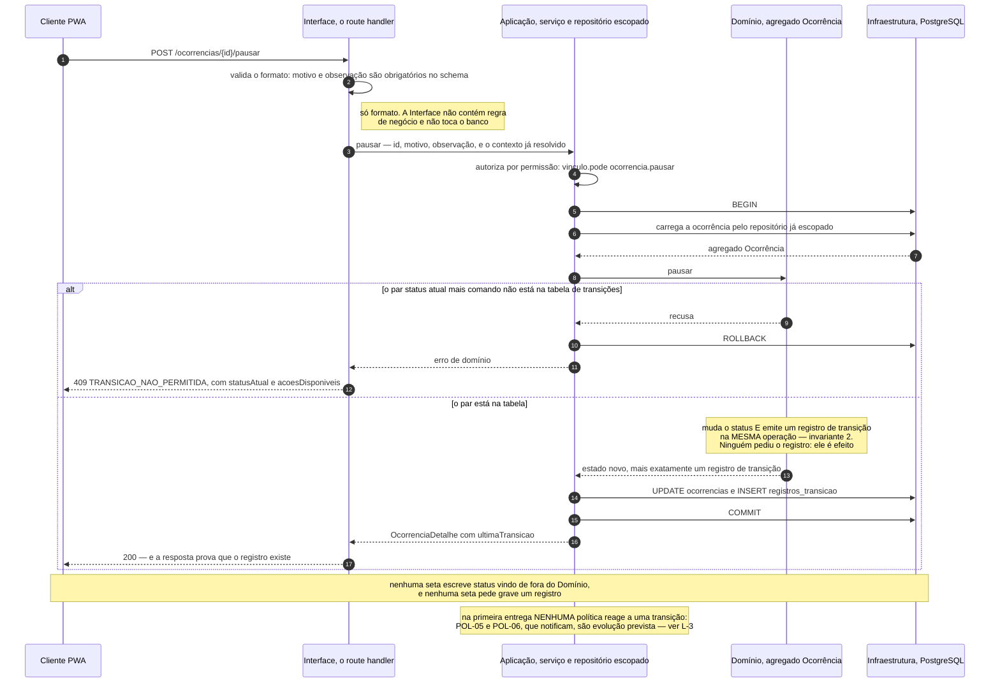
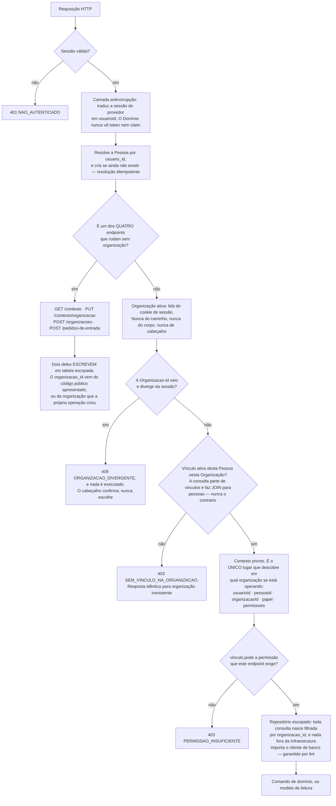
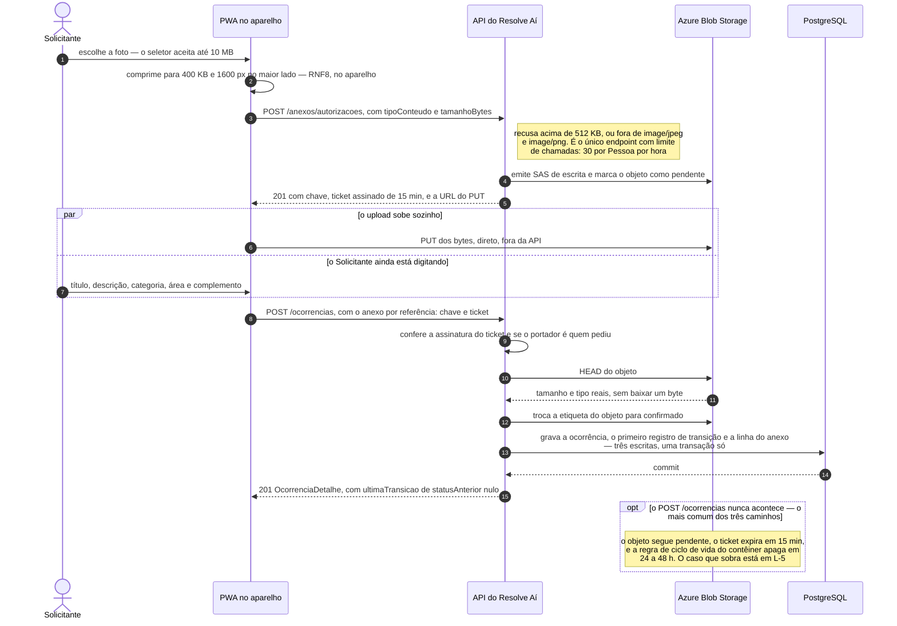

# Fluxos e Diagramas — Resolve Aí

Este documento tem **seis diagramas** e a lista dos doze candidatos que foram pesados para chegar a eles.
A segunda parte é tão conteúdo quanto a primeira: um pacote de documentação sem diagrama nenhum é
suspeito, mas um pacote com doze diagramas corretos e nenhuma escolha declarada é pior, porque não dá para
saber se alguém decidiu ou se alguém desenhou tudo o que deu.

Deriva do [escopo](escopo.md), da [arquitetura](arquitetura.md), do
[contrato de API](contrato-de-api.md), do [modelo de dados](modelo-de-dados.md), do
[glossário](glossario.md), de onde saiu todo rótulo de nó, e dos três fluxogramas do próprio enunciado.

---

## 1. Por que estes seis

### O critério de aceitação

Um diagrama ganha o lugar dele quando mostra o que o texto mostra pior: uma **topologia**, ou seja, quem
fala com quem; uma **ordem no tempo**, quem chama quem e em que sequência; um **espaço de estados**, o que
pode virar o quê; ou uma **travessia de fronteira**, onde um dado sai de um lugar e entra em outro.

E o corolário, que foi o que mais recusou: **diagrama que reescreve uma tabela é pior que a tabela**,
porque custa manutenção, não acrescenta informação, e no dia em que a tabela mudar ele passa a mentir com
autoridade visual.

Resultado: **seis aceitos e doze recusados**.

| # | Diagrama | Tipo | O que ele mostra que o texto mostra pior |
|---|---|---|---|
| DG-1 | Máquina de estados da `Ocorrência` | `stateDiagram-v2` | O espaço de estados: quais são poços sem saída, que `Pausada` é um desvio que volta, e o delta contra o ciclo de vida do enunciado |
| DG-2 | Um comando de transição, de ponta a ponta | `sequenceDiagram` | A ordem no tempo que prova a ADR-0001: o registro de histórico é efeito dentro do agregado, e não chamada de fora |
| DG-3 | Resolução de contexto e autorização | `flowchart` | O ponto de estrangulamento do RNF1, e as duas escritas que passam por fora dele |
| DG-4 | Entrada na organização | `flowchart` | A topologia dos caminhos até um Vínculo, e os dois becos que ela contém |
| DG-5 | Registro da ocorrência com anexo | `sequenceDiagram` | A travessia de fronteira: os bytes nunca tocam a aplicação |
| DG-6 | Cadeia de implantação | `flowchart` | A topologia de execução: três provedores, um `Dockerfile`, e onde a migração de banco entra |

### Duas regras que valem para todos

**Toda frase que acompanha um diagrama é uma afirmação, e não uma legenda.** Se o Mermaid não renderizar,
a informação sobrevive na frase. E se a frase não pudesse ser escrita, o diagrama não teria tese e não
estaria aqui.

**Todo diagrama distingue no desenho o que vem do enunciado do que é acréscimo nosso**, por rótulo do nó,
traço tracejado ou nota. É o caso do DG-1, do DG-4 e do DG-6.

### Notação

Não há C4, BPMN nem UML aqui. Os tipos usados — `stateDiagram-v2`, `sequenceDiagram`, `flowchart`, e o
`erDiagram` que já existe no modelo de dados — são recursos do próprio Mermaid, e as palavras *ator*,
*participante* e *mensagem* aparecem no sentido corrente, e não como vocabulário de uma dessas notações.

**Mermaid em bloco de código, dentro de Markdown.** Não SVG, não PNG, não ferramenta externa: renderiza no
GitHub, é texto e portanto diferenciável em *pull request*, e é o formato que os fluxogramas do enunciado
já são. **Sem emoji nos nossos diagramas**, porque em rótulo o emoji atrapalha leitor de tela e não
sobrevive a copiar e colar.

### Os dois diagramas que já existem, e não se refazem

| Diagrama | Onde | Por que não é refeito aqui |
|---|---|---|
| Mapa de contexto | [`arquitetura.md` §3](arquitetura.md) | É o desenho do design estratégico. Um segundo desenho das mesmas caixas seria a segunda cópia a manter |
| Diagrama Entidade-Relacionamento | [`modelo-de-dados.md` §3](modelo-de-dados.md) | É o esquema físico. O DG-4 e o DG-5 apontam para ele em vez de repetir colunas |

**A regra que isso serve: um diagrama, um lugar.** Nunca o mesmo diagrama em dois arquivos, porque
duplicata diverge, e diagrama divergente é pior que diagrama ausente. Dois dos seis aceitos moram na
arquitetura, o DG-1 e o DG-6, e a §5 diz quais, onde e por quê.

---

## 2. As três fontes do enunciado, e o que fazemos com cada uma

Os três fluxogramas do enunciado são conteúdo verbatim do desafio. A relação entre eles e o que
desenhamos precisa ser explícita, **porque o avaliador tem o enunciado na mão e vai comparar**.

| Fonte | O que ela mostra | O nosso equivalente | Divergência |
|---|---|---|---|
| `fluxograma-1`, perfis e responsabilidades | Solicitante e Gestor ligados a um bloco de ocorrência com nove atributos | Nenhum diagrama. As capacidades estão no [escopo](escopo.md); as permissões, no [contrato](contrato-de-api.md) §4.5; os atributos, no ER do [modelo de dados](modelo-de-dados.md) | Ele desenha as capacidades como sequência encadeada, o que não é fluxo: é lista desenhada como fluxo por conveniência visual, e está registrado assim nas [premissas](premissas-e-questoes-abertas.md). **Não repetimos o encadeamento.** Ele também não lista "Solução aplicada" entre os atributos, enquanto a imagem renderizada no PDF lista, e é a premissa P4. E o nosso terceiro papel, o `Encarregado`, não existe nele: é acréscimo nosso, pela D27 |
| `fluxograma-2`, ciclo de vida | Os cinco estados; `Cancelada` a partir dos três primeiros; todos os cinco ligados ao bloco de histórico | DG-1 | Acrescentamos `Pausada`, autorizada pelo *"no mínimo"* do enunciado, e o estado inicial. A ligação de todos os estados ao histórico é o que sustenta a premissa P1 |
| `fluxograma-3`, fluxo geral | Os mesmos cinco estados, com o registro de histórico apenas nas transições | DG-1 para os estados, e DG-2 para o mecanismo do registro | É a outra metade da divergência acima, resolvida pela P1: a criação também registra. O DG-1 não desenha o bloco de histórico, porque ele é o assunto inteiro do DG-2, e desenhá-lo nos dois seria a duplicata que a regra proíbe |

**Uma quarta relação, que não é divergência e sim acréscimo:** `Pausada` não existe em nenhuma das três
fontes. É decisão nossa, na D8, e no DG-1 está visualmente distinguível, com traço tracejado, sufixo no
rótulo e nota própria.

**A divergência da avaliação.** A imagem do ciclo de vida traz um nó *"Avaliação do solicitante"* depois de
`Resolvida`, que a lista textual e o `fluxograma-2` não têm, e isso está resolvido pela D1: avaliação é
ação sobre `Resolvida`, e não sexto estado. Só a imagem da segunda página tem esse nó; a da quarta tem os
cinco estados e nada mais. São três fontes contra uma. Detalhe na §6, no achado L-8.

---

## 3. Os diagramas

### DG-1 · Máquina de estados da `Ocorrência`

**Este diagrama mora em [`arquitetura.md`, Parte I §4](arquitetura.md)**, logo abaixo da tabela de
transições permitidas. O motivo: a tabela diz **quem pode** e o diagrama diz **que forma o grafo tem**, e
são duas metades de um argumento só. Uma transição nova que entre num e não no outro fica visivelmente
errada quando os dois estão juntos, e separados não fica. Ele não é reproduzido aqui, e o que fica nesta
seção é a análise que não cabe ao lado do desenho.

**O que ele afirma:** a máquina tem dois poços e nenhum caminho de volta. De `Resolvida` e de `Cancelada`
não se sai, e `Pausada` é o único desvio que retorna, sempre para o estado de onde saiu. O enunciado
desenha os cinco estados sem o desvio, então tudo o que está tracejado é nosso.

**Origem dos elementos.** Os cinco estados e as setas entre eles vêm do enunciado. `Pausada`, as duas
setas de `pausar`, as duas de `retomar` e a seta `Pausada → Cancelada` são nossas, pelas decisões D8 e
D12. A seta inicial é a premissa P1. A ausência de `reabrir` é a D24, e a ausência de um sexto estado de
avaliação é a D1.

**O que ele deliberadamente não mostra:**

- **Quem pode disparar cada comando.** É a coluna "quem pode" da tabela de transições, e repeti-la aqui
  criaria a segunda cópia da regra de autorização. O diagrama mostra a forma do grafo; a tabela mostra as
  permissões, e é essa divisão que impede que ele seja a tabela redesenhada.
- **Os oito comandos que não transicionam.** Desenhá-los como laço no próprio estado sugeriria transição,
  e transição gera registro de histórico. Sugerir isso seria mentir sobre o requisito central do desafio.
- **As precondições que não são de status:** `iniciarAtendimento` exige responsável atribuído, e `pausar` e
  `cancelar` exigem motivo estruturado e observação. Estão nas invariantes do agregado.
- **O registro de histórico.** É o DG-2 inteiro.

---

### DG-2 · Um comando de transição, de ponta a ponta

**O que este diagrama afirma:** não existe caminho em que o status muda sem que o registro de transição
nasça na mesma operação, porque **quem muda o status é o mesmo objeto que emite o registro**, e nenhuma
seta vinda de fora do Domínio pede qualquer uma das duas coisas. É a ADR-0001 desenhada.

**Origem dos elementos.** Que cada transição de status deve ser auditável, e que o registro tem cinco
campos, vem do enunciado. Todo o resto do desenho é mecanismo nosso: as quatro camadas vêm da
[arquitetura](arquitetura.md) §5; a consistência forçada do agregado, da
[ADR-0001](adr/0001-historico-de-transicoes-como-conceito-de-dominio.md); o verbo no caminho, da §3.3 do
[contrato](contrato-de-api.md); e o `409 TRANSICAO_NAO_PERMITIDA` com `acoesDisponiveis`, da §8.4.

**O que ele deliberadamente não mostra:**

- **A resolução de contexto**, que já aconteceu antes da primeira seta. É o DG-3, e desenhar as duas coisas
  no mesmo diagrama produziria dez participantes e nenhuma tese.
- **Os outros nove comandos.** A forma é idêntica, e o que muda é o schema de entrada e o par de status e
  comando validado. O `pausar` foi escolhido porque é o único que exige motivo e observação, o que deixa a
  D23 visível já na segunda linha.
- **A `Ocorrência` sendo criada.** O `registrar` é o DG-5, que tem quatro participantes a mais.

**Uma consequência que o desenho torna visível.** A última nota não é decoração: na
[arquitetura](arquitetura.md) o fluxo de ponta a ponta termina com as políticas reagindo ao evento, e **na
primeira entrega esse último passo é vazio para todo comando de transição**, porque as políticas que
reagiriam são todas evolução prevista. Ver o achado L-3.

---

### DG-3 · Resolução de contexto e autorização

**O que este diagrama afirma:** existe **um** lugar no sistema que decide em qual organização se está
operando, e todo o resto herda a decisão. O cliente nunca nomeia uma organização, exceto no corpo de um
único `PUT`. Quatro endpoints passam por fora do funil, dois deles escrevendo, e é essa lista curta que a
verificação automatizada do RNF1 tem de cobrir.

**Origem dos elementos.** Tudo aqui é mecanismo nosso, porque o enunciado não trata de atender várias
organizações na mesma instância. O funil é a
[ADR-0003](adr/0003-isolamento-de-tenant-na-camada-de-aplicacao.md); a camada anticorrupção é o par de
padrões descrito na [arquitetura](arquitetura.md) §3; a regra de que a consulta parte de `vinculos` é a
§4.3 do [modelo de dados](modelo-de-dados.md); a lista dos quatro endpoints e o papel do
`X-Organizacao-Id` são as §4.2 e §4.4 do [contrato](contrato-de-api.md); e a autorização por permissão e
não por papel, a §4.5.

**O que ele deliberadamente não mostra:**

- **A troca de organização ativa**, que foi recusada como diagrama próprio. Ela é o nó `ORG` visto por
  trás: `PUT /contexto/organizacao` é o único ponto do produto inteiro em que um `organizacaoId` viaja do
  cliente para o servidor, e ele valida o vínculo antes de gravar o cookie.
- **A RLS**, que está ligada com outra responsabilidade, a de negar acesso direto do cliente ao banco, e
  não participa da decisão de escopo.
- **Onde o Encarregado para.** Um vínculo com esse papel e com conta atravessa o funil inteiro e chega ao
  losango de permissão com a lista vazia, levando `403` em todo endpoint de negócio. É estado declarado, e
  não acidente, mas é um caminho que termina em nada.

---

### DG-4 · Entrada na organização

**O que este diagrama afirma:** todo Vínculo nasce de uma decisão de um Gestor, **exceto o primeiro de cada
organização, que não tem quem o decida**. Essa exceção é o bootstrap da D26, e é também a razão dos becos:
o grafo não tem nenhuma aresta que crie um Gestor novo sem um Gestor já dentro.

**Origem dos elementos.** Criar conta e autenticar-se vêm do enunciado, e nem sequer são endpoints deste
produto, porque autenticação é subdomínio genérico, comprado do provedor. Todo o resto é decisão nossa:
auto-serviço, código público e pedido de entrada, convite, e cadastro de Encarregado. **O que está
tracejado é evolução prevista.**

**O que ele deliberadamente não mostra:** os campos de cada requisição, que estão no
[contrato](contrato-de-api.md) §8.2; e a tabela `pessoas`, global e sem `organizacao_id`, que é a razão de
`POST /vinculos` sempre criar uma Pessoa nova em vez de procurar por e-mail, porque procurar seria a
consulta global que a regra do vínculo primeiro proíbe.

**Dois achados que o desenho produziu**, ambos na §6: o L-6, sobre aprovar com o papel errado, e o L-9,
sobre a enumeração de caminhos de entrada que deixava um de fora.

---

### DG-5 · Registro da ocorrência com anexo

**O que este diagrama afirma:** o anexo nunca passa pelo servidor da aplicação. O cliente escreve direto no
storage com credencial temporária, e a API só emite a credencial e **valida a reivindicação**, com um
`HEAD` que lê tamanho e tipo reais sem baixar nada. A validação não acontece no upload: acontece na hora de
reivindicar.

**Origem dos elementos.** Anexar uma imagem é exigência do enunciado, que pede a capacidade e não diz nada
sobre o como. Todo o mecanismo é nosso: a compressão no aparelho é o RNF8, o paralelismo do passo do meio é
o que faz o registro caber no RNF6, e URL assinada, ticket assinado e etiqueta de índice do objeto são
padrões correntes de storage. A decisão inteira está na §10 do [contrato](contrato-de-api.md), e a coluna
que guarda a chave opaca, na §2.8 do [modelo](modelo-de-dados.md).

**O que ele deliberadamente não mostra:**

- **A leitura do anexo**, que responde `302` para uma URL assinada de 10 minutos, com URL estável para o
  cache do PWA. É simétrico ao que está desenhado, e o segundo desenho não acrescentaria fronteira nova.
- **O ciclo de vida do objeto no storage** como espaço de estados próprio: são três estados e duas setas, e
  as duas já aparecem aqui como passos.
- **As camadas internas da API.** É o DG-2.

**Verificação que o desenho obrigou.** A §10 do contrato e a §2.8 do modelo de dados foram conferidas uma
contra a outra, e concordam: a coluna guarda uma chave opaca, o contrato grava exatamente essa chave, e a
§10.3 recusa a variante de prefixo citando a §2.8 pelo nome. Não há contradição a reportar, e há uma lacuna
no caminho de falha, que é o L-5.

---

### DG-6 · Cadeia de implantação

**Este diagrama mora em [`arquitetura.md`, Parte II §9](arquitetura.md)**, dentro do plano de implantação.
O motivo: ele é o parágrafo sobre a cadeia de entrega com os outros dois provedores e a migração no lugar,
e quem lê um plano de implantação é quem precisa dele. Ele não é reproduzido aqui.

**Uma seta mudou na mudança.** Aqui ela era tracejada, com a lacuna L-4 escrita no rótulo, porque quem
dispara a migração não estava definido. A resposta veio — um passo do próprio workflow, antes do deploy —
e na versão que mora na arquitetura a seta é firme e nomeada. **O achado sobreviveu ao conserto**, e fica
registrado no L-4, porque o rastro de como a lacuna foi encontrada vale mais que a seta.

**O que ele afirma:** o `Dockerfile` que roda na máquina do implementador é o mesmo artefato que serve em
produção, e a única seta que não passa pelo contêiner da aplicação é a dos bytes da imagem, que o usuário
escreve direto no storage. O rollback da aplicação é imediato, o do banco não é, e é por isso que a
migração vai primeiro.

**Origem dos elementos.** Conteinerização e deploy em nuvem são exigências do enunciado, que pede que
existam e não diz onde. A escolha de Azure Container Apps, `ghcr.io` e Blob Storage é nossa, justificada na
[ADR-0004](adr/0004-execucao-em-container-no-azure.md).

**O que ele deliberadamente não mostra:** o conteúdo do pipeline, que está na
[arquitetura](arquitetura.md) §7; as variáveis de ambiente e os segredos; e o ambiente de preview por
branch, que não existe, e cuja ausência é consequência declarada da ADR-0004.

---

## 4. Os candidatos recusados

Doze recusas. Cada uma tem o motivo, porque **recusa sem motivo é indistinguível de esquecimento**.

| Candidato | Recusado porque |
|---|---|
| Ciclo de vida com atores em raias | O ator de cada transição é uma coluna da tabela da arquitetura, e não uma topologia. Some-se que o Mermaid não tem raias: forjá-las com `subgraph` produz travessias cruzadas ilegíveis assim que um estado é alcançável por dois papéis, que é o caso de `cancelar` |
| Sequência da troca de organização ativa | São três mensagens e nenhuma ordem surpreendente. O que importa é a regra, e não a sequência: a organização vem da sessão, e o cabeçalho confirma sem nunca escolher. Absorvido pelo DG-3 |
| Contexto de sistema, com os externos | As caixas de runtime e as setas entre elas já estão no DG-6, inclusive a do cliente escrevendo direto no storage. Um terceiro desenho das mesmas caixas seria o terceiro lugar a atualizar quando um provedor mudar |
| As quatro camadas e a regra de dependência | Quatro caixas e setas todas no mesmo sentido: é o caso-escola do diagrama que reescreve uma tabela. E o que a tabela mostra pior, a regra acontecendo, está no DG-2 |
| Jornada atual contra jornada da solução | A jornada da solução já é uma tabela de raias na Documentação da Demanda. Redesenhá-la reproduz a ordem das linhas e não acrescenta nada. E a comparação de antes e depois é retórica, e não estrutura: é material de apresentação |
| As nove atividades como fluxo | Elas são espinha de mapa de histórias, e agrupamento não é sequência. Desenhar como fluxo faria o leitor inferir que "Gerir" acontece depois de "Acompanhar". **É o mesmo erro que o `fluxograma-1` do enunciado comete**, e que já registramos como erro; repeti-lo depois de tê-lo apontado seria o pior resultado possível |
| Ciclo de vida do objeto no storage | Três estados e duas setas, e as duas já são passos do DG-5. Um diagrama de três nós é uma frase escrita de forma cara |
| Anonimização de uma Pessoa | Os cinco passos já estão numerados no modelo de dados, em ordem, com a camada de cada um. O que interessa ali é o que não é alcançado, e isso é prosa, e não seta |
| Trilha de auditoria contra linha do tempo | A diferença é de recorte e vocabulário, e está numa tabela de quatro linhas no contrato. Não há topologia nem ordem |
| Os três canais de conversa | Dois dos três são evolução prevista. Desenhar uma máquina de canais na primeira entrega mostraria dois nós inalcançáveis |
| Modelo de leitura do dashboard | Cinco indicadores num endpoint. É um schema de resposta, e ele já está escrito |
| Mapa de navegação de telas | Não é nosso: é do [inventário de telas](inventario-de-telas.md). Desenhá-lo aqui criaria a duplicata |

---

## 5. Onde cada diagrama mora

Dois destes seis ficam melhor dentro de um documento existente, e a razão é a mesma nos dois casos: **um
diagrama que precisa concordar com uma tabela deve estar ao lado dela**, porque distância é como a
divergência começa.

| Diagrama | Mora em | Âncora | Por que lá é melhor |
|---|---|---|---|
| DG-1, máquina de estados | `docs/arquitetura.md` | Parte I §4, logo após a tabela de transições permitidas | A tabela e o diagrama são um argumento só: a tabela diz quem pode, o desenho diz que forma o grafo tem. Separados, o dia em que uma transição mudar só um dos dois muda |
| DG-6, cadeia de implantação | `docs/arquitetura.md` | Parte II §9, logo após o parágrafo da cadeia de entrega | O diagrama é aquele parágrafo com os outros dois provedores e a migração no lugar. O leitor do plano de implantação é quem precisa dele |

Este documento ficou com a referência cruzada e com a análise de origem e de divergência, que é conteúdo
daqui de qualquer forma, porque é a relação com as três fontes do enunciado. Os quatro restantes não têm
tabela correspondente em outro documento e ficam aqui.

---

## 6. O que desenhar revelou

Nove achados, e nenhum foi resolvido no próprio desenho, porque **ambiguidade se registra, e não se
resolve em silêncio**. Todos foram respondidos, e a tabela abaixo é o que aconteceu com cada um. As seções
seguintes preservam o achado como foi encontrado, porque **o rastro vale mais que a conclusão**: o que
importa para quem for manter isto é que os nove apareceram ao desenhar, e não em revisão de texto, e três
deles existiam havia semanas em documentos já revisados.

| # | O que era | O que virou |
|---|---|---|
| L-1 | A ADR-0003 punha a resolução de contexto no handler; a arquitetura proíbe a Interface de tocar o banco | Corrigida a redação da ADR-0003. A decisão não mudou; a palavra apontava para a camada errada |
| L-2 | Duas escritas em tabela escopada rodam fora do repositório escopado, sem que nada dissesse de onde vinha o `organizacao_id` | Regra fechada na ADR-0003: o `organizacao_id` entra por dois caminhos e não existe um terceiro, e as duas operações com licença estão enumeradas. Caso próprio no critério A4 |
| L-3 | Nenhuma política reage a transição na primeira entrega, e três documentos sugeriam que sim | Declarado na arquitetura: das onze políticas, duas rodam, e nenhuma reage a transição. Criada a POL-11, que faltava |
| L-4 | A migração de banco não tinha dono na cadeia de implantação | Passo do próprio workflow, antes do deploy. Recusado o comando manual, pelo motivo das ADR-0001 e 0003: com ele, a ordem segura depende de alguém lembrar |
| L-5 | O objeto de imagem pode ficar confirmado e órfão se a transação falhar | Declarado como terceiro caso residual na §10.3 do contrato, com o argumento de por que a ordem atual é a mais segura das duas |
| L-6 | Aprovar pedido de entrada com o papel errado é irreversível | Virou o ponto de atenção PA-25, e o conserto entrou na primeira entrega: remover vínculo sem histórico, que é um desfazer estreito, e não a revogação completa |
| L-7 | O modelo de dados classificava a recorrência como adiada | Justificativa corrigida. A decisão de não indexar continua valendo pelo argumento da agregação, que não dependia do prazo |
| L-8 | A citação atribuía o nó de avaliação a duas imagens do PDF | Corrigida para uma só, nas premissas. O erro enfraquecia a própria premissa, ao transformar três contra um em dois contra dois |
| L-9 | Dois textos enumeravam caminhos de entrada e deixavam um de fora | O escopo passou a listar os três caminhos, e a arquitetura passou a qualificar de qual agregado ela fala |

### L-1 · A camada que resolve o contexto tinha dois donos em dois documentos

A [ADR-0003](adr/0003-isolamento-de-tenant-na-camada-de-aplicacao.md) dizia que o handler que valida a
sessão lê o usuário autenticado, busca o vínculo ativo e monta um contexto. Mas a
[arquitetura](arquitetura.md) proíbe a camada de Interface, que é onde o route handler vive, de tocar o
banco, e atribui a resolução à camada de Aplicação.

Desenhar o DG-3 obrigou a escolher de quem é o passo, e as duas leituras têm consequência: se o ponto único
vive na Interface, ele viola a regra de dependência que a ADR-0001 e a ADR-0003 declaram proteger. Ficou a
leitura da arquitetura. É redação, e não decisão, e é redação sobre a fronteira mais cara do projeto.

### L-2 · Duas escritas em tabela escopada acontecem fora do repositório escopado

O [contrato](contrato-de-api.md) §4.4 lista quatro endpoints que não passam pelo repositório escopado, e
dois deles escrevem: `POST /pedidos-de-entrada` insere em tabela escopada, e `POST /organizacoes` cria a
organização, o vínculo de Gestor e, pela POL-01, as categorias e as áreas semente.

Nenhum documento dizia qual componente preenche o `organizacao_id` nessas escritas, nem como o código
público vira `organizacao_id` sem passar pelo funil. Não era defeito: era passo sem dono declarado, e
estava exatamente no mecanismo que existe para tornar o vazamento impossível por engano.

### L-3 · Na primeira entrega, nenhuma política reage a uma transição de status

A [arquitetura](arquitetura.md) descrevia o fluxo de ponta a ponta terminando com as políticas reagindo ao
evento. Cruzando as políticas com o recorte do [escopo](escopo.md):

| Política | Roda na primeira entrega? |
|---|---|
| POL-01, semear categorias e áreas | Sim |
| POL-02, estabelecer vínculo ao aceitar convite | Não, porque o convite é evolução prevista |
| POL-03 e POL-04, abrir e arquivar o canal da atribuição | Não, porque os canais 2 e 3 são evolução prevista |
| POL-05 e POL-06, notificar responsável e solicitante | Não, porque notificação é evolução prevista |
| POL-07, entregar por canal externo | Não, porque é plano pago |
| POL-08, pausar o relógio ativo | Não escreve nada, por desenho |
| POL-09 e POL-10, alarme e envelhecimento | Não, porque são evolução prevista |
| POL-11, estabelecer vínculo ao aprovar pedido | Sim |

**Sobram duas, e nenhuma reage a transição.** Uma consequência que o achado produziu: a POL-11 não estava
na lista original das políticas, porque foi acrescentada depois e a lista nunca foi atualizada junto.

### L-4 · A migração de banco não tinha dono na cadeia de implantação

A [arquitetura](arquitetura.md) dizia que migrações são versionadas em arquivo e aplicadas pelo CLI, e que
a ordem segura é migração compatível primeiro e código depois. **Quem executa o CLI, e em que momento da
cadeia, não estava escrito**, e desenhar o DG-6 obrigou a escolher a origem de uma seta.

O detalhe importa porque a regra de ordem só é verificável se houver um lugar onde ela é aplicada: se a
migração for manual e o deploy automático, a ordem depende de a pessoa lembrar, que é o tipo de garantia
que a ADR-0001 e a ADR-0003 recusaram em outros pontos.

### L-5 · O objeto do anexo pode ficar órfão e imortal

A §10.2 do [contrato](contrato-de-api.md) ordena a reivindicação assim: confere o ticket, faz `HEAD`, marca
o objeto como confirmado, e só então grava a ocorrência. Se a transação do banco falhar depois da troca da
etiqueta, o objeto fica confirmado sem nenhuma linha que o referencie, e a regra de ciclo de vida do
contêiner só recolhe o que está pendente. Ele fica fora do banco e fora da faxina, para sempre.

**A ordem documentada é a mais segura das duas:** inverter, gravando e depois etiquetando, trocaria um
objeto órfão de 400 KB por uma ocorrência real cujo anexo some em 24 a 48 h, que é perda de dado.

**E apareceu um quarto caminho, que não existia quando este achado foi escrito.** A imagem virou a tabela
`anexos`, e a restrição de unicidade da chave faz o banco recusar a segunda reivindicação do mesmo objeto.
Isso encosta na regra que manda a tela reenviar a mesma chave quando o registro cai por rede: se a primeira
chamada tiver comitado e só a resposta se perdido, o reenvio agora recebe `409 ANEXO_JA_REIVINDICADO`.
Antes, esse reenvio criava em silêncio uma segunda ocorrência apontando para a mesma foto. É o tipo de
coisa que uma decisão de modelagem entrega de graça, e que não estaria escrita em lugar nenhum se ninguém
tivesse voltado ao desenho.

### L-6 · Aprovar um pedido de entrada com o papel errado é irreversível

Achado do DG-4. O endpoint de aprovação recebe o papel e cria o Vínculo, e a partir daí não havia caminho
de volta: o `PATCH` de vínculo não aceita papel, revogar vínculo é evolução prevista, e um novo pedido
responde `409 JA_VINCULADO`.

Aprovar um morador como Encarregado por engano produz uma pessoa que autentica, atravessa o funil inteiro,
recebe a lista de permissões vazia e não consegue nem registrar uma ocorrência. Aprovar como Gestor por
engano é o oposto e pior: privilégio permanente. É mais provável que o beco do Gestor único, porque é erro
de clique num formulário de rotina.

**Foi resolvido trazendo para a primeira entrega um desfazer estreito:** remover o vínculo enquanto ele não
tiver histórico. Não é a revogação completa, que continua sendo evolução prevista, e é o suficiente para
desfazer o engano.

### L-7 · O modelo de dados classificava a recorrência como adiada

O [modelo de dados](modelo-de-dados.md) justificava não criar dois índices com dois argumentos, e o
primeiro deles dizia que a recorrência ainda não estava na primeira entrega. Mas o [escopo](escopo.md) a
lista como entregue, e o contrato a devolve no dashboard.

**A decisão de não criar os índices pode continuar certa**, porque o segundo argumento da mesma linha é que
a agregação sobre a partição inteira é varredura por natureza. O que estava errado era a justificativa
citar um status de escopo que mudou. É o tipo de frase que envelhece em silêncio.

### L-8 · A divergência da avaliação é citada em duas páginas do PDF, e só uma tem o nó

As [premissas](premissas-e-questoes-abertas.md) diziam que a imagem do ciclo de vida em duas páginas mostra
um nó de avaliação do solicitante. Conferido página a página: só a segunda mostra. A quarta tem os cinco
estados, `Cancelada` tracejada e o quadro de histórico, e nada mais.

**A D1 não muda; ela fica mais forte.** O placar real é de três fontes com cinco estados contra uma com
seis.

### L-9 · Dois textos enumeram caminhos de entrada e deixam um de fora

O [escopo](escopo.md) dizia que todo vínculo nasce aprovado por um Gestor, ou porque ele convidou, ou
porque aprovou um pedido de entrada. São dois, e existe um terceiro: o cadastro de Encarregado sem conta,
que cria Pessoa e Vínculo na mesma transação, sem convite e sem pedido. A invariante continua verdadeira,
porque é um Gestor decidindo, e a enumeração estava incompleta, e é dela que o leitor tira o modelo mental.

**No mesmo achado, uma imprecisão menor:** a arquitetura dizia que as políticas reagem sem nunca escrever
no agregado, enquanto isso vale especificamente do agregado `Ocorrência`, porque a POL-01 escreve
`Categoria` e `Área`, que estão dentro do agregado `Organização`.

---

## 7. O que a validação de sintaxe cobre, e o que não cobre

A sintaxe de todos os diagramas do repositório é validada por `npm run verificar:mermaid`, que roda dentro
do `npm run verificar` e falha o build. Ele usa o parser oficial do Mermaid sobre cada bloco, e tem
controle diferencial: recusa um rótulo com parêntese fora de aspas e aceita o mesmo diagrama com o rótulo
entre aspas, o que mostra que a verificação de fato discrimina.

**Parsear não é renderizar.** Um diagrama pode passar no parser e sair ilegível, com nota sobreposta,
rótulo longo demais, ou uma direção que estica a página. A conferência visual continua sendo trabalho de
quem revisa, e nada foi conferido em tela pequena, onde o DG-6 é largo.

**A versão do Mermaid do GitHub pode ser anterior à do verificador.** Por isso a sintaxe é conservadora,
com só `flowchart`, `stateDiagram-v2` e `sequenceDiagram`, e sem nenhum tipo experimental. Os dois recursos
menos antigos em uso são o `classDef` dentro de `stateDiagram-v2` e o bloco `par`, e os dois têm substituto
de custo zero: o rótulo do nó `Pausada` já diz de onde ele vem sem depender de estilo, e o `par` vira duas
mensagens em sequência com uma nota.

**Nenhum termo novo foi criado.** Todo rótulo de nó veio do [glossário](glossario.md) ou é identificador
técnico já fixado em outro documento. O par de estados do objeto no storage é o único candidato a termo, e
pelo critério do glossário ele não entra: a distinção que ele carrega já está na definição do fluxo de
imagem do contrato.
