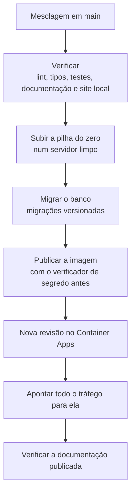

# Infraestrutura

Um contêiner com a aplicação inteira, PostgreSQL e autenticação gerenciados, e um armazenamento de objetos
para as imagens. Tudo dentro de franquias gratuitas permanentes, e a mesma imagem roda na máquina de quem
desenvolve e em produção.

## Onde cada peça roda

| Peça | Provedor | O que faz |
|---|---|---|
| Aplicação | Azure Container Apps | serve a interface, a API e estas páginas, num contêiner só |
| Banco | Supabase PostgreSQL | as ocorrências, a trilha e o cadastro |
| Contas e sessões | Supabase Auth | autenticação, confirmação de e-mail e recuperação de senha |
| Imagens | Azure Blob Storage | um contêiner de objetos, alimentado direto pelo aparelho |
| Imagem do contêiner | GitHub Container Registry | pública, consumida sem credencial |
| Esteira | GitHub Actions | verificações, migrações, construção da imagem e implantação |

A aplicação roda na região `chilecentral` e o banco em São Paulo, com latência de cerca de 40 ms entre os
dois. A assinatura de estudante restringe as regiões permitidas a cinco, e a do Brasil não está entre
elas. Contra o orçamento de resposta do produto esse número é ruído, e fica escrito para que ninguém gaste
uma tarde tentando mover a aplicação para mais perto.

## A imagem

O mesmo `Dockerfile` sobe o ambiente local e a produção, em três estágios: dependências, construção e
execução. O estágio final leva apenas a saída autocontida do Next, sem código-fonte, sem dependências de
desenvolvimento e sem testes. Ele roda com usuário próprio, não privilegiado, e tem verificação de saúde
apontada para a tela de entrada.

**A imagem não carrega segredo nem configuração.** Não há `ARG` no arquivo, os arquivos de ambiente são
excluídos antes de qualquer cópia, e não existe variável embutida no pacote que o navegador baixa. As
cinco variáveis de execução chegam do próprio Container App em tempo de execução:

| Variável | Para quê |
|---|---|
| `SUPABASE_URL` e `SUPABASE_CHAVE_ANONIMA` | falar com o provedor de autenticação |
| `BANCO_URL` | a conexão do servidor com o PostgreSQL |
| `SEGREDO_DE_SESSAO` | assinar o cookie da organização ativa |
| `ARMAZENAMENTO_CONEXAO` | assinar as credenciais temporárias de upload |

Como a imagem é pública, nada disso pode estar nela. Um verificador confere antes da publicação, e
[Testes](testes.md) descreve como.

## Da máquina ao ar



**A ordem importa, e a migração vem antes da imagem.** Voltar atrás na aplicação é imediato; no banco, não
é. Quem aplica a migração é a própria esteira, num passo que falha em voz alta e interrompe a cadeia, em
vez de depender de alguém lembrar de rodar um comando antes da mesclagem.

**Criar revisão não move tráfego.** O ambiente roda em modo de revisões múltiplas, que é a precondição de
poder voltar atrás sem reconstruir nada, e o preço desse modo é que a revisão nova nasce com peso zero. Sem
o passo que aponta o tráfego, a esteira ficaria verde enquanto a URL continuasse servindo o código
anterior, que é o modo de falha mais traiçoeiro possível.

## Voltar atrás

O Container Apps guarda as revisões anteriores, e voltar é redirecionar o tráfego para uma delas: imediato
e sem reconstruir. A prova de que o caminho de volta tem alvo é a revisão anterior continuar ativa com peso
zero depois de cada entrega.

Migração de banco é versionada em arquivo e não se desfaz sozinha, então mudança destrutiva de esquema
exige o script de volta escrito à mão. É a razão de a ordem segura ser migração compatível primeiro,
código depois.

## O que a franquia gratuita impõe

Sem tráfego, a aplicação escala para zero réplicas; a primeira requisição depois de um período ocioso leva
cerca de 20 segundos enquanto o contêiner inicia.

O projeto de banco na franquia gratuita pausa depois de sete dias de inatividade, e uma pausa derruba a
migração da entrega seguinte. A mitigação é uma consulta trivial agendada diariamente. Já foi semanal, e
falhou: sete dias de janela contra sete dias de intervalo dão margem zero, e o agendador é de melhor
esforço. O intervalo diário dá sete tentativas dentro de cada janela.

O teto de armazenamento do banco na franquia comporta cerca de 55.000 ocorrências, quase trinta vezes o
alvo declarado em [O produto](produto.md). O armazenamento de imagens não é restrição: na escala deste
produto o limite prático é o custo, e ele é da ordem de um dólar por ano.

## O ambiente local

```
npm run local
```

Sobe a pilha inteira em contêiner: a aplicação com o mesmo `Dockerfile` da produção, o PostgreSQL e o Auth
da CLI do Supabase, e um emulador do armazenamento de objetos. Um clone limpo chega até aqui sem passo
manual, porque as credenciais do emulador são públicas e fixas.

A esteira sobe essa mesma pilha do zero a cada entrega, num servidor limpo, e bate na aplicação por HTTP.
É o que impede o ambiente local de divergir do publicado sem que ninguém perceba.

O passo a passo, incluindo o que precisa estar instalado, está no
[README do repositório](https://github.com/natanjunior/8FSDT-Hackathon#como-rodar).
