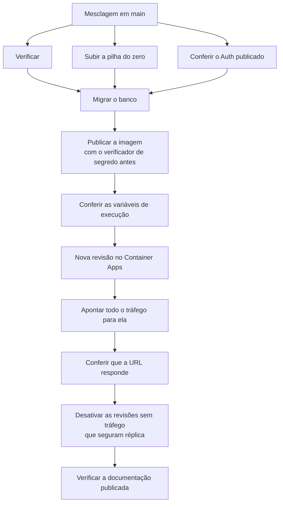
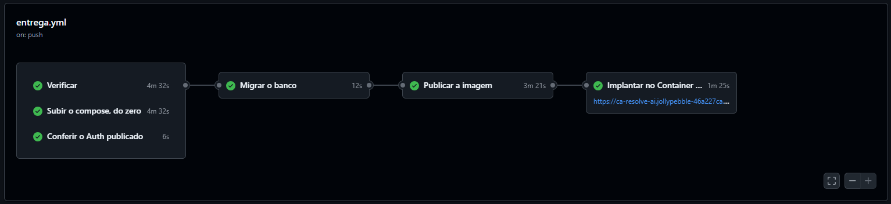
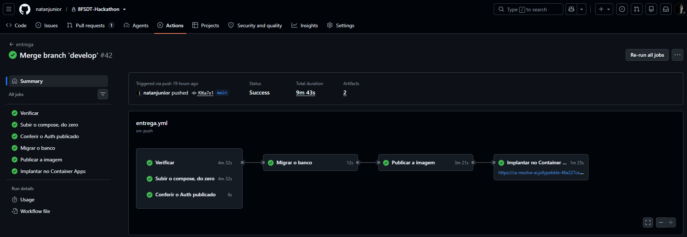

# Infraestrutura

Um contêiner com a aplicação inteira, PostgreSQL e autenticação gerenciados, e um armazenamento de objetos
para as imagens. A maior parte cabe em franquias gratuitas permanentes, e o crédito de estudante paga o
resto: a réplica da aplicação que fica sempre de pé, e os centavos do e-mail de conta e do armazenamento
de imagens. A mesma imagem roda na máquina de quem desenvolve e em produção.

## Onde cada peça roda

| Peça | Provedor | O que faz |
|---|---|---|
| Aplicação | Azure Container Apps | serve a interface, a API e estas páginas, num contêiner só |
| Banco | Supabase PostgreSQL | as ocorrências, a trilha e o cadastro |
| Contas e sessões | Supabase Auth | autenticação, confirmação de e-mail e recuperação de senha |
| E-mail de conta | Azure Communication Services | o servidor de envio do provedor de autenticação, para a confirmação e a recuperação de senha |
| E-mail do convite | Brevo | o convite pessoal, por SMTP, dentro da requisição |
| Imagens | Azure Blob Storage | um contêiner de objetos, alimentado direto pelo aparelho |
| Imagem do contêiner | GitHub Container Registry | pública, consumida sem credencial |
| Esteira | GitHub Actions | verificações, migrações, construção da imagem e implantação |

A aplicação roda na região `chilecentral` e o banco em São Paulo, com latência de cerca de 40 ms entre os
dois. A assinatura de estudante restringe as regiões permitidas a cinco, e a do Brasil não está entre
elas. Contra o orçamento de resposta do produto esse número é ruído, e fica escrito para que ninguém gaste
uma tarde tentando mover a aplicação para mais perto.

## A imagem

O mesmo `Dockerfile` sobe o ambiente local e a produção, em três estágios: dependências, construção e
execução. O estágio final leva apenas a saída autocontida do Next, sem código-fonte, sem dependências de
desenvolvimento e sem testes. Ele roda com usuário próprio, não privilegiado, e tem verificação de saúde
apontada para a tela de entrada.

**A imagem não carrega segredo nem configuração.** Não há `ARG` no arquivo, os arquivos de ambiente são
excluídos antes de qualquer cópia, e não existe variável embutida no pacote que o navegador baixa. As
sete variáveis de execução chegam do próprio Container App em tempo de execução:

| Variável | Para quê |
|---|---|
| `SUPABASE_URL` e `SUPABASE_CHAVE_ANONIMA` | falar com o provedor de autenticação |
| `BANCO_URL` | a conexão do servidor com o PostgreSQL |
| `SEGREDO_DE_SESSAO` | assinar o cookie da organização ativa |
| `ARMAZENAMENTO_CONEXAO` | assinar as credenciais temporárias de upload |
| `CORREIO_SMTP_URL` | o servidor de envio do convite, com a credencial |
| `CORREIO_REMETENTE` | quem aparece como remetente do convite |

Como a imagem é pública, nada disso pode estar nela. Um verificador confere antes da publicação, e
[Testes](testes.md) descreve como.

## Da máquina ao ar



**As três conferências do começo correm juntas**, e a migração espera as três. Uma delas olha para fora
da máquina: a do Auth publicado compara o que o provedor de autenticação serve com o que o repositório
declara, e uma divergência ali interrompe a entrega antes de qualquer mudança no banco. A conferência das
variáveis de execução faz o mesmo papel do outro lado, depois da imagem e antes da revisão nova: o que o
`.env.example` declara precisa existir no Container App, ou a aplicação sobe e quebra só no caminho que
usa a variável que falta.

**A ordem importa, e a migração vem antes da imagem.** Voltar atrás na aplicação é imediato; no banco, não
é. Quem aplica a migração é a própria esteira, num passo que falha em voz alta e interrompe a cadeia, em
vez de depender de alguém lembrar de rodar um comando antes da mesclagem.

**Criar revisão não move tráfego.** O ambiente roda em modo de revisões múltiplas, que é a precondição de
poder voltar atrás sem reconstruir nada, e o preço desse modo é que a revisão nova nasce com peso zero. Sem
o passo que aponta o tráfego, a esteira ficaria verde enquanto a URL continuasse servindo o código
anterior. Depois dele a esteira confere duas coisas: que a URL pública responde, e que a documentação no
ar não ganhou link quebrado. Entre as duas, as revisões que ficaram sem tráfego são desativadas, porque
em modo múltiplo uma revisão antiga continuaria segurando a réplica que a entrega acabou de pagar.

O desenho acima é a forma. Abaixo está uma execução dela, disparada por uma mesclagem em `main`.





**Data da captura:** 06/10/2026, execução 42.

O tempo é dominado pelas duas conferências longas do começo, e elas correm lado a lado: o custo é o da
mais lenta, e não o da soma das três. Menos de dez minutos da mesclagem até a URL no ar é a ordem de
grandeza que deixa entregar várias vezes num mesmo dia.

## Voltar atrás

O Container Apps guarda as revisões anteriores, e voltar é reativar uma delas e redirecionar o tráfego para
ela, sem reconstruir nada. Depois de cada entrega, a esteira desativa a revisão anterior, porque com o
mínimo de uma réplica ela continuaria rodando sem servir ninguém
([ADR-0023](adr/0023-uma-replica-sempre-de-pe.md)). Desativada, ela continua guardada, e a volta leva o
tempo de ela iniciar. Quando a revisão nova não responde na conferência da esteira, a anterior nem chega a
ser desativada.

Migração de banco é versionada em arquivo e não se desfaz sozinha, então mudança destrutiva de esquema
exige o script de volta escrito à mão. É a razão de a ordem segura ser migração compatível primeiro,
código depois.

## A cópia de segurança do banco

O projeto de banco na franquia gratuita não guarda cópia de segurança. As migrações reconstroem o esquema,
mas nenhuma delas reconstrói o dado nem as contas de quem usa o produto. A cópia é feita pela própria
esteira: o workflow
[`copia-de-seguranca-do-banco.yml`](https://github.com/natanjunior/8FSDT-Hackathon/blob/main/.github/workflows/copia-de-seguranca-do-banco.yml)
roda o `pg_dump` uma vez por dia, de madrugada, e
guarda o resultado como artefato da execução por trinta dias.

A cópia leva os dois esquemas que as migrações não refazem, o do produto e o das contas, no formato
próprio do PostgreSQL, que já sai comprimido e deixa escolher na volta o que restaurar. O cliente é o da
versão 17, tirado da mesma imagem de contêiner que serve de banco aos testes da esteira, porque o cliente
instalado no servidor de execução é mais antigo e recusa copiar um servidor mais novo. A versão é
conferida antes da cópia, e a execução falha com a causa escrita quando o segredo de conexão falta,
quando a versão não confere, quando a cópia sai vazia ou quando o arquivo não tem a assinatura do formato.

Como a cópia contém as contas, com e-mail e senha cifrada, ela só sobe enquanto o repositório for
privado. Com o repositório público, qualquer conta do GitHub poderia baixar o artefato, e a execução
falha em vez de publicá-lo.

A volta seria criar o projeto, aplicar as migrações e restaurar os dados com o `pg_restore`. A
restauração não foi ensaiada. O roteiro da cópia é testado na esteira com o contêiner e a API simulados,
sem banco e sem o segredo; a cópia contra o banco publicado só se prova na primeira execução agendada.

## A réplica sempre de pé

Do envio do trabalho até o fim da avaliação, a aplicação roda com no mínimo uma réplica, e nenhuma visita
espera o contêiner iniciar. Medida depois de mais de duas horas sem tráfego, a resposta ficou abaixo de um
segundo.

A franquia mensal de computação cobre cerca de 100 horas dessa réplica, pouco mais de quatro dias. O resto
sai do crédito de estudante. Sem tráfego, a réplica fica abaixo do limite de ociosidade da plataforma, e a
hora ociosa custa US$ 0,0216, cerca de US$ 13 num mês inteiro. A assinatura tem limite de gasto: o crédito
zerado a desliga, sem gerar fatura.

Sem o mínimo, a aplicação escala para zero réplicas cerca de cinco minutos depois da última requisição, e
a primeira chamada seguinte leva por volta de 20 segundos enquanto o contêiner inicia. A decisão e as
alternativas estão na [ADR-0023](adr/0023-uma-replica-sempre-de-pe.md).

Quem volta à aplicação pelo mesmo navegador conta ainda com o trabalhador de serviço. Ele guarda uma casca
sem dado nenhum e, quando a última resposta do servidor que ele viu tem mais de quatro minutos, a pinta na
hora e a troca pela tela assim que o servidor responde.

## O que a franquia gratuita impõe

O projeto de banco na franquia gratuita pausa depois de sete dias de inatividade, e uma pausa derruba a
migração da entrega seguinte. A mitigação é uma consulta trivial agendada diariamente. Já foi semanal, e
falhou: sete dias de janela contra sete dias de intervalo dão margem zero, e o agendador é de melhor
esforço. O intervalo diário dá sete tentativas dentro de cada janela.

O teto de armazenamento do banco na franquia comporta cerca de 55.000 ocorrências, quase trinta vezes o
alvo declarado em [O produto](produto.md). O armazenamento de imagens não é restrição: na escala deste
produto o limite prático é o custo, e ele é da ordem de um dólar por ano.

## O e-mail

O produto envia um e-mail só, o convite pessoal, e ele sai por SMTP. A recuperação de senha sai pelo
provedor de autenticação, com outra credencial e outra cota, e os dois não se misturam.

O envio acontece dentro da requisição, um depois do outro, até vinte por vez, porque não há fila. Quando
o provedor recusa ou demora, nada é gravado, o limite de um por dia por endereço fica intacto, e a tela diz
ao Gestor qual convite não saiu. O link para copiar continua no modal.

No ambiente local, as mensagens ficam na caixa de teste que a pilha do provedor de autenticação sobe, e
nada sai da máquina. A razão de cada escolha está na
[ADR-0022](adr/0022-o-email-sai-por-smtp-com-o-nodemailer.md).

## O ambiente local

```
npm run local
```

Sobe a pilha inteira em contêiner: a aplicação com o mesmo `Dockerfile` da produção, o PostgreSQL e o Auth
da CLI do Supabase, e um emulador do armazenamento de objetos. Um clone limpo chega até aqui sem passo
manual, porque as credenciais do emulador são públicas e fixas.

A esteira sobe essa mesma pilha do zero a cada entrega, num servidor limpo, e bate na aplicação por HTTP.
É o que impede o ambiente local de divergir do publicado sem que ninguém perceba.

O passo a passo, incluindo o que precisa estar instalado, está no
[README do repositório](https://github.com/natanjunior/8FSDT-Hackathon#como-rodar).
