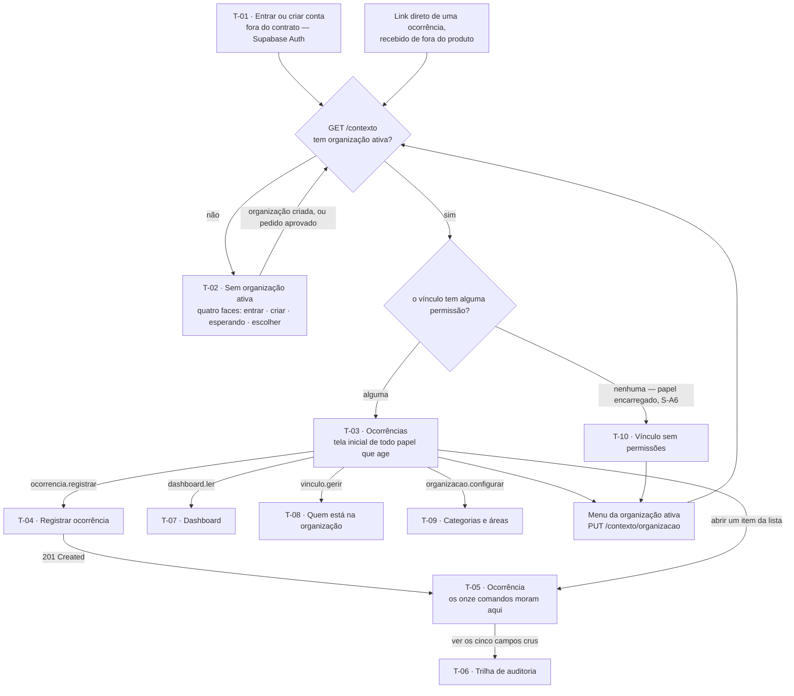

# Inventário de Telas — Resolve Aí

**Dez telas.** É o número que este documento defende, contra as 42 capacidades ✅ do
[escopo](escopo.md) e os 37 endpoints do [contrato de API](contrato-de-api.md).

Deriva de [escopo.md](escopo.md) (as capacidades), [contrato-de-api.md](contrato-de-api.md) e
[`api/openapi.yaml`](api/openapi.yaml) (o que cada tela chama e os campos exatos que mostra),
[glossario.md](glossario.md) — **todo nome de tela, de botão e de rótulo saiu daqui** —,
[documentacao-da-demanda.md](documentacao-da-demanda.md) (as personas e os RNFs),
[arquitetura.md](arquitetura.md) Parte I §4 (a máquina de estados, que decide quais ações aparecem) e
[fluxos-e-diagramas.md](fluxos-e-diagramas.md) (o DG-4 e o DG-5, que são fluxos de tela e não foram
redescobertos).

> **O que este documento não faz.** Não desenha. Não há layout, posição, cor, tipografia nem esboço de
> tela aqui — isso é o passo 5, e ele faz melhor com um inventário que não tentou fazê-lo. A fronteira:
> **o que a tela contém e o que ela responde é deste documento; como ela se parece é do próximo.**

**Citação de fonte.** O que vem da disciplina de DDD é citado como `aula N, p.X`. **Nenhuma das nove
aulas trata de interface** — nem de estado vazio, nem de navegação, nem de modal, nem de PWA. Todo
vocabulário de interface deste documento é **[FONTE EXTERNA]** e se sustenta por mérito próprio, no
mesmo regime que a `modelo-de-dados.md` aplicou a multi-tenancy.

---

## 1. Como ler — e o critério que produziu dez telas

**Marcadores de origem**, herdados do `escopo.md`. Toda tela carrega o marcador das **capacidades que
realiza**, nunca um marcador próprio:

| Marcador | Significado | Pode ser cortado? |
|---|---|---|
| `ENUNCIADO · literal` | O desafio define o quê **e** o como | **Não** |
| `ENUNCIADO · aberto` | A existência é imposta; a forma é decisão do projeto | **Não** (a existência) |
| `NOSSO` | Adição do projeto | Sim |

### O critério de aceitação

> Uma tela ganha o lugar dela quando responde **uma pergunta que o usuário chega fazendo**. *"O que
> aconteceu com o meu pedido?"* é uma pergunta que alguém tem antes de abrir o aplicativo. *"Alterar
> prioridade"* não é: é uma ação que acontece **dentro** da resposta a *"o que eu preciso resolver
> agora?"*.

E o corolário, que é o que mais recusou:

> **Ação não é tela.** Dos onze comandos do agregado `Ocorrência`, **nenhum** tem lugar próprio: os onze
> acontecem de dentro da tela onde a pessoa já está vendo a ocorrência. Uma tela por comando produz um
> aplicativo em que o usuário **navega em vez de trabalhar**.

Aplicado às 42 capacidades ✅, o critério colapsa quase tudo. As nove atividades do escopo não são nove
telas: a atividade 0 é uma, as atividades 3 a 6 — dezesseis capacidades, os onze comandos inteiros —
são **uma**, e as atividades 2 e 7 se dividem entre registrar e acompanhar. O que sobra:

| Vem de | Telas |
|---|---|
| Estar autenticado e não pertencer a lugar nenhum | 2 (T-01, T-02) |
| A ocorrência — listar, registrar, operar, auditar | 4 (T-03 a T-06) |
| A gestão da organização | 3 (T-07 a T-09) |
| Um estado declarado que não é capacidade nenhuma | 1 (T-10) |

**A lista do que foi recusado é conteúdo**, e está na §5. Sem ela não há como distinguir curadoria de
omissão.

### O que "estar completo" significa aqui

O teste é concreto: **o passo 5 desenha o protótipo a partir deste documento.** Se para desenhar uma
tela for preciso decidir algo que não está decidido aqui, o documento está incompleto. Por isso cada
tela declara os três estados (vazio, carregando, erro) **com o texto que aparece**, o alvo primário, e
se tem endereço próprio.

---

## 2. As duas pessoas, e a decisão estrutural que decorre delas

O **Solicitante** registra pelo celular, com pressa, e o **RNF6** diz que o registro completo com foto
cabe em **menos de um minuto**. Usa o produto de vez em quando e **não vai aprender nada**.

O **Gestor** tem uma lista para triar, filtra por três dimensões (G2), compara indicadores. Trabalha
sentado, provavelmente numa tela grande, e usa o produto todo dia.

É **um PWA, um código, um implementador** ([ADR-0002](adr/0002-stack-e-plataforma.md)).

### A decisão: uma área, telas compartilhadas, ações governadas por permissão

> **Não existem duas áreas do aplicativo. Existe um só shell, uma só navegação e um só conjunto de
> telas. O que muda entre o Solicitante e o Gestor é (a) quais itens de navegação existem e (b) quais
> ações a tela oferece — e as duas coisas vêm de `contexto.permissoes` e de
> `ocorrencia.acoesDisponiveis`, nunca de uma verificação de papel no cliente.**

Três argumentos decidiram, e o primeiro é o mais forte porque não é nosso:

**1 · O contrato já foi desenhado para telas compartilhadas.** `GET /ocorrencias` é *"a mesma URL,
conjuntos diferentes"* e o contrato **recusou explicitamente** criar `/minhas-ocorrencias` (§8.5).
`GET /ocorrencias/{id}` devolve `acoesDisponiveis` calculado para *aquele* chamador, justamente para que
a interface *"desenhe botões a partir do que o domínio respondeu"* (§8.5). E `statusRotulo` é calculado
no servidor **em função de quem lê** (§8.8, S-A10). Duas áreas exigiriam duas telas de lista consumindo
o mesmo endpoint com o mesmo schema — a duplicata que a `fluxos-e-diagramas.md` §1 recusa em diagrama,
recusada aqui em tela.

**2 · O síndico morador já foi resolvido por parâmetro, não por área.** O Gestor que também mora no
prédio usa `?autor=eu` na **mesma** lista (contrato §8.5, `modelo-de-dados.md` §6.4) — foi decisão
explícita não lhe dar um segundo vínculo. Com duas áreas ele teria de **trocar de área** para ver a
própria ocorrência, que é exatamente o de-para que o contrato removeu. Ele **registra ocorrência** (o
mapa de permissões da §4.5 dá `ocorrencia.registrar` ao Gestor *"sem nenhuma exceção escrita"*) e
**avalia a própria** — e faz as duas coisas nas mesmas telas.

**3 · O custo.** Duas áreas são dois shells, duas navegações, duas árvores de rota e duas respostas para
cada estado vazio, com **um implementador** e ~6 semanas. É o risco técnico que a análise de Cagan
classifica como **dominante** (`documentacao-da-demanda.md` §0).

**O que a decisão custa, declarado.** As três telas de gestão (T-07, T-08, T-09) só existem para quem
tem a permissão, e um Solicitante que receba o link de uma delas leva `403 PERMISSAO_INSUFICIENTE`. Numa
área separada isso seria óbvio pelo endereço; aqui é um erro. A mitigação é a §7: esse `403` tem frase
própria. E a tela do Gestor fica mais densa do que ficaria se fosse só dele, porque carrega os elementos
que o Solicitante também precisa — é o preço de não ter duas.

### Alvo primário: o discriminador é o dado, não a largura da tela

*"Responsivo"* não é resposta — toda tela vai ser responsiva. A pergunta é **para qual das duas pessoas
cada tela é projetada primeiro**, porque é isso que decide o que aparece sem rolar. A resposta por tela
está em cada seção, e há **um caso** que merece a regra escrita, porque é o único em que as duas pessoas
usam a mesma tela com necessidades opostas:

> **Em T-03 · Ocorrências, o alvo primário é escolhido por `visibilidadeAplicada`, que vem na própria
> resposta — não pelo tamanho da janela.**
>
> - `apenas_minhas` → **celular primeiro**. A lista é curta (uma pessoa registra poucas ocorrências), a
>   barra de filtros não compete por espaço, e o que precisa aparecer sem rolar é `statusRotulo`.
> - `todas` → **tela grande primeiro**. A barra de filtros é permanente, e `prioridade`,
>   `motivoPausa` e `responsavel` aparecem **sem abrir o item**, porque são o que a triagem compara.

A elegância disso é que o Gestor que pede `?autor=eu` recebe `apenas_minhas` — e nesse momento ele *é*
um Solicitante lendo, então a tela certa é a do celular. **O servidor já sabe qual das duas leituras
está em curso e já diz.** [FONTE EXTERNA]

---

## 3. O mapa

### As dez telas

| # | Tela | Quem vê | A pergunta | Alvo primário | Endereço próprio |
|---|---|---|---|---|---|
| **T-01** | Entrar ou criar conta | qualquer pessoa, **sem sessão** | *"Como eu entro?"* | celular | sim |
| **T-02** | Sem organização ativa | sessão válida, **sem** organização ativa | *"Onde eu trabalho?"* | celular | sim |
| **T-03** | Ocorrências | qualquer vínculo com `ler_propria` ou `ler_todas` | *"O que aconteceu com os meus pedidos?"* / *"O que eu preciso resolver agora?"* | ver §2 | sim, **com os filtros** |
| **T-04** | Registrar ocorrência | `ocorrencia.registrar` | *"Preciso avisar de um problema."* | **celular** (RNF6) | sim |
| **T-05** | Ocorrência | quem pode ler aquela ocorrência | *"O que está acontecendo com esta, e o que eu faço com ela?"* | celular | **sim — é o link que substitui o WhatsApp** |
| **T-06** | Trilha de auditoria | quem pode ler aquela ocorrência | *"Prove o que aconteceu, campo por campo."* | tela grande | sim |
| **T-07** | Dashboard | `dashboard.ler` | *"Está melhorando ou piorando?"* | tela grande | sim |
| **T-08** | Quem está na organização | `vinculo.gerir` | *"Quem está aqui, e quem quer entrar?"* | tela grande | sim |
| **T-09** | Categorias e áreas | `organizacao.configurar` | *"As opções que o Solicitante vê estão certas?"* | tela grande | sim |
| **T-10** | Vínculo sem permissões | vínculo com `permissoes: []` | *"Entrei. Por que não consigo fazer nada?"* | celular | não |

**Sobre os nomes.** Cada nome é o identificador da tela **neste inventário** e usa vocabulário do
[glossário](glossario.md). **Não é necessariamente o texto que aparece na tela** — em T-02 e T-10 o
identificador nomeia um estado (*Organização ativa*, *Permissão*, *Vínculo* são termos) e o texto ao
usuário está em linguagem de gente, escrito na seção de cada uma. Dois nomes precisaram de decisão:

- **T-07 é `Dashboard`, não "Painel".** *Dashboard* é palavra do enunciado (G8) e o contrato §7.2 já a
  declara como um dos quatro nomes que vieram de fora do glossário sem serem inventados. Criar "Painel"
  seria um segundo nome para uma coisa só — exatamente o que o glossário existe para impedir.
- **T-08 é `Quem está na organização`**, que é a frase que o próprio `openapi.yaml` usa como resumo de
  `GET /vinculos`. Não é "Pessoas": `Pessoa` é a tabela **global**, e a *regra do vínculo primeiro*
  (contrato §4.6) diz que toda listagem de gente é listagem de `Vínculo`. Nomear a tela "Pessoas"
  contradiria a regra na primeira palavra. **Se o hub quiser um nome curto, ele é proposta ao
  glossário — não é invenção deste inventário** (glossário §9).

### A navegação

> **O que este mapa afirma:** **T-03 é o eixo.** Toda tela de dentro da organização se alcança dela, e
> nenhuma tela de dentro se alcança de outra sem passar por ela. É consequência de uma decisão, não de
> conveniência de desenho: a tela inicial de **todos** os papéis é a mesma, e o que os separa é o que
> ela oferece. O único ramo que não desemboca em T-03 é o do vínculo sem permissão — e ele termina em
> T-10, que é um beco por construção.

**Três decisões de navegação que o mapa carrega:**

**1 · A tela inicial de todo papel que age é T-03 — inclusive a do Gestor.** Não é o Dashboard. A
justificativa é a própria D19: o dashboard *"responde o que a lista não responde"*, o que o torna a
**segunda** pergunta do dia, não a primeira. O trabalho diário do Gestor é triar (jornada da solução,
etapa 03), e a lista é onde a triagem acontece.

**2 · O link profundo sobrevive à autenticação.** Quem recebe o endereço de uma ocorrência sem sessão
passa por T-01, e sem organização ativa passa por T-02 — e **volta ao destino** depois. Sem isso, *"uma
ocorrência que não pode ser mandada por link é uma ocorrência que vai ser descrita por WhatsApp"*, que é
o comportamento que o produto veio substituir. Se o destino for de outra organização, o resultado é
`404` (contrato §6.3) — e a §7 dá a frase.

**3 · A troca de organização ativa é um menu do shell, não uma tela.** Ele vive no cabeçalho, é
alimentado por `contexto.vinculos` e chama `PUT /contexto/organizacao`. O nome da organização ativa fica
**permanentemente visível** ao lado dele — é a única consequência de interface que a fundação técnica
nº 38 (isolamento em ponto único) tem, e ela é necessária: num produto em que a organização vem da
sessão e não da URL, o endereço não diz onde você está, então a tela tem de dizer.

### O botão "voltar" do navegador

É um PWA num navegador. O botão existe, e o que ele faz é decisão:

| Onde | O que "voltar" faz |
|---|---|
| T-05, T-06, T-07, T-08, T-09 | volta a **T-03 com os filtros preservados** — é por isso que os filtros vivem na *query string* |
| T-04 | volta a T-03 e **descarta o formulário**, com confirmação se algo foi digitado |
| T-05 recém-chegado de um `201` de T-04 | volta a **T-03**, nunca ao formulário — a ocorrência já existe, e reabrir o formulário convida ao toque duplo que o contrato §7.10 declarou não proteger |
| **modal aberto** | **fecha o modal e permanece na tela** |
| T-02, T-10 | não há para onde voltar; o botão é inerte |

A última linha da tabela do meio exige um mecanismo, e ele é decisão declarada:

> **Modal não tem endereço, mas empurra uma entrada de histórico por fragmento** (`#pausar`, `#cancelar`,
> `#avaliar`). Fragmento não é endereço no sentido que importa — não é compartilhável e não descreve um
> recurso —, e um fragmento velho é **inerte**: quem abrir `/ocorrencias/{id}#pausar` numa ocorrência que
> já saiu de `pausada` simplesmente não vê modal, porque `pausar` não está em `acoesDisponiveis`.

A alternativa — modal sem histórico — foi recusada porque em Android o botão voltar **é** o gesto de
fechar, e ele levaria o usuário fora da ocorrência no meio de um cancelamento. [FONTE EXTERNA]

---

## 4. Uma seção por tela

### T-01 · Entrar ou criar conta

| Campo | Conteúdo |
|---|---|
| **Quem vê** | Qualquer pessoa **sem sessão válida**. É a única tela pública do produto. |
| **A pergunta** | *"Como eu entro?"* |

**O que mostra.** E-mail, senha, e o caminho de criar conta e de redefinir senha. **Não mostra nada da
organização**: a identidade da organização na página de cadastro é ⬜ (`escopo.md`, atividade 0, D25), e
por isso esta tela é a mesma para todo mundo, em toda organização.

**O que oferece.** Entrar · criar conta · redefinir senha. **Nenhuma das três chama endpoint deste
contrato** — autenticação é o subdomínio **Genérico** comprado no Supabase Auth (`arquitetura.md` Parte
I §1 e §3; contrato §4.1: *"o contrato consome a sessão; não a emite"*), integrado como Conformista +
ACL. A tela chama o SDK do provedor, e o e-mail transacional de confirmação e de redefinição é a única
mensagem automática que a primeira entrega envia (emenda à D13, `escopo.md` §3.2). Ao final, navegação
para o shell, que faz `GET /contexto`.

**Como reage ao status.** Não reage — não há ocorrência aqui.

**Vazio · carregando · erro.**
- *Vazio:* não existe — o formulário é o conteúdo.
- *Carregando:* botão em estado de espera. **Não é aqui que o cold start aparece**: esta tela não toca a
  nossa API. A primeira requisição ao Resolve Aí acontece na tela seguinte, e é lá que o RNF5 é dito.
- *Erro:* as mensagens são do provedor. Uma decisão nossa: **credencial inválida não distingue "e-mail
  não existe" de "senha errada"** — *"E-mail ou senha incorretos."* É a mesma lógica do `404` do
  contrato §6.3 aplicada à autenticação, e pela mesma razão. [FONTE EXTERNA]

**Alvo primário.** Celular. O que aparece sem rolar são os dois campos e o botão de entrar; criar conta
vem abaixo.

**Endereço próprio.** Sim, e é o destino de qualquer redirecionamento por falta de sessão — que precisa
carregar o endereço pretendido para devolver depois (§3, decisão 2).

**Capacidades que realiza.** nº 6 — *Criar conta e autenticar-se* · `ENUNCIADO · aberto` (S1, S2).

---

### T-02 · Sem organização ativa

| Campo | Conteúdo |
|---|---|
| **Quem vê** | Sessão válida **sem organização ativa** — `contexto.organizacaoAtiva == null` |
| **A pergunta** | *"Onde eu trabalho?"* |

Esta é a tela que a documentação anterior mais deixou implícita, e ela cobre **quatro estados
diferentes** — três dos quais não são capacidade nenhuma e por isso são fáceis de esquecer. A face é
escolhida por `GET /contexto`, que é o **único** endpoint que uma Pessoa sem vínculo consegue usar
(contrato §8.0).

| Face | Condição em `GET /contexto` | O que a pessoa acabou de fazer |
|---|---|---|
| **A · Entrar em uma organização** | `vinculos: []` · `pedidosDeEntrada: []` | Criou a conta agora |
| **B · Esperando aprovação** | `vinculos: []` · pedido com `situacao: "pendente"` | Pediu entrada e espera o Gestor |
| **C · Pedido recusado** | `vinculos: []` · pedido com `situacao: "recusado"` | Foi recusada — e **pode refazer** (S-A12 / S4 do modelo) |
| **D · Escolher a organização** | `vinculos[]` com **dois ou mais**, e nenhuma ativa | É a Persona 1B, o síndico que também mora em outro prédio |

**O que mostra, por face.**
- **A:** um campo para o **Código da Organização** (`^[A-Z0-9]{6,12}$`, o do cartaz do elevador) e,
  separado dele, o caminho de **criar uma organização** com um campo de `nome`. Dois caminhos, e a
  hierarquia é clara: quem chega aqui quase sempre está **entrando**, não fundando.
- **B:** `pedidosDeEntrada[].organizacao.nome` e `criadoEm`. Texto: *"Seu pedido para entrar em
  {nome} está aguardando a decisão de um Gestor."* **E a frase que a ausência de notificação obriga:**
  *"Você não será avisado automaticamente — volte aqui para ver."* Mentir por omissão aqui é pior do que
  a limitação: o aviso automático é ⬜ (Q10), e uma tela que diz *"aguarde"* sem dizer *"e nada vai te
  chamar"* produz uma pessoa que espera para sempre.
- **C:** *"Seu pedido para entrar em {nome} não foi aprovado."* + o campo de código de novo, porque
  pedido recusado **pode ser refeito**. Sem o campo, a face C é um beco que o modelo de dados não quis
  criar.
- **D:** `contexto.vinculos[]` — `nome` e `papel` de cada uma. Nada mais: não há contagem de ocorrências
  por organização, porque não há endpoint que a dê sem organização ativa (§4.4).

**O que oferece.**

| Ação | Endpoint |
|---|---|
| Pedir entrada com o código | `POST /pedidos-de-entrada` `{ codigoPublico, nome?, telefone? }` |
| Criar a organização | `POST /organizacoes` `{ nome }` — devolve `201` + `Set-Cookie`, e a organização **já fica ativa** |
| Escolher uma organização (face D) | `PUT /contexto/organizacao` `{ organizacaoId }` |
| Sair | SDK do provedor — navegação para T-01 |

Depois de qualquer uma das três primeiras, o shell refaz `GET /contexto` e a navegação segue o mapa.
Criar organização leva direto a T-03 com o **estado vazio de organização nova**, que é onde o convite a
configurar as Áreas mora — ver T-03.

**Como reage ao status.** Não reage.

**Vazio · carregando · erro.**
- *Vazio:* a face A **é** o estado vazio, e é por isso que ela é convite e não aviso. *"Você ainda não
  está em nenhuma organização."* + os dois caminhos.
- *Carregando:* **é aqui que o cold start aparece pela primeira vez** (RNF5, escala a zero). Se o
  `GET /contexto` passar de ~2 s, o texto é *"Acordando o servidor — a primeira abertura do dia é mais
  lenta."* Isso não é decoração: um giro de oito segundos sem explicação lê-se como defeito, e o RNF5
  declara o cold start como **esperado**, não como imprevisto.
- *Erro:* ver §7 — `404 CODIGO_PUBLICO_NAO_ENCONTRADO`, `409 JA_VINCULADO`,
  `409 PEDIDO_DE_ENTRADA_PENDENTE`, `403 SEM_VINCULO_NA_ORGANIZACAO`.

**Alvo primário.** Celular. Quem digita o código do cartaz do elevador está no elevador.

**Endereço próprio.** Sim. É o destino de qualquer `403 SEM_ORGANIZACAO_ATIVA`.

**Capacidades que realiza.**
- nº 1 — *Criar a organização por auto-serviço; quem cria vira o Gestor inicial* · `NOSSO` (D26)
- nº 7 — *Pedir entrada com o código da organização, aguardando aprovação* · `NOSSO` (D25)

---

### T-03 · Ocorrências

| Campo | Conteúdo |
|---|---|
| **Quem vê** | `ocorrencia.ler_todas` (Gestor) **ou** `ocorrencia.ler_propria` (Solicitante) |
| **A pergunta** | Solicitante: *"O que aconteceu com os meus pedidos?"* · Gestor: *"O que eu preciso resolver agora?"* |

**Uma tela, duas perguntas, um endpoint.** `GET /ocorrencias` devolve conjuntos diferentes conforme a
permissão de quem pergunta, e a resposta **declara o recorte** em `visibilidadeAplicada`
(`todas` | `apenas_minhas`). A tela mostra esse recorte em palavras — *"Todas as ocorrências"* ou
*"Minhas ocorrências"* —, porque o contrato o devolve exatamente *"para que o cliente possa dizer ao
usuário o que está vendo"* (§8.5).

**O que mostra.** Uma lista de `OcorrenciaResumo`, em **ordem fixa `registradaEm` decrescente** (S-A11 —
não há parâmetro de ordenação, e não há `total`). Por item, na ordem de leitura:

1. `statusRotulo` — o rótulo em linguagem de gente calculado no servidor conforme quem lê (D19). O
   Solicitante lê *"Em execução"*; o Gestor lê *"Em atendimento"*.
2. `motivoPausa`, **quando o status é `pausada` e quem lê é Gestor.** É obrigatório e não é enfeite: o
   rótulo do Gestor é sempre *"Pausada"*, e sem este campo a lista dele mostraria **quatro esperas
   diferentes com a mesma palavra** — escondendo justamente o que a D8 existe para tornar visível
   (glossário §4, contrato §8.8). Ao Solicitante o motivo já está dentro do rótulo, e repeti-lo seria
   redundância.
3. `titulo`
4. `categoria.nome` · `area.nome` — o `tipo` da área é o **congelado no registro**, não o atual.
5. `prioridade` — só quando `visibilidadeAplicada == "todas"`. Prioridade é decisão do Gestor (glossário
   §3) e não há nada que o Solicitante faça com ela.
6. `responsavel.nome` quando não nulo — *"quem está cuidando"*. Visível ao Solicitante de propósito
   (*"mostrar constrói confiança"*, `openapi.yaml`), e sem canal direto entre os dois.
7. `temImagem` como marca, `registradaEm` e `atualizadaEm`.
8. **O convite a avaliar**, quando `status == "resolvida"`, quem lê é o autor, e ainda não avaliou. É a
   restrição herdada nº 2, e ela aparece **aqui e em T-05** — ver o quadro no fim desta seção.

**O que oferece.**

| Ação | Endpoint / destino |
|---|---|
| Filtrar por `status`, `categoriaId`, `prioridade` — todos múltiplos | `GET /ocorrencias?status=&categoriaId=&prioridade=` |
| *"Ver as minhas"* — só aparece com `ler_todas` | `GET /ocorrencias?autor=eu` |
| Carregar mais | `GET /ocorrencias?cursor=<proximoCursor>` |
| Registrar ocorrência — só com `ocorrencia.registrar` | **navegação** → T-04 |
| Abrir um item | **navegação** → T-05 |
| Dashboard · Quem está na organização · Categorias e áreas | **navegação** → T-07, T-08, T-09, cada uma só com a permissão respectiva |

**Sobre os filtros.** São **exatamente os três de G2** (`ENUNCIADO · literal`), mais `autor=eu`.
`areaId` **não existe** e não deve ser acrescentado: o contrato o excluiu deliberadamente (§8.5), e
oferecer na tela um filtro que a API não tem é o começo da divergência. Os **filtros rápidos** — não
triadas, pausadas esperando o Gestor, sem atualização — são ⬜ (D15), e a §5 registra o que isso custa.

Os valores dos filtros ficam na *query string*, e é o que faz *"voltar"* de T-05 devolver a lista que o
Gestor estava lendo, e não a lista do zero.

**Como reage ao status.** A tela em si não age sobre ocorrência nenhuma — **não há ação de lista, não há
seleção múltipla, não há triagem em lote**. Toda ação sobre uma ocorrência acontece em T-05, porque
todo comando exige contexto (e dois deles exigem texto obrigatório) e porque `acoesDisponiveis` chega no
`OcorrenciaDetalhe`, **não** no `OcorrenciaResumo`. Ação de lote sem `acoesDisponiveis` obrigaria o
cliente a adivinhar quais itens aceitam o comando — a segunda cópia da máquina de estados que o contrato
§8.5 existe para impedir.

**Vazio · carregando · erro.** São **três** vazios diferentes, e confundi-los é o erro clássico:

| Situação | Texto e o que oferece |
|---|---|
| Organização recém-criada, `todas`, zero ocorrências | *"Nenhuma ocorrência ainda."* + **dois convites**: conferir as Áreas semeadas (→ T-09) e registrar a primeira (→ T-04). O primeiro é o que importa: a organização nasce com áreas-semente genéricas, e **a primeira coisa que quebra o registro do Solicitante é uma lista de áreas que não descreve o prédio** |
| Solicitante, zero ocorrências | *"Você ainda não registrou nenhuma ocorrência."* + o botão de registrar |
| Filtro sem resultado | *"Nenhuma ocorrência com estes filtros."* + limpar filtros. **Nunca a mesma frase dos dois de cima** — organização vazia e busca vazia são fatos diferentes, e trocar uma pela outra faz o Gestor pensar que perdeu dados |

- *Carregando:* primeira carga da sessão → o texto de cold start do RNF5 (ver T-02). Cargas seguintes e
  paginação → estrutura de espera, sem texto. Filtro aplicado → a lista anterior permanece visível
  enquanto a nova chega, porque a tela é o eixo da navegação e esvaziá-la a cada filtro é perder o lugar.
- *Erro:* `409 ORGANIZACAO_DIVERGENTE` e `403 SEM_ORGANIZACAO_ATIVA` — ver §7.

**Alvo primário.** Ver §2: **escolhido por `visibilidadeAplicada`**, não pelo tamanho da janela. Com
`apenas_minhas`, sem rolar aparecem os itens com o rótulo em destaque. Com `todas`, sem rolar aparecem a
barra de filtros e as três dimensões de comparação (`prioridade`, `motivoPausa`, `responsavel`).

**Endereço próprio.** Sim, **e os filtros fazem parte dele.** Uma visão filtrada é compartilhável e
sobrevive ao botão voltar.

**Capacidades que realiza.**
- nº 14 — *Listar todas as ocorrências da organização* · `ENUNCIADO · aberto` (G1)
- nº 15 — *Filtrar por categoria, status e prioridade* · `ENUNCIADO · literal` (G2)
- nº 28 — *Ver as minhas ocorrências e o status atual* · `ENUNCIADO · aberto` (S7)
- nº 31 — *Rótulos em linguagem de gente* · `NOSSO` (D19) — realizada como campo exibido

> ### O convite a avaliar — restrição herdada nº 2
>
> O rótulo de `resolvida` é **"Resolvida"**, e o *"conte como foi"* foi deliberadamente tirado dele
> porque *"rótulo é estado, não convite"* (glossário §4, regra 3; contrato §13.2, Q-API-2, correção 3).
> **O convite é da tela, e a tela decide onde.** Decisão:
>
> **O convite aparece em dois lugares: como marca no item em T-03, e como chamada em T-05.** Texto:
> *"Resolvida. Conte como foi."*
>
> Estar em T-03 não é redundância — é o que o objetivo **O4** exige. A meta é *"≥ 60% das ocorrências
> resolvidas receberam avaliação"*, e o convite que só existe dentro do detalhe só alcança quem já
> decidiu abrir. Com o sino ⬜ e a notificação ⬜, **a lista é o único lugar onde o produto pode pedir a
> avaliação sem ser aberto de propósito.** O que isso não resolve está na §9, achado F8.

---

### T-04 · Registrar ocorrência

| Campo | Conteúdo |
|---|---|
| **Quem vê** | `ocorrencia.registrar` — Solicitante **e Gestor** (§4.5: o Gestor acumula as capacidades do Solicitante) |
| **A pergunta** | *"Preciso avisar de um problema."* |

**A tela mais restringida do inventário.** O **RNF6** manda: da abertura ao envio, **menos de um
minuto**, incluindo foto, pelo celular. É a mitigação do risco de **usabilidade**, o segundo mais alto
da análise de Cagan. Tudo aqui se subordina a isso.

**O que mostra.** Os campos de `RegistroDeOcorrencia`, nesta ordem:

| Campo | Restrição do schema | Nota |
|---|---|---|
| `titulo` | obrigatório, 1–150 | |
| `descricao` | obrigatório, 1–5000 | É onde a intenção do Solicitante vive — **não há campo de urgência** (glossário §8: o campo sofre inflação e vira ruído, D7) |
| `categoriaId` | obrigatório | de `GET /categorias`, **só as com `ativa: true`**, na ordem de `ordem` (D18: *"qual categoria aparece antes é escolha do Gestor"*) |
| `areaId` | **obrigatório** | de `GET /areas`, só as ativas. É obrigatório porque **é dela que a visibilidade deriva** |
| `localizacaoComplemento` | opcional, ≤ 200 | texto livre — *"ao lado da vaga 34"* |
| `imagem` | opcional | uma só (RNF8), como **referência** — nunca bytes |

**Não mostra, e não pode:** `status`, `prioridade`, `areaTipo` — os três são escritos pelo servidor, e
enviá-los devolve `422 CAMPO_NAO_SUPORTADO` (contrato §3.5). Também não mostra `ocorrenciaOrigemId`,
cuja coluna existe e cuja capacidade é ⬜.

**O que oferece.**

| Ação | Endpoint |
|---|---|
| Escolher a foto e comprimi-la | **no aparelho** — 400 KB / 1600 px no maior lado (RNF8). O seletor aceita até 10 MB; o que sobe é o comprimido |
| Subir a foto | `POST /imagens/autorizacoes` `{ tipoConteudo, tamanhoBytes }` → `PUT` direto no storage, **fora da API** |
| Enviar | `POST /ocorrencias` — devolve `201` + `Location` + `OcorrenciaDetalhe` |
| Cancelar | **navegação** → T-03, com confirmação se algo foi digitado |

**A ordem das duas primeiras é o que faz o RNF6 caber, e é o DG-5 inteiro** (`fluxos-e-diagramas.md`):
o upload começa **no instante em que a foto é escolhida** e corre em paralelo enquanto a pessoa digita a
descrição. O `POST /ocorrencias` transporta ~200 bytes de JSON em vez de 400 KB de foto. A tela não
espera o upload para deixar digitar, e **não espera o upload para habilitar o envio** se a foto ainda
não terminou — ela espera só o `chave`+`ticket`, que chegam do `201` da autorização.

**Depois do `201`:** navegação para **T-05 da ocorrência criada**, nunca de volta ao formulário. É onde
o primeiro registro da trilha (`ultimaTransicao` com `statusAnterior: null`, premissa **P1**) está
visível — e é a prova, para quem acabou de reclamar, de que o pedido existe.

**Como reage ao status.** Não reage — a ocorrência nasce `aberta` e a tela não escolhe nada disso.

**Vazio · carregando · erro.**
- *Vazio:* não existe estado vazio de formulário. **Mas existe um caso vizinho e ele é grave:** se
  `GET /categorias` ou `GET /areas` devolver zero itens ativos, **não há como registrar nada**. A
  organização nasce com sementes (POL-01), então isso só acontece se o Gestor desativar tudo. Texto:
  *"Esta organização não tem {categorias | áreas} ativas. Fale com um Gestor."* — e para o próprio
  Gestor, o mesmo texto com o caminho para T-09. Sem essa frase, o formulário fica com um campo
  obrigatório vazio e insubmissível, sem dizer por quê.
- *Carregando:* as duas listas carregam junto com a tela. A foto tem indicação de progresso própria,
  **e ela não bloqueia o formulário** — bloquear é perder o RNF6.
- *Erro:* `422 CATEGORIA_INVALIDA`, `422 AREA_INVALIDA`, `422 IMAGEM_NAO_RECONHECIDA`,
  `422 IMAGEM_ACIMA_DO_LIMITE`, `429 LIMITE_DE_AUTORIZACOES_DE_UPLOAD`, e **a rede caindo no meio** —
  todos na §7, que é onde esta tela mais contribui.

**Alvo primário.** **Celular, sem concorrência.** O que aparece sem rolar: `titulo`, `categoria` e o
botão de foto. `descricao`, `area` e `localizacaoComplemento` vêm abaixo. A razão de a área não estar
acima é que ela é o campo mais longo de escolher (~30 opções, contrato §7.7) e não é o que a pessoa tem
na cabeça ao abrir o aplicativo.

**Endereço próprio.** Sim — e é o alvo do atalho do aplicativo instalado (§6).

**Capacidades que realiza.**
- nº 11 — *Registrar com título, descrição e categoria* · `ENUNCIADO · literal` (S3, S4)
- nº 12 — *Informar a localização: uma Área mais complemento em texto* · `ENUNCIADO · aberto` (S5) + D10
- nº 13 — *Anexar uma imagem, comprimida no próprio celular* · `ENUNCIADO · aberto` (S6) + RNF8

---

### T-05 · Ocorrência

| Campo | Conteúdo |
|---|---|
| **Quem vê** | Quem pode ler aquela ocorrência — o autor, ou quem tem `ocorrencia.ler_todas` |
| **A pergunta** | Solicitante: *"O que está acontecendo com a minha?"* · Gestor: *"O que está acontecendo com esta, e o que eu faço com ela?"* |

**É a tela que carrega dezesseis das 42 capacidades**, e é onde os **onze comandos** moram. Consome
quatro `GET` e pode chamar onze `POST`.

**O que mostra.** `OcorrenciaDetalhe` — tudo de `OcorrenciaResumo` mais `descricao`,
`localizacaoComplemento`, `imagemUrl`, `solucaoAplicada`, `avaliacao`, `ultimaTransicao` e
`acoesDisponiveis` — em quatro blocos de conteúdo:

**1 · Identidade.** `statusRotulo` (+ `motivoPausa` para o Gestor, pela mesma razão de T-03), `titulo`,
`prioridade`, `categoria.nome`, `area.nome` + `localizacaoComplemento`, `autor.nome`,
`responsavel.nome`, `registradaEm`.

**2 · Conteúdo.** `descricao` e a imagem, se houver — via `imagemUrl`, que aponta para
`GET /ocorrencias/{id}/imagem` (URL **estável** desta API, que responde `302` para uma URL assinada de 10
minutos). A tela **nunca guarda nem exibe a URL do storage**.

**3 · A linha do tempo.** `GET /ocorrencias/{id}/linha-do-tempo` — transições **+** mensagens **+**
atribuições, intercaladas por instante, com o `rotulo` em linguagem de gente. É a capacidade nº 29 (S9),
e é a resposta direta ao *"tenho dificuldade de deixar os condôminos a par do que está sendo feito"*.
Cada item traz `ocorridoEm`, `autor.nome` e, nas transições, `observacao`, `motivoPausa` e
`motivoCancelamento` — **os três visíveis ao Solicitante**, por decisão do hub (Q-API-3, resposta (a)).

Cinco tipos de evento **não** aparecem na linha do tempo, e isso é limitação conhecida, não bug de tela:
comentário fora do canal 1, nota interna, **alteração de prioridade**, reatribuição e mensagem da
atribuição (**PA-21**). A alteração de prioridade em particular *"não entra na trilha"* (contrato §8.4),
então mudá-la não deixa rastro em lugar nenhum que a tela possa mostrar.

**4 · A conversa.** `GET /ocorrencias/{id}/comentarios` — o **canal 1**, Gestores + Solicitante autor.
Cada `Comentario` traz `texto`, `autor.nome`, `criadoEm`. **Sem edição e sem exclusão** (P6 do
contrato), e o produto **não tem nota interna** nesta entrega — ver o quadro no fim da seção.

**O que oferece.** A tela renderiza **exatamente `acoesDisponiveis`**, e nada além. Onde cada comando
mora:

| Ação | Forma | Endpoint | O que o formulário tem |
|---|---|---|---|
| **Analisar** | **botão direto, sem modal** | `POST …/analisar` | — |
| **Iniciar atendimento** | modal | `POST …/iniciar-atendimento` | `observacao?` |
| **Retomar** | modal | `POST …/retomar` | `observacao?` — o destino **não é escolhido nem informado antes**: a tela descobre pela resposta |
| **Pausar** | modal | `POST …/pausar` | `motivo` (quatro opções) **e** `observacao`, ambos obrigatórios (D23) |
| **Cancelar** | modal | `POST …/cancelar` | `motivo` **e** `observacao`, ambos obrigatórios. A lista de motivos é **filtrada pelo papel** na própria tela (ver abaixo) |
| **Resolver** | modal | `POST …/resolver` | `observacao?` **e** `solucaoAplicada?` — em foco, pré-preenchido se já houver |
| **Registrar solução aplicada** | **campo no corpo da tela**, não modal | `POST …/registrar-solucao-aplicada` | `solucaoAplicada` |
| **Alterar prioridade** | **seletor no bloco 1**, salva na mudança | `POST …/alterar-prioridade` | `prioridade` |
| **Atribuir / Reatribuir** | modal | `POST …/atribuir-responsavel` | lista de `GET /vinculos`, com **"Atribuir a mim"** como primeira linha |
| **Avaliar** | modal | `POST …/avaliar` | `nota` 1–5 **e** `comentario?` |
| **Comentar** | campo no bloco 4 | `POST …/comentarios` | `texto` |
| Ver a trilha crua | **navegação** → T-06 | — | — |

**A regra que separa os grupos, escrita para ser aplicada a comandos futuros:**

> **Comando que precisa de texto digitado abre modal. Comando que não precisa é botão direto. Campo que
> não é um comando de fato — prioridade, solução aplicada — mora no corpo da tela, no bloco a que
> pertence. Nenhum comando tem tela própria.**

Três casos merecem a justificativa individual, porque parecem exceções:

- **`analisar` é o único botão nu.** É a ação de **volume** da triagem (a etapa 03 da jornada da
  solução, e o que o filtro rápido de "não triadas" serviria — D15, ⬜), e nesse momento não há decisão
  a justificar: o Gestor acabou de abrir. A D23 é explícita sobre o custo do contrário — *"campo
  obrigatório em momento rotineiro é preenchido com 'ok' e o dado morre"* — e um campo **opcional** em
  momento rotineiro sofre o mesmo destino, com um clique a mais. `iniciar-atendimento` e `retomar`
  ganham modal porque nos dois há algo real a dizer (*"o Zelador começa amanhã"*, *"a peça chegou"*) e
  nenhum dos dois é de alto volume.
- **`registrar-solucao-aplicada` não tem botão próprio.** `/resolver` aceita `solucaoAplicada` no mesmo
  corpo *"para que o formulário da D22 seja uma requisição, não duas"*. Então o campo vive no corpo da
  tela — para o Gestor que registra o que foi feito **antes** de conferir e fechar — e o modal de
  resolver mostra o mesmo campo, pré-preenchido. É o único jeito de o endpoint não ficar órfão sem
  inventar um botão que compete com "Resolver".
- **`alterar-prioridade` é um seletor, não um modal.** Não há texto a escrever, e a D6 já o congela em
  estado terminal — quando isso acontece, o seletor simplesmente não está em `acoesDisponiveis`.

**Sobre a lista de motivos de cancelamento.** A tela mostra **só os motivos permitidos ao papel de quem
está olhando**: ao Solicitante, `desistencia` · `resolvido_por_conta_propria` · `aberta_por_engano` ·
`duplicada`; ao Gestor, os sete. É o único lugar do inventário onde a tela filtra por papel em vez de
por permissão, e é assim porque o contrato define a lista **por papel** (D5/D12,
`422 MOTIVO_NAO_PERMITIDO_PARA_O_PAPEL`). Consequência: **esse `422` não é caminho de usuário** — se
aparecer, é defeito da tela.

**Como reage ao status.** Esta é a decisão mais consequente da tela:

> **A tela mostra as ações disponíveis. Não mostra as indisponíveis, nem desabilitadas.** Ela renderiza
> `acoesDisponiveis` e nada mais.

Três razões, e a primeira é estrutural:

1. **Desabilitar exige a segunda cópia da máquina de estados.** Para mostrar `resolver` cinza em
   `aberta`, o cliente precisa conhecer o **conjunto completo** de comandos e saber quais faltam — o que
   é a tabela de transições no cliente, pela porta de trás. O contrato criou `acoesDisponiveis`
   precisamente para evitar isso (§8.5: *"alternativa rejeitada: cliente com a tabela em código,
   sincronizada por disciplina"*).
2. **O Solicitante veria sete botões cinza que ele nunca poderá usar** — num produto cujo risco número
   dois é usabilidade e cujo usuário *"não vai aprender nada"*.
3. É a mesma escolha que o contrato fez ao responder `404` em vez de `403` (§6.3): **não confirmar a
   existência do que você não pode alcançar.**

**O que isso custa, declarado:** o Gestor **não aprende a máquina de estados pela tela.** Ele não vê que
`resolver` exige passar por `em_atendimento` — descobre tentando o que está oferecido. Duas
compensações, ambas já no contrato: o `409 TRANSICAO_NAO_PERMITIDA` traz `statusAtual` e
`acoesDisponiveis` no corpo, então **quando a máquina surpreende alguém, ela se explica no próprio
erro**; e T-06 mostra o caminho que aquela ocorrência de fato percorreu. **É suposição, não evidência**
— ver S-T2 e Q-T3.

**Vazio · carregando · erro.**
- *Vazio:* a ocorrência nunca é vazia. A **conversa** pode ser: *"Nenhuma mensagem ainda. Escreva aqui
  para falar com os Gestores."* (ao Solicitante) / *"…com o Solicitante."* (ao Gestor) — e a diferença
  entre as duas frases é o que impede um Gestor de escrever ali achando que é interno.
- *Carregando:* o bloco 1 e o 2 vêm de `GET /ocorrencias/{id}`; a linha do tempo e a conversa são duas
  requisições a mais. **As três disparam juntas**, e os blocos 3 e 4 mostram estrutura de espera sem
  bloquear os dois primeiros — sob cold start (RNF5), esperar as três para pintar qualquer coisa é
  esperar três vezes. A imagem carrega por último e nunca segura o resto.
- *Erro:* `404 OCORRENCIA_NAO_ENCONTRADA` (que **é indistinguível** de "de outra organização"),
  `409 TRANSICAO_NAO_PERMITIDA`, `409 RESPONSAVEL_NAO_ATRIBUIDO`, `409 JA_AVALIADA`,
  `409 AVALIACAO_EXIGE_RESOLVIDA`, `422 RESPONSAVEL_SEM_VINCULO_ATIVO` — todos na §7.

**Alvo primário.** **Celular.** Sem rolar: `statusRotulo`, `titulo`, e a última entrada da linha do
tempo — que é a resposta literal a *"o que aconteceu com o meu pedido?"*. As ações vêm em seguida; a
`descricao` e a imagem depois. Para o Gestor na tela grande, a linha do tempo e a conversa ficam ao lado
em vez de abaixo — mas isso é layout, e é do passo 5.

**Endereço próprio.** **Sim, e é o mais importante do produto.** `/ocorrencias/{id}` é o link que
substitui descrever a ocorrência por WhatsApp — o comportamento exato que o produto veio substituir.
Sobrevive à autenticação (§3, decisão 2). Os modais são fragmentos, não endereços.

**Capacidades que realiza.** Dezesseis:
- nº 16 — *Analisar* · `ENUNCIADO · literal` (F2)
- nº 17 — *Alterar a prioridade* · `ENUNCIADO · aberto` (G3) + D6
- nº 18 — *Cancelar com motivo estruturado e observação* · `ENUNCIADO · literal` (F3) + D12
- nº 19 — *Atribuir o responsável* · `ENUNCIADO · aberto` (G4) + D21
- nº 20 — *Auto-atribuição do Gestor, em um clique* · `NOSSO` (D21)
- nº 21 — *Reatribuir* · `NOSSO`
- nº 22 — *Iniciar o atendimento* · `ENUNCIADO · literal` (F2) + D21
- nº 23 — *Pausar com motivo estruturado* · `NOSSO` (D8)
- nº 24 — *Retomar* · `NOSSO` (D8)
- nº 25 — *Registrar a solução aplicada* · `ENUNCIADO · aberto` (G7) + D22
- nº 26 — *Resolver* · `ENUNCIADO · literal` (F2)
- nº 27 — *Avaliar a resolução* · `ENUNCIADO · aberto` (S10) + D1
- nº 29 — *Ver a linha do tempo* · `ENUNCIADO · aberto` (S9)
- nº 30 — *Comentar com os Gestores* · `ENUNCIADO · aberto` (S8, G6) + D9
- nº 13 (leitura) — *Anexar uma imagem* · `ENUNCIADO · aberto` (S6) — a exibição
- nº 31 — *Rótulos em linguagem de gente* · `NOSSO` (D19)

> ### O aviso de visibilidade — restrição herdada nº 1
>
> A `observacao` de cada transição, o motivo da pausa e o motivo do cancelamento **são visíveis ao
> Solicitante** (Q-API-3, resposta (a); contrato §8.5). Decorre disso uma restrição que o contrato
> passou explicitamente para este passo:
>
> **Todo modal que tem campo `observacao` — `pausar`, `cancelar`, `resolver`, `iniciar-atendimento`,
> `retomar` — mostra, junto ao campo e antes de ele ser preenchido:**
>
> > *"O Solicitante vê esta observação. Não há como editá-la depois."*
>
> **Duas frases porque os dois fatos importam**, e cada uma sozinha é insuficiente: quem lê, e que é
> final. O registro de transição é **imutável** (contrato §9.1) — não há `PATCH`, não há `DELETE`, e não
> pode haver. Um Gestor que escreva nota interna ali por engano **não tem volta**.
>
> **O agravante que torna o aviso obrigatório e não recomendável:** a **nota interna** é o canal 2, e
> ela é ⬜ (D9, cortada porque o cenário é o do síndico único). Então **na primeira entrega não existe
> lugar nenhum** para texto interno entre Gestores. O campo de observação é o único campo de texto livre
> que um Gestor tem, e ele é público ao Solicitante. Sem o aviso, o engano não é improvável: é a leitura
> natural de um campo chamado "observação".

---

### T-06 · Trilha de auditoria

| Campo | Conteúdo |
|---|---|
| **Quem vê** | Quem pode ler aquela ocorrência — o autor **e** os Gestores (S-A1: *"as duas são legíveis pelo autor e pelos Gestores"*) |
| **A pergunta** | *"Prove o que aconteceu com esta ocorrência, campo por campo."* |

**Por que ela é tela, e não uma aba de T-05.** Três razões, e a terceira decidiu:

1. **Responde outra pergunta.** A linha do tempo responde *"o que está acontecendo"*; a trilha responde
   *"prove"*. O glossário separa os dois termos justamente porque eram um só (colisão nº 1).
2. **Fala outra língua.** A trilha traz `statusAnterior` e `statusNovo` **crus** — os nomes internos, não
   os rótulos. É a única tela do produto que mostra vocabulário de máquina, e é assim de propósito:
   auditoria que traduz não é auditoria.
3. **Tem outra plateia e outro uso.** É o que se leva para a assembleia, para a imobiliária e para o
   avaliador. Precisa de endereço próprio para ser referenciada, e *"cada transição de status deve ser
   auditável"* é **o requisito central do desafio** — dar-lhe uma aba escondida seria enterrar a
   entrega mais defensável do projeto.

**O que mostra.** `GET /ocorrencias/{id}/trilha-de-auditoria` — os `RegistroDeTransicao`, **do mais
antigo para o mais recente** (o oposto da lista de ocorrências, e de propósito: uma trilha se lê do
começo). Cada registro traz os **cinco campos do F5, um por campo, sem serialização**:

| Campo | Nota |
|---|---|
| `statusAnterior` | **nulo apenas no registro de criação** — a premissa **P1**, e é a origem da trilha |
| `statusNovo` | |
| `ocorreuEm` | |
| `autor` | o **autor da transição** — a Pessoa, nunca a credencial (glossário, colisão nº 2) |
| `observacao` | mais `motivoPausa` e `motivoCancelamento` quando houver |

**O que oferece.** Nada que chame endpoint. **Não há ação nenhuma nesta tela** — é a expressão de
interface da invariante 3 do agregado (*"o histórico é append-only"*) e da §9.1 do contrato (*"não
existe `POST`, não existe `PATCH`, não existe `DELETE`"*). Só navegação de volta a T-05.

**Como reage ao status.** Não reage — e isso é o ponto. A trilha de uma ocorrência `cancelada` tem
exatamente a mesma forma e as mesmas ações (nenhuma) da trilha de uma `aberta`.

**Vazio · carregando · erro.**
- *Vazio:* **não existe, e isso é uma garantia, não uma sorte.** A premissa **P1** faz a criação gravar
  o primeiro registro, então **toda ocorrência tem ao menos um**. É a única lista do produto que não
  pode estar vazia. Se esta tela aparecer vazia algum dia, a invariante 2 da
  [ADR-0001](adr/0001-historico-de-transicoes-como-conceito-de-dominio.md) foi violada — e vale dizer
  isso ao implementador: **um estado vazio aqui é um defeito, não um estado.**
- *Carregando:* estrutura de espera. Uma requisição só.
- *Erro:* `404 OCORRENCIA_NAO_ENCONTRADA`, com a mesma frase de T-05 (§7).

**Alvo primário.** **Tela grande.** São sete colunas por linha e o uso é comparar linhas — é a única
tela do inventário projetada para uma tabela larga. No celular, cada registro vira um bloco empilhado
sem perder nenhum campo: **nenhum dos cinco campos do F5 pode ser escondido por falta de espaço**, e é
essa a única restrição que o passo 5 herda daqui.

**Endereço próprio.** Sim — `/ocorrencias/{id}/auditoria`. É a tela que mais precisa ser referenciável.

**Capacidades que realiza.** nº 37 — *Agregado `Ocorrência` com máquina de estados e trilha imutável* ·
`ENUNCIADO · literal` (F4, F5, F6) · ADR-0001. É a **única capacidade de fundação técnica com tela**, e
sem esta tela `GET /ocorrencias/{id}/trilha-de-auditoria` seria **endpoint órfão** — ver §8.

---

### T-07 · Dashboard

| Campo | Conteúdo |
|---|---|
| **Quem vê** | `dashboard.ler` — Gestor |
| **A pergunta** | *"Está melhorando ou piorando, e onde?"* |

**Uma tela, cinco indicadores, uma requisição.** `GET /dashboard` devolve os cinco juntos, e o contrato
§8.7 explica por que não são cinco endpoints: *"o dashboard é uma tela, e numa aplicação com escala a
zero cinco requisições podem significar cinco esperas de cold start onde uma bastaria"*. **Cinco telas
seria o mesmo erro com um custo maior.**

**O que mostra.** `Dashboard`, e a **ordem é conteúdo** — é ela que impede o painel de aeroporto. Os
cinco números não são iguais em valor, e a tela declara isso pela ordem em que os apresenta:

| # | Indicador | Campo | Por que nesta posição |
|---|---|---|---|
| 1 | **Recorrência por categoria e por área** | `recorrenciaPorCategoria[]`, `recorrenciaPorArea[]` — série mensal, `{ mes, quantidade }` | **É a justificativa do dashboard existir.** Sem ela o indicador exigido pelo desafio mostraria o que a lista já mostra, e oito vazamentos no mesmo bloco em três meses continuariam parecendo oito ordens de serviço em vez de **uma obra** (D19) |
| 2 | **Backlog por status** | `backlogPorStatus[]` — `{ status, statusRotulo, quantidade }` | É a única resposta a *"quantas em cada status"*, que a lista não dá: `GET /ocorrencias` **não devolve `total`** de propósito (§7.7) |
| 3 | **Backlog por categoria** | `backlogPorCategoria[]` | Onde o volume está agora |
| 4 | **Tempo médio de resolução, mês a mês** | `tempoMedioDeResolucao.porMes[]` — `{ mes, horas, resolvidas }` | Tendência. É **tempo de calendário**, com as pausas incluídas |
| 5 | **Média das avaliações** | `mediaDasAvaliacoes` — `{ media, avaliadas, resolvidas }` | Última porque é a mais frágil: é a única medida de qualidade do produto **e** a que depende de alguém agir |

**Duas coisas que a tela é obrigada a dizer em palavras**, e que não são enfeite:

- **`backlog` é fotografia de agora; `recorrencia` e `tempoMedioDeResolucao` são séries dentro da
  janela.** São perguntas diferentes, o contrato as devolve juntas, e a tela precisa dizer qual é qual —
  senão o Gestor lê o backlog como se respeitasse o período que ele escolheu.
- **`avaliadas` e `resolvidas` aparecem sempre ao lado da média.** *"Sem o denominador, a média mente
  quando poucos avaliam"* — que é o **PA-16**, ainda aberto. O mesmo vale para `resolvidas` ao lado de
  `horas`: um mês com duas resoluções e um com trinta não podem parecer iguais.

E uma que a tela **não** mostra, com o motivo: **tempo de calendário × tempo ativo** é ⬜ (D19). O
objetivo **O5** é justamente essa separação, e ele **não é medido na primeira entrega** — está declarado
assim na Documentação da Demanda. A tela não insinua o contrário, e não há espaço reservado prometendo.

**O que oferece.**

| Ação | Endpoint |
|---|---|
| Escolher a janela — `de` e `ate` | `GET /dashboard?de=&ate=` — `date`, padrão de **90 dias**, interpretado em **America/Sao_Paulo** (§7.5) |

**Nada mais.** Não há navegação daqui para a lista filtrada: seria um filtro por área ou por mês, e
`areaId` não é filtro de `GET /ocorrencias` (§8.5) nem existe filtro por data. Oferecer o atalho
exigiria um parâmetro que o contrato recusou — **é o exemplo mais claro de tela que se contém para não
divergir da API.**

**Como reage ao status.** Não reage a status de ocorrência. Reage ao **período**, e é o único lugar do
produto onde o usuário escolhe um.

**Vazio · carregando · erro.** A organização recém-criada abre esta tela com zero em tudo, e a decisão é:

> **Com zero dados, o Dashboard mostra a estrutura com zeros — não um estado vazio.** A estrutura ensina
> o que vai ser medido; uma tela em branco não ensina nada, e este é o Gestor que acabou de criar a
> organização e ainda está decidindo se vai usar o produto.

Com uma exceção, porque zero não é resposta honesta para uma série temporal:

- `recorrenciaPorCategoria` e `recorrenciaPorArea` vazias → *"A recorrência aparece a partir do segundo
  mês de uso."* É o indicador nº 1 e é o único cuja ausência precisa de explicação, porque um gráfico
  com um ponto não é uma tendência.
- `mediaDasAvaliacoes.media == null` → *"Nenhuma ocorrência avaliada ainda — 0 de 0 resolvidas."*
- `tempoMedioDeResolucao` com `horas: null` num mês → **o mês continua na série**, com a lacuna
  visível. O contrato é explícito: *"buraco na série é informação, e omitir o mês faria a linha do
  gráfico mentir"*.
- *Carregando:* uma requisição, e é a mais pesada do produto (cinco agregações). Sob cold start é a
  espera mais provável de ser longa — o texto do RNF5 vale aqui **mesmo não sendo a primeira requisição
  da sessão**.
- *Erro:* `403 PERMISSAO_INSUFICIENTE` se alguém chegar por link — ver §7.

**Alvo primário.** **Tela grande.** É a única tela do inventário em que isso é escolha e não
concessão: cinco indicadores, dois deles séries mensais, e o uso é **comparar**. No celular eles
empilham na ordem da tabela acima, e a recorrência é a que fica visível sem rolar.

**Endereço próprio.** Sim, **com o período na *query string*** — um dashboard de um trimestre é a coisa
que se manda para a imobiliária.

**Capacidades que realiza.**
- nº 32 — *Dashboard com indicadores* · `ENUNCIADO · aberto` (G8)
- nº 33 — *Backlog por status e por categoria* · `NOSSO` (D19)
- nº 34 — *Média das avaliações* · `NOSSO` (D19)
- nº 35 — *Recorrência por categoria e por área* · `NOSSO` (D19)
- nº 36 — *Tempo médio de resolução, mês a mês* · `NOSSO` (D19)

---

### T-08 · Quem está na organização

| Campo | Conteúdo |
|---|---|
| **Quem vê** | `vinculo.gerir` — Gestor |
| **A pergunta** | *"Quem está aqui, e quem quer entrar?"* |

**Sete endpoints, uma tela.** As duas metades — quem já está e quem pediu — são a **mesma** pergunta
para o Gestor: os pedidos pendentes são a parte acionável da lista de gente. Separá-las produziria uma
tela cuja resposta é *"nenhum pedido"* na esmagadora maioria dos dias.

**O que mostra.** Duas listas, e a ordem entre elas é decisão: **os pedidos vêm primeiro**, porque são
o que exige ação.

**1 · Pedidos de entrada** — `GET /pedidos-de-entrada` (padrão `situacao=pendente`). Por item,
`PedidoDeEntradaDetalhe`: `pessoa.nome`, `pessoa.emailContato`, `pessoa.telefone`, `criadoEm`. É o único
lugar, com a lista abaixo, onde contato aparece — **dado pessoal sob o RNF10** (S-A5).

**2 · Vínculos ativos** — `GET /vinculos`. Por item, `Vinculo`: `pessoa.nome`, `papel`, `temConta`,
contato, `criadoEm`. **`temConta` não é detalhe técnico:** `false` é o Encarregado sem conta — *"existe
como cadastro, recebe atribuições e aparece como responsável, e para agir no sistema seria preciso ter
conta"*. É a informação que explica por que o zelador nunca move nada no sistema, e ela precisa estar
visível ou o Gestor a interpreta como defeito.

**O que oferece.**

| Ação | Endpoint |
|---|---|
| Aprovar um pedido, escolhendo o papel | `POST /pedidos-de-entrada/{id}/aprovar` `{ papel }` |
| Recusar um pedido | `POST /pedidos-de-entrada/{id}/recusar` `{ observacao? }` |
| Cadastrar pessoa sem conta (o Encarregado) | `POST /vinculos` `{ nome, papel, emailContato?, telefone? }` |
| Corrigir os dados de quem **não tem conta** | `PATCH /vinculos/{pessoaId}` `{ nome?, emailContato?, telefone? }` |
| Remover um vínculo sem histórico | `DELETE /vinculos/{pessoaId}` — sem corpo, devolve `204` |
| Filtrar por papel · por situação do pedido | `GET /vinculos?papel=` · `GET /pedidos-de-entrada?situacao=` |

**Duas coisas que a tela não oferece, e precisam ser ditas porque a ausência surpreende:**

- **Não há como trocar o papel de alguém.** `PATCH /vinculos/{pessoaId}` **não aceita `papel`** (Q-API-6,
  resposta (a)): promover a Gestor não é capacidade ✅. O único conserto de papel errado é remover e
  refazer o pedido.
- **Não há como corrigir os dados de quem tem conta.** `409 PESSOA_COM_CONTA_NAO_EDITAVEL`, e a razão é
  boa: `pessoas` é tabela **global**, e um Gestor editando o nome de quem tem conta alteraria o cadastro
  daquela pessoa **em todas as outras organizações**. A tela mostra os campos como leitura, com a frase
  em §7. Mas **isso deixa um buraco que não é de tela** — ver §9, achado F11.

**Como reage ao status.** Não reage a status de ocorrência. Reage ao **estado do vínculo**: os três
botões de remover não aparecem iguais — ver o quadro adiante.

**Vazio · carregando · erro.**
- *Vazio, pedidos:* *"Nenhum pedido aguardando."* É o **caso normal**, não uma falta — e a frase precisa
  soar como isso.
- *Vazio, vínculos:* **não existe.** Toda organização tem ao menos o Gestor que a criou (D26), e o
  `409 ULTIMO_GESTOR` garante que ele não pode se remover. Lista vazia aqui é defeito.
- *Carregando:* duas requisições, disparadas juntas.
- *Erro:* `409 VINCULO_COM_HISTORICO`, `409 ULTIMO_GESTOR`, `409 PEDIDO_JA_DECIDIDO`,
  `409 JA_VINCULADO`, `409 PESSOA_COM_CONTA_NAO_EDITAVEL` — os cinco na §7. **Esta é a tela que mais
  contribui para aquela seção**, e não por acaso: é onde as decisões estruturais do modelo (papel
  imutável, nada é apagado, um vínculo por pessoa) encostam umas nas outras.

**Alvo primário.** Tela grande. Sem rolar: os pedidos pendentes por inteiro, e o começo da lista de
vínculos. É trabalho de escritório, feito uma vez por semana.

**Endereço próprio.** Sim.

**Capacidades que realiza.**
- nº 8 — *Gestor aprova ou recusa o pedido de entrada* · `NOSSO` (D25)
- nº 9 — *Cadastro de Encarregados, sem conta* · `NOSSO` (D27)
- nº 10 — *Remover vínculo sem histórico, desfazendo papel aprovado por engano* · `NOSSO` (D25, PA-25)
- nº 19 (parcial) — *Atribuir o responsável* · `ENUNCIADO · aberto` (G4) + D21 — `GET /vinculos` **é** a
  lista de candidatos que o modal de T-05 consome

> ### O papel na aprovação — restrição herdada nº 3
>
> O **PA-25** nasceu de um erro de clique num `select`, e o conserto existe
> (`DELETE /vinculos/{pessoaId}`). Mas **conserto é remendo**: o conserto é do Gestor, e quem precisa
> saber que deve procurá-lo é a pessoa aprovada com o papel errado — que, se foi aprovada como
> `encarregado`, cai em T-10 e não consegue **nada**. A tela onde o erro acontece tem de torná-lo
> difícil. Três decisões:
>
> **1 · Não há papel pré-selecionado.** O botão de aprovar fica indisponível até que um papel seja
> escolhido. **Não existe papel que se obtém por não escolher** — que é exatamente o mecanismo do erro
> de clique.
>
> **2 · A confirmação diz o papel em palavras, não em campo.**
> *"Aprovar {nome} como **Gestor** nesta organização?"* — o papel numa frase que a pessoa lê, em vez de
> um valor num controle que ela já parou de olhar.
>
> **3 · A consequência está escrita onde a escolha é feita**, uma linha por papel:
> - **Solicitante** — *"Registra e acompanha as próprias ocorrências."*
> - **Gestor** — *"Analisa, atribui, resolve e cancela qualquer ocorrência. Configura a organização e
>   aprova quem entra."*
> - **Encarregado** — *"Aparece como responsável pela ocorrência. **Nesta versão, não consegue fazer
>   nada dentro do sistema.**"*
>
> **A terceira linha é a que teria evitado o PA-25**, e é por isso que ela está em negrito no produto e
> não só aqui. Ela também é a única frase de interface do inventário que declara uma limitação de versão
> — e vale, porque a alternativa é uma pessoa presa em T-10 sem saber por quê.
>
> **E o remover, que é o conserto, também é difícil de errar:** o botão só aparece quando o vínculo pode
> sair, e quando não pode, a razão substitui o botão (§7). A confirmação diz o que sobra:
> *"Remover o vínculo de {nome}. O cadastro da pessoa não é apagado, e ela pode pedir entrada de novo."*

---

### T-09 · Categorias e áreas

| Campo | Conteúdo |
|---|---|
| **Quem vê** | `organizacao.configurar` — Gestor. `GET /categorias` e `GET /areas` são de **qualquer vínculo ativo**, porque T-04 os consome |
| **A pergunta** | *"As opções que o Solicitante vê estão certas?"* |

**Uma tela, não duas.** Categorias e Áreas são as duas listas que **alimentam o mesmo formulário** (T-04)
e são o único conteúdo configurável da organização. Configurá-las é uma sessão de trabalho, feita uma
vez, quando a organização nasce — e a pergunta é uma só. Separá-las produziria duas telas de uma lista
cada.

**O que mostra.** Duas listas.

**1 · Categorias** — `Categoria`: `nome` (≤ 60), `ativa`, `ordem`. Ordenadas por `ordem`, porque *"qual
categoria aparece antes é escolha do Gestor"* (D18). Nascem com **as sete do desafio** (POL-01), e a tela
diz isso: *"Sete categorias foram criadas junto com a organização."* — sem essa frase, o Gestor não sabe
se as encontrou ou se alguém as digitou.

**2 · Áreas** — `Area`: `nome` (≤ 80), `tipo` (`comum` | `privativa`), `ativa`. **O `tipo` precisa de
uma linha de explicação na tela**, porque a palavra não se explica: *"Área comum — garagem, hall, salão.
Unidade privativa — apartamento, sala, loja."* E ordenadas por `nome`, por ausência de alternativa: o
schema de `Area` **não tem `ordem`**, ao contrário de `Categoria` — ver §9, achado F12.

**O que oferece.**

| Ação | Endpoint |
|---|---|
| Criar categoria | `POST /categorias` |
| Renomear, reordenar, desativar e reativar categoria | `PATCH /categorias/{id}` `{ nome?, ordem?, ativa? }` |
| Criar área | `POST /areas` |
| Renomear, mudar o tipo, desativar e reativar área | `PATCH /areas/{id}` `{ nome?, tipo?, ativa? }` |

**Não há apagar, e a tela diz por quê.** `ativa: false` é como uma categoria sai de uso — não há
`DELETE` (P6), e a chave estrangeira vinda de `ocorrencias` é `RESTRICT`. Ao desativar:
*"Desativar não apaga. As ocorrências já registradas continuam apontando para esta {categoria | área}, e
ela deixa de aparecer no formulário de registro."*

**Duas frases que a tela é obrigada a produzir, e a segunda é a mais importante do inventário depois do
aviso de visibilidade:**

- **Ao renomear a última categoria ativa, ou ao desativar todas:** *"Sem nenhuma {categoria | área}
  ativa, ninguém consegue registrar ocorrência."* É a única configuração desta tela que **quebra outra
  tela** (ver o estado vazio de T-04).
- **Ao mudar o `tipo` de uma Área**, a resposta do `PATCH` traz `ocorrenciasComTipoAnterior` — uma
  contagem que existe *"para que a interface possa dizer ao Gestor, em português, que o passado não
  muda"* (contrato §8.1). A frase: *"{N} ocorrências já registradas mantêm o tipo anterior. Mudar o
  tipo vale de agora em diante — o passado não muda."* Sem ela, um Gestor que reclassifique uma área
  espera que a visibilidade das ocorrências antigas mude, e ela não muda (emenda à D10). **É um campo
  de resposta que só existe para produzir uma frase de tela; deixar de produzi-la desperdiça a decisão
  inteira.**

**Como reage ao status.** Não reage.

**Vazio · carregando · erro.**
- *Vazio:* **não existe na prática** — as sementes garantem sete categorias e as áreas iniciais. Se as
  duas listas vierem vazias, a POL-01 falhou, e a frase é a de T-04: *"Esta organização não tem
  {categorias | áreas} ativas."*
- *Carregando:* duas requisições, disparadas juntas. Coleções pequenas — ~15 e ~30 —, **sem paginação**
  (§7.7).
- *Erro:* `409 CATEGORIA_NOME_DUPLICADO`, `409 AREA_NOME_DUPLICADO` — ver §7.

**Alvo primário.** Tela grande. Duas listas editáveis lado a lado, com reordenação — trabalho de
configuração, feito sentado, uma vez.

**Endereço próprio.** Sim. E é o destino do convite no estado vazio de T-03, que é como a maioria dos
Gestores vai chegar aqui.

**Capacidades que realiza.**
- nº 2 — *Categorias-semente — as sete do desafio* · `NOSSO` (D18) — **realizada como efeito** da POL-01
  em `POST /organizacoes`, e **verificável** aqui e em T-04
- nº 3 — *Áreas-semente, com os tipos comum e privativa* · `NOSSO` (D10, D18) — idem
- nº 4 — *Editar categorias* · `ENUNCIADO · aberto`
- nº 5 — *Editar áreas* · `NOSSO` (D18)

---

### T-10 · Vínculo sem permissões

| Campo | Conteúdo |
|---|---|
| **Quem vê** | Qualquer vínculo com `contexto.permissoes == []`. Na primeira entrega, isso é **exatamente** o papel `encarregado` (S-A6) |
| **A pergunta** | *"Entrei. Por que não consigo fazer nada?"* |

### Primeiro, o fato que surpreende: o `Encarregado` não tem tela nenhuma

**Conferido nas fontes, e é para ser dito em voz alta:**

- O acesso próprio do Encarregado **foi cortado da primeira entrega** — Q11, cinco capacidades ⬜ de
  uma vez: entrar e ver a própria lista, leitura sem rede, reportar execução concluída, recusar
  atribuição, e a conversa da atribuição (`escopo.md` §3.1).
- O contrato registra a consequência: **`permissoes: []`** para o vínculo `encarregado`, e
  `403 PERMISSAO_INSUFICIENTE` em qualquer endpoint de negócio (§4.5, suposição **S-A6**). O mapa de
  permissões tem a coluna dele inteira preenchida com `—`.
- O DG-3 desenha o caminho: um vínculo `encarregado` com conta *"atravessa o funil inteiro e chega ao
  losango de permissão com `permissoes: []`"* — *"um caminho que termina em nada"*.

> **Portanto: zero telas para o papel `Encarregado`.** Nenhuma das dez telas deste inventário existe
> para ele. Ele existe como **cadastro** em T-08, **aparece como responsável** em T-03 e T-05, e recebe
> o trabalho **pessoalmente** — o Gestor age em nome dele no sistema. É o zelador que não usa celular, a
> Persona 1A narrada.

E há um custo que não é de tela e que já está declarado: quando o Gestor age em nome do Encarregado, o
campo **autor da transição** registra o Gestor, *"mesmo quando o trabalho foi de outra pessoa"*. A
trilha fica **correta e incompleta**, e isso toca o requisito central do desafio (**PA-07**). Em T-06
isso é invisível: a tela mostra o Gestor, porque é o Gestor que está gravado.

### E então: a tela que decorre disso, e que não é capacidade nenhuma

Se uma pessoa **com conta** for aprovada com o papel `encarregado`, ela autentica, tem vínculo, tem
organização ativa e **não pode fazer nada**. Uma tela vazia sem explicação é defeito. Esta tela é a
resposta, e ela é o único item deste inventário que **não realiza nenhuma capacidade do escopo** — ver
§9, achado F3.

**O que mostra.** `GET /contexto` — `pessoa.nome`, `organizacaoAtiva.nome`, `papel`, e
`permissoes: []`. Nada mais é alcançável: qualquer outro endpoint responde `403`.

**O texto, que é o conteúdo inteiro da tela:**

> *"Você entrou em **{organizacaoAtiva.nome}** como **Encarregado**."*
>
> *"Nesta versão do Resolve Aí, o Encarregado não tem acesso próprio ao sistema: você aparece como
> responsável pelas ocorrências que lhe forem atribuídas, e recebe o trabalho fora do aplicativo."*
>
> *"**Se isto está errado** — se você deveria poder registrar ocorrências —, fale com um Gestor da
> organização. Ele pode desfazer este vínculo, e você pede entrada de novo com o papel certo."*

**Os três parágrafos são três decisões.** O primeiro diz **onde** ela está e **como o quê** — sem isso a
tela é um erro genérico. O segundo diz que **é assim de propósito**, e não que o aplicativo quebrou. O
terceiro é o que liga esta tela ao **PA-25**: o conserto (`DELETE /vinculos/{pessoaId}`) existe, mas é
**do Gestor** — e **é esta pessoa que precisa saber que deve procurá-lo**, porque ela é a única que
sabe que o papel está errado. Sem o terceiro parágrafo, o conserto existe e ninguém o pede.

**O que oferece.**

| Ação | Endpoint / destino |
|---|---|
| Trocar de organização — só se `contexto.vinculos` tiver outra | `PUT /contexto/organizacao` |
| Sair | SDK do provedor → T-01 |

**Nada mais, e não há nada a acrescentar:** não existe endpoint que um vínculo com `permissoes: []`
possa chamar além de `GET /contexto` e do `PUT` de troca. A tela não tem um botão de "pedir permissão"
porque **não existe endpoint que o atenda** — e inventar um botão que abre um cliente de e-mail seria
prometer um caminho que o produto não tem.

**Como reage ao status.** Não reage.

**Vazio · carregando · erro.**
- *Vazio:* a tela **é** um estado vazio, e é por isso que ela é toda texto. É o caso exato do princípio:
  *"estado vazio é onde produto morre"* — e o custo de acrescentá-la depois seria uma pessoa concluindo
  que o produto está quebrado.
- *Carregando:* o `GET /contexto` do shell, já feito. Nada a carregar aqui.
- *Erro:* nenhum. É a única tela do produto que não pode dar erro, porque não chama nada.

**Alvo primário.** Celular — é onde alguém abre um aplicativo em que acabou de entrar.

**Endereço próprio.** **Não.** É um estado, não um lugar: quem chega aqui chegou por não ter permissão,
e um endereço para "não ter permissão" seria uma página que se pode visitar de propósito. O shell a
renderiza no lugar do destino pretendido.

**Capacidades que realiza.** **Nenhuma.** Ver §9, achado **F3** — é achado, não descuido.

---

## 5. O que **não** virou tela

Vinte recusas. Cada uma com o motivo, porque **recusa sem motivo é indistinguível de esquecimento**.

### As grandes: onze comandos, zero telas

| O que poderia ter sido tela | Onde ficou, e por quê |
|---|---|
| **Os onze comandos do agregado**, um por tela | **T-05, todos.** É o corolário do critério: ação não é tela. Onze telas produziriam um aplicativo em que o Gestor sai da ocorrência para agir sobre ela e volta para ver o resultado — navegar em vez de trabalhar. E o contrato já provê `acoesDisponiveis` no `OcorrenciaDetalhe`, ou seja **no payload da tela onde a pessoa já está** |
| **Alterar prioridade** | Seletor no bloco 1 de T-05. Nenhum texto a escrever, e a D6 já o congela em estado terminal |
| **Auto-atribuição do Gestor** (capacidade ✅ nº 20) | Primeira linha do modal de atribuir, em T-05. *"A auto-atribuição em um clique não é endpoint"* (contrato §8.4) — pela mesma razão, não é tela: é a primeira opção de uma lista |
| **Reatribuir** (capacidade ✅ nº 21) | O **mesmo** modal, quando já existe responsável. A distinção é derivada do estado, não da intenção do cliente — a resposta diz qual dos dois aconteceu, em `reatribuicao` |
| **Registrar solução aplicada** | Campo no corpo de T-05, e o mesmo campo pré-preenchido no modal de resolver. `/resolver` aceita `solucaoAplicada` no mesmo corpo, de propósito (D22) |

### As que pareciam telas e são faces ou menus

| O que poderia ter sido tela | Onde ficou, e por quê |
|---|---|
| **Criar organização** | Face de T-02. É **um** campo de texto. Um campo não é um lugar a visitar |
| **Pedir entrada com o código** | Face de T-02. Um campo obrigatório e dois opcionais |
| **Escolher a organização** no login de quem tem dois vínculos | Face D de T-02. É a mesma pergunta — *"onde eu trabalho?"* — em outra circunstância |
| **Trocar a organização ativa** depois de dentro | **Menu do shell**, com o nome da organização ativa sempre visível. Já foi recusado como diagrama próprio no passo 3 (candidato 5) pela mesma razão: *"o que importa não é a sequência, é a regra"* |
| **"Minhas ocorrências"** como tela separada | T-03 com `?autor=eu`. O contrato **recusou** `/minhas-ocorrencias` (§8.5), e uma tela a mais reintroduziria o que ele recusou |
| **Os filtros** como tela ou passo | *Query string* de T-03. Filtro que exige uma tela é filtro que ninguém usa duas vezes |
| **Linha do tempo** | Bloco 3 de T-05. É a resposta à pergunta do detalhe, não a outra pergunta — quem quer saber "o que aconteceu" está perguntando sobre **esta** ocorrência |
| **Comentários** | Bloco 4 de T-05. Uma conversa sobre uma ocorrência não tem vida fora dela, e o canal 1 **não tem lista própria** no contrato |
| **A imagem**, em tela cheia | Elemento de T-05. O endpoint é um `302`; ampliar uma foto é um gesto, não um destino |
| **Cinco telas de indicador** | Uma T-07. O contrato já decidiu por um endpoint só, e a razão — cinco cold starts para uma tela — vale ainda mais para cinco telas |
| **Aprovar / recusar pedido** | Ações em T-08. Duas ações sobre um item de lista |

### As que não existem porque a capacidade não existe

| O que poderia ter sido tela | Por que não |
|---|---|
| **Perfil / minha conta** | **Não haveria o que salvar.** `PATCH /vinculos/{pessoaId}` é recusado para quem tem conta (`409 PESSOA_COM_CONTA_NAO_EDITAVEL`, S-A3) e **não há endpoint que o substitua** — ver §9, achado **F11**. Redefinir senha é do provedor, em T-01 |
| **Sino / notificações** | ⬜ — Q10. Nenhum aviso automático na primeira entrega, em nenhum canal |
| **Filtros rápidos** | ⬜ — D15. É *"o corte de maior custo operacional: são o que o Gestor faz todo dia"* (`escopo.md` §3.3), e o que sobra são os três filtros de G2 em T-03 |
| **Ocorrências de área comum do meu local** | ⬜ — D10. O dado entra; o comportamento não é exercido. Na primeira entrega **toda ocorrência é visível apenas ao autor e aos Gestores** |
| **Ver semelhantes e aderir** | ⬜ — D11 |
| **Lista do Encarregado** | ⬜ — Q11. E `?responsavel=eu` é fatia 2 (contrato §11, item 13) |
| **Nota interna** | ⬜ — D9. E é justamente essa ausência que torna o aviso de visibilidade em T-05 obrigatório |
| **Busca por texto** | Não existe `?q=` (contrato §9.8), e o índice GIN foi deliberadamente não criado |
| **Editar ocorrência** | Não existe `PATCH /ocorrencias` (S-A7). Título, descrição, categoria, área e imagem são escritos **uma vez** |
| **Página pública da organização** | ⬜ — D25. A primeira entrega usa o código digitado à mão em T-02 |
| **Onboarding, tour ou ajuda** | Não é capacidade, e contradiz o RNF6: o Solicitante *"não vai aprender nada"*, então o produto tem de funcionar sem ensinar |
| **Tela de erro genérica / 500** | Não é tela: é um estado de cada tela, com o `traceId` visível para quem tiver de procurar no log. Ver §7 |

---

## 6. Os estados que não são telas

### Sem organização ativa

O contrato tem **quatro** endpoints que rodam sem organização (§4.4), e é essa lista curta que define
onde a aplicação existe antes de a pessoa pertencer a algum lugar: `GET /contexto`,
`PUT /contexto/organizacao`, `POST /organizacoes`, `POST /pedidos-de-entrada`. **Os quatro são
consumidos por T-02 e pelo shell, e por mais ninguém.**

A regra do shell: **qualquer `403 SEM_ORGANIZACAO_ATIVA` leva a T-02**, guardando o destino pretendido.
Isso cobre o link profundo recebido antes de a pessoa entrar em qualquer organização.

### Sem permissão

**T-10** cobre o caso de `permissoes: []`. O caso diferente — permissão que existe mas não cobre
*aquela* tela — é um `403 PERMISSAO_INSUFICIENTE`, e **na navegação normal ele não acontece**, porque os
itens de menu de T-07, T-08 e T-09 só existem com a permissão respectiva. Ele acontece por **link
recebido**, e por isso tem frase própria na §7.

### Cold start

O **RNF5** é explícito: *"o serviço usa escala a zero para caber na franquia gratuita, então cold start
na primeira requisição após ociosidade é esperado e declarado"*. É **fato de projeto, não imprevisto**,
e a consequência de interface é uma regra:

> **A primeira requisição de uma sessão tem espera nomeada. As seguintes têm estrutura de espera
> silenciosa.**
>
> Texto: *"Acordando o servidor — a primeira abertura do dia é mais lenta."*, mostrado depois de ~2 s.

Onde ela aparece: em **T-02** (o `GET /contexto` do shell, que é a primeira requisição de qualquer
cliente), em **T-03** quando é a primeira tela da sessão, e em **T-07** — que é a única tela a merecer a
frase **mesmo não sendo a primeira requisição**, porque são cinco agregações num pedido só. O banco no
*free tier* também pausa depois de 7 dias sem atividade (RNF5), e nesse caso a espera é maior ainda: a
mesma frase serve, porque ela não promete um prazo.

### O que o PWA acrescenta nesta entrega — e o que não acrescenta

É PWA por decisão de plataforma ([ADR-0002](adr/0002-stack-e-plataforma.md)): instalável, com
*manifest*. Mas **a leitura offline é fatia 2** (RNF7, cortada junto com o acesso do Encarregado). Sendo
específico, e sem descrever capacidade que não existe:

| Aspecto | Nesta entrega |
|---|---|
| **Instalável** | Sim — *manifest* com nome, ícone e cor. **Nenhum convite de instalação próprio** é projetado: a afordância do navegador basta, e uma tela de convite entregaria zero enquanto a leitura offline não existir. Decisão, não omissão (S-T11) |
| **Tela que o aplicativo abre do zero** | `/ocorrencias` — T-03. É a resposta à primeira pergunta de **todos** os papéis que agem. O shell redireciona: sem sessão → T-01; `403 SEM_ORGANIZACAO_ATIVA` → T-02; `permissoes: []` → T-10 (S-T8) |
| **Atalho do aplicativo instalado** | Um só: **Registrar ocorrência** → T-04. É o RNF6 levado a sério — um toque menos entre a lâmpada queimada e o formulário |
| **Leitura offline da lista e do detalhe** | **Não existe.** RNF7 é ⬜ |
| **O que o *service worker* cacheia** | **Só o shell do aplicativo** — nada de resposta de API. Cachear leitura sem a invalidação que a fatia 2 desenharia produziria dado velho sem história de atualização, o que é pior que um giro de espera. Declarado em S-T6 |
| **Escrita offline** | Não é requisito (RNF7, explicitamente) |

**E o caso que o RNF6 garante que vai acontecer: a rede cai no meio do registro de uma ocorrência.**
Registrar em rede móvel, no subsolo, é o cenário do RNF6 acontecendo. O fluxo de imagem tem duas partes
independentes (DG-5), e a decisão trata as duas:

> **O cliente guarda `chave` + `ticket` enquanto o formulário está aberto, e por até 15 minutos. Se o
> `POST /ocorrencias` falhar por rede, ele é refeito com a **mesma** referência — a foto não sobe duas
> vezes.** Passados os 15 minutos, o `ticket` está morto e a tela **diz isso**: *"A foto expirou.
> Escolha a foto de novo — o resto do que você escreveu está aqui."*

O que isso ganha: o custo caro (subir a foto) não se repete, e o que a pessoa digitou não se perde. O
que isso **não** é: uma fila de escrita offline. Não há repetição automática em segundo plano, e o botão
de enviar continua sendo do usuário — a idempotência foi deliberadamente não implementada (Q-API-4,
resposta (a)), e o desfazer do toque duplo é o cancelamento com motivo `aberta_por_engano`.

Além disso, uma faixa persistente de *"sem conexão"* enquanto a rede estiver fora, e **as ações que
escrevem ficam indisponíveis** em vez de falharem — porque um `POST` que estoura por rede numa tela sem
fila é indistinguível, para o usuário, de um comando recusado pelo domínio.

---

## 7. Erros que aparecem para o usuário, e a frase de cada um

O contrato tem uma taxonomia com **códigos estáveis** (§6.4), e `title` e `detail` já vêm em pt-BR e
*"podem ir direto para a tela"*. **Nem todo código precisa de tratamento próprio na interface.** A regra
que usei para escolher:

> **Ganha frase própria o erro que (a) um usuário real encontra fazendo a coisa certa, e (b) exige dele
> uma ação diferente de "tentar de novo".** O resto usa o `detail` do contrato, com o `traceId` visível.

E a regra que decorre da §4 de T-05: **erro que a tela deveria ter prevenido é defeito, não caminho de
usuário.** Três estão nessa categoria e estão marcados abaixo.

| `codigo` | HTTP | Onde | A frase, e o que a tela oferece |
|---|---|---|---|
| `VINCULO_COM_HISTORICO` | 409 | T-08 | *"{nome} já registrou ocorrências, foi responsável ou escreveu mensagens nesta organização. Um vínculo com histórico não pode ser removido — o histórico não se apaga."* **A tela não mostra o botão** quando o vínculo tem histórico: mostra essa razão no lugar dele. O caminho correto é **revogar**, que é ⬜ — e a frase diz: *"Encerrar o acesso preservando o registro é uma função que ainda não existe."* |
| `ULTIMO_GESTOR` | 409 | T-08 | *"Esta é a única pessoa com poder de gestão nesta organização. Removê-la deixaria a organização sem ninguém que possa aprovar entradas."* Igual à de cima: **o botão não aparece**, a razão aparece. É a guarda que impede este endpoint de abrir uma segunda porta para o **PA-24** |
| `TRANSICAO_NAO_PERMITIDA` | 409 | T-05 | **O caso das duas pessoas triando ao mesmo tempo.** Não há controle otimista no contrato (§7.9) — a segunda descobre pelo erro. *"Esta ocorrência mudou enquanto você estava olhando: agora ela está **{statusAtual em rótulo}**."* + **a tela se recarrega e mostra as ações novas**, que vêm no próprio corpo do erro em `acoesDisponiveis`. É a resposta mais completa que o inventário dá a um erro, e ela é possível **só porque o contrato pôs `statusAtual` e `acoesDisponiveis` no corpo do `409`** |
| `OCORRENCIA_NAO_ENCONTRADA` | 404 | T-03, T-05, T-06 | Por decisão do contrato (§6.3), é **indistinguível** de "existe em outra organização". Então a frase tem de cobrir os dois sem escolher: *"Esta ocorrência não existe em **{organizacaoAtiva.nome}**."* — e o nome da organização vem no corpo do erro exatamente para isto: *"metade das vezes a resposta é 'ah, estou na organização errada', e a resposta já diz em qual você está"*. A tela oferece **trocar de organização** quando `contexto.vinculos` tiver outra, e o `traceId` |
| `IMAGEM_NAO_RECONHECIDA` | 422 | T-04 | A imagem recusada **depois** de o upload já ter acontecido. *"A foto não chegou ou a autorização expirou. Escolha a foto de novo — o resto do que você escreveu está aqui."* **A última meia frase é o conteúdo:** perder o texto por causa da foto é o modo de falha que faz alguém voltar para o WhatsApp |
| `IMAGEM_ACIMA_DO_LIMITE` | 422 | T-04 | *"A foto ficou grande demais depois da compressão. Tente uma foto com menos detalhe."* Não menciona bytes: 512 KB não é informação para quem está no subsolo |
| `LIMITE_DE_AUTORIZACOES_DE_UPLOAD` | 429 | T-04 | *"Muitas fotos enviadas na última hora. Espere um pouco antes de anexar outra."* O único limite de chamadas do contrato, e a única razão de ele existir é declarada lá |
| `CATEGORIA_INVALIDA` · `AREA_INVALIDA` | 422 | T-04 | O caso real: o Gestor desativou a categoria **enquanto o formulário estava aberto**. *"Esta {categoria \| área} não está mais disponível. Escolha outra."* + recarrega a lista, mantendo o resto do formulário |
| `CODIGO_PUBLICO_NAO_ENCONTRADO` | 404 | T-02 | *"Nenhuma organização usa este código. Confira as letras e os números."* — o código é digitado à mão de um cartaz, e errar é o caso comum |
| `JA_VINCULADO` | 409 | T-02 | *"Você já está em {nome}."* + **entrar nela** (`PUT /contexto/organizacao`). O erro é a resposta certa e a ação óbvia é seguir adiante |
| `PEDIDO_DE_ENTRADA_PENDENTE` | 409 | T-02 | *"Seu pedido já foi enviado e está aguardando a decisão de um Gestor."* + leva para a **face B** da própria tela |
| `SEM_VINCULO_NA_ORGANIZACAO` | 403 | menu de troca, T-02 face D | *"Você não tem acesso a esta organização."* Resposta **idêntica** para organização inexistente, de propósito. Na prática só aparece se um vínculo foi removido entre o `GET /contexto` e o `PUT` |
| `ORGANIZACAO_DIVERGENTE` | 409 | qualquer tela | **A aba esquecida.** *"Esta aba estava em outra organização. Recarregando…"* — e a tela **refaz `GET /contexto` e a leitura, sem pedir nada ao usuário**. É o erro que o cabeçalho opcional `X-Organizacao-Id` existe para produzir, e ele não é um problema do usuário: é o mecanismo funcionando |
| `PERMISSAO_INSUFICIENTE` | 403 | T-07, T-08, T-09 por link | *"Seu papel nesta organização não dá acesso a esta página."* + volta a T-03. Não acontece pela navegação, só por link recebido — e nunca é a resposta para o vínculo sem permissão nenhuma, que vai para T-10 |
| `SEM_ORGANIZACAO_ATIVA` | 403 | qualquer tela | Não tem frase: **leva a T-02**, guardando o destino |
| `PESSOA_COM_CONTA_NAO_EDITAVEL` | 409 | T-08 | *"{nome} tem conta no Resolve Aí e edita os próprios dados. O cadastro de quem tem conta vale em todas as organizações dela."* **A tela mostra os campos como leitura**, então o erro só aparece se algo escapar. E a segunda frase é a única explicação disponível — ver **F11** |
| `JA_AVALIADA` | 409 | T-05 | *"Esta ocorrência já foi avaliada."* + mostra a avaliação. Não acontece pela tela (o convite desaparece com `avaliacao != null`), acontece com duas abas |
| `AVALIACAO_EXIGE_RESOLVIDA` | 409 | T-05 | ⚠️ **defeito, não caminho:** `avaliar` só está em `acoesDisponiveis` em `resolvida` |
| `RESPONSAVEL_NAO_ATRIBUIDO` | 409 | T-05 | *"Antes de iniciar o atendimento, escolha quem vai cuidar disto."* + abre o modal de atribuir. **Depende de Q-T1:** se `acoesDisponiveis` já aplicar a invariante 9, este erro nunca aparece — ver **F1** |
| `RESPONSAVEL_SEM_VINCULO_ATIVO` | 422 | T-05 | *"Esta pessoa não faz mais parte da organização."* + recarrega a lista de candidatos |
| `MOTIVO_NAO_PERMITIDO_PARA_O_PAPEL` | 422 | T-05 | ⚠️ **defeito, não caminho:** o modal de cancelar já filtra os motivos pelo papel |
| `SOMENTE_O_GESTOR_CANCELA_NESTE_ESTADO` · `SOMENTE_O_AUTOR_PODE_AVALIAR` | 403 | T-05 | ⚠️ **defeito, não caminho:** os dois estão cobertos por `acoesDisponiveis` |
| `CATEGORIA_NOME_DUPLICADO` · `AREA_NOME_DUPLICADO` | 409 | T-09 | *"Já existe uma {categoria \| área} com este nome."* O nome é único por organização porque *"duas categorias com o mesmo nome quebrariam o indicador de recorrência, que é o número mais importante do dashboard"* |
| `PEDIDO_JA_DECIDIDO` | 409 | T-08 | *"Este pedido já foi decidido por outro Gestor."* + recarrega a lista |
| `NAO_AUTENTICADO` | 401 | qualquer tela | Não tem frase: leva a T-01, guardando o destino |
| `ERRO_INTERNO` | 500 | qualquer tela | *"Algo deu errado do nosso lado."* + **o `traceId` visível e copiável**, porque é a única coisa que liga a tela à linha de log. É o que compensa a decisão da §6.3 |
| `FORMATO_INVALIDO` | 400 | formulários | Não vira faixa de erro: vira mensagem **por campo**, de `erros[]` (`{ campo, codigo, mensagem }`) |

**Códigos que deliberadamente não têm frase própria:** `CORPO_NAO_SUPORTADO` (415), `CAMPO_NAO_SUPORTADO`
(422) e `PRIORIDADE_IMUTAVEL_EM_ESTADO_TERMINAL` (409). Os três só podem sair de um cliente que envia o
que a tela não oferece — o terceiro porque `alterar-prioridade` desaparece de `acoesDisponiveis` em
estado terminal. Se aparecerem, são defeito, e o `detail` do contrato basta.

---

## 8. Rastreabilidade — o triângulo, nos três sentidos

Três conjuntos: **42 capacidades ✅**, **37 endpoints**, **10 telas**.

### 8.1 · Toda capacidade ✅ é alcançável a partir de alguma tela

| # | Capacidade | Origem | Tela |
|---|---|---|---|
| **0 · Configurar a organização** ||||
| 1 | Criar a organização por auto-serviço | `NOSSO` (D26) | T-02 |
| 2 | Categorias-semente | `NOSSO` (D18) | *(efeito da POL-01; **visível** em T-09 e T-04)* |
| 3 | Áreas-semente, com os dois tipos | `NOSSO` (D10, D18) | *(efeito da POL-01; **visível** em T-09 e T-04)* |
| 4 | Editar categorias | `ENUNCIADO · aberto` | T-09 |
| 5 | Editar áreas | `NOSSO` (D18) | T-09 |
| **1 · Entrar na organização** ||||
| 6 | Criar conta e autenticar-se | `ENUNCIADO · aberto` (S1, S2) | **T-01** — realizada pelo provedor, **sem endpoint do contrato** |
| 7 | Pedir entrada com o código | `NOSSO` (D25) | T-02 |
| 8 | Gestor aprova ou recusa | `NOSSO` (D25) | T-08 |
| 9 | Cadastro de Encarregados, sem conta | `NOSSO` (D27) | T-08 |
| 10 | Remover vínculo sem histórico | `NOSSO` (D25, PA-25) | T-08 |
| **2 · Registrar a ocorrência** ||||
| 11 | Registrar com título, descrição e categoria | `ENUNCIADO · literal` (S3, S4) | T-04 |
| 12 | Informar a localização | `ENUNCIADO · aberto` (S5) + D10 | T-04 |
| 13 | Anexar uma imagem comprimida | `ENUNCIADO · aberto` (S6) + RNF8 | T-04 (anexar) · T-05 (ver) |
| **3 · Triar** ||||
| 14 | Listar todas as ocorrências | `ENUNCIADO · aberto` (G1) | T-03 |
| 15 | Filtrar por categoria, status e prioridade | `ENUNCIADO · literal` (G2) | T-03 |
| 16 | Analisar | `ENUNCIADO · literal` (F2) | T-05 |
| 17 | Alterar a prioridade | `ENUNCIADO · aberto` (G3) + D6 | T-05 |
| 18 | Cancelar com motivo estruturado | `ENUNCIADO · literal` (F3) + D12 | T-05 |
| **4 · Atribuir** ||||
| 19 | Atribuir o responsável | `ENUNCIADO · aberto` (G4) + D21 | T-05 (+ T-08 pela lista) |
| 20 | Auto-atribuição em um clique | `NOSSO` (D21) | T-05 |
| 21 | Reatribuir | `NOSSO` | T-05 |
| **5 · Executar** ||||
| 22 | Iniciar o atendimento | `ENUNCIADO · literal` (F2) + D21 | T-05 |
| 23 | Pausar com motivo estruturado | `NOSSO` (D8) | T-05 |
| 24 | Retomar | `NOSSO` (D8) | T-05 |
| **6 · Fechar** ||||
| 25 | Registrar a solução aplicada | `ENUNCIADO · aberto` (G7) + D22 | T-05 |
| 26 | Resolver | `ENUNCIADO · literal` (F2) | T-05 |
| 27 | Avaliar a resolução | `ENUNCIADO · aberto` (S10) + D1 | T-05 (convite também em T-03) |
| **7 · Acompanhar** ||||
| 28 | Ver as minhas ocorrências e o status | `ENUNCIADO · aberto` (S7) | T-03 |
| 29 | Ver a linha do tempo | `ENUNCIADO · aberto` (S9) | T-05 |
| 30 | Comentar com os Gestores | `ENUNCIADO · aberto` (S8, G6) + D9 | T-05 |
| 31 | Rótulos em linguagem de gente | `NOSSO` (D19) | T-03, T-05, T-07 — **campo exibido, não ação** |
| **8 · Gerir** ||||
| 32 | Dashboard com indicadores | `ENUNCIADO · aberto` (G8) | T-07 |
| 33 | Backlog por status e por categoria | `NOSSO` (D19) | T-07 |
| 34 | Média das avaliações | `NOSSO` (D19) | T-07 |
| 35 | Recorrência por categoria e por área | `NOSSO` (D19) | T-07 |
| 36 | Tempo médio de resolução, mês a mês | `NOSSO` (D19) | T-07 |
| **Fundação técnica** ||||
| 37 | Agregado com máquina de estados e trilha imutável | `ENUNCIADO · literal` (F4–F6) | **T-06** (a trilha) · T-05 (`acoesDisponiveis` desenha os botões) |
| 38 | Isolamento por organização em ponto único | `NOSSO` (D2, D3, RNF1) | **não é capacidade de interface** — sua única consequência de tela é o nome da organização ativa permanentemente visível, e o `404` da §7 |
| 39 | Ambiente executável em contêiner | `ENUNCIADO · literal` (E7) | **não é de interface** |
| 40 | Publicação em nuvem, com pipeline | `ENUNCIADO · aberto` (E8) | **não é de interface** |
| 41 | Testes de domínio, aplicação, isolamento e ponta a ponta | `ENUNCIADO · aberto` (E6) | **não é de interface** |
| 42 | Documentação e README | `ENUNCIADO · aberto` (E9) | **não é de interface** — este documento é parte dela |

**Fechamento.** Das **36 capacidades de usuário**, todas alcançáveis: **31 com ação direta numa tela**,
**2 realizadas como efeito de política** e visíveis em duas telas (nº 2 e 3), **1 realizada como campo
exibido** (nº 31), **1 sem endpoint do contrato** por ser do provedor (nº 6), e nº 13 e 19 repartidas
entre duas telas. Das **6 de fundação técnica**, **1 tem tela** (nº 37 → T-06), **1 tem consequência de
interface sem tela** (nº 38) e **4 não são de interface**.

**Nenhuma capacidade ✅ ficou sem tela.**

### 8.2 · Toda tela realiza ao menos uma capacidade

Nove das dez, sim. **A exceção é T-10**, e é achado — F3 da §9.

### 8.3 · Todo endpoint é chamado por alguma tela

Este é o sentido mais revelador, e ele **produziu uma tela**: sem T-06,
`GET /ocorrencias/{id}/trilha-de-auditoria` não teria quem o chamasse.

| Endpoint | Tela(s) que chamam |
|---|---|
| `GET /contexto` | **o shell** — todas as telas depois de T-01; e T-02 e T-10 diretamente |
| `PUT /contexto/organizacao` | menu de troca (shell) · T-02 face D · T-10 |
| `POST /organizacoes` | T-02 |
| `GET /categorias` | T-04 · T-09 |
| `POST /categorias` | T-09 |
| `PATCH /categorias/{id}` | T-09 |
| `GET /areas` | T-04 · T-09 |
| `POST /areas` | T-09 |
| `PATCH /areas/{id}` | T-09 |
| `POST /pedidos-de-entrada` | T-02 |
| `GET /pedidos-de-entrada` | T-08 (+ a contagem no menu do Gestor — ver F10) |
| `POST /pedidos-de-entrada/{id}/aprovar` | T-08 |
| `POST /pedidos-de-entrada/{id}/recusar` | T-08 |
| `GET /vinculos` | T-08 · **T-05** (o modal de atribuir) |
| `POST /vinculos` | T-08 |
| `PATCH /vinculos/{pessoaId}` | T-08 |
| `DELETE /vinculos/{pessoaId}` | T-08 |
| `POST /imagens/autorizacoes` | T-04 |
| `POST /ocorrencias` | T-04 |
| `POST /ocorrencias/{id}/analisar` | T-05 |
| `POST /ocorrencias/{id}/alterar-prioridade` | T-05 |
| `POST /ocorrencias/{id}/atribuir-responsavel` | T-05 |
| `POST /ocorrencias/{id}/iniciar-atendimento` | T-05 |
| `POST /ocorrencias/{id}/pausar` | T-05 |
| `POST /ocorrencias/{id}/retomar` | T-05 |
| `POST /ocorrencias/{id}/registrar-solucao-aplicada` | T-05 — o campo no corpo da tela |
| `POST /ocorrencias/{id}/resolver` | T-05 |
| `POST /ocorrencias/{id}/cancelar` | T-05 |
| `POST /ocorrencias/{id}/avaliar` | T-05 |
| `GET /ocorrencias` | T-03 |
| `GET /ocorrencias/{id}` | T-05 |
| `GET /ocorrencias/{id}/linha-do-tempo` | T-05 |
| `GET /ocorrencias/{id}/trilha-de-auditoria` | **T-06 — e só ela** |
| `GET /ocorrencias/{id}/imagem` | T-05 |
| `GET /ocorrencias/{id}/comentarios` | T-05 |
| `POST /ocorrencias/{id}/comentarios` | T-05 |
| `GET /dashboard` | T-07 |

**Trinta e sete endpoints, trinta e sete chamados. Zero órfãos.** Mas dois merecem nota:

- **`GET /ocorrencias/{id}/trilha-de-auditoria` só não é órfão porque T-06 existe.** Se a trilha fosse
  uma aba dentro de T-05, o endpoint seguiria chamado — mas a tela teria sido decidida por conveniência
  de agrupamento em vez de pela pergunta que responde. **Foi o triângulo que forçou a decisão a ser
  tomada em voz alta**, e a conclusão foi que a pergunta é outra.
- **`POST /ocorrencias/{id}/registrar-solucao-aplicada` seria órfão** se o campo de solução aplicada
  vivesse **apenas** dentro do modal de resolver — que era a leitura mais natural da D22 (*"campo em
  foco, induzido por UX"*). O contrato §8.4 diz que enviá-lo em `/resolver` *"equivale a chamar
  `/registrar-solucao-aplicada` antes"*, e isso torna o endpoint dispensável se a tela não lhe der um
  lugar. Deu: o campo no corpo de T-05, para o Gestor que registra o que foi feito antes de fechar.

---

## 9. O que o inventário revelou

Doze itens. Nenhum foi resolvido aqui — **ambiguidade se registra, não se resolve em silêncio** (aula 6,
p.7–8), e cinco deles tocam decisões que são do hub.

| # | O que é | Onde | Gravidade |
|---|---|---|---|
| **F1** | `acoesDisponiveis` não diz se considera as precondições que não são status nem permissão | `contrato-de-api.md:918-920` · `api/openapi.yaml:2564-2570` | **alta** |
| **F2** | O contrato não diz qual é a `organizacaoAtiva` numa sessão nova | `contrato-de-api.md:265-276` · `api/openapi.yaml:89-131` | **alta** |
| **F3** | Nada na documentação cobre o que o vínculo sem permissão vê | — | **média** |
| **F4** | Três contagens desatualizadas em dois documentos | `contrato-de-api.md:643` · `fluxos-e-diagramas.md:8,10` | baixa |
| **F5** | O Gestor não tem como listar o que atribuiu a si mesmo | `escopo.md` cap. 20 vs. `contrato-de-api.md:1276` | média |
| **F6** | O nome de uma Pessoa recém-criada não tem origem declarada | `contrato-de-api.md:236-238` · `api/openapi.yaml:2317-2320` | média |
| **F7** | O `409` de transição inválida é a única defesa contra dois Gestores triando junto | `contrato-de-api.md:610-622` | declarado, sem conserto |
| **F8** | O PA-16 não tem mitigação possível nesta entrega | `premissas-e-questoes-abertas.md:131` | média |
| **F9** | Nada avisa o Gestor de que chegou um pedido de entrada | `escopo.md` §3.2 | média |
| **F10** | A contagem de pedidos pendentes custa uma requisição a mais no shell do Gestor | — | decisão desta tela |
| **F11** | Quem tem conta não consegue editar os próprios dados em lugar nenhum | `contrato-de-api.md:750` | **alta** |
| **F12** | `Categoria` tem `ordem`; `Area` não | `api/openapi.yaml:2434-2452` | baixa |

### F1 · `acoesDisponiveis` não diz se considera as precondições que não são status nem permissão

O contrato define `acoesDisponiveis` como *"a lista dos comandos que **este** chamador pode executar
**agora**, derivada da máquina de estados cruzada com as permissões"*. Mas **três precondições do
agregado não são nem máquina de estados nem permissão**:

- **invariante 9** — `iniciarAtendimento` exige responsável atribuído (D21). Não é sobre `status`, e o
  contrato §8.4 diz literalmente que *"é a única precondição de estado que não é sobre `status`"*.
- **invariante 7** — `prioridade` é imutável em estado terminal (D6). E `alterar-prioridade` **não
  transiciona**, logo não está na tabela de transições.
- **invariante 8 / `JA_AVALIADA`** — `avaliar` é do autor, em `resolvida`, uma vez só. O "uma vez só" não
  é status nem permissão.

**Por que isso é da tela e não do contrato.** T-05 renderiza exatamente `acoesDisponiveis`. Se a lista
não aplicar as três, a tela tem duas saídas e **as duas são ruins**: oferecer um botão que falha de
forma previsível, ou reimplementar as três invariantes no cliente — que é a **segunda cópia da máquina
de estados** que o campo existe para impedir (§8.5).

**Recomendação:** `acoesDisponiveis` aplica **todas** as precondições do comando, não só status ×
permissão — e o contrato diz isso com essas palavras. O nome do campo já promete: uma ação que falha
sempre não está disponível.

### F2 · O contrato não diz qual é a `organizacaoAtiva` numa sessão nova

`PUT /contexto/organizacao` *"grava a escolha num cookie de sessão assinado"*, e `GET /contexto`
*"funciona sem organização ativa"*. **Nenhum dos dois diz o que acontece quando há vínculo e não há
cookie** — a situação de todo primeiro login e de toda sessão nova.

Se `organizacaoAtiva` for `null` nesse caso, **todo login de todo usuário** precisa de um `PUT` antes de
qualquer tela renderizar — inclusive o caso comum, que é **um** vínculo, onde a pergunta tem uma única
resposta possível. Sob cold start (RNF5), isso é uma segunda espera para uma pergunta que o servidor já
sabe responder.

**Recomendação, e é o que este inventário assume (S-T1):** com **exatamente um** vínculo ativo,
`GET /contexto` devolve aquele como ativa; com **dois ou mais** e sem cookie, devolve `null` e o cliente
mostra a face D de T-02.

### F3 · Nada na documentação cobre o que o vínculo sem permissão vê

O estado está **declarado três vezes** — S-A6 (`permissoes: []`), §4.5 (*"o Encarregado não tem
permissão nenhuma na primeira entrega"*), e o DG-3 (*"um caminho que termina em nada"*). Mas não há
**capacidade**, não há **endpoint** e não há **fluxo** para o que a pessoa vê ao chegar lá.

T-10 é a resposta, e é **a única tela deste inventário que não realiza nenhuma capacidade** — o que,
pelo critério de verificação, obriga a parar e reportar. A conclusão: **não é requisito inventado, é
lacuna real da documentação anterior**, do mesmo tipo que o passo 2 encontrou. O estado foi declarado; a
sua face de interface não.

**Recomendação:** não virar capacidade nova (não há nada a construir além de texto). Virar **nota na
atividade 1 do `escopo.md`**, ao lado da capacidade nº 10, dizendo que o vínculo sem permissão tem uma
tela declarada e qual é o caminho de conserto. É a mesma disciplina que a S-A15 aplicou à organização
sem volta: **estado sem saída que ninguém documentou é o que vira suporte às três da manhã.**

### F4 · Três contagens desatualizadas em dois documentos

- **`contrato-de-api.md:643`** abre a §8 com *"**36 operações**"*; a §14, na linha 1600, diz *"nenhum dos
  **37** endpoints existe sem capacidade correspondente"*.
- **`fluxos-e-diagramas.md:10`** cita *"[contrato-de-api.md] (os **36** endpoints)"*.
- **`fluxos-e-diagramas.md:8`** cita *"[escopo.md] (as **41** capacidades da primeira entrega)"*, e o
  escopo fechou em **42**.

**Verificado no YAML:** 30 caminhos, **37 operações**
(`grep -cE '^    (get|post|put|patch|delete):' docs/api/openapi.yaml` → 37; 12 `get`, 20 `post`, 3
`patch`, 1 `put`, 1 `delete`). A contagem 36 é de **antes** do conserto do PA-25, que acrescentou
`DELETE /vinculos/{pessoaId}` — e 41 é de antes de o mesmo conserto acrescentar a capacidade nº 10.
**As duas correções do dia 20/08/2026 não chegaram a estas três linhas.**

**Proposta:** 36 → 37 nos dois lugares, 41 → 42 em `fluxos-e-diagramas.md:8`.

### F5 · O Gestor não tem como listar o que atribuiu a si mesmo

**Auto-atribuição do Gestor, em um clique** é capacidade ✅ (nº 20, `NOSSO`, D21), e a justificativa dela
é forte: *"quem está fazendo é exatamente o que o Gestor não sabe hoje"*. Mas o filtro
`?responsavel=eu` é **fatia 2** (contrato §11, item 13), e os filtros de T-03 são só os três de G2.

Consequência: o Gestor se atribui e **não tem lista do que é dele**. Ele vê `responsavel` item por item,
percorrendo a lista inteira. **A capacidade entra sem a leitura que a torna útil.**

Não é defeito do contrato — o filtro é ⬜ por decisão consciente, junto com o acesso do Encarregado.
Duas atenuações reais: `responsavel` está no `OcorrenciaResumo`, então a informação está na lista; e o
cenário da primeira entrega é o do **síndico único**, onde *"atribuído a mim"* e *"atribuído a alguém"*
quase coincidem. Fica **declarado, não consertado** — mas é o tipo de coisa que fica óbvia na primeira
demonstração ao vivo.

### F6 · O nome de uma Pessoa recém-criada não tem origem declarada

O ACL *"cria a `Pessoa` se ainda não existir"* (§4.1, resolução idempotente da §9.2 do modelo). E
`PessoaReferencia` tem `nome` em `required`, tipado `string` — **não nulável**. Então uma Pessoa criada
no primeiro login **precisa** de um nome, e **nenhum documento diz de onde ele vem**.

Para a tela isso é concreto: T-02 ou cumprimenta a pessoa pelo nome, ou tem de pedi-lo. Hoje o único
lugar onde um nome pode ser informado é o campo opcional `nome` de `POST /pedidos-de-entrada` —
*"preenche ou corrige o nome da Pessoa"* —, o que sugere que já existe um para corrigir.

**Recomendação:** declarar que o ACL semeia `pessoas.nome` a partir dos metadados do provedor
(`display_name` do Supabase Auth), e que o campo `nome` de `POST /pedidos-de-entrada` é a correção
disponível. Se o provedor não garantir o metadado, o campo `nome` do pedido passa a ser **obrigatório** —
que é mudança de schema, e não é deste inventário.

### F7 · O `409` de transição é a única defesa contra dois Gestores triando junto

Não há `ETag`/`If-Match` (§7.9), por decisão consciente: *"nos comandos de transição o problema não
existe — a máquina de estados já é o controle otimista"*. Correto. Mas restam **dois** pontos onde a
última escrita vence sem aviso: `alterar-prioridade` e `registrar-solucao-aplicada`. E a alteração de
prioridade **não entra na trilha** (PA-21), então ela é sobrescrita **sem deixar rastro em lugar
nenhum**.

**O que a tela pode fazer, e é tudo:** toda resposta de comando devolve `atualizadaEm`, então T-05
detecta que o dado mudou desde a leitura e recarrega. **O que a tela não pode fazer:** dizer o que foi
sobrescrito, porque não há registro. Fica declarado, coerente com a razão do contrato — o cenário é o do
síndico único.

### F8 · O PA-16 não tem mitigação possível nesta entrega

*"O que acontece se o Solicitante nunca avaliar?"* — **PA-16**, aberto. O objetivo **O4** quer ≥ 60% das
resolvidas avaliadas, e a média das avaliações é *"a única medida de qualidade do produto"*.

Este inventário fez o que pode: o convite aparece em T-05 **e** em T-03 (não só no detalhe). Mas
`GET /ocorrencias` ordena **só** por `registradaEm DESC` (S-A11) e não tem filtro de "resolvida e não
avaliada" — então uma ocorrência resolvida de dois meses atrás **afunda**, e o convite afunda com ela.
Os dois instrumentos que resolveriam — o **sino** e os **filtros rápidos** — são ⬜.

Fica declarado: **a interface da primeira entrega não tem mecanismo que traga de volta uma resolução não
avaliada.** O Solicitante consegue chegar lá filtrando por `status=resolvida`, e o Solicitante não vai
filtrar. É o custo do corte do aviso automático (§3.2 do escopo) aparecendo num lugar que aquela seção
não previu.

### F9 · Nada avisa o Gestor de que chegou um pedido de entrada

`POST /pedidos-de-entrada` cria o pedido; `GET /pedidos-de-entrada` o mostra a quem abrir T-08. Entre os
dois **não há nada**: a notificação é ⬜ (Q10). Então a pessoa que digitou o código do elevador espera
na face B de T-02 até que o Gestor **por acaso** abra a tela de pessoas — e a face B tem de dizer isso,
como está escrito em T-02.

É o caminho de entrada inteiro do produto pendurado num acaso, e é consequência direta de um corte já
declarado. A mitigação possível está em F10.

### F10 · A contagem de pedidos pendentes custa uma requisição a mais no shell do Gestor

Decisão desta tela, tomada por causa de F9:

> **O item de navegação de T-08 carrega a contagem de pedidos pendentes, obtida de
> `GET /pedidos-de-entrada` no carregamento do shell — e só quando `contexto.permissoes` inclui
> `vinculo.gerir`.**

**O que custa:** uma requisição a mais em toda abertura do aplicativo pelo Gestor, numa plataforma cujo
p95 convive com cold start (RNF5) e cuja franquia é medida em vCPU-segundos (ADR-0004). **O que compra:**
a diferença entre uma pessoa entrar na organização hoje e entrar quando o Gestor lembrar de olhar.
Registrado como custo declarado, não como detalhe — é a única decisão deste inventário que gasta
requisição de propósito.

### F11 · Quem tem conta não consegue editar os próprios dados em lugar nenhum

O contrato §8.2 justifica `409 PESSOA_COM_CONTA_NAO_EDITAVEL` com uma frase que **promete um caminho que
não existe**:

> *"Quem tem conta edita os próprios dados; quem não tem existe apenas como cadastro de quem o criou."*

**Não há endpoint onde isso aconteça.** Percorrendo os 37: `PATCH /vinculos/{pessoaId}` é recusado
justamente para quem tem conta; não há `PATCH /contexto/pessoa`; não há recurso `/pessoas` (§4.6, e não
deve haver). O único momento em que uma pessoa com conta informa o próprio nome é o campo opcional
`nome` de `POST /pedidos-de-entrada` — **uma vez, ao entrar, e nunca mais.**

A razão da recusa continua **certa**: `pessoas` é global, e um Gestor editando quem tem conta alteraria
o cadastro daquela pessoa em todas as organizações. O problema não é a regra, é a frase — e o buraco que
ela esconde.

**É o achado que decidiu não haver tela de perfil neste inventário**, e ele apareceu exatamente por
perguntar *"o que uma tela de perfil salvaria?"*. **Duas saídas, e a escolha é do hub:**
(a) qualificar a frase — quem tem conta edita no provedor, e o ACL ressincroniza `pessoas.nome`; ou
(b) `PATCH /contexto/pessoa`, que é endpoint novo e capacidade nova. **Recomendo (a)** para a primeira
entrega, e nesse caso T-01 ganha um caminho para a tela de conta do provedor. **Se ficar como está, o
nome que a pessoa digitou ao entrar é o nome que aparece na trilha de auditoria para sempre** — e a
trilha é imutável.

### F12 · `Categoria` tem `ordem`; `Area` não

`Categoria` traz `ordem` em `required`, porque *"qual categoria aparece antes é escolha do Gestor"*
(D18). `Area` traz `id`, `nome`, `tipo`, `ativa` — **e nada de ordem**. Mas a lista de áreas é a **mais
longa das duas** (~30 contra ~15, §7.7) e é a que o Solicitante percorre com pressa, no celular, dentro
do RNF6.

Este inventário assume **ordenação por `nome`** (S-T10) e a declara. Acrescentar `ordem` a `Area` seria
mudança de schema, que não é deste artefato. **Proposta ao hub:** ou `Area` ganha `ordem`, simetricamente
à `Categoria` e pela mesma razão, ou a ordenação por `nome` é declarada no contrato para que a tela não a
escolha em silêncio.

---

## 10. Suposições declaradas

Não há Domain Expert real e **não haverá teste de usabilidade** (limitação 4 da Documentação da
Demanda), apesar de o risco de usabilidade estar classificado como **alto**. **Toda decisão de interface
aqui é suposição**, e o que segue são as que mudam o desenho se estiverem erradas.

| # | Suposição | O que muda se estiver errada |
|---|---|---|
| **S-T1** | **Com exatamente um vínculo, `GET /contexto` devolve a organização como ativa** sem `PUT` prévio (**F2**) | Se não, todo login precisa de um `PUT` antes de qualquer tela — e a face D de T-02 deixa de ser exceção e passa a ser o caminho de **todo mundo**, inclusive de quem tem uma organização só |
| **S-T2** | **Ação indisponível não é renderizada** — nem desabilitada | Se o hub preferir desabilitadas, T-05 ganha a lista completa de comandos no cliente (a segunda cópia da máquina de estados que o contrato §8.5 recusou), e o Solicitante passa a ver sete controles cinza. O que se ganha é o Gestor aprendendo o ciclo de vida pela tela |
| **S-T3** | **`acoesDisponiveis` aplica todas as precondições**, não só status × permissão (**F1**) | Se não, T-05 precisa das invariantes 7, 8 e 9 em código próprio — e o campo perde a razão de existir |
| **S-T4** | **Uma área, telas compartilhadas, ações por permissão** | Duas áreas dobram shell, navegação e estados vazios, e reintroduzem o de-para que o `?autor=eu` do contrato removeu. É a suposição mais cara de reverter |
| **S-T5** | **T-03 escolhe o alvo primário por `visibilidadeAplicada`**, não pela largura da janela | Se a leitura certa for por viewport, a lista do Gestor no celular passa a mostrar três dimensões de comparação num espaço que não as comporta — ou a do Solicitante na tela grande ganha uma barra de filtros que ele nunca usa |
| **S-T6** | **O *service worker* cacheia só o shell** nesta entrega | Se o hub quiser cache de leitura antes da fatia 2, é preciso decidir invalidação — e um detalhe de ocorrência velho é pior que uma espera |
| **S-T7** | **`chave` + `ticket` sobrevivem à queda de rede por 15 minutos**, e o `POST /ocorrencias` é refeito sem novo upload | Se o ticket for de uso único no instante da emissão, a foto sobe duas vezes e o RNF6 sofre na segunda tentativa, que é justamente a que acontece com rede ruim |
| **S-T8** | **A tela inicial de todo papel que age é T-03**, e o aplicativo instalado abre nela | Se o Gestor precisar do Dashboard primeiro, a tela inicial passa a depender de permissão, e o mapa da §3 ganha um ramo |
| **S-T9** | **`analisar` é o único comando sem modal** | Se a `observacao` da análise se revelar valiosa, ele ganha modal e a triagem passa a ter um clique a mais por item — multiplicado pelos trinta de uma segunda-feira |
| **S-T10** | **A lista de Áreas é ordenada por `nome`** (**F12**) | Se `Area` ganhar `ordem`, T-04 e T-09 passam a respeitá-la, como já fazem com `Categoria` |
| **S-T11** | **Não há convite de instalação próprio do PWA** | Se a instalação virar meta, é uma tela-estado a projetar — e vale mais quando houver leitura offline para justificar instalar |
| **S-T12** | **O nome da Pessoa no primeiro login vem dos metadados do provedor** (**F6**) | Se não vier, T-02 tem de pedir o nome, e o campo `nome` de `POST /pedidos-de-entrada` passa a ser obrigatório |
| **S-T13** | **Modal empurra histórico por fragmento**, então "voltar" fecha o modal | Se a plataforma não sustentar isso, "voltar" com modal aberto leva o usuário fora da ocorrência no meio de um cancelamento |

---

## 11. Questões ao hub

| # | Questão | Opções | Recomendação |
|---|---|---|---|
| **Q-T1** | **`acoesDisponiveis` considera as precondições que não são status nem permissão?** (F1) | (a) sim — aplica invariantes 7, 8 e 9, e o contrato diz isso; (b) não — a tela reimplementa as três | **(a).** O nome do campo já promete, e (b) devolve ao cliente a cópia da máquina de estados que o campo existe para eliminar |
| **Q-T2** | **Qual é a `organizacaoAtiva` numa sessão sem cookie?** (F2) | (a) com um vínculo, o servidor a escolhe; com vários, `null`; (b) sempre `null`, e o cliente sempre escolhe | **(a).** (b) cobra uma pergunta de resposta única em todo login, sob cold start |
| **Q-T3** | **Ação indisponível: escondida ou desabilitada?** (S-T2) | (a) escondida; (b) desabilitada com o motivo | **(a)**, com uma ressalva honesta: **(b) ensina o produto**, e sem teste de usabilidade não temos evidência de qual vence. Se o hub escolher (b), a lista completa de comandos vira constante no cliente — e isso precisa estar declarado como exceção à §8.5 do contrato |
| **Q-T4** | **T-10 vira capacidade no `escopo.md`?** (F3) | (a) não — nota na atividade 1, ao lado da nº 10; (b) sim — capacidade nova, `NOSSO` | **(a).** Não há nada a construir além de texto, e a nota é o instrumento que a S-A15 já usou para o mesmo tipo de estado |
| **Q-T5** | **De onde vem o nome de uma Pessoa recém-criada?** (F6) | (a) metadados do provedor, corrigível no pedido de entrada; (b) `nome` obrigatório em `POST /pedidos-de-entrada` | **(a)**, se o Supabase Auth garantir o metadado. Se não garantir, é (b) — e (b) é mudança de schema |
| **Q-T6** | **Quem tem conta edita os próprios dados onde?** (F11) | (a) no provedor, com o ACL ressincronizando `pessoas.nome` — e a frase do §8.2 é qualificada; (b) `PATCH /contexto/pessoa`, endpoint e capacidade novos | **(a)** para a primeira entrega. Em qualquer das duas, **não há tela de perfil neste inventário** |
| **Q-T7** | **T-08 pode se chamar algo mais curto que "Quem está na organização"?** | (a) fica assim; (b) o hub aprova um termo novo no glossário | **(a)** por ora. *"Pessoas"* contradiria a regra do vínculo primeiro na primeira palavra, e **nome novo é proposta ao glossário, não invenção deste inventário** (glossário §9) |
| **Q-T8** | **A contagem de pedidos pendentes no menu do Gestor vale uma requisição a mais no shell?** (F10) | (a) sim; (b) não — o Gestor descobre abrindo T-08 | **(a).** Com a notificação ⬜, é a única coisa que separa "entra hoje" de "entra quando alguém lembrar" |

---

## 12. Limitações — o que não foi verificado

**1 · O diagrama de navegação não foi renderizado, só parseado.** A sintaxe do bloco Mermaid da §3 foi
validada com o parser oficial do Mermaid, versão **11.17.0**, via `mermaid.parse()` num DOM de `jsdom`
— o mesmo método e a mesma versão do passo 3. O bloco passa, e o mesmo script **recusa**, como controle
negativo, um rótulo com parêntese fora de aspas (`A[Em análise (pelo Gestor)]` → *parse error*), o que
mostra que a verificação de fato verifica. **Parsear não é renderizar:** a conferência visual no GitHub
está pendente.

**2 · Nenhuma tela foi validada com um usuário.** Não há teste de usabilidade no projeto (limitação 4
da Documentação da Demanda), e o risco de usabilidade é **alto**. As treze suposições da §10 são
suposições de verdade, não hipóteses de fachada — e a mais frágil é a **S-T2** (esconder a ação
indisponível), porque as duas opções ensinam coisas diferentes e nenhuma foi testada.

**3 · Nenhum texto de interface foi revisado por outra pessoa.** As frases da §7 e dos estados vazios
foram escritas aqui, uma vez. Elas usam o vocabulário do glossário, mas *"usa o vocabulário certo"* e
*"é a frase certa"* não são a mesma verificação.

**4 · O tempo do RNF6 não foi medido.** *"Menos de um minuto, com foto"* é o alvo, e a ordem dos campos
de T-04 e o paralelismo do upload são o que este inventário faz por ele. **Se cabe, ninguém sabe** — e
é o passo 5, com o protótipo, a primeira oportunidade real de descobrir. É também a única mitigação
disponível para o segundo risco mais alto do projeto.

**5 · A contagem de endpoints foi verificada; a de capacidades não, inteira.** Os 37 saíram de
`grep` sobre o `openapi.yaml`. As 42 capacidades foram lidas da tabela da §14 do contrato e conferidas
contra as tabelas por atividade do `escopo.md` — mas o somatório por atividade da §2 do escopo
(5+5+3+5+3+3+3+4+5+6 = 42) fecha, e é o que dá confiança na contagem.
