# Modelo de Dados — Resolve Aí

Modelo físico para **PostgreSQL 15+ no Supabase**, derivado dos seis agregados de
[arquitetura.md](arquitetura.md) (Parte I, §4), do vocabulário de [glossario.md](glossario.md) e das 27
decisões de produto. É o primeiro artefato depois da descoberta — dele saem o contrato de API, os fluxos,
as telas e as issues.

**O que este documento não faz.** Não decide produto: onde faltou uma decisão de domínio, a suposição foi
declarada e devolvida ao dono da decisão. **As cinco perguntas foram respondidas em 20/08/2026** — a §13 registra as
respostas e o que cada uma mudou aqui. Não traz DDL completo nem migrações — só SQL onde a constraint é
sutil e o texto não bastaria. Não decide camadas, ORM nem organização de pastas.

> **Nota de revisão — 20/08/2026.** A [ADR-0004](adr/0004-execucao-em-container-no-azure.md) trocou a
> plataforma de execução (Azure Container Apps) e o **storage de anexo** (Azure Blob Storage) **depois**
> que este documento foi escrito. **Nenhuma decisão de modelagem mudou** — foram corrigidos §2.3, §2.8,
> §6.15, §7.7 e §11, e a redação da coluna de imagem passou a ser **agnóstica de provedor**. **PostgreSQL
> e autenticação continuam no Supabase**, então a §9 e a §10 permanecem exatamente como estavam.

> **Nota de revisão — 21/08/2026 · uma decisão de modelagem foi revertida.** A imagem da ocorrência era a
> coluna `ocorrencias.imagem_caminho`; passa a ser a tabela **`anexos`** (§6.16). O argumento — o conceito
> do domínio é **evidência**, e a assimetria de custo entre virar tabela agora e virar tabela depois —
> está na **§7.8**, com a reversão declarada em vez de substituída em silêncio.
>
> **O escopo não mudou:** continua sendo **um anexo, do tipo imagem, comprimido no aparelho** (RNF8). O
> `escopo.md` segue com 63 itens, 42 na primeira entrega.
>
> Mudaram §2.2, §2.8, §3, §4.1, §5, §6.7, §8.1, §8.2, §10.2 e §11, e entraram §6.16, §7.8 e §11.5. Duas
> perguntas que ninguém tinha feito ganharam resposta escrita: **o que a LGPD faz com o anexo quando uma
> Pessoa é anonimizada** (§10.2) e **quanto custaria admitir vídeo** (§11.5).

> ## Nota de revisão — 22/08/2026 · rodada de revisão do modelo, e a segunda reversão declarada
>
> Uma leitura crítica do esquema, tabela por tabela, produziu **quatro grupos de mudança**. Duas coisas
> vale saber antes de ler: **nenhuma capacidade entrou ou saiu do escopo** (segue 63 itens, 42 na primeira
> entrega), e **a segunda decisão revertida deste documento está declarada como tal**, na §7.9.
>
> | Grupo | O que mudou | Onde |
> |---|---|---|
> | **Integridade que faltava** | Limites de texto passam a existir no banco · `avaliacao_comentario` entra no `CHECK` da avaliação · `CHECK` de ordem temporal em seis tabelas · a trilha ganha `sequencia`, e a **P1** vira `sequencia = 1` | §2.7, §6.7, §6.8, §8.1 |
> | **Auditoria e proveniência** | `criado_por`/`atualizado_por` em `categorias` e `areas` — *quem tornou esta Área comum?* · `atualizado_em` onde havia `PATCH` sem carimbo · `organizacoes.criada_por_pessoa_id` | §6.3, §6.5, §6.6 |
> | **Conceitos que a coluna escondia** | **`contatos` vira tabela** e sai de `pessoas` (§7.9) · `vinculos.area_id` — a **unidade do morador** · `anexos` ganha `fonte`, `titulo`, `nome_arquivo` e miniatura | §6.2, §6.4, §6.16, §6.17 |
> | **Ausências que precisavam de resposta** | **§6.2.1 — o que `pessoas` não guarda, e por quê**, com uma linha por campo recusado e o custo de acrescentar depois | §6.2.1 |
>
> **O que isto custa em garantia, e está declarado:** o `CHECK` que impedia Pessoa anonimizada de carregar
> contato **deixa de alcançar** quando o contato vira tabela. A garantia é reconstruída em dois mecanismos
> (§10.1 e §8.1), e o rebaixamento está escrito em vez de escondido.

> ## ⚠️ A regra que nenhuma constraint impõe
>
> Todo o isolamento entre organizações é estrutural neste esquema — **menos duas tabelas**. `pessoas` e
> `contatos` são globais, sem `organizacao_id`, e por isso o repositório base **não consegue escopá-las
> por coluna**.
>
> > **Nunca se consulta `pessoas` nem `contatos` diretamente. Toda consulta a pessoas começa em
> > `vinculos` — que já vem escopado — e faz `JOIN` para `pessoas`, e daí para `contatos`.**
>
> Uma listagem que parta de `pessoas` devolve o cadastro do sistema inteiro, de todas as organizações.
> **Nenhuma chave estrangeira, `CHECK` ou índice impede isso** — é regra de repositório, e é o caminho de
> vazamento mais provável do produto. Detalhamento na §4.3.
>
> **E o prêmio subiu em 22/08/2026.** Enquanto o contato eram duas colunas de `pessoas`, o que vazava por
> esse caminho eram nomes e dois campos. Com **`contatos` como tabela**, o mesmo erro entrega **telefone e
> e-mail de todas as pessoas de todas as organizações**. A tabela não criou o risco — ela aumentou o que
> se perde. É por isso que a §4.3 passa a trazer uma **recomendação de mecanismo**, e não só de teste.

## Como ler

**Citação de fonte.** Neste documento, **`aula N`** refere-se à disciplina de **Banco de Dados** (Fase 2).
Citações da disciplina de **DDD** trazem número de página (`aula 5, p.9`), como no resto de `docs/`. O que
não veio de nenhuma das duas está marcado **[FONTE EXTERNA]** e se sustenta por mérito próprio.

**Marcadores de origem**, herdados do resto da documentação: **`ENUNCIADO · literal`** (o enunciado define
o quê e o como) · **`ENUNCIADO · aberto`** (a existência é imposta, a forma é nossa) · **`NOSSO`**.

**Recorte.** Cada tabela indica se pertence ao **MVP** ou à **evolução prevista**, conforme o recorte do
[escopo](escopo.md). As tabelas de evolução prevista estão modeladas de propósito: o esquema completo
evita migração destrutiva depois, e o custo de declarar uma tabela vazia é zero.

---

## 1. Por que relacional, e por que este relacional

A aula 1 lista cinco situações em que se usa banco relacional. **As cinco se aplicam**, e a terceira e a
quinta são decisivas aqui:

| Critério (aula 1) | Como aparece no Resolve Aí |
|---|---|
| Dados estruturados com relacionamentos claros | Organização → Vínculo → Ocorrência → Registro de transição |
| Necessita de transações ACID | **A invariante 2 da ADR-0001**: transição e registro de histórico na **mesma operação**. É atomicidade (aula 2), não convenção |
| Integridade referencial é crítica | Nenhum registro de transição sem ocorrência; nenhum autor sem vínculo. É o RNF2 |
| Consultas complexas com JOINs | Linha do tempo, dashboard de recorrência, filtros rápidos |
| Schema estável e bem definido | Os 5 estados e os 5 campos do histórico são `ENUNCIADO · literal`: o esquema **não pode** mudar |

A escolha do PostgreSQL já está fechada na [ADR-0002](adr/0002-stack-e-plataforma.md); o que esta seção
faz é registrar que ela sobrevive ao teste da aula 1 — e que o argumento mais forte não é preferência, é
que **a auditabilidade do enunciado é um requisito de integridade transacional**.

**Supabase é DBaaS** no sentido da aula 6: backup, patch e monitoramento gerenciados pelo provedor. Com a
ressalva já declarada em `documentacao-da-demanda.md` (RNF5): a alta disponibilidade e o failover que a
aula 6 atribui a DBaaS **são recursos de plano pago**; no free tier valem cold start e pausa após 7 dias
de inatividade.

---

## 2. Convenções do esquema

Dez convenções. Onde divergimos do material da disciplina, a divergência está dita.

**2.1 · Nomes em pt-BR, `snake_case`, sem acento.** O glossário é explícito em que *"estes termos viram
nome de tabela, de endpoint e de classe"*. Acento em identificador exigiria aspas em toda consulta, então
`ocorrencias`, não `ocorrências`. Tabelas no **plural** (idioma à parte, é a convenção da aula 2:
`users`, `posts`), colunas no singular.

**2.2 · Chave primária: UUID onde a linha tem identidade própria; chave natural composta onde a linha
*é* a relação.** A aula 2 fixa `id UUID PRIMARY KEY DEFAULT gen_random_uuid()`, e é o padrão em catorze
das dezesseis tabelas. As duas exceções são `vinculos` (PK `pessoa_id, organizacao_id`) e `adesoes` (PK
`ocorrencia_id, pessoa_id`): nenhuma das duas tem identidade fora do par que a define, e **todas as
referências a elas no esquema são pelo par**, não por um surrogate. Um `id` ali seria uma coluna e um
índice único que ninguém usa.

> **[FONTE EXTERNA]** UUID v4 é aleatório e prejudica a localidade de inserção da B-tree. Com 2.000
> ocorrências (RNF3) isso é irrelevante, e UUID v7 foi **deliberadamente não adotado** para não introduzir
> extensão ou geração no cliente. Ganho colateral que vale registrar em multi-tenant: id sequencial em URL
> vaza o volume de uma organização para outra.

**2.3 · `TIMESTAMPTZ`, nunca `TIMESTAMP`.** Divergência consciente da aula 2, que usa `TIMESTAMP DEFAULT
CURRENT_TIMESTAMP`. O motivo: *"data e horário"* é um dos cinco campos `ENUNCIADO · literal` do registro de
transição, e **a nuvem roda em UTC** enquanto os usuários estão em BRT — vale para o Supabase, e vale para
o Azure Container Apps, que passou a executar a aplicação. `TIMESTAMP` sem fuso grava
um instante ambíguo — **num campo cuja razão de existir é ser auditável**. Vale para todas as colunas de
tempo do esquema, por uniformidade.

**2.4 · Conjunto fechado vira `ENUM`; conjunto configurável vira tabela escopada.** O critério é
**quem edita**:

| Quem define o conjunto | Mecanismo | Casos |
|---|---|---|
| O domínio (enunciado ou decisão) | **Tipo `ENUM` do PostgreSQL** | status, papel, prioridade, tipo de área, motivos, tipo de canal |
| A Organização, em tempo de uso | **Tabela com `organizacao_id`** | `categorias` e `areas` (D18) |

Divergência da aula 2, que usa `VARCHAR(50) CHECK (role IN (...))`. O motivo é concreto:
`status_ocorrencia` aparece em **três colunas** (`ocorrencias.status`,
`registros_transicao.status_anterior`, `registros_transicao.status_novo`). Com `VARCHAR + CHECK` seriam
três `CHECK` idênticos a manter em sincronia — e um deles desatualizado é exatamente como um estado
inválido entra na trilha de auditoria. O `ENUM` é uma definição só, com 4 bytes por valor.

Custo assumido: acrescentar valor exige `ALTER TYPE ... ADD VALUE` numa migração, e **remover valor é
caro**. Aceitável porque estes conjuntos são literais do enunciado ou de decisão fechada.

Os valores são gravados sem acento (`em_analise`). **Isso não renomeia o termo**: `Em análise` continua
sendo o nome do domínio, `em_analise` é a grafia técnica dele, e o **rótulo exibido** ao Solicitante é uma
terceira coisa (D19), que vive na aplicação.

**2.5 · `ON DELETE RESTRICT` é o padrão do esquema.** A aula 2 apresenta `CASCADE`, `SET NULL` e
`RESTRICT`. Aqui **quase tudo é `RESTRICT`**, e a razão é o RNF9: *"o histórico não expira — ele **é** o
produto"*. Nada é apagado fisicamente no MVP; o que existe é **desativar** (categoria, área),
**revogar** (vínculo), **arquivar** (canal) e **anonimizar** (pessoa). `CASCADE` num esquema cuja função é
guardar trilha de auditoria é uma porta de destruição silenciosa.

Há **uma** exceção, e ela é o mecanismo da LGPD: `pessoas.usuario_id → auth.users(id) ON DELETE SET NULL`
(§10).

**2.6 · Normalização até 3FN, com três desnormalizações declaradas.** **[FONTE EXTERNA]** — formas normais
não são tratadas em nenhuma das seis aulas de Banco de Dados. As três exceções estão na §7, cada uma com a
consulta que a justifica.

**2.7 · Texto: `VARCHAR(n)` onde existe limite de negócio, `TEXT` onde não existe.** No PostgreSQL os dois
têm o mesmo desempenho e o mesmo armazenamento; `VARCHAR(n)` é validação declarada, não otimização
**[FONTE EXTERNA]**. Por isso `titulo VARCHAR(150)` — cabe numa linha de lista.

> ### ⚠️ Esta convenção estava escrita e não estava aplicada — corrigido em 22/08/2026
>
> A redação anterior dava `descricao TEXT` como exemplo de *"limite que não existe"*. **O limite existe:**
> o `openapi.yaml` declara `descricao` com `maxLength: 5000` desde a primeira versão, e declara mais
> quatro. O banco não tinha nenhum deles.
>
> | Coluna | Limite que o contrato já declarava | Era | Passa a ser |
> |---|---:|---|---|
> | `ocorrencias.descricao` | 5.000 | `text` | `varchar(5000)` |
> | `ocorrencias.solucao_aplicada` | 4.000 | `text` | `varchar(4000)` |
> | `ocorrencias.avaliacao_comentario` | 1.000 | `text` | `varchar(1000)` |
> | `registros_transicao.observacao` | 1.000 | `text` | `varchar(1000)` |
> | `mensagens.texto` | 4.000 | `text` | `varchar(4000)` |
>
> **Por que isso não era detalhe.** O único guarda era o schema de entrada da camada de Interface — que
> vale para quem entra por HTTP, e **não vale para migração nem para `psql` administrativo**, que é
> exatamente o caminho que a ADR-0001 nomeia como o que *"escapa"*. Uma `observacao` de 40 KB inserida por
> script entraria na trilha imutável e não sairia mais, porque a trilha é `append-only` por gatilho.
>
> **O que continua `TEXT`, e agora por escolha dita:** `chave` e `thumbnail_chave` em `anexos`,
> `token_hash` em `convites`, `logo_caminho` em `organizacoes`. São valores gerados por máquina, cujo
> tamanho é decidido pelo provedor e pode mudar — declarar um número aqui seria inventar um limite que o
> negócio não tem.

**2.8 · Anexo não entra no banco, e a chave é opaca e agnóstica de provedor.**
`anexos.chave` guarda uma **chave opaca do objeto** — nunca os bytes, nunca uma URL (que é
assinada e expira) e **nunca o nome do contêiner ou do bucket embutido no valor**. Onde essa chave é
resolvida em objeto é decisão de infraestrutura, hoje o **Azure Blob Storage**
([ADR-0004](adr/0004-execucao-em-container-no-azure.md)).

A regra da chave opaca não é purismo: a plataforma de storage **já mudou uma vez** durante este projeto, e
uma coluna que guardasse `https://<projeto>.supabase.co/storage/v1/...` teria exigido migração de 2.000
linhas. Com chave opaca, a troca de provedor não toca o banco.

A §11 mostra o que aconteceria se os bytes viessem para cá: o teto de 500 MB seria estourado **antes** do
alvo do RNF3.

> **Onde essa chave morava, e por que mudou de lugar — 21/08/2026.** Até esta data a chave era a coluna
> `ocorrencias.imagem_caminho`. Ela passou a ser a **tabela `anexos`** (§6.16), pela razão argumentada na
> **§7.8**. O que **não** mudou: a chave continua opaca, e esta convenção vale exatamente como estava
> escrita — só trocou de endereço.

**2.9 · Em toda tabela escopada, `organizacao_id` é a primeira coluna de todo índice de listagem.**
Consequência direta da [ADR-0003](adr/0003-isolamento-de-tenant-na-camada-de-aplicacao.md): **toda**
consulta sai do repositório base já com o filtro de organização, então esse é o predicado mais seletivo e
mais constante do sistema. Índice que não começa por ele não é usado pelas consultas que existem.

**Duas exceções, e as duas são restrições de unicidade, não índices de listagem:** `UNIQUE (usuario_id)` em
`pessoas`, `UNIQUE (codigo_publico)` em `organizacoes` e `UNIQUE (chave)` em `anexos`. Uma restrição global
tem de ser global — um único por organização não impediria dois tenants de reivindicarem a mesma chave de
storage, que é um contêiner só.

**2.10 · Ordenação alfabética é `pt-BR`, declarada na coluna. [FONTE EXTERNA]**

O contrato promete *"desempate alfabético"* nas listas de `Categoria` e `Area` (§8.1 do contrato de API), e
essa promessa **depende do `collation` do banco, que nenhum documento deste projeto tinha conferido**. Com
`collation` `C` ou `en_US`, `Área` ordena **depois** de `Zona`, porque a comparação é byte a byte sobre
UTF-8 e `Á` tem byte inicial maior que qualquer letra ASCII.

> **`nome` em `categorias` e em `areas` leva `COLLATE "pt-BR-x-icu"` na definição da coluna.**

Por que na coluna e não na consulta: `COLLATE` no `ORDER BY` funciona, mas **precisa ser lembrado em toda
consulta** — e a §8 deste documento inteira é sobre não depender de lembrar. Na coluna, o índice
`UNIQUE (organizacao_id, nome)` já nasce na ordem certa e serve a ordenação sem passo de `sort`.

Custo declarado: o `collation` ICU exige que o Supabase o tenha disponível — no PostgreSQL 15 ele é
built-in, e a verificação é `SELECT collname FROM pg_collation WHERE collname LIKE 'pt%'`. **Se não
estiver, o caminho de volta é `COLLATE "pt_BR.utf8"`**, e a diferença prática entre os dois é nenhuma para
listas de dezenas de itens. Fica declarado porque é o tipo de coisa que só aparece em demonstração, na
frente da banca, com a lista fora de ordem.

---

## 3. Diagrama Entidade-Relacionamento

```mermaid
erDiagram
    AUTH_USERS ||--o| PESSOAS : "credencial de (0..1)"
    PESSOAS   ||--o{ CONTATOS : "e alcancada por"
    PESSOAS   ||--o{ VINCULOS : "tem"
    PESSOAS   ||--o{ CONVITES : "destinado a"
    PESSOAS   ||--o{ PEDIDOS_DE_ENTRADA : "solicita"

    ORGANIZACOES ||--o{ VINCULOS : "concede"
    ORGANIZACOES ||--o{ CATEGORIAS : "configura"
    ORGANIZACOES ||--o{ AREAS : "configura"
    ORGANIZACOES ||--o{ OCORRENCIAS : "escopa"
    ORGANIZACOES ||--o{ CONVITES : "emite"
    ORGANIZACOES ||--o{ PEDIDOS_DE_ENTRADA : "recebe"

    VINCULOS ||--o| ORGANIZACOES : "criada por - FK diferida"
    VINCULOS ||--o{ CATEGORIAS : "cadastrou e editou"
    VINCULOS ||--o{ AREAS : "cadastrou e editou"
    AREAS    ||--o{ VINCULOS : "unidade do morador"

    CATEGORIAS ||--o{ OCORRENCIAS : "classifica"
    AREAS      ||--o{ OCORRENCIAS : "localiza"

    VINCULOS ||--o{ OCORRENCIAS : "autor"
    VINCULOS ||--o{ REGISTROS_TRANSICAO : "autor da transicao"
    VINCULOS ||--o{ ATRIBUICOES : "responsavel"
    VINCULOS ||--o{ MENSAGENS : "autor"
    VINCULOS ||--o{ ADESOES : "aderiu"
    VINCULOS ||--o{ NOTIFICACOES : "destinatario"
    VINCULOS ||--o{ ANEXOS : "anexou"

    OCORRENCIAS ||--|{ REGISTROS_TRANSICAO : "trilha de auditoria"
    OCORRENCIAS ||--o{ ATRIBUICOES : "designa"
    OCORRENCIAS ||--o{ CANAIS_CONVERSA : "conversa em"
    OCORRENCIAS ||--o{ ADESOES : "recebe"
    OCORRENCIAS ||--o{ ANEXOS : "evidencia - um na 1a entrega"
    OCORRENCIAS ||--o{ OCORRENCIAS : "origem - duplicada ou recorrencia"

    ATRIBUICOES     ||--o| CANAIS_CONVERSA : "identifica o canal 3"
    CANAIS_CONVERSA ||--o{ MENSAGENS : "contem"
    REGISTROS_TRANSICAO ||--o{ NOTIFICACOES : "origina"

    AUTH_USERS {
        uuid id PK
        text email "credencial - gerido pelo Supabase Auth"
    }

    PESSOAS {
        uuid id PK
        uuid usuario_id UK "FK auth.users - NULL = sem conta"
        varchar nome "120 - o nome pelo qual a pessoa e chamada"
        timestamptz anonimizada_em "LGPD RNF10 - apaga as linhas de CONTATOS"
        timestamptz criado_em
        timestamptz atualizado_em
    }

    CONTATOS {
        uuid id PK
        uuid pessoa_id FK
        enum tipo "email | telefone"
        varchar valor "255 - telefone em E.164, imposto por CHECK"
        enum finalidade "pessoal | trabalho | recado"
        boolean tem_whatsapp "CHECK exige tipo telefone"
        smallint ordem "1 tenta primeiro - o rank do FHIR"
        varchar observacao "200 - falar com a portaria"
        timestamptz criado_em
        timestamptz atualizado_em
    }

    ORGANIZACOES {
        uuid id PK
        varchar nome "120"
        varchar codigo_publico UK "gera um pedido de entrada"
        text logo_caminho "whitelabel - chave opaca pela 2.8"
        boolean exigir_solucao_ao_resolver "interruptor D22"
        uuid criada_por_pessoa_id FK "FK diferida para vinculos"
        timestamptz criado_em
        timestamptz atualizado_em
    }

    VINCULOS {
        uuid pessoa_id PK "FK pessoas"
        uuid organizacao_id PK "FK organizacoes"
        enum papel "gestor | solicitante | encarregado"
        uuid area_id FK "unidade do morador - anulavel"
        timestamptz criado_em
        timestamptz revogado_em "NULL = ativo"
    }

    CATEGORIAS {
        uuid id PK
        uuid organizacao_id FK
        varchar nome "60 - COLLATE pt-BR-x-icu"
        varchar icone "40 - nome de icone do conjunto lucide"
        boolean ativa
        smallint ordem
        uuid criado_por_pessoa_id FK
        uuid atualizado_por_pessoa_id FK
        timestamptz criado_em
        timestamptz atualizado_em
    }

    AREAS {
        uuid id PK
        uuid organizacao_id FK
        varchar nome "80 - COLLATE pt-BR-x-icu"
        enum tipo "comum | privativa - muda a visibilidade adiante"
        boolean ativa
        smallint ordem
        uuid criado_por_pessoa_id FK
        uuid atualizado_por_pessoa_id FK "quem tornou esta area comum"
        timestamptz criado_em
        timestamptz atualizado_em
    }

    OCORRENCIAS {
        uuid id PK
        uuid organizacao_id FK
        varchar titulo "150"
        varchar descricao "5000"
        uuid categoria_id FK
        uuid area_id FK
        enum area_tipo "copia congelada no registro"
        varchar localizacao_complemento "200 - texto livre"
        enum prioridade "baixa | normal | alta"
        enum status "aberta | em_analise | em_atendimento | pausada | resolvida | cancelada"
        uuid autor_pessoa_id FK
        varchar solucao_aplicada "4000"
        smallint avaliacao_nota "1..5, so apos resolvida"
        varchar avaliacao_comentario "1000 - dentro do CHECK da avaliacao"
        timestamptz avaliada_em "CHECK nao anterior a registrada_em"
        uuid ocorrencia_origem_id FK "auto-referencia"
        enum vinculo_origem "duplicada | recorrencia"
        timestamptz registrada_em
        timestamptz atualizada_em
    }

    REGISTROS_TRANSICAO {
        uuid id PK
        uuid organizacao_id FK
        uuid ocorrencia_id FK
        smallint sequencia "UK com ocorrencia_id - 1 = criacao, P1"
        enum status_anterior "NULL apenas na sequencia 1"
        enum status_novo
        timestamptz ocorreu_em
        uuid autor_pessoa_id FK
        varchar observacao "1000"
        enum motivo_pausa
        enum motivo_cancelamento
    }

    ANEXOS {
        uuid id PK
        uuid organizacao_id FK
        uuid ocorrencia_id FK
        enum tipo "imagem - um valor hoje"
        enum fonte "azure_blob - permite migracao incremental"
        text chave UK "chave opaca do objeto"
        text thumbnail_chave UK "opcional - mesma autorizacao"
        varchar nome_arquivo "255 - opcional"
        varchar titulo "150 - opcional, escrito por quem anexa"
        varchar tipo_conteudo "100 - MIME real, conferido no HEAD"
        integer tamanho_bytes
        uuid anexado_por_pessoa_id FK
        timestamptz anexado_em "CHECK nao anterior a registrada_em"
    }

    ATRIBUICOES {
        uuid id PK
        uuid organizacao_id FK
        uuid ocorrencia_id FK
        uuid responsavel_pessoa_id FK
        uuid atribuido_por_pessoa_id FK
        timestamptz atribuido_em
        timestamptz encerrada_em "NULL = vigente - CHECK nao anterior a atribuido_em"
        enum motivo_encerramento "reatribuicao | recusa"
    }

    CANAIS_CONVERSA {
        uuid id PK
        uuid organizacao_id FK
        uuid ocorrencia_id FK
        enum tipo "comentario | nota_interna | atribuicao"
        uuid atribuicao_id UK "identidade do canal 3"
        timestamptz criado_em
        timestamptz arquivado_em "CHECK nao anterior a criado_em"
    }

    MENSAGENS {
        uuid id PK
        uuid organizacao_id FK
        uuid canal_id FK
        uuid autor_pessoa_id FK
        varchar texto "4000"
        timestamptz criado_em
    }

    ADESOES {
        uuid ocorrencia_id PK "FK ocorrencias"
        uuid pessoa_id PK "FK vinculos"
        uuid organizacao_id FK
        timestamptz criado_em
    }

    NOTIFICACOES {
        uuid id PK
        uuid organizacao_id FK
        uuid destinatario_pessoa_id FK
        uuid registro_transicao_id FK
        timestamptz criado_em
        timestamptz lida_em "CHECK nao anterior a criado_em"
    }

    CONVITES {
        uuid id PK
        uuid organizacao_id FK
        uuid pessoa_id FK
        enum papel
        text token_hash UK "uso unico"
        timestamptz criado_em
        timestamptz expira_em "CHECK posterior a criado_em"
        timestamptz usado_em
    }

    PEDIDOS_DE_ENTRADA {
        uuid id PK
        uuid organizacao_id FK
        uuid pessoa_id FK
        enum situacao "pendente | aprovado | recusado"
        varchar observacao "500 - o motivo da recusa, escrito pelo Gestor"
        timestamptz criado_em
        timestamptz decidido_em "CHECK nao anterior a criado_em"
        uuid decidido_por_pessoa_id FK
    }
```



---

## 4. Escopo multi-tenant — o que é escopado e o que não é

A [ADR-0003](adr/0003-isolamento-de-tenant-na-camada-de-aplicacao.md) aplica o escopo **na camada de
aplicação**, num repositório base. O modelo de dados não é dispensado disso: ele tem de tornar o filtro
**eficiente** e tornar o vazamento **impossível por engano**.

### 4.1 Classificação de todas as tabelas

| Tabela | Escopada? | Observação |
|---|---|---|
| `auth.users` | **Não** | Externa. Uma credencial atende todas as organizações da Pessoa |
| `pessoas` | **Não** | Global por D4: a mesma Pessoa é Gestora numa organização e Solicitante em outra, com **um login só** |
| `contatos` | **Não** | Global **porque `pessoas` é** — o contato é da Pessoa, não do vínculo. É a segunda tabela sem escopo estrutural, e a mais sensível das duas (§6.17) |
| `organizacoes` | — | **É** o escopo. O filtro é a própria PK |
| `vinculos` | Sim (`organizacao_id` na PK) | É a ponte entre o global e o escopado |
| `categorias` · `areas` | Sim | |
| `convites` · `pedidos_de_entrada` | Sim | |
| `ocorrencias` | Sim | |
| `registros_transicao` · `atribuicoes` · `canais_conversa` · `mensagens` · `adesoes` · `notificacoes` · `anexos` | Sim | `organizacao_id` **desnormalizado** — ver §7.3 |

> **`anexos` entrou nesta lista em 21/08/2026** (§6.16). Ela carrega `organizacao_id` pelo mesmo motivo das
> outras seis filhas — e ganha um uso que nenhuma delas tem: **é ela que torna enumerável o conjunto de
> objetos de uma organização no storage**, coisa que uma coluna de texto em `ocorrencias` não permitia sem
> varredura. A consequência para a LGPD está na §10.2.

> ### ⚠️ `contatos` entrou em 22/08/2026, e ela **piora** a linha de cima desta tabela
>
> Havia **uma** tabela sem escopo estrutural. Agora há **duas**, e a segunda guarda telefone e e-mail.
>
> **Por que ela não pode ser escopada, mesmo querendo.** Contato é da **Pessoa**, não do vínculo: o mesmo
> telefone alcança a pessoa em qualquer organização onde ela esteja. Pôr `organizacao_id` aqui obrigaria a
> pessoa a recadastrar o telefone em cada condomínio — e criaria o que a D4 recusa, que é uma identidade
> por organização.
>
> **A consequência, dita sem arredondar:** o erro de partir de `pessoas` em vez de `vinculos` deixou de
> vazar *nomes* e passa a vazar **telefone e e-mail de até 10.000 pessoas de 50 organizações**. Mesma
> probabilidade, prêmio muito maior. É a razão de a §4.3 ter ganhado a recomendação de mecanismo.

### 4.2 A regra de referência a Pessoa, e por que ela importa

> **Toda referência a uma Pessoa a partir de uma tabela escopada é feita pelo par
> `(pessoa_id, organizacao_id)`, com chave estrangeira composta para `vinculos`.**

Consequência: **o banco recusa** um autor de ocorrência, um autor de transição, um responsável, um autor
de mensagem ou um destinatário de notificação que não tenha vínculo naquela organização. É garantia
estrutural, não checagem esquecível — e é exatamente o tipo de erro que a ausência de RLS deixaria
descoberto.

**Duas exceções deliberadas:** `convites` e `pedidos_de_entrada` referenciam `pessoas` **direto**, porque
os dois existem *antes* de o vínculo existir (D25: *"o Vínculo só passa a existir com aprovação do
Gestor"*). São os dois únicos pontos do esquema onde uma tabela escopada aponta para o mundo global.

### 4.3 O ponto mais afiado do modelo — regra de repositório

> **Repetida do topo do documento, porque é a única garantia de isolamento que o banco não dá.**

`pessoas` e `contatos` são globais e **não têm `organizacao_id`**. Isso significa que o repositório base
**não consegue escopá-las por coluna** — ele tem de escopá-las por relação. Na prática:

> **Nunca se consulta `pessoas` nem `contatos` diretamente. A consulta começa em `vinculos` (já escopado),
> faz `JOIN` para `pessoas`, e só então para `contatos`.**

Uma listagem que parta de `pessoas` retorna o cadastro do sistema inteiro. É o caminho de
vazamento mais provável do produto, e não há coluna que o impeça.

**O que exatamente vaza, por tabela — porque "vazamento" sem substantivo não move ninguém:**

| Se a consulta partir de | O que volta |
|---|---|
| `pessoas` | nome de **todas** as pessoas cadastradas no sistema, de todas as organizações |
| `contatos` | **telefone e e-mail** das mesmas pessoas — dado pessoal sob o RNF10, e o ativo mais explorável do banco |

**Quem pode ver contato, hoje, quando a consulta está certa:** só quem tem `vinculo.gerir` — Gestor — e só
de pessoas com vínculo **na organização dele** (§4.6 e suposição S-A5 do contrato de API). Nome aparece
embutido em recurso escopado (`{pessoaId, nome}`) para qualquer pessoa da mesma organização. **E nada é
alcançável sem sessão válida:** não existe endpoint anônimo no produto.

**Onde isso precisa aparecer para não se perder** — as três âncoras já existem na documentação, e esta
regra é o conteúdo que falta dentro delas:

| Instrumento | O que a regra vira |
|---|---|
| **Definition of Done** | Item por funcionalidade: *toda consulta nova passa pelo repositório escopado — e consulta a pessoas parte de `vinculos`*. A ADR-0003 já exige a primeira metade; esta é a segunda |
| **Critério A4** de `arquitetura.md` (*"nenhum dado atravessa organizações"*) | Caso de teste de integração próprio, com duas organizações semeadas e a **mesma Pessoa vinculada às duas** — o cenário da Persona 1B, que é onde o erro aparece |
| **Regra de lint de fronteira** | A regra existente impede importar o cliente de banco fora da Infraestrutura. **Não alcança este caso**: aqui a consulta é legítima, só parte da tabela errada. É limitação declarada — a defesa é o teste, não o lint |

> ### O mecanismo que tornaria isto impossível, e por que fica como recomendação
>
> Os três instrumentos acima são **disciplina, teste e revisão**. Existe um quarto que é **estrutura**, e
> ele vale registrar porque o prêmio subiu com `contatos`:
>
> > A aplicação conecta com um **papel de banco que não tem `SELECT` em `pessoas` nem em `contatos`**, e lê
> > gente por uma **view** `vinculos_com_pessoa` que já nasce com o `JOIN` por `vinculos`. A consulta
> > proibida deixa de ser "esquecível" e passa a ser **impossível** — ela não compila contra as permissões.
>
> **Fica como recomendação, não como decisão** — avaliado e adiado pelo dono da decisão em 22/08/2026. O
> obstáculo é o mesmo que derrubou o `REVOKE` da §6.8: no Supabase a aplicação conecta com papel de alto
> privilégio, e criar um papel próprio é configuração de plataforma, não de esquema — com um implementador
> e cinco semanas, entra na fila depois do que o enunciado exige.
>
> **A diferença em relação à §6.8 está registrada:** lá o `REVOKE` protegia contra `psql` administrativo,
> um caminho improvável. Aqui protegeria contra **a consulta errada escrita por engano no código da
> aplicação**, que é o caminho provável. Se um dia sobrar tempo de infraestrutura, **é esta a primeira
> coisa a fazer** — e não a segunda.

### 4.4 Como isso se traduz em índices

Todo índice de listagem começa por `organizacao_id` (§2.9). E o padrão de FK composta exige, em cada
tabela referenciada, uma restrição `UNIQUE (id, organizacao_id)` além da PK:

```sql
-- O par que torna a desnormalização de organizacao_id impossível de corromper.
ALTER TABLE ocorrencias ADD CONSTRAINT ocorrencias_id_org_uk UNIQUE (id, organizacao_id);

CREATE TABLE registros_transicao (
  id              uuid PRIMARY KEY DEFAULT gen_random_uuid(),
  organizacao_id  uuid NOT NULL,
  ocorrencia_id   uuid NOT NULL,
  autor_pessoa_id uuid NOT NULL,
  -- ...
  -- Amarra o filho ao MESMO tenant do pai. Um INSERT com organizacao_id errado falha no banco.
  FOREIGN KEY (ocorrencia_id, organizacao_id)
    REFERENCES ocorrencias (id, organizacao_id) ON DELETE RESTRICT,
  -- E amarra o autor a um vínculo NAQUELA organização.
  FOREIGN KEY (autor_pessoa_id, organizacao_id)
    REFERENCES vinculos (pessoa_id, organizacao_id) ON DELETE RESTRICT
);
```

**[FONTE EXTERNA]** — chave estrangeira composta como guarda de tenant não é tratada em nenhuma das seis
aulas, coerente com a nota de `premissas-e-questoes-abertas.md` de que multi-tenancy não tem respaldo no
material.

**O que a FK composta para `vinculos` não garante:** que o vínculo esteja **ativo**. Ela garante que
existe. Vínculo revogado permanece na tabela (§2.5), justamente para não órfãr a trilha — então a checagem
de "pode agir agora" é da camada de aplicação, sempre.

### 4.5 RLS

Conforme a ADR-0003, **RLS fica ligada com outra responsabilidade**: negar acesso direto do cliente ao
banco. Traduzido para o esquema: `ENABLE ROW LEVEL SECURITY` em todas as tabelas do schema `public`, **sem
nenhuma policy permissiva** para os papéis `anon` e `authenticated`. O resultado é negação total para quem
chegar pelo SDK do navegador; o servidor conecta com papel que não é submetido a RLS. Não há política que
filtre por organização — **isso é da aplicação**, e duplicá-lo no banco criaria as duas filosofias que a
ADR-0003 recusa.

---

## 5. Tipos `ENUM`

Catorze tipos. Todos vêm de decisão fechada; nenhum é editável pela Organização (§2.4).
*(A redação anterior dizia "nove" e a tabela já tinha dez linhas — erro de contagem corrigido em
21/08/2026, junto com a entrada de `tipo_anexo`. Em 22/08/2026 entraram `fonte_anexo`, `tipo_contato` e
`finalidade_contato`.)*

| Tipo | Valores | Origem |
|---|---|---|
| `status_ocorrencia` | `aberta` · `em_analise` · `em_atendimento` · `pausada` · `resolvida` · `cancelada` | `ENUNCIADO · literal` (F1) + D8 |
| `papel_vinculo` | `gestor` · `solicitante` · `encarregado` | D4, D27 |
| `prioridade_ocorrencia` | `baixa` · `normal` · `alta` | D6 · **três níveis confirmados** (§13) |
| `tipo_area` | `comum` · `privativa` | D10 · usado em `areas.tipo` **e** na cópia `ocorrencias.area_tipo` (§7.5) |
| `motivo_pausa` | `aguardando_informacao_solicitante` · `aguardando_peca` · `aguardando_autorizacao` · `aguardando_terceiro` | D8 |
| `motivo_cancelamento` | `desistencia` · `resolvido_por_conta_propria` · `aberta_por_engano` · `duplicada` · `improcedente` · `fora_de_escopo` · `sem_informacao_suficiente` | D5, D12 |
| `tipo_canal` | `comentario` · `nota_interna` · `atribuicao` | D9 |
| `vinculo_ocorrencia` | `duplicada` · `recorrencia` | D17, D24 |
| `motivo_encerramento_atribuicao` | `reatribuicao` · `recusa` | D9, Event Storming passo 5 |
| `situacao_pedido_entrada` | `pendente` · `aprovado` · `recusado` | D25 |
| `tipo_anexo` | `imagem` | S6 + RNF8 · **um valor, deliberadamente** — abaixo |
| `fonte_anexo` | `azure_blob` | ADR-0004 · **um valor hoje, e o motivo de existir é justamente admitir o segundo** — §6.16 |
| `tipo_contato` | `email` · `telefone` | §6.17 · é o `system` do `ContactPoint` do HL7 FHIR, **podado ao que o produto alcança** |
| `finalidade_contato` | `pessoal` · `trabalho` · `recado` | §6.17 · é o `use` do FHIR, traduzido |

> ### `tipo_anexo` tem **um** valor, e a pergunta não é de custo
>
> A objeção correta a um enum de um valor é que ele **parece uma coluna disfarçada** — e, se parecesse, a
> tabela `anexos` (§6.16) não estaria modelando *evidência*, estaria modelando *imagem* com passos a mais.
>
> **O que prova que a tabela modela evidência não é a cardinalidade do enum; é o ponto de discriminação
> existir e estar nomeado.** Uma linha com `tipo`, `tipo_conteudo`, `chave` e `tamanho_bytes`, numa tabela
> chamada `anexos`, já discrimina tipos. O enum declara **qual é o alcance de hoje**, e é exatamente a
> aplicação da regra desta rodada: *estrutura certa, escopo estreito*. Declarar `video`, `documento` e
> `audio` seria alargar o **escopo** no esquema, não a estrutura.
>
> **E há um custo que não é do banco:** o valor sai no contrato, em `Anexo.tipo`. Quatro valores fariam
> qualquer cliente que leia o YAML construir quatro caminhos de renderização para dado que nunca chega.
>
> **Onde está escrito que os outros três não entram**, que é o que impede o valor de virar promessa:
> `escopo.md`, atividade 2 — *"Anexar uma imagem, comprimida no próprio celular"*, `ENUNCIADO · aberto`
> (S6) — e **RNF8** em `documentacao-da-demanda.md`, que fixa *"uma por ocorrência, JPEG ou PNG"*. Os dois
> são declaração de escopo, não omissão.
>
> **O que custa acrescentar, em linhas, para não ser preciso descobrir depois:**
>
> ```sql
> ALTER TYPE tipo_anexo ADD VALUE 'video';   -- barato: ADD VALUE não reescreve tabela
> ```
>
> No contrato é `image/jpeg`/`image/png` ganhando um vizinho em `POST /anexos/autorizacoes` e um valor novo
> num enum de **saída** — aditivo pelas duas regras da §11 do contrato de API. **O cliente não muda**,
> porque ele nunca envia o tipo: o servidor o deriva do `tipoConteudo` autorizado. A conta de quanto isso
> custaria em armazenamento e em RNF6 está na §11.5, e é ela que transforma *"vídeo depois"* em decisão de
> produto com número.

> ### `fonte_anexo` também tem um valor — e aqui o argumento é o oposto
>
> Em `tipo_anexo`, um valor é **contenção**: o escopo é imagem e declarar mais seria promessa. Em
> `fonte_anexo`, um valor é **preparação**, e a diferença é que existe **evidência empírica dentro deste
> projeto**: o storage já mudou de provedor uma vez, do Supabase Storage para o Azure Blob (ADR-0004),
> depois de o modelo estar escrito.
>
> **O que a coluna compra.** A §2.8 garante que a chave é opaca — e ela só resolve em objeto se se souber
> **quem** a resolve. Enquanto há um provedor, isso é conhecimento global, num arquivo de configuração.
> No dia do segundo, a chave sozinha fica ambígua: linhas velhas no provedor A, linhas novas no B, e nada
> na linha diz qual. Com `fonte`, a migração deixa de ser **big-bang** — escreve-se no provedor novo e
> lê-se de onde cada linha diz — e passa a ser incremental, reversível e testável em produção.
>
> **Custo: 4 bytes e um `DEFAULT`.** É o oposto de YAGNI: não é imaginar um futuro, é registrar que o
> passado já aconteceu.

**`motivo_cancelamento` é um conjunto só, não dois.** As listas da D5 são por papel — Solicitante
(*desisti · resolvi por conta própria · abri por engano · é duplicada*) e Gestor (*improcedente ·
duplicada · fora de escopo · sem informação suficiente*) —, mas `duplicada` está nas duas e a divisão é
**autorização, não domínio de valor**. Modelar dois tipos duplicaria o valor comum e obrigaria duas colunas
mutuamente exclusivas. **Rejeitado:** um enum por papel. Quem pode escolher qual valor é checagem da
camada de aplicação, como toda autorização.

---

## 6. As tabelas

### 6.1 `auth.users` — o agregado `Usuário` · **externa** · MVP

**Propósito:** guardar a credencial de acesso de uma Pessoa. **É** o nosso agregado `Usuário` — não
criamos tabela para ele (§9).

Gerida inteiramente pelo Supabase Auth. **Nunca escrevemos nela por migração nem por código de domínio.**
Do seu esquema, dependemos de exatamente duas colunas: `id` (alvo da nossa FK) e `email` (a credencial).
Nada mais do contrato dela atravessa a fronteira — é a **ACL** descrita em `arquitetura.md` (Parte I, §3).

---

### 6.2 `pessoas` — o agregado `Pessoa` · **global** · MVP

**Propósito:** representar um ser humano no sistema, com nome e contato, independentemente de ele
conseguir entrar. **O contato saiu daqui em 22/08/2026** e é a tabela `contatos` (§6.17) — a reversão está
argumentada na §7.9.

| Coluna | Tipo | Nulo | Padrão |
|---|---|---|---|
| `id` | `uuid` | não | `gen_random_uuid()` |
| `usuario_id` | `uuid` | **sim** | — |
| `nome` | `varchar(120)` | não | — |
| `anonimizada_em` | `timestamptz` | sim | — |
| `criado_em` | `timestamptz` | não | `now()` |
| `atualizado_em` | `timestamptz` | não | `now()` |

**Quatro colunas e dois relógios — e é isto que a §6.2.1 defende.** `pessoas` guarda **como a pessoa é
chamada**, se ela consegue entrar, e se foi anonimizada. Nada mais.

**Chaves e constraints**

- `PRIMARY KEY (id)`
- `UNIQUE (usuario_id)` — é o que implementa o **`0..1` por Pessoa**. No PostgreSQL, `NULL`s são
  distintos entre si num índice único, então N pessoas sem conta convivem sem conflito **[FONTE EXTERNA]**.
- `FOREIGN KEY (usuario_id) REFERENCES auth.users (id) ON DELETE SET NULL` — a única exceção ao
  `RESTRICT` do §2.5. É o mecanismo do RNF10 (§10).
- `CHECK (anonimizada_em IS NULL OR usuario_id IS NULL)` — Pessoa anonimizada não tem conta.

> ### ⚠️ Este `CHECK` encolheu, e é um rebaixamento de garantia — 22/08/2026
>
> Ele dizia
> `CHECK (anonimizada_em IS NULL OR (email_contato IS NULL AND telefone IS NULL AND usuario_id IS NULL))`
> e garantia, **numa linha só**, que Pessoa anonimizada não carregava contato — a linha do RNF10 na §8.1,
> classe **B** (regra de negócio cuja única casa é o banco).
>
> **Com o contato em outra tabela, um `CHECK` de linha não alcança mais.** `CHECK` no PostgreSQL só vê a
> própria linha; consultar `contatos` daqui exigiria subconsulta, que `CHECK` não aceita.
>
> **A garantia é reconstruída em dois mecanismos, e nenhum é tão forte quanto o `CHECK` era:**
>
> | Mecanismo | O que cobre |
> |---|---|
> | O passo 3 da anonimização **apaga as linhas de `contatos`** (§10.1) | O caminho normal. É o **único `DELETE` de dado do produto**, e é legítimo: contato não é trilha, ninguém o referencia, e apagá-lo é literalmente o que o RNF10 pede |
> | Gatilho `BEFORE INSERT OR UPDATE ON contatos` que recusa Pessoa com `anonimizada_em` preenchido | O caminho de volta — sem ele, dá para **reinserir** contato numa pessoa já anonimizada, e a anonimização se desfaz em silêncio |
>
> **Por que aceitar o rebaixamento.** A alternativa era manter o contato aqui, e a §7.9 argumenta por que
> não. **O que não seria aceitável é não dizer** — a §8.1 passa a listar esta invariante com o mecanismo
> novo e a **classe trocada de B para C**: regra duplicada de propósito, no comando de anonimização **e**
> no gatilho.

**Índices**

| Índice | Consulta que o justifica |
|---|---|
| `UNIQUE (usuario_id)` | **A consulta mais frequente do sistema inteiro:** resolver a sessão em Pessoa, uma vez por requisição (ADR-0003, ponto 1). `SELECT ... FROM pessoas WHERE usuario_id = $1` |

**Índice deliberadamente não criado:** nenhum em `nome`. Busca de pessoa **sempre** parte de `vinculos`
(§4.3); um índice global aqui só serviria a uma consulta que não deve existir.

---

### 6.2.1 O que `pessoas` **não** guarda, e por quê

> **Esta seção existe porque a ausência estava incomodando quem lê, e *"não tem tela que use"* não é
> resposta suficiente.** Escrita em 22/08/2026, por exigência do dono da decisão, depois de a pergunta
> *"por que não há data de nascimento?"* aparecer duas vezes. **Ausência sem motivo escrito é
> indistinguível de esquecimento** — e cada uma destas tem motivo.

**O critério, dito antes da lista.** São dois testes, e um campo precisa passar nos dois:

1. **Quem consome?** Uma tela, um indicador, uma regra, uma política. Não *"talvez um dia"*: quem, hoje ou
   num item ⬜ já registrado.
2. **A assimetria de custo aponta para qual lado?** Se acrescentar depois for **caro** — migração, quebra
   de contrato, retrabalho de tela —, decide-se agora. Se for **barato** — uma coluna anulável e nada mais
   —, espera-se, porque **ter também custa**.

O segundo teste é o mesmo que fez o **anexo virar tabela** (§7.8) e o **contato virar tabela** (§7.9). Ele
não é viés contra acrescentar: nesses dois casos ele **mandou acrescentar**, e nos de baixo manda esperar.
É o mesmo critério dando respostas opostas — e é isso que o torna critério, e não preferência.

**E há um custo em *ter* que não é de esquema: a LGPD.** O Art. 6º da Lei 13.709/2018 exige
**finalidade** (propósito legítimo, específico e informado ao titular) e **necessidade** (limitação ao
mínimo necessário). Guardar dado pessoal que **nenhuma funcionalidade lê** não produz um esquema mais
completo: produz coleta sem propósito declarado, num produto que já registra o **PA-05** como aberto e sem
revisão jurídica. **Coluna vazia não é neutra — é passivo.** **[FONTE EXTERNA]**

| Campo ausente | Quem pediria | Por que não entrou | O que custa acrescentar depois |
|---|---|---|---|
| **Data de nascimento** | Nada no produto: não há regra de idade, faixa etária, aniversário nem indicador demográfico | Falha no teste 1, e é dado pessoal sem finalidade declarada | Uma coluna `date` anulável. **Nenhuma resposta de API muda; nenhum cliente quebra** |
| **Sexo / gênero** | Nada. Nenhuma tela, indicador ou permissão depende disso | Idem — e é a categoria com maior chance de ser tratada como **dado sensível** (Art. 5º, II) numa discussão jurídica que este projeto não teve | Uma coluna anulável, mais a decisão de qual conjunto de valores adotar — que é decisão de produto, não de banco |
| **Endereço em texto livre** | O Gestor, para saber de onde é o morador | **A pergunta tinha resposta melhor dentro do domínio.** Dentro do tenant, o endereço da pessoa **é uma Área**: *"apartamento 302"* já existe como linha em `areas`, com tipo, ordem e `ativa`. Um texto livre paralelo criaria **duas verdades sobre o mesmo fato**, e a segunda sem nenhuma dessas garantias | **Nada — já foi feito.** Virou **`vinculos.area_id`** (§6.4), que é a modelagem correta: a unidade pertence ao **vínculo**, não à Pessoa, porque a mesma pessoa mora num lugar e trabalha em outro |
| **Nome social** | Quem é chamado por nome diferente do civil — e é a ausência mais justa das seis | **O sistema já guarda só o nome social; faltava dizer isso.** O produto **nunca pede nome civil**: não há cobrança, contrato, nota fiscal nem documento. `pessoas.nome` é, e sempre foi, *o nome pelo qual a pessoa é chamada* — e a coluna agora diz isso na própria descrição. Uma segunda coluna criaria a distinção que o produto não tem | Não se aplica. **O buraco real é outro, e está declarado:** quem tem conta **não consegue corrigir o próprio nome** depois de entrar numa Organização (§8.2 do contrato de API). Coluna nova não conserta; caminho de edição conserta |
| **Foto de perfil** | Uma lista de moradores com rosto | Três razões, e a terceira decide: (a) nada no produto exibe foto de pessoa — `PessoaReferencia` é `{pessoaId, nome}`; (b) rosto é dado biométrico-adjacente, e um diretório de 10.000 rostos é ativo de risco desproporcional ao valor; (c) **`pessoas` é global** (§4.3) — seria pôr o dado mais sensível do produto exatamente na tabela que este documento marca como o caminho de vazamento mais provável | Uma linha em `anexos` com `ocorrencia_id` anulável. **O mecanismo já existe** — ver o princípio abaixo |
| **CPF ou documento** | Ninguém pediu; fica registrado por completude | Não há cobrança, contrato nem obrigação fiscal. CPF é o identificador que mais atrai vazamento e o que menos serve a este produto | Uma coluna anulável — e uma conversa de LGPD que hoje não precisamos ter |

> ### O princípio que fecha os casos de foto, logo e afins
>
> **Todo objeto binário do produto passa pelo mesmo mecanismo do anexo:** chave opaca (§2.8), credencial
> temporária de escrita, etiqueta `pendente`/`confirmado` e faxina por regra de ciclo de vida (§10.3 do
> contrato de API). **Nunca uma coluna de caminho solta, e nunca um segundo caminho de upload.**
>
> Isso vale **hoje** para `organizacoes.logo_caminho`, que é `text` cru e **não tem nenhuma** dessas
> garantias — é o mesmo defeito que a `imagem_caminho` tinha antes da §7.8, e está declarado como
> limitação na §6.3. E vale **amanhã** para foto de perfil, se ela entrar: o caminho é uma linha em
> `anexos`, não uma coluna nova aqui.
>
> **Por que escrever isso antes de existir:** o custo de descobrir a regra no dia da foto de perfil é
> alguém inventar um segundo fluxo de upload — e aí passam a existir duas maneiras de subir arquivo no
> produto, das quais só uma tem faxina.

---

### 6.3 `organizacoes` — o agregado `Organização` (o tenant) · MVP

**Propósito:** o condomínio, a empresa ou o bairro que usa o produto — e o limite de isolamento de dados.

| Coluna | Tipo | Nulo | Padrão |
|---|---|---|---|
| `id` | `uuid` | não | `gen_random_uuid()` |
| `nome` | `varchar(120)` | não | — |
| `codigo_publico` | `varchar(12)` | não | — |
| `logo_caminho` | `text` | sim | — |
| `exigir_solucao_ao_resolver` | `boolean` | não | `false` |
| `criada_por_pessoa_id` | `uuid` | **sim** | — |
| `criado_em` | `timestamptz` | não | `now()` |
| `atualizado_em` | `timestamptz` | não | `now()` |

**Chaves e constraints**

- `PRIMARY KEY (id)`
- `UNIQUE (codigo_publico)` — **global**, não por organização: o código é digitado sem contexto nenhum
  (D25, caminho "código digitado"), então precisa identificar uma organização sozinho.
- `CHECK (codigo_publico ~ '^[A-Z0-9]{6,12}$')` — sem minúscula e sem caractere ambíguo, porque o código
  vive em cartaz de elevador e é digitado à mão.
- `FOREIGN KEY (criada_por_pessoa_id, id) REFERENCES vinculos (pessoa_id, organizacao_id)`
  **`DEFERRABLE INITIALLY DEFERRED`** — abaixo

`nome` + `logo_caminho` **são** o whitelabel da D25 — não há tabela separada para dois campos.
`exigir_solucao_ao_resolver` é o interruptor por organização da D22. Ambos são **evolução prevista**, mas custam duas
colunas e evitam migração depois.

> ### `criada_por_pessoa_id`, e o ovo-e-galinha que ela cria — 22/08/2026
>
> **O que ela responde:** *quem criou esta Organização?* A D26 diz que quem cria vira o Gestor inicial, e
> até aqui isso era **derivável** — o vínculo de Gestor mais antigo. Derivação frágil: se um segundo Gestor
> entrar e o primeiro for revogado, a derivação passa a apontar para a pessoa errada, e **nada avisa**.
>
> **O problema:** a organização é inserida **antes** do vínculo — o vínculo precisa do `organizacao_id`
> para existir. Uma chave estrangeira comum recusaria o `INSERT` da organização, porque o vínculo alvo
> ainda não existe.
>
> **A solução, e por que ela é a menos ruim das três:**
>
> | Opção | O que custa |
> |---|---|
> | **FK composta `DEFERRABLE INITIALLY DEFERRED` para `vinculos`** ✅ | A verificação é adiada para o `COMMIT`, e as duas inserções já estão na mesma transação (POL-01 cria organização, vínculo, categorias-semente e áreas-semente juntas). **A §4.2 continua intacta** |
> | FK direta para `pessoas` | Funcionaria, e criaria a **terceira** exceção à §4.2 num documento que afirma haver exatamente duas (`convites` e `pedidos_de_entrada`). Trocar uma invariante declarada por uma coluna de conveniência é caro |
> | Nenhuma FK | Coluna `uuid` solta apontando para nada verificado. É o que o §1 deste documento usa para justificar relacional |
>
> **Custo declarado da opção escolhida:** FK diferida move o erro do `INSERT` para o `COMMIT`, o que
> piora a mensagem quando algo dá errado — e exige que quem escrever a migração **não** a declare como FK
> normal por hábito. É anulável de propósito: as organizações semeadas em ambiente de teste não têm
> criador.

> ### ⚠️ Limitação declarada — `logo_caminho` é uma chave de storage fora do mecanismo de storage
>
> Ela é `text` cru. **Não é declarada opaca, não tem `CHECK` contra URL, não nasce `pendente`, não é
> reivindicada e não é recolhida pela faxina** — ou seja, não tem nenhuma das garantias que a §2.8 e a
> §10.3 do contrato de API construíram para o anexo. É o **mesmo defeito** que `ocorrencias.imagem_caminho`
> tinha antes da §7.8.
>
> **Por que fica assim:** a identidade da organização é **⬜ evolução prevista** — não existe
> `PATCH /organizacao` na primeira entrega, então **nada escreve nesta coluna hoje**. Consertar agora seria
> construir mecanismo para um campo sem produtor; e criar uma tabela `logos` seria modelar duas vezes o que
> ninguém constrói.
>
> **O caminho quando a logo entrar, decidido antes para não ser improvisado:** ela vira **uma linha em
> `anexos`**, com `ocorrencia_id` passando a anulável. Custa uma migração de nulabilidade e **zero
> mecanismo novo** — é a aplicação do princípio da §6.2.1, *"todo objeto binário passa pelo mesmo
> mecanismo"*.

**Índices:** só a PK e o único de `codigo_publico`, que serve à consulta da página de entrada
(`WHERE codigo_publico = $1`). Com 50 organizações (RNF3), a aula 3 é explícita: *"tabelas com < 1000
linhas geralmente não precisam de índices"*.

---

### 6.4 `vinculos` — o `Vínculo` (Pessoa + Papel + Organização) · MVP

**Propósito:** dizer o que uma Pessoa é dentro de uma Organização — e ser a única ponte entre o mundo
global (`pessoas`) e o mundo escopado.

| Coluna | Tipo | Nulo | Padrão |
|---|---|---|---|
| `pessoa_id` | `uuid` | não | — |
| `organizacao_id` | `uuid` | não | — |
| `papel` | `papel_vinculo` | não | — |
| `area_id` | `uuid` | **sim** | — |
| `criado_em` | `timestamptz` | não | `now()` |
| `revogado_em` | `timestamptz` | sim | — |

**Chaves e constraints**

- `PRIMARY KEY (pessoa_id, organizacao_id)` — chave natural (§2.2). **É também a restrição de unicidade
  que todas as FKs compostas do esquema referenciam** (§4.2).
- `FOREIGN KEY (pessoa_id) REFERENCES pessoas (id) ON DELETE RESTRICT`
- `FOREIGN KEY (organizacao_id) REFERENCES organizacoes (id) ON DELETE RESTRICT`
- `FOREIGN KEY (area_id, organizacao_id) REFERENCES areas (id, organizacao_id) ON DELETE RESTRICT` —
  a **unidade do morador**, abaixo

> ### `area_id` — a unidade do morador · 22/08/2026
>
> **O que ela responde:** *de qual unidade é esta pessoa, nesta Organização?* — o apartamento 302, a sala
> 14, a casa 7.
>
> **O que fez ela entrar não foi um pedido de campo novo; foi um cheiro no que já existia.** Os exemplos do
> contrato de API chamam a pessoa de **"Morador do 302"**. Ou seja: **o produto já vinha guardando a
> unidade dentro do campo `nome`**, em texto, sem relação, sem integridade e sem jeito de consultar. A
> pergunta *"onde mora o endereço da pessoa?"* tinha, portanto, uma resposta pior que a ausência: tinha uma
> resposta errada, escondida.
>
> **Por que no vínculo e não em `pessoas`.** Porque a unidade é **da relação, não do ser humano**: a mesma
> pessoa mora no 302 de um condomínio e trabalha na sala 14 de uma empresa. Em `pessoas` — que é global —
> ela seria uma unidade só para todas as organizações, o que está errado em todos os casos com mais de um
> vínculo. **É a mesma razão pela qual `papel` mora aqui.**
>
> **Por que a FK é composta.** `(area_id, organizacao_id) → areas (id, organizacao_id)`: o banco recusa
> apontar a unidade de um morador para uma Área **de outra organização**. É o padrão da §4.2, e aqui ele
> impede um vazamento com nome — a unidade de alguém aparecendo no condomínio errado.
>
> **Anulável, e é obrigatório que seja:** o Gestor não tem unidade, o Encarregado terceirizado não tem
> unidade, e o morador aprovado por pedido de entrada não informa a dele (o corpo de
> `POST /pedidos-de-entrada` não tem esse campo, e acrescentá-lo é decisão de produto, não de esquema).
> **`NOT NULL` aqui quebraria o cadastro de Encarregado no primeiro uso.**
>
> **O que ela habilita, e o que não habilita.** Habilita o Gestor ver de quem é a ocorrência sem depender
> de texto no nome. **Não** habilita, e não pretende, a visibilidade comunitária da D10 — *"ocorrências de
> área comum do meu local"* é ⬜, e continua sendo. Mas quando esse item entrar, **"meu local" passa a ter
> onde ser lido**, em vez de exigir uma coluna nova naquele momento.
>
> **Índice:** nenhum novo. *"Quem são os moradores do 302"* não é capacidade ✅ de ninguém, e a consulta que
> existe — os vínculos de uma organização — já é servida pelo índice parcial `(organizacao_id, papel)`.

**Um vínculo por Pessoa por Organização — confirmado em 20/08/2026.** O glossário diz que uma
Pessoa tem vários vínculos *"em organizações diferentes e com papéis diferentes"*, e a ADR-0003 resolve um
contexto de requisição com **um** `papel`. As duas frases juntas sustentam a PK acima.

**Papéis não são mutuamente exclusivos em capacidade — e é isso que resolve o síndico que mora no
prédio.** Ele não precisa de um segundo vínculo: **o conjunto de permissões do papel `Gestor` inclui
registrar ocorrência**, e a ocorrência terá `autor_pessoa_id` apontando para ele, como qualquer outra. É o
espelho da D21, que já tornou papel e atribuição ortogonais: **o papel define a visão padrão e o conjunto
de permissões; ele não retira capacidade que o enunciado concede.**

Consequência para o modelo, e é uma ausência: **não existe coluna, tabela ou constraint para isso.** O
acúmulo de capacidade vive no mapa `papel → permissões`.

> ### 🔗 Dependência declarada — a `PRIMARY KEY (pessoa_id, organizacao_id)` depende de uma decisão de
> ### arquitetura, e não é óbvio que dependa
>
> A chave desta tabela só se sustenta porque a `arquitetura.md` (Parte II, tópico 5) decidiu **autorização
> orientada a permissão, e não a papel**: as checagens perguntam `vinculo.pode(X)`, **nunca**
> `vinculo.papel == GESTOR`.
>
> **Se a checagem fosse por papel**, o síndico que mora no prédio não conseguiria registrar ocorrência sem
> um segundo vínculo de `Solicitante` — e o segundo vínculo é exatamente o que esta PK proíbe. Seria
> necessário abrir a chave para `(pessoa_id, organizacao_id, papel)`, **reescrever todas as chaves
> estrangeiras compostas do esquema** (§4.2) e fazer a ADR-0003 resolver uma *lista* de papéis por
> requisição.
>
> **Ou seja: uma decisão de autorização que parecia barata quando foi tomada é o que sustenta a decisão de
> modelagem mais estrutural deste documento.** Trocar `vinculo.pode(X)` por checagem de papel não é
> refatoração local — é migração de esquema. Fica registrado aqui porque é o tipo de amarra que se perde,
> e depois ninguém entende por que não pode mudar.

**Revogar não apaga.** `revogado_em` é o mecanismo, e é o que permite que as FKs compostas continuem
válidas para toda a trilha de auditoria escrita por alguém que depois saiu. Um vínculo revogado e
reconcedido **reaproveita a mesma linha** (limpa `revogado_em`, eventualmente com outro `papel`).

> **Limitação declarada — não há histórico de vínculo.** Decidido em 20/08/2026: fica como está.
> Duas perdas, e a segunda é a que a análise inicial não tinha visto:
>
> 1. Não se sabe **quando** alguém foi Solicitante e passou a Gestor.
> 2. **Readmitir uma pessoa exige limpar `revogado_em`** — e com isso desaparece o registro de que houve
>    revogação anterior. A linha volta a parecer um vínculo que nunca foi interrompido.
>
> **Por que é aceitável:** a trilha de auditoria das ocorrências referencia a **Pessoa**, não o estado do
> vínculo. Nenhum registro de transição fica órfão nem incorreto. É perda de **histórico administrativo**,
> não de auditoria de domínio — e auditoria de domínio é o requisito do enunciado.
>
> **Rejeitado:** N linhas por par com índice único parcial `WHERE revogado_em IS NULL`. Isso daria
> histórico, mas **índice parcial não pode ser alvo de chave estrangeira** no PostgreSQL, e perderíamos
> toda a garantia da §4.2 — que vale mais. Se o histórico for necessário um dia, entra como **tabela
> própria**, no caminho que a ADR-0001 já reservou para *"histórico de outros recursos"*.

**Índices**

| Índice | Consulta que o justifica |
|---|---|
| `PRIMARY KEY (pessoa_id, organizacao_id)` | Resolução de contexto: os vínculos ativos da Pessoa da sessão, e o papel dela na organização escolhida. Roda **uma vez por requisição** |
| `(organizacao_id, papel) WHERE revogado_em IS NULL` | *"Quem são os Gestores desta organização"* — participantes do canal 1 e alvo de notificação; e a lista de pessoas a quem atribuir. Índice **parcial**, no padrão que a aula 3 usa em `deleted_at IS NULL`: só as linhas ativas entram, e as revogadas nunca são listadas |

---

### 6.5 `categorias` — a `Categoria` · MVP

**Propósito:** a natureza da ocorrência, configurável por Organização (D18), com semente das 7 do enunciado.

| Coluna | Tipo | Nulo | Padrão |
|---|---|---|---|
| `id` | `uuid` | não | `gen_random_uuid()` |
| `organizacao_id` | `uuid` | não | — |
| `nome` | `varchar(60)` **`COLLATE "pt-BR-x-icu"`** | não | — |
| `icone` | `varchar(40)` | **sim** | — |
| `ativa` | `boolean` | não | `true` |
| `ordem` | `smallint` | não | `0` |
| `criado_por_pessoa_id` | `uuid` | **sim** | — |
| `atualizado_por_pessoa_id` | `uuid` | **sim** | — |
| `criado_em` | `timestamptz` | não | `now()` |
| `atualizado_em` | `timestamptz` | não | `now()` |

**Chaves e constraints**

- `PRIMARY KEY (id)` · `UNIQUE (id, organizacao_id)` (alvo da FK composta de `ocorrencias`)
- `UNIQUE (organizacao_id, nome)` — duas categorias com o mesmo nome no mesmo condomínio quebrariam o
  indicador de recorrência, que é o número mais importante do dashboard (D19)
- `FOREIGN KEY (organizacao_id) REFERENCES organizacoes (id) ON DELETE RESTRICT`
- `FOREIGN KEY (criado_por_pessoa_id, organizacao_id) → vinculos (pessoa_id, organizacao_id) RESTRICT`
- `FOREIGN KEY (atualizado_por_pessoa_id, organizacao_id) → vinculos (pessoa_id, organizacao_id) RESTRICT`

> **`icone` guarda identificador, nunca imagem — 22/08/2026.** É o **nome de um ícone do conjunto
> `lucide`**, que a [ADR-0007](adr/0007-camada-de-interface-com-shadcn-ui.md) já traz junto com o
> shadcn/ui: `lightbulb`, `droplets`, `trash-2`. Nunca emoji — renderiza diferente em cada aparelho e
> quebra a igualdade visual entre Android e iOS. E nunca URL — URL seria **objeto binário**, e objeto
> binário passa pelo mecanismo do anexo (§6.2.1), não por uma coluna de texto.
>
> **Por que vale a coluna:** `categoria` é escolhida em **T-04**, que é o caminho crítico do RNF6, e o
> protótipo mediu que lista sem apoio visual custa segundos de um orçamento de sessenta. As sete
> categorias-semente do enunciado são conceitos visuais — iluminação, vazamento, limpeza.
>
> **Anulável, e na primeira entrega é só de semente:** as sete nascem com ícone pela POL-01, e **não há
> seletor de ícone** na tela do Gestor. Assim a coluna custa zero de interface agora, e ganha o seletor no
> dia em que a edição de categoria virar tela de verdade.

> ### Auditoria de configuração — `criado_por` e `atualizado_por` · 22/08/2026
>
> **A pergunta que expôs a falta:** *quem cadastrou, quem editou, e quando?* Havia `criado_em`, e nem
> `atualizado_em` existia — então uma categoria renomeada não deixava rastro nenhum.
>
> Vale mais em `areas` que aqui, e o motivo está na §6.6 — mas as duas tabelas recebem `PATCH` do mesmo
> endpoint e da mesma tela, e ter auditoria numa e não na outra seria a inconsistência que a próxima pessoa
> a ler acharia arbitrária.
>
> **É "último a escrever", não histórico.** Duas colunas dizem *quem foi a última pessoa*; não dizem a
> sequência de mudanças. Histórico de configuração seria **tabela própria**, no caminho que a ADR-0001 já
> reservou para *"histórico de outros recursos"* — e não entra, porque o RNF9 fala do histórico **da
> ocorrência**, que é o requisito do enunciado. Isto é o 80/20: responde *"quem fez isso?"*, que é a
> pergunta que se faz de verdade, sem construir uma segunda trilha.
>
> **Anuláveis** porque as sementes da POL-01 são criadas pela política, não por uma pessoa clicando.

**`ativa`, não exclusão.** Categoria usada por ocorrência antiga não pode sumir sem destruir o histórico —
o evento do Event Storming é *"Categoria desativada"*, não apagada. É o que sustenta o `RESTRICT` na FK
vinda de `ocorrencias`.

`ordem` existe porque a D18 diz que *"qual categoria aparece antes é escolha do Gestor"*.

**Índices:** nenhum além dos acima. `UNIQUE (organizacao_id, nome)` já atende a listagem por organização
(prefixo `organizacao_id`), e são ~7 a 15 linhas por organização.

---

### 6.6 `areas` — a `Área` · MVP

**Propósito:** a subdivisão configurada da Organização — bloco B, garagem, apartamento 302 —, cujo
**tipo deriva a visibilidade** de toda ocorrência ali registrada (D10).

| Coluna | Tipo | Nulo | Padrão |
|---|---|---|---|
| `id` | `uuid` | não | `gen_random_uuid()` |
| `organizacao_id` | `uuid` | não | — |
| `nome` | `varchar(80)` **`COLLATE "pt-BR-x-icu"`** | não | — |
| `tipo` | `tipo_area` | não | — |
| `ativa` | `boolean` | não | `true` |
| `ordem` | `smallint` | não | `0` |
| `criado_por_pessoa_id` | `uuid` | **sim** | — |
| `atualizado_por_pessoa_id` | `uuid` | **sim** | — |
| `criado_em` | `timestamptz` | não | `now()` |
| `atualizado_em` | `timestamptz` | não | `now()` |

**Chaves e constraints:** iguais às de `categorias` — `PRIMARY KEY (id)`, `UNIQUE (id, organizacao_id)`,
`UNIQUE (organizacao_id, nome)`, FK para `organizacoes` com `RESTRICT`, e as duas FKs compostas de
auditoria para `vinculos`.

> ### ⚠️ É aqui que a auditoria de configuração deixa de ser boa prática e passa a ser necessária
>
> Nas outras tabelas de configuração, `criado_por`/`atualizado_por` respondem *"quem mexeu nisso?"*. **Aqui
> a resposta é de privacidade**, e a diferença é grande.
>
> **`areas.tipo` decide quem vê o quê.** Uma Área `privativa` produz ocorrências visíveis só ao autor e aos
> Gestores; uma Área `comum` produz ocorrências que — quando o item ⬜ da D10 entrar — os vizinhos leem. A
> §7.5 já registra que **a mudança não é retroativa**, e é o que torna a operação segura de oferecer.
>
> **Mas ela é seguríssima para trás e consequente para frente.** Reclassificar uma Área de `privativa`
> para `comum` **muda a visibilidade de tudo que for registrado dali em diante** — e, até 22/08/2026,
> **nada no banco registrava quem fez isso**. Havia `criado_em` e nem `atualizado_em`.
>
> **A pergunta que o esquema não conseguia responder:** *"as ocorrências deste bloco ficaram públicas —
> quem tornou esta Área comum, e quando?"* Numa discussão de privacidade real, essa é **a** pergunta, e a
> resposta era um encolher de ombros.
>
> Duas colunas e um `atualizado_em` resolvem. **Não é histórico** — é a última escrita —, e a limitação
> está dita na §6.5: histórico de configuração seria tabela própria, e não entra.
>
> **Consequência para o contrato:** `PATCH /areas/{id}` já devolve `ocorrenciasComTipoAnterior` para
> avisar o Gestor que o passado não muda. Agora o servidor também **grava quem avisou** — e a próxima
> pergunta, *"a interface deve mostrar isso?"*, é de tela, não de esquema.

> **`ordem` foi acrescentada em 21/08/2026, e a decisão anterior era não tê-la.** `Categoria` sempre teve
> `ordem`; `Area` não, sob o argumento de que trinta itens sem ordem natural não se curam à mão. O
> protótipo mediu: o campo de Área custa **cerca de 12 segundos** do orçamento de 60 do RNF6 — um quinto
> do tempo gasto em dizer *onde*, que é o endereço da ocorrência e não o conteúdo dela. Busca e *"usadas
> recentemente"* derrubam para ~4 s, **mas só do segundo registro em diante**; no primeiro não há
> recentes, e o primeiro registro é o único que decide se existe um segundo. É a única coluna deste
> esquema que entrou por medição de tempo de interface.

**`tipo` não tem valor padrão, de propósito.** Toda Área nasce com um dos dois tipos (D18), e um padrão
implícito escolheria a visibilidade da ocorrência em silêncio — que é exatamente o que a D10 recusa ao
dizer que a visibilidade é *derivação, não configuração*.

> **`areas.tipo` é o tipo *vigente*, não o que rege as ocorrências já registradas.** Pela emenda à D10
> (§7.5), cada ocorrência guarda uma **cópia** do tipo no momento do registro. Reclassificar uma Área,
> portanto, **muda o que acontece daqui para a frente e não mexe no passado** — que é justamente o que
> torna a operação segura de oferecer na interface.

**Índices:** nenhum além dos acima, pelo mesmo motivo de `categorias`.

---

### 6.7 `ocorrencias` — a raiz do agregado `Ocorrência` · MVP

**Propósito:** o problema registrado e acompanhado até a resolução. É o objeto central do sistema.

| Coluna | Tipo | Nulo | Padrão |
|---|---|---|---|
| `id` | `uuid` | não | `gen_random_uuid()` |
| `organizacao_id` | `uuid` | não | — |
| `titulo` | `varchar(150)` | não | — |
| `descricao` | `varchar(5000)` | não | — |
| `categoria_id` | `uuid` | não | — |
| `area_id` | `uuid` | não | — |
| `area_tipo` | `tipo_area` | não | — |
| `localizacao_complemento` | `varchar(200)` | sim | — |
| `prioridade` | `prioridade_ocorrencia` | não | `'normal'` |
| `status` | `status_ocorrencia` | não | `'aberta'` |
| `autor_pessoa_id` | `uuid` | não | — |
| `solucao_aplicada` | `varchar(4000)` | sim | — |
| `avaliacao_nota` | `smallint` | sim | — |
| `avaliacao_comentario` | `varchar(1000)` | sim | — |
| `avaliada_em` | `timestamptz` | sim | — |
| `ocorrencia_origem_id` | `uuid` | sim | — |
| `vinculo_origem` | `vinculo_ocorrencia` | sim | — |
| `registrada_em` | `timestamptz` | não | `now()` |
| `atualizada_em` | `timestamptz` | não | `now()` |

**Chaves e constraints**

- `PRIMARY KEY (id)` · `UNIQUE (id, organizacao_id)`
- `FOREIGN KEY (organizacao_id) → organizacoes (id) RESTRICT`
- `FOREIGN KEY (categoria_id, organizacao_id) → categorias (id, organizacao_id) RESTRICT`
- `FOREIGN KEY (area_id, organizacao_id) → areas (id, organizacao_id) RESTRICT`
- `FOREIGN KEY (autor_pessoa_id, organizacao_id) → vinculos (pessoa_id, organizacao_id) RESTRICT`
- `FOREIGN KEY (ocorrencia_origem_id, organizacao_id) → ocorrencias (id, organizacao_id) RESTRICT`
- `CHECK (length(trim(titulo)) > 0 AND length(trim(descricao)) > 0)` — os três campos do S4 são
  `ENUNCIADO · literal`; `NOT NULL` sozinho aceitaria string vazia
- `CHECK (ocorrencia_origem_id IS DISTINCT FROM id)`
- `CHECK ((ocorrencia_origem_id IS NULL) = (vinculo_origem IS NULL))`
- `CHECK (avaliada_em IS NULL OR avaliada_em >= registrada_em)` — ordem temporal (§8.1)
- A constraint da avaliação, abaixo

**Localização = Área + complemento** (D10, glossário). `area_id` é obrigatório e `localizacao_complemento`
é o texto livre — *"ao lado da vaga 34"*. Não há coordenada nem mapa.

> **`imagem_caminho` saiu desta tabela em 21/08/2026.** A evidência anexada à ocorrência é a tabela
> **`anexos`** (§6.16); o argumento da reversão está na **§7.8**. Nenhuma outra coluna mudou, e a
> `Ocorrência` continua sendo a raiz do agregado — `anexos` é filha dela, dentro do mesmo limite.

**A visibilidade deriva de `area_tipo`, a cópia gravada no registro — não do tipo atual da Área.** É a
**emenda à D10 decidida em 20/08/2026** (pergunta 4, §13), e o argumento é o sentido perigoso da
mudança: reclassificar uma Área de `privativa` para `comum` **exporia ao condomínio inteiro ocorrências
registradas sob expectativa de privacidade**. Seria vazamento causado por configuração, não por defeito — e
a D10 existe justamente para que a visibilidade seja previsível sem ninguém ter de configurá-la.

A modelagem e as alternativas estão na §7.5, onde esta é tratada como a **quarta desnormalização
declarada**. O que importa aqui: `area_tipo` é `NOT NULL`, é escrito **uma vez**, no registro, e **nunca é
atualizado** — nem quando a Área muda de tipo.

**Uma coluna, dois vínculos.** `ocorrencia_origem_id` + `vinculo_origem` cobrem os dois casos que a
documentação já criou: **duplicidade** (D17, cancelamento com motivo `duplicada`) e **recorrência** (D24,
o problema que voltou — que a D24 manda resolver *"reusando o mecanismo de vínculo que a D17 criou"*).
O discriminador existe para que *"ocorrências que voltaram"*, o indicador da D19, seja uma consulta direta
em vez de inferência sobre motivo de cancelamento.

**A avaliação fica aqui, não em tabela própria.** É objeto de valor `0..1` dentro do limite do agregado
(`arquitetura.md`, Parte I, §4), e três colunas anuláveis custam menos que uma tabela — mas o argumento
decisivo é outro: **só aqui a invariante 8 do agregado é verificável pelo banco**, porque `status` está na
mesma linha:

```sql
ALTER TABLE ocorrencias ADD CONSTRAINT ocorrencias_avaliacao_ck CHECK (
  (avaliacao_nota IS NULL AND avaliada_em IS NULL AND avaliacao_comentario IS NULL)
  OR (avaliacao_nota BETWEEN 1 AND 5 AND avaliada_em IS NOT NULL AND status = 'resolvida')
);
```

> **`avaliacao_comentario` entrou neste `CHECK` em 22/08/2026, e a falta era real.** A redação anterior
> cruzava `avaliacao_nota`, `avaliada_em` e `status` — e **deixava o comentário de fora**. O resultado é que
> o banco aceitava uma ocorrência com **comentário de avaliação e nenhuma nota**, sem `avaliada_em`, em
> qualquer status: uma avaliação que não existe, com um texto pendurado nela.
>
> A correção é de uma linha e vale por uma regra: **objeto de valor `0..1` só é garantido se *todas* as
> colunas que o compõem entrarem na mesma condição.** Bastou uma ficar de fora para a invariante 8 ter um
> buraco — e o comentário é justamente a coluna opcional, que é a que se esquece.

**Rejeitado:** tabela `avaliacoes` com `UNIQUE (ocorrencia_id)`. Precisaria de *trigger* para checar o
status de outra tabela — mais código, mais lugares, mesma regra. *"Só do Solicitante autor"* não precisa
de coluna: o autor **é** `autor_pessoa_id`.

**A escala 1–5 com comentário opcional foi confirmada em 20/08/2026**, com um argumento que vale
guardar para outras decisões de formato: **escala → polegar é conversão sem perda** (4–5 colapsam em
positivo); **polegar → escala não é**, porque exigiria inventar dado que nunca existiu. Diante de
incerteza sobre o formato certo, grava-se a forma mais rica.

**Índices**

| Índice | Consulta que o justifica |
|---|---|
| `(organizacao_id, registrada_em DESC)` | **G1** — *"visualizar todas as ocorrências da organização"*, na ordem padrão da listagem. É também o índice das faixas de envelhecimento (D15) |
| `(organizacao_id, status)` | **G2** — filtro por status, e os filtros rápidos *"não triadas"* (`= 'aberta'`) e *"pausadas"* |
| `(organizacao_id, autor_pessoa_id)` | **S7** — *"ver minhas ocorrências"*. É a consulta mais frequente do Solicitante, que é o ator mais numeroso (200 pessoas por organização, RNF3) |

**Índices deliberadamente não criados**, com o motivo — a aula 3 é explícita em que *"índices em excesso
prejudicam INSERT/UPDATE/DELETE"* e em não fazer otimização prematura:

| Não criado | Por quê |
|---|---|
| `(organizacao_id, prioridade)` | **Baixa seletividade** — o caso que a aula 3 dá como exemplo do que evitar. A prioridade nasce `normal` (D6), então a esmagadora maioria das linhas tem o mesmo valor |
| `(organizacao_id, categoria_id)` e `(organizacao_id, area_id)` | Servem à **recorrência** (D19), que é uma **agregação sobre o conjunto inteiro** da organização — o plano correto para `GROUP BY` sobre toda a partição é varredura, não índice. *(A primeira redação também dizia que a recorrência era evolução prevista. Ela **está na primeira entrega** — o escopo a marca ✅ e o contrato a devolve no dashboard. A decisão de não indexar continua valendo pelo argumento da agregação, que não dependia do prazo.)* |
| GIN + `to_tsvector('portuguese', ...)` em `titulo`/`descricao` | O padrão de busca textual da aula 3. **Nenhuma história do mapa pede busca por texto** — *"ver ocorrências semelhantes"* (D11) é semelhança por **Área e status**, não por palavra. Fica registrado como o índice a criar no dia em que a busca existir |
| `(autor_pessoa_id)` e demais colunas de FK isoladas | A aula 3 recomenda índice em toda FK. Aqui as FKs de pessoa já entram como **segunda coluna** de índices compostos que começam por `organizacao_id`, e o pai (`vinculos`, `pessoas`) **nunca é apagado** (§2.5) — então não há verificação de `RESTRICT` a acelerar |

---

### 6.8 `registros_transicao` — o `Registro de transição` · MVP

**Propósito:** guardar, de forma imutável, cada mudança de status de uma ocorrência com os cinco campos do
enunciado. **É a tabela que satisfaz o requisito central do desafio** — *"cada transição de status deve ser
auditável"* — e é a razão de a ADR-0001 existir.

| Coluna | Tipo | Nulo | Padrão | Campo do enunciado (F5) |
|---|---|---|---|---|
| `id` | `uuid` | não | `gen_random_uuid()` | — |
| `organizacao_id` | `uuid` | não | — | — (escopo, §7.3) |
| `ocorrencia_id` | `uuid` | não | — | — |
| `sequencia` | `smallint` | não | — | — (ordem da trilha) |
| `status_anterior` | `status_ocorrencia` | **sim** | — | **status anterior** |
| `status_novo` | `status_ocorrencia` | não | — | **novo status** |
| `ocorreu_em` | `timestamptz` | não | `now()` | **data e horário** |
| `autor_pessoa_id` | `uuid` | não | — | **usuário responsável** (= *autor da transição*) |
| `observacao` | `varchar(1000)` | sim | — | **observação da alteração** |
| `motivo_pausa` | `motivo_pausa` | sim | — | — (D8) |
| `motivo_cancelamento` | `motivo_cancelamento` | sim | — | — (D12) |

**Os cinco campos estão todos presentes, um por coluna, sem serialização em JSON.** O nome da coluna de
autor é `autor_pessoa_id`, e não `usuario_responsavel`, por decisão do glossário: a colisão nº 2 quebrou
*"responsável"* em três termos, e o campo F5 virou **autor da transição**. Ele aponta para **Pessoa**, não
para Usuário — pela D4, *"remover uma conta não órfã nenhuma ocorrência histórica"*.

**Chaves e constraints**

- `PRIMARY KEY (id)` · `UNIQUE (id, organizacao_id)` (alvo da FK de `notificacoes`)
- `FOREIGN KEY (ocorrencia_id, organizacao_id) → ocorrencias (id, organizacao_id) RESTRICT`
- `FOREIGN KEY (autor_pessoa_id, organizacao_id) → vinculos (pessoa_id, organizacao_id) RESTRICT`
- `UNIQUE (ocorrencia_id, sequencia)` — a ordem da trilha, abaixo
- `CHECK (sequencia >= 1)`
- `CHECK (status_anterior IS DISTINCT FROM status_novo)` — transição que não muda o status não é transição
- `CHECK ((sequencia = 1) = (status_anterior IS NULL))` — **a premissa P1 no banco**, agora nos dois
  sentidos: o primeiro registro não tem status anterior, e **só** o primeiro não tem
- `CHECK (status_anterior IS NOT NULL OR status_novo = 'aberta')` — e a criação nasce `aberta`
- A constraint de motivo e observação (abaixo)

**A regra da D23 é verificável pelo banco**, porque `pausar` e `cancelar` são exatamente as transições cujo
destino é `pausada` e `cancelada`:

```sql
ALTER TABLE registros_transicao ADD CONSTRAINT registros_transicao_motivo_ck CHECK (
  -- motivo codificado obrigatório e exclusivo de cada comando
      (status_novo = 'pausada')   = (motivo_pausa IS NOT NULL)
  AND (status_novo = 'cancelada') = (motivo_cancelamento IS NOT NULL)
  -- observação obrigatória onde há decisão a justificar (D23); opcional no avanço rotineiro
  AND (status_novo NOT IN ('pausada', 'cancelada')
       OR (observacao IS NOT NULL AND length(trim(observacao)) > 0))
);

-- P1 e a ordem da trilha, na mesma restrição.
-- Substituiu, em 22/08/2026, o índice único parcial `(ocorrencia_id) WHERE status_anterior IS NULL`:
-- ele garantia uma origem só, e não garantia ordem nenhuma.
ALTER TABLE registros_transicao
  ADD CONSTRAINT registros_transicao_sequencia_uk UNIQUE (ocorrencia_id, sequencia);
```

> ### `sequencia` — o que o `ocorreu_em` sozinho não garantia · 22/08/2026
>
> **O defeito era de ordenação, e ele é sutil.** A trilha era lida por `ORDER BY ocorreu_em`, e
> `ocorreu_em` tem `DEFAULT now()` — que no PostgreSQL é **o instante do início da transação**, não do
> comando. Dois registros gravados na mesma transação recebem **exatamente o mesmo valor**, e aí a ordem da
> trilha de auditoria passa a ser **indefinida**: o PostgreSQL devolve na ordem que quiser, e pode devolver
> diferente entre duas execuções da mesma consulta.
>
> **Onde isso acontece de verdade.** Hoje cada comando grava um registro por transação, então o empate é
> raro — mas não impossível: `POST /ocorrencias` já grava a ocorrência **e** o primeiro registro juntos, e
> qualquer comando futuro que produza duas transições numa operação (uma correção em lote, uma migração de
> dados, um comando composto) empata na hora. **Numa trilha de auditoria, ordem indefinida é defeito**, não
> inconveniência: é o documento que responde *"o que aconteceu primeiro?"*.
>
> **Por que não bastava `ORDER BY ocorreu_em, id`.** Porque `id` é **UUID v4, aleatório** (§2.2): ele dá
> desempate **estável** — a mesma consulta devolve sempre a mesma ordem —, mas **arbitrário**: a ordem não
> tem relação com o que aconteceu antes. Estável e errado continua errado.
>
> **O que a coluna compra, além da ordem:**
>
> | Ganho | Antes | Agora |
> |---|---|---|
> | Ordem da trilha | indefinida em empate | total e determinística |
> | **P1** (a criação é o primeiro registro) | índice único parcial `WHERE status_anterior IS NULL` — garantia em **um** sentido | `CHECK ((sequencia = 1) = (status_anterior IS NULL))` — garantia nos **dois** sentidos |
> | Encadeamento (`status_anterior` = `status_novo` do anterior) | inverificável sem consultar a tabela | verificável por uma consulta de reconciliação com `LAG() OVER (PARTITION BY ocorrencia_id ORDER BY sequencia)` |
> | *"Quantas transições esta ocorrência teve?"* | `COUNT(*)` | `MAX(sequencia)` |
>
> **O que ela custa:** 2 bytes, e uma responsabilidade nova para o agregado — ele passa a **ler o último
> `sequencia` da ocorrência e somar 1**, dentro da transação que já estava aberta. Duas ocorrências
> concorrentes não colidem, porque a `UNIQUE` é por `ocorrencia_id`; **duas transições concorrentes na
> mesma ocorrência colidem — e devem**: a segunda recebe violação de unicidade, que é o comportamento
> correto quando dois Gestores agem no mesmo instante. Antes, as duas passariam e a trilha ficaria com
> ordem ambígua.
>
> **`smallint` e não `integer`:** o teto é 32.767 transições numa ocorrência. Se alguma chegar perto disso,
> o problema não é o tipo da coluna.

**Imutabilidade (invariante 3 da ADR-0001), em duas camadas.** O mecanismo primário é o agregado: o
repositório **não expõe operação de `update` nem de `delete`** nesta tabela. A defesa em profundidade é um
gatilho que recusa qualquer tentativa — e a própria ADR-0001 prevê isso, ao dizer que auditoria de
infraestrutura *"pode ser acrescentada depois como defesa em profundidade... sem alterar esta decisão"*:

```sql
CREATE FUNCTION registros_transicao_append_only() RETURNS trigger AS $$
BEGIN
  RAISE EXCEPTION 'registros_transicao é append-only (ADR-0001): % recusado', TG_OP;
END;
$$ LANGUAGE plpgsql;

CREATE TRIGGER registros_transicao_append_only_tg
  BEFORE UPDATE OR DELETE ON registros_transicao
  FOR EACH STATEMENT EXECUTE FUNCTION registros_transicao_append_only();
```

> **Isto não contradiz a ADR-0001.** Ela rejeita o *trigger* como **mecanismo de captura** do histórico —
> porque diff de linha não produz a `observação`. Aqui o gatilho não captura nada: ele apenas **proíbe**.
> São coisas diferentes.
>
> **Alternativa considerada:** `REVOKE UPDATE, DELETE ON registros_transicao` (o DCL da aula 2). É mais
> barato, mas no Supabase a aplicação conecta com papel de alto privilégio e a revogação ficaria frágil.
> O gatilho vale para qualquer conexão, inclusive `psql` administrativo — que é justamente o caminho que a
> ADR-0001 aponta como o que *"escapa do histórico"*.

**Invariantes que ficam na aplicação, e por quê:**

- **"Toda transição produz exatamente um registro"** (invariante 2) — é sobre duas escritas acontecerem
  juntas, não sobre o conteúdo de uma linha. Vive no comando do agregado, dentro de uma transação
  (`BEGIN … COMMIT`, aula 2), o que a torna atômica.
- **Encadeamento** — o `status_anterior` de um registro tem de ser o `status_novo` do anterior. Exigiria um
  gatilho que consulta a tabela a cada inserção; e a transição legal já é validada pela máquina de estados
  da `arquitetura.md` (Parte I, §4), que é testável **sem banco**, em milissegundos.

**Índices**

| Índice | Consulta que o justifica |
|---|---|
| `UNIQUE (ocorrencia_id, sequencia)` | **A trilha de auditoria e a linha do tempo** (S9): `WHERE ocorrencia_id = $1 ORDER BY sequencia`. É a consulta mais executada sobre a tabela que mais cresce — e a ordenação passa a ser **determinística**. Substituiu `(ocorrencia_id, ocorreu_em)`, que servia à mesma consulta e não garantia ordem em empate |
| `(organizacao_id, ocorreu_em DESC)` | Dashboard (G8): *"tempo médio de resolução mês a mês"* e volume por período, sempre recortados por organização e por janela de tempo |
| `(ocorrencia_id) WHERE sequencia = 1` | Encontra a **origem** da trilha — a data de registro — sem varrer nada. Índice parcial com seletividade máxima: uma linha por ocorrência. *(A garantia de P1 saiu daqui e virou `CHECK`, que é mais forte: cobre os dois sentidos.)* |

---

### 6.9 `atribuicoes` — o **responsável pela ocorrência** · MVP

**Propósito:** registrar qual Pessoa foi designada para resolver uma ocorrência — e **quando essa
designação começou e terminou**, que é o que dá identidade ao canal 3.

| Coluna | Tipo | Nulo | Padrão |
|---|---|---|---|
| `id` | `uuid` | não | `gen_random_uuid()` |
| `organizacao_id` | `uuid` | não | — |
| `ocorrencia_id` | `uuid` | não | — |
| `responsavel_pessoa_id` | `uuid` | não | — |
| `atribuido_por_pessoa_id` | `uuid` | não | — |
| `atribuido_em` | `timestamptz` | não | `now()` |
| `encerrada_em` | `timestamptz` | sim | — |
| `motivo_encerramento` | `motivo_encerramento_atribuicao` | sim | — |

**Por que uma tabela, e não uma coluna `responsavel_pessoa_id` em `ocorrencias`.** Três razões que se
somam:

1. A **linha do tempo** é definida no glossário como *"transições **mais** mensagens **mais**
   atribuições"* — uma coluna só guarda o responsável atual, não a sequência.
2. A D9 diz que *"a identidade do canal 3 é a atribuição, não a pessoa"*. Sem uma linha por atribuição, não
   existe a que o canal se amarre — e a regra *"Pedro não vê a conversa de João"* vira controle de acesso
   por mensagem.
3. Reatribuir é evento do Event Storming (POL-04 arquiva o canal anterior); com coluna, esse evento não
   deixa rastro.

**Rejeitado:** manter **também** uma coluna desnormalizada `ocorrencias.responsavel_pessoa_id` para
listagem. Seriam duas fontes de verdade para o mesmo fato, e a consulta *"só o que é meu"* já é um índice
parcial direto (abaixo).

**Chaves e constraints**

- `PRIMARY KEY (id)` · `UNIQUE (id, organizacao_id)` (alvo da FK de `canais_conversa`)
- `FOREIGN KEY (ocorrencia_id, organizacao_id) → ocorrencias (id, organizacao_id) RESTRICT`
- `FOREIGN KEY (responsavel_pessoa_id, organizacao_id) → vinculos (pessoa_id, organizacao_id) RESTRICT`
  — é isto que implementa a D21: a atribuição aponta para **qualquer Pessoa com vínculo na organização**,
  Encarregado **ou** Gestor, sem que o papel entre na regra
- `FOREIGN KEY (atribuido_por_pessoa_id, organizacao_id) → vinculos (pessoa_id, organizacao_id) RESTRICT`
- `CHECK ((encerrada_em IS NULL) = (motivo_encerramento IS NULL))`
- `CHECK (encerrada_em IS NULL OR encerrada_em >= atribuido_em)` — ordem temporal (§8.1)

```sql
-- D21, "um responsável por ocorrência", garantido pelo banco.
CREATE UNIQUE INDEX atribuicoes_vigente_uk
  ON atribuicoes (ocorrencia_id) WHERE encerrada_em IS NULL;
```

**Índices**

| Índice | Consulta que o justifica |
|---|---|
| `UNIQUE (ocorrencia_id) WHERE encerrada_em IS NULL` | A invariante acima; e resolve *"quem é o responsável desta ocorrência"* (D20 — o Solicitante vê o nome) em uma busca |
| `(responsavel_pessoa_id, organizacao_id) WHERE encerrada_em IS NULL` | **"Só o que é meu"** — a lista do Encarregado (evolução prevista, mas é a consulta que a tela dele inteira depende) e a auto-atribuição do Gestor |
| `(ocorrencia_id, atribuido_em)` | A linha do tempo, que intercala atribuições com transições e mensagens |

---

### 6.10 `canais_conversa` — o `Canal de conversa` · canal 1 no MVP, canais 2 e 3 na evolução prevista

**Propósito:** o espaço de mensagens escopado a uma Ocorrência, nos três tipos da D9.

| Coluna | Tipo | Nulo | Padrão |
|---|---|---|---|
| `id` | `uuid` | não | `gen_random_uuid()` |
| `organizacao_id` | `uuid` | não | — |
| `ocorrencia_id` | `uuid` | não | — |
| `tipo` | `tipo_canal` | não | — |
| `atribuicao_id` | `uuid` | sim | — |
| `arquivado_em` | `timestamptz` | sim | — |
| `criado_em` | `timestamptz` | não | `now()` |

**Chaves e constraints**

- `PRIMARY KEY (id)` · `UNIQUE (id, organizacao_id)`
- `FOREIGN KEY (ocorrencia_id, organizacao_id) → ocorrencias (id, organizacao_id) RESTRICT`
- `FOREIGN KEY (atribuicao_id, organizacao_id) → atribuicoes (id, organizacao_id) RESTRICT`
- `UNIQUE (atribuicao_id)` — **um canal por atribuição**

```sql
-- Ordem temporal (§8.1): não se arquiva um canal antes de ele existir.
ALTER TABLE canais_conversa ADD CONSTRAINT canais_conversa_arquivado_ck
  CHECK (arquivado_em IS NULL OR arquivado_em >= criado_em);

-- "A identidade do canal 3 é a atribuição" (D9), escrita como constraint.
ALTER TABLE canais_conversa ADD CONSTRAINT canais_conversa_atribuicao_ck
  CHECK ((tipo = 'atribuicao') = (atribuicao_id IS NOT NULL));

-- Canais 1 e 2 existem no máximo uma vez por ocorrência; o canal 3 é regido pelo UNIQUE acima.
CREATE UNIQUE INDEX canais_conversa_tipo_uk
  ON canais_conversa (ocorrencia_id, tipo) WHERE tipo <> 'atribuicao';
```

**Nenhuma coluna de participantes.** Quem escreve em cada canal é **derivado**: canal 1 = Gestores da
organização (`vinculos` com `papel = 'gestor'`) + `ocorrencias.autor_pessoa_id`; canal 2 = Gestores; canal
3 = Gestores + `atribuicoes.responsavel_pessoa_id`. A D9 define o lado fixo como **papel, não pessoa** —
materializar a lista criaria uma cópia que envelhece a cada vínculo novo.

**Arquivar é coluna, não exclusão de linha.** `arquivado_em` fecha o canal para novas mensagens e mantém a
visibilidade aos Gestores — *"arquivado nunca é apagado"* (D9). O que POL-04 faz ao reatribuir é preencher
esta coluna, no mesmo momento em que preenche `atribuicoes.encerrada_em`.

**Índices:** `(ocorrencia_id)` — abrir a ocorrência carrega seus canais. São no máximo três ativos por
ocorrência, então nada além disso se justifica.

---

### 6.11 `mensagens` — a mensagem de um canal · canal 1 no MVP

**Propósito:** o texto trocado dentro de um canal.

| Coluna | Tipo | Nulo | Padrão |
|---|---|---|---|
| `id` | `uuid` | não | `gen_random_uuid()` |
| `organizacao_id` | `uuid` | não | — |
| `canal_id` | `uuid` | não | — |
| `autor_pessoa_id` | `uuid` | não | — |
| `texto` | `varchar(4000)` | não | — |
| `criado_em` | `timestamptz` | não | `now()` |

**Chaves e constraints**

- `PRIMARY KEY (id)`
- `FOREIGN KEY (canal_id, organizacao_id) → canais_conversa (id, organizacao_id) RESTRICT`
- `FOREIGN KEY (autor_pessoa_id, organizacao_id) → vinculos (pessoa_id, organizacao_id) RESTRICT`
- `CHECK (length(trim(texto)) > 0)`

**Sem `ocorrencia_id` desnormalizado.** Seria tentador, para a linha do tempo. Mas o caminho
`canais_conversa (ocorrencia_id)` → `mensagens (canal_id)` são duas buscas indexadas sobre **no máximo três
canais** — a desnormalização não pagaria a redundância. É o contraste deliberado com a §7.3, onde ela paga.

**Sem edição nem exclusão.** O inventário do enunciado marca *"quem vê, edição, exclusão"* como aberto em
S8, e nada foi decidido. Modelamos sem: se a edição entrar, ela exige coluna própria e uma decisão sobre se
a versão anterior é preservada — o que, pela ADR-0001, seria histórico de outro recurso.

**Índices:** `(canal_id, criado_em)` — abrir um canal é `WHERE canal_id = $1 ORDER BY criado_em`, com
`LIMIT` para paginação, no padrão que a aula 3 recomenda para listagens.

---

### 6.12 `adesoes` — a `Adesão` · **evolução prevista**

**Propósito:** registrar o *"também estou com esse problema"* de um Observador numa ocorrência de área
comum (D11) — a única ação dele.

| Coluna | Tipo | Nulo | Padrão |
|---|---|---|---|
| `ocorrencia_id` | `uuid` | não | — |
| `pessoa_id` | `uuid` | não | — |
| `organizacao_id` | `uuid` | não | — |
| `criado_em` | `timestamptz` | não | `now()` |

**Chaves e constraints**

- `PRIMARY KEY (ocorrencia_id, pessoa_id)` — chave natural (§2.2). É o padrão de tabela de relação N:N da
  aula 2, com a diferença de que a unicidade **é** a chave em vez de uma `UNIQUE` acessória; uma pessoa não
  adere duas vezes ao mesmo problema, e a contagem de adesões é o sinal de impacto
- `FOREIGN KEY (ocorrencia_id, organizacao_id) → ocorrencias (id, organizacao_id) RESTRICT`
- `FOREIGN KEY (pessoa_id, organizacao_id) → vinculos (pessoa_id, organizacao_id) RESTRICT`

**Nada migra na duplicidade.** A D17 é explícita: as adesões permanecem na ocorrência duplicada, e *"o
sinal de impacto é calculado sobre o grupo"* — a original mais suas duplicadas, por
`ocorrencias.ocorrencia_origem_id`. É modelo de leitura, e por isso não há coluna nenhuma aqui para isso.

**Quem pode aderir** — e se o autor pode aderir à própria — é **PA-03, em aberto**. O esquema comporta as
duas respostas; a regra é da aplicação.

**Índices:** só a PK, que já atende *"quantas adesões esta ocorrência tem"* pelo prefixo `ocorrencia_id`.

---

### 6.13 `notificacoes` — o agregado `Notificação` · **evolução prevista**

**Propósito:** o aviso gerado a cada transição de status, para o Solicitante autor e para o responsável
atribuído **que tenha Usuário** (D14).

| Coluna | Tipo | Nulo | Padrão |
|---|---|---|---|
| `id` | `uuid` | não | `gen_random_uuid()` |
| `organizacao_id` | `uuid` | não | — |
| `destinatario_pessoa_id` | `uuid` | não | — |
| `registro_transicao_id` | `uuid` | não | — |
| `criado_em` | `timestamptz` | não | `now()` |
| `lida_em` | `timestamptz` | sim | — |

**Chaves e constraints**

- `PRIMARY KEY (id)`
- `FOREIGN KEY (registro_transicao_id, organizacao_id) → registros_transicao (id, organizacao_id) RESTRICT`
- `FOREIGN KEY (destinatario_pessoa_id, organizacao_id) → vinculos (pessoa_id, organizacao_id) RESTRICT`
- `UNIQUE (registro_transicao_id, destinatario_pessoa_id)` — POL-05 e POL-06 são idempotentes: reprocessar
  a mesma transição não duplica o aviso
- `CHECK (lida_em IS NULL OR lida_em >= criado_em)` — ordem temporal (§8.1)

**O destinatário é Pessoa, não Usuário** — mesmo argumento da D4 usado em `atribuicoes`: apontar para a
credencial órfãria a notificação quando a conta some. A regra *"sem Usuário não há notificação"* é
condição de **criação** (POL-03/05), verificada na aplicação, não estrutura.

**Não há `ocorrencia_id`.** Ele vem por `registro_transicao_id`, e a notificação **é sempre sobre uma
transição** (D14: *"a notificação é disparada pelo mesmo evento que grava o histórico"*). Uma coluna
própria abriria a porta para notificação sem transição, que nenhuma política prevê.

**Não há coluna de entrega por canal externo.** POL-07 (e-mail, push, WhatsApp) é plano pago e está fora do
MVP e da evolução prevista (Q10). Quando entrar, entra como tabela própria de tentativas de entrega — uma coluna
`entregue_em` não comportaria N canais nem repetição.

**Índices:** `(destinatario_pessoa_id, criado_em DESC)` — o **sino** é literalmente esta consulta. O índice
parcial `WHERE lida_em IS NULL`, para o contador de não lidas, fica registrado como o próximo se o contador
aparecer em toda tela.

---

### 6.14 `convites` — o `Convite` · **evolução prevista**

**Propósito:** o token de uso único, vinculado a uma Pessoa e com validade, que leva à página de cadastro
com os dados dela pré-preenchidos e **dispensa o `Pedido de entrada`** (D25) — o Gestor já criou aquela
Pessoa, então não há o que aprovar.

| Coluna | Tipo | Nulo | Padrão |
|---|---|---|---|
| `id` | `uuid` | não | `gen_random_uuid()` |
| `organizacao_id` | `uuid` | não | — |
| `pessoa_id` | `uuid` | não | — |
| `papel` | `papel_vinculo` | não | — |
| `token_hash` | `text` | não | — |
| `expira_em` | `timestamptz` | não | — |
| `usado_em` | `timestamptz` | sim | — |
| `criado_por_pessoa_id` | `uuid` | não | — |
| `criado_em` | `timestamptz` | não | `now()` |

**Chaves e constraints**

- `PRIMARY KEY (id)` · `UNIQUE (token_hash)`
- `FOREIGN KEY (pessoa_id) REFERENCES pessoas (id) RESTRICT` — **exceção da §4.2**: o convite existe antes
  do vínculo, que é justamente o que ele vai criar
- `FOREIGN KEY (criado_por_pessoa_id, organizacao_id) → vinculos (pessoa_id, organizacao_id) RESTRICT` —
  quem convida já tem vínculo
- `CHECK (expira_em > criado_em)`
- `CREATE UNIQUE INDEX ON convites (pessoa_id, organizacao_id) WHERE usado_em IS NULL` — no máximo um
  convite aberto por pessoa e organização

**Guarda-se o hash, nunca o token.** **[FONTE EXTERNA]** — o material não trata de segredos. O motivo é a
propriedade que a D25 declara: *"se vazar, o risco é contido"*. Um vazamento do banco com tokens em claro
entregaria acesso automático a todas as organizações com convite aberto. `usado_em` é o que torna o uso
único, e é também o que permite ao Gestor ver *"que já foi usado"*.

**Índices:** `UNIQUE (token_hash)` — a consulta da página de convite é exatamente `WHERE token_hash = $1`.

---

### 6.15 `pedidos_de_entrada` — o `Pedido de entrada` · MVP

**Propósito:** guardar o pedido de quem entrou com o **código público** da organização e ainda não foi
aprovado pelo Gestor.

> **Termo aprovado e incorporado ao glossário em 20/08/2026.** A D25 descrevia isto como *"cair na fila de
> aprovação do Gestor"*, e **"fila" é vocabulário de ferramenta já retirado do projeto** — veio do Jira e
> foi substituído por *filtro rápido* (colisão nº 5 do glossário). O termo proposto por este documento,
> **`Pedido de entrada`**, foi aceito e está no glossário, com a distinção de que **não se
> confunde com `Convite`, que dispensa aprovação**.

| Coluna | Tipo | Nulo | Padrão |
|---|---|---|---|
| `id` | `uuid` | não | `gen_random_uuid()` |
| `organizacao_id` | `uuid` | não | — |
| `pessoa_id` | `uuid` | não | — |
| `situacao` | `situacao_pedido_entrada` | não | `'pendente'` |
| `observacao` | `varchar(500)` | sim | — |
| `criado_em` | `timestamptz` | não | `now()` |
| `decidido_em` | `timestamptz` | sim | — |
| `decidido_por_pessoa_id` | `uuid` | sim | — |

**Chaves e constraints**

- `PRIMARY KEY (id)`
- `FOREIGN KEY (pessoa_id) REFERENCES pessoas (id) RESTRICT` — **exceção da §4.2**, pelo mesmo motivo do
  convite
- `FOREIGN KEY (decidido_por_pessoa_id, organizacao_id) → vinculos (pessoa_id, organizacao_id) RESTRICT`
- `CHECK ((situacao = 'pendente') = (decidido_em IS NULL))`
- `CHECK (decidido_em IS NULL OR decidido_em >= criado_em)` — ordem temporal (§8.1)
- `CHECK (observacao IS NULL OR situacao = 'recusado')` — só a recusa tem motivo a escrever

> ### `observacao` entrou em 22/08/2026, e ela conserta um defeito real do contrato
>
> **`POST /pedidos-de-entrada/{id}/recusar` aceitava `{ observacao }` — com `maxLength: 500` declarado no
> `openapi.yaml` — e não existia coluna nenhuma para guardá-la.** O contrato recebia um dado e o descartava
> em silêncio.
>
> **Havia duas saídas, e a escolhida foi guardar.** Tirar o campo do contrato era mais barato e seria
> pior: o Gestor escreve *"não consta como morador na lista da administradora"*, e essa frase é a **única
> explicação existente** de por que alguém não entrou. Jogá-la fora produz exatamente a pergunta que o
> produto veio eliminar — *"por que fui recusado?"* — sem ninguém capaz de responder.
>
> **O `CHECK` amarra a coluna à situação:** só pedido `recusado` carrega observação. Aprovação não tem o que
> justificar, e pendente ainda não foi decidido — sem a constraint, a coluna viraria campo de anotação
> livre sobre pedidos abertos, que é outra funcionalidade e não foi decidida.
>
> **O que continua fora:** mostrar essa observação a quem foi recusado. Hoje `GET /contexto` devolve
> `pedidosDeEntrada[]` com `situacao`, e **não** com o motivo. Expor é decisão de produto — a informação
> passa a existir, e quem decide se ela é dita é o dono do produto, não o esquema.
- `CREATE UNIQUE INDEX ON pedidos_de_entrada (pessoa_id, organizacao_id) WHERE situacao = 'pendente'` — um
  pedido pendente por vez; pedido recusado **pode ser refeito** (suposição S4)

**Por que não é uma coluna `situacao` em `vinculos`.** Porque a D25 é literal: *"o `Vínculo` só passa a
existir com aprovação do Gestor"*. Um vínculo pendente seria um vínculo que existe sem aprovação — e, pior,
todas as FKs compostas da §4.2 passariam a aceitar como autor alguém que ainda não foi admitido.

**Índices:** `(organizacao_id, criado_em) WHERE situacao = 'pendente'` — os pedidos pendentes que o Gestor
abre para aprovar ou recusar. Índice parcial no padrão da aula 3, e aqui a seletividade é ótima: o normal é
a tabela ter quase só linhas já decididas.

---

### 6.16 `anexos` — a evidência da ocorrência · MVP

> **Fora da ordem de agregado, de propósito.** Esta tabela pertence ao agregado `Ocorrência` e deveria vir
> logo depois da §6.7. Ficou no fim porque inseri-la ali renumeraria de §6.8 a §6.15 — e essas oito seções
> são citadas por número em `contrato-de-api.md`, `arquitetura.md`, `fluxos-e-diagramas.md` e
> `inventario-de-telas.md`. **Numeração aditiva custa uma nota; renumerar custa quatro documentos.**

**Propósito:** guardar a **evidência** anexada a uma ocorrência — a chave do objeto no storage, o tipo e
os dados necessários para lê-lo. É a substituição da coluna `ocorrencias.imagem_caminho`, e a **§7.8**
argumenta a reversão.

| Coluna | Tipo | Nulo | Padrão |
|---|---|---|---|
| `id` | `uuid` | não | `gen_random_uuid()` |
| `organizacao_id` | `uuid` | não | — |
| `ocorrencia_id` | `uuid` | não | — |
| `tipo` | `tipo_anexo` | não | — |
| `fonte` | `fonte_anexo` | não | `'azure_blob'` |
| `chave` | `text` | não | — |
| `thumbnail_chave` | `text` | **sim** | — |
| `nome_arquivo` | `varchar(255)` | **sim** | — |
| `titulo` | `varchar(150)` | **sim** | — |
| `tipo_conteudo` | `varchar(100)` | não | — |
| `tamanho_bytes` | `integer` | não | — |
| `anexado_por_pessoa_id` | `uuid` | não | — |
| `anexado_em` | `timestamptz` | não | `now()` |

**Chaves e constraints**

- `PRIMARY KEY (id)`
- `FOREIGN KEY (ocorrencia_id, organizacao_id) → ocorrencias (id, organizacao_id) RESTRICT` — o padrão da
  §4.2: o banco recusa um anexo cujo `organizacao_id` não bata com o da ocorrência
- `FOREIGN KEY (anexado_por_pessoa_id, organizacao_id) → vinculos (pessoa_id, organizacao_id) RESTRICT`
- `UNIQUE (chave)` — **global**, e a razão está abaixo
- `UNIQUE (thumbnail_chave)` — pelo mesmo motivo, e os `NULL`s são distintos entre si
- `CHECK (tamanho_bytes > 0)`
- `CHECK (thumbnail_chave IS NULL OR (thumbnail_chave <> chave AND thumbnail_chave NOT LIKE '%://%'))` —
  a miniatura é **outro objeto**, e a chave dela é opaca pela mesma regra da §2.8
- `CHECK (anexado_em >= (SELECT registrada_em FROM ...))` **não existe** — `CHECK` não aceita subconsulta.
  A ordem entre o anexo e a ocorrência é garantida pela transação: as duas linhas nascem no mesmo `COMMIT`
- `CHECK (length(trim(chave)) > 0 AND chave NOT LIKE '%://%')` — a §2.8 escrita como constraint: **chave
  opaca nunca é URL**. É a única regra desta rodada que o banco impõe, e ela é *forma do dado* (classe A da
  §8), não regra de negócio

**`UNIQUE (chave)` é o que faz "reivindicar" significar alguma coisa.** O mecanismo da §10.3 do contrato de
API é uma transição de estado do objeto: nasce `pendente`, a reivindicação o promove a `confirmado`,
**uma vez**. Sem esta restrição, duas linhas poderiam reivindicar o mesmo objeto — e `confirmado` deixaria
de significar *"reivindicado exatamente uma vez"*: a etiqueta no storage e a tabela discordariam sobre o
estado do objeto. Com ela, o banco impõe o que a etiqueta já quer dizer.

> **E ela muda um comportamento que já estava desenhado — vale dizer qual.** A tela de registro reenvia a
> **mesma** `chave` quando o `POST /ocorrencias` cai por rede (é a suposição **S-T7** do inventário de
> telas, e existe para a foto não subir duas vezes). Se a primeira chamada tiver **comitado** e só a
> resposta se perdido, o reenvio agora esbarra nesta restrição e recebe `409 ANEXO_JA_REIVINDICADO`, com o
> `ocorrenciaId` de destino — em vez de criar **uma segunda ocorrência apontando para a mesma foto**, que é
> o que a coluna fazia em silêncio. É idempotência parcial ganha de graça, num caminho em que o contrato
> declarou (§7.10) que não construiria mecanismo nenhum.

**O índice único é global e isso não fere a §2.9.** A convenção diz que todo **índice de listagem** começa
por `organizacao_id`; este é restrição de unicidade, na mesma família de `pessoas.usuario_id` e de
`organizacoes.codigo_publico`. E precisa ser global porque **o contêiner de storage é um só**: duas
organizações não podem reivindicar a mesma chave, e um único por organização não impediria isso.

### O que esta tabela **não** tem, e por que

| Ausência | Razão |
|---|---|
| **Índice único parcial ou `CHECK` limitando a um anexo** | **É a decisão mais importante desta seção** — desenvolvida abaixo |
| `UNIQUE (id, organizacao_id)` | O par da §4.4 existe para ser **alvo de chave estrangeira composta**, e nada no esquema referencia `anexos`. Criá-lo seria um índice que nenhuma consulta usa — o mesmo critério que recusou índices em `pessoas.nome` (§6.2). Se um dia algo apontar para um anexo, ele entra junto com a FK |
| `nome_original` | Texto controlado por quem envia, que **nenhuma tela exibe** e que carrega dado pessoal com frequência (*"vazamento-apto-302.jpg"*). O cliente recomprime e reenquadra o arquivo (RNF8), então o nome já é resíduo de outro arquivo. Guardá-lo seria dado pessoal a mais sob o RNF10, sem consumidor |
| `ordem` | Com um anexo não há o que ordenar; com N, a ordem é `anexado_em`, que já existe |
| `legenda` / `descricao` | Nada no produto consome. A descrição da ocorrência é o lugar do texto |
| `removido_em` / `removido_por_pessoa_id` | Seriam o mecanismo de um *takedown* por LGPD, que **não existe e não foi decidido** (§10.2). Acrescentá-los depois são duas colunas anuláveis e um campo novo de saída — migração barata e aditiva. Modelar preventivamente seria o oposto do que foi decidido sobre a **PA-19** |

> ### ⚠️ Não há restrição de quantidade no banco — e isso é a decisão, não um esquecimento
>
> **O escopo da primeira entrega é um anexo por ocorrência.** O banco **não** o impõe: não existe
> `CREATE UNIQUE INDEX anexos_um_por_ocorrencia ON anexos (ocorrencia_id)`, não existe `CHECK`, não existe
> gatilho.
>
> **O motivo é a razão de esta rodada existir.** Se o banco proibir o segundo anexo, permitir o segundo
> depois é **migração** — e a tabela substituiu a coluna precisamente para não pagar migração depois.
> Restrição de quantidade que hoje custa uma linha de DDL custaria, no dia da mudança, uma migração no
> ambiente de produção de um projeto com um implementador.
>
> **A restrição de *um* é de escopo, e mora onde o escopo mora:** no schema de entrada do contrato
> (`RegistroDeOcorrencia.anexos` com `maxItems: 1`) e na aplicação, que só emite autorização de upload para
> imagem. Ampliar é trocar um número num schema — **aceita mais e nunca menos**, e portanto não quebra
> cliente algum.
>
> **Para quem vier depois:** acrescentar aqui um índice único *"por segurança"* **desfaz esta decisão** e
> recria o problema que ela consertou. Se o argumento for *"o banco tem de garantir"*, a resposta está na
> §8 — a §8.2 classifica esta regra explicitamente como aplicação, com o motivo.

**Índices**

| Índice | Consulta que o justifica |
|---|---|
| `(organizacao_id, ocorrencia_id)` | **As duas únicas leituras que existem**: os anexos de uma ocorrência no detalhe, e a contagem por ocorrência na listagem (`quantidadeDeAnexos`). Começa por `organizacao_id` pela §2.9, e é o que faz a listagem pagar 20 buscas indexadas em vez de uma varredura |
| `UNIQUE (chave)` | A reivindicação: `WHERE chave = $1`. E é a invariante acima, não só desempenho |

**Índices deliberadamente não criados:** nenhum em `tipo` nem em `fonte`. Com um valor em cada enum a
seletividade é zero — é o caso que a aula 3 dá como exemplo do que evitar, e é o mesmo argumento que
recusou `(organizacao_id, prioridade)` em §6.7. Entram no dia em que houver mais de um valor **e** uma
consulta que filtre por ele — as duas coisas, não só a primeira. *(Para `fonte`, essa consulta tem nome: é
a varredura de migração de provedor, `WHERE fonte = 'azure_blob'`, e ela é de operação, não de produto.)*

### As quatro colunas de 22/08/2026, uma a uma

**`fonte` — a única obrigatória, e a que existe por evidência e não por hipótese.**
A §5 já argumenta o porquê: a chave é opaca, e opaca só resolve se se souber **quem** resolve. Com um
provedor isso é configuração global; com dois, a chave sozinha é ambígua. Este projeto **já trocou de
provedor uma vez** (ADR-0004), e a coluna é o que transforma a próxima troca de **big-bang** em
incremental — escreve-se no provedor novo, lê-se de onde cada linha diz, e a migração das linhas antigas
acontece em segundo plano, reversível. **4 bytes e um `DEFAULT`.**

**`thumbnail_chave` — segundo objeto, e *uma* autorização.**
A miniatura é gerada **no aparelho**, no mesmo passe de compressão que já produz os 400 KB do RNF8 — não
há trabalho novo de servidor, e nenhum byte a mais atravessa o contêiner da aplicação.

> **O que decide se isto cabe no RNF6 é o desenho do fluxo, não a coluna.**
> `POST /anexos/autorizacoes` passa a devolver **dois destinos de upload** — `upload` e `uploadMiniatura`
> —, ambos com SAS, ambos etiquetados `pendente`, cobertos pelo **mesmo ticket**. Continua sendo
> **uma chamada, um slot do limite de 30/h, uma reivindicação, uma transação**, e os dois `PUT` correm no
> mesmo paralelo que o DG-5 já tinha. Duas autorizações teriam dobrado a ida e volta dentro de um orçamento
> de 60 segundos, e é por isso que não são duas.
>
> **A faxina recolhe as duas.** A miniatura órfã cai na mesma regra de ciclo de vida — ela nasce
> `pendente` como qualquer objeto, e o terceiro caso residual da §10.3 do contrato vale para ela sem
> emenda.
>
> **A coluna é anulável de propósito:** anexo sem miniatura é caso normal, e o cliente que não a gerar
> continua funcionando. Nada no produto exige que ela exista.

**`nome_arquivo` — anulável, e a recusa anterior fica registrada.**
Em 21/08/2026 esta coluna foi **recusada** por dois argumentos: para foto o nome é ruído
(`IMG_20260821_143022.jpg`), e nomes de arquivo carregam dado pessoal com frequência
(`vazamento-apto-302-joao.pdf`). **Os dois argumentos continuam verdadeiros** — e a decisão mudou porque o
peso do outro lado subiu: para os tipos que não são imagem, o nome é a **única etiqueta humana** que o
arquivo tem, e é ele que faz um PDF de orçamento ser reconhecível numa lista.

> **A consequência de LGPD fica declarada, não resolvida:** esta coluna pode conter dado pessoal escrito
> por quem enviou, e **a anonimização não a alcança** — pelo mesmo motivo que não alcança
> `ocorrencias.descricao` nem `registros_transicao.observacao` (§10.2, limitação 1). Ela entra na mesma
> lista de texto livre não varrido, que é o **PA-05**.

**`titulo` — o rótulo que a pessoa escreve, e é melhor que `nome_arquivo`.**
Diferença que importa: `nome_arquivo` é **resíduo de sistema de arquivos**, `titulo` é **dado de domínio** —
alguém escolheu aquelas palavras para descrever aquela evidência. É LGPD-mais-seguro pelo mesmo motivo
(quem escreveu escolheu o que escrever), e é o que uma lista de anexos deve exibir quando houver mais de
um.

> **Na primeira entrega ele é aceito pelo contrato e digitado na tela.** Decisão do dono do produto em
> 22/08/2026, contra a recomendação deste documento, que era coluna e contrato sem campo na tela.
> **O custo está declarado e é medido:** o orçamento do RNF6 fecha em **53 s de 60**, e o campo é
> **opcional** — quem pula não paga nada além da varredura visual; quem preenche gasta o tempo de digitar
> um rótulo curto. **Se a medição do protótipo mostrar o orçamento estourando, este é o primeiro campo a
> sair da tela** — e ele sai sem tocar esquema nem contrato, porque a coluna é anulável e o campo é
> opcional. Registrado aqui para que a decisão de tirar, se vier, não pareça recuo.

**A listagem paga um `join`, e não se desnormaliza um contador.** `GET /ocorrencias` devolve
`quantidadeDeAnexos` por item, e derivá-lo exige juntar com esta tabela. Uma coluna
`ocorrencias.total_anexos` foi considerada e **recusada pelo critério da própria §7.1**: desnormaliza-se o
que é **filtrado ou ordenado** por consulta frequente, nunca o que é apenas projetado. Nenhum filtro do G2
menciona anexo, e a página tem no máximo 20 itens contra um índice.

---

---

### 6.17 `contatos` — como se alcança uma Pessoa · **global** · MVP

> **Substituiu `pessoas.email_contato` e `pessoas.telefone` em 22/08/2026.** É a **segunda reversão
> declarada** deste documento — a primeira foi o anexo (§7.8) — e o argumento está na **§7.9**.

**Propósito:** guardar **por onde** se alcança uma Pessoa, com finalidade, ordem de preferência e a
indicação de que um número aceita WhatsApp.

| Coluna | Tipo | Nulo | Padrão |
|---|---|---|---|
| `id` | `uuid` | não | `gen_random_uuid()` |
| `pessoa_id` | `uuid` | não | — |
| `tipo` | `tipo_contato` | não | — |
| `valor` | `varchar(255)` | não | — |
| `finalidade` | `finalidade_contato` | não | `'pessoal'` |
| `tem_whatsapp` | `boolean` | não | `false` |
| `ordem` | `smallint` | não | `1` |
| `observacao` | `varchar(200)` | sim | — |
| `criado_em` | `timestamptz` | não | `now()` |
| `atualizado_em` | `timestamptz` | não | `now()` |

**Chaves e constraints**

- `PRIMARY KEY (id)`
- `FOREIGN KEY (pessoa_id) REFERENCES pessoas (id) ON DELETE CASCADE` — **a única `CASCADE` do esquema**,
  e ela é discutida abaixo
- `UNIQUE (pessoa_id, tipo, valor)` — o mesmo número duas vezes na mesma pessoa é ruído, não dado
- `CHECK (ordem >= 1)`
- **`UNIQUE (pessoa_id, ordem)`** — sem ela, dois contatos empatam em `1` e a tela apresenta **empate como
  preferência**. Foi acrescentada em 22/08/2026, e vale registrar como a restrição nasceu: o `principal
  boolean` recusado acima tinha um índice único parcial justamente para garantir *"um só principal"*, e ao
  trocá-lo por `ordem` a garantia não veio junto. Trocar de mecanismo sem trocar de garantia é o modo de
  falha desse tipo de decisão
- `CHECK (tem_whatsapp = false OR tipo = 'telefone')` — **WhatsApp é indicação sobre um número**, e o banco
  recusa marcá-la num e-mail
- `CHECK (tipo <> 'telefone' OR valor ~ '^\+[1-9][0-9]{7,14}$')` — **E.164**, abaixo

> **Como o E.164 é produzido na primeira entrega, sem biblioteca.** O `CHECK` aceita qualquer país, mas
> **quem escreve só produz números brasileiros**: a aplicação remove tudo que não é dígito, exige 10 ou 11
> deles, e prefixa `+55`. São cerca de dez linhas.
>
> A alternativa era `libphonenumber`, e ela foi **recusada** — seria a única dependência de terceiro do
> produto sem saída barata, num projeto que já recusou o componente de gráfico pelo mesmo critério. O que
> se perde está declarado: **número estrangeiro não é registrável na primeira entrega**, o que num
> condomínio brasileiro é caso de borda. A coluna aceita; o formulário não produz. No dia em que precisar,
> a biblioteca entra sem tocar o esquema — que é a razão de o `CHECK` ser E.164 completo e não `^\+55`.
- `CHECK (tipo <> 'email' OR valor LIKE '%_@_%.__%')` — forma mínima. Validação de e-mail de verdade é da
  aplicação; aqui é só a garantia de que não entrou um telefone no campo errado

### As decisões desta tabela, e de onde vieram

O desenho segue o **`ContactPoint` do HL7 FHIR** **[FONTE EXTERNA]** — o padrão que resolve este problema
há anos, com cinco elementos: `system` (o meio), `value`, `use` (a finalidade), `rank` (ordem de
preferência) e `period` (vigência). **Três foram adotados, um foi traduzido e um foi recusado.**

| FHIR | Aqui | Decisão |
|---|---|---|
| `system` — phone \| fax \| email \| pager \| sms \| url \| other | **`tipo`** — `email` \| `telefone` | **Podado.** Sete valores para um produto que alcança dois seria o erro que a §5 evita: valor de enum sem produtor é promessa |
| `value` | **`valor`** | Adotado, com `CHECK` de forma por tipo |
| `use` — home \| work \| temp \| old \| mobile | **`finalidade`** — `pessoal` \| `trabalho` \| `recado` | **Traduzido.** `mobile` é característica do número, não finalidade — virou `tem_whatsapp`; `old` é vigência, que foi recusada |
| `rank` — 1 é o mais preferido | **`ordem`** | **Adotado, e é a lição que mais mudou o desenho** — abaixo |
| `period` — quando esteve em uso | — | **Recusado.** É histórico de contato, e a decisão é a mesma do histórico de vínculo (§6.4): não agora, e se precisar é **tabela própria**, nunca uma coluna de vigência aqui |

**`ordem` em vez de `principal boolean` — e vale explicar porque o booleano é o reflexo natural.**
`principal` exigiria um índice único parcial (`WHERE principal`) para impedir dois principais, e **não diria
o que fazer com o segundo**. `ordem` resolve os dois: `1` é para onde se liga primeiro, e a lista já é a
cadeia de tentativa. É de graça, e é o que o FHIR faz.

**Telefone em E.164, imposto pelo banco.** `+5511987654321` — `+`, código do país, e até 15 dígitos
**[FONTE EXTERNA]**. Duas razões, e a segunda é o seu caso de uso:

1. Representações diferentes do mesmo número — `(11) 98765-4321`, `11987654321`, `+55 11 98765-4321` —
   tornam **comparação e deduplicação impossíveis**, e o `UNIQUE (pessoa_id, tipo, valor)` acima passaria a
   não garantir nada.
2. **É exatamente o formato que um link de WhatsApp consome.** Guardar em qualquer outro formato obrigaria
   a normalizar na hora de montar o link — em cada lugar que montasse.

> **A normalização é da aplicação, e precisa de biblioteca. [FONTE EXTERNA]** Transformar o que a pessoa
> digitou em E.164 depende de país padrão, regra de discagem nacional e validade do número — coisas que
> expressão regular não cobre. A referência é a `libphonenumber` do Google. **O `CHECK` do banco não
> normaliza: ele recusa o que não foi normalizado**, que é a divisão certa — o banco garante a forma, a
> aplicação produz a forma.

**A única `ON DELETE CASCADE` do esquema, e por que ela não contradiz a §2.5.**
A §2.5 fixa `RESTRICT` como padrão, e chama `CASCADE` de *"porta de destruição silenciosa"* — num esquema
cuja função é guardar trilha de auditoria. **Contato não é trilha:** nada o referencia, ele não registra que
algo aconteceu, e ele **precisa** poder ser apagado, porque apagá-lo é o que o RNF10 exige na anonimização
(§10.1). O `CASCADE` aqui é o mecanismo da LGPD, exatamente como o `ON DELETE SET NULL` de
`pessoas.usuario_id` é — e a §2.5 já abre exceção nominal para esse caso. **Esta é a segunda, com o mesmo
motivo.**

> ### ⚠️ Esta tabela é global, e é a mais sensível do esquema
>
> `contatos` **não tem `organizacao_id`**, e não pode ter: o contato é da Pessoa, não do vínculo — o mesmo
> telefone alcança a pessoa em qualquer organização onde ela esteja. Pôr escopo aqui obrigaria a
> recadastrar telefone em cada condomínio e criaria a identidade-por-organização que a **D4** recusa.
>
> **A consequência está na §4.3, e ela é a razão de aquela seção ter ganhado uma recomendação de
> mecanismo:** o erro de partir de `pessoas` em vez de `vinculos` deixou de vazar *nomes* e passa a vazar
> **telefone e e-mail de todas as pessoas de todas as organizações**. Mesma probabilidade de erro, prêmio
> muito maior.
>
> **Quem pode ler contato:** só `vinculo.gerir` — Gestor —, e só de pessoas com vínculo **na organização
> dele** (suposição S-A5 do contrato de API). Não existe endpoint que devolva contato fora disso, e não
> existe endpoint anônimo no produto.

**Índices**

| Índice | Consulta que o justifica |
|---|---|
| `UNIQUE (pessoa_id, tipo, valor)` | *"os contatos desta pessoa"*, pelo prefixo `pessoa_id` — a única leitura que existe, dentro de `GET /vinculos`. E é a restrição de não-duplicação |

**Índice deliberadamente não criado, e aqui a ausência é a defesa: nenhum em `valor`.**
Procurar pessoa por e-mail ou telefone é **precisamente a consulta global proibida** da §4.3 — e a
suposição **S-A2** do contrato de API já decidiu que `POST /vinculos` **nunca reaproveita cadastro por
e-mail**, porque a resposta vazaria a existência de um cadastro em outra organização. Sem índice, essa
consulta é uma varredura de 15.000 linhas: **cara, lenta e visível no plano de execução** — que é
exatamente o que se quer de uma consulta que não deveria existir.

**Volume:** ~1,5 contatos por pessoa × 10.000 pessoas ≈ **15.000 linhas**, ~130 bytes cada ≈ 2,0 MB com
índices. A conta completa está na §11.1.

## 7. Decisões de modelagem

### 7.1 Normalização — 3FN, com quatro exceções nomeadas

**[FONTE EXTERNA]** — formas normais não são tratadas em nenhuma das seis aulas de Banco de Dados; o
material cobre chaves, relacionamentos e integridade referencial (aula 2), não a teoria de normalização.

O esquema está em **3FN**: nenhum atributo não-chave depende de outro atributo não-chave. As quatro
exceções são desnormalizações **deliberadas**, e **três delas** passam pelo mesmo critério:

> Desnormaliza-se quando o dado derivado é **filtrado ou ordenado** por uma consulta que roda a todo
> momento, e o custo de mantê-lo é **uma escrita por comando** — nunca para "poupar um join".

**A quarta (§7.5) não passa por esse critério, e é intencional.** `ocorrencias.area_tipo` não existe por
desempenho: existe porque a cópia **tem de divergir** da origem — é um valor congelado no tempo, e o
congelamento é a regra. Vale a pena separar as duas famílias, porque elas têm riscos opostos: nas três
primeiras, divergir é um defeito; na quarta, divergir é o comportamento correto.

As candidatas que **não** foram desnormalizadas estão na §7.6.

### 7.2 Desnormalização 1 — `ocorrencias.status`

O status é derivável: é o `status_novo` do último registro da trilha. Ainda assim é coluna.

**A consulta que justifica:** **G2**, *"filtrar por categoria, status e prioridade"*, é `ENUNCIADO ·
literal` e é a tela principal do Gestor. Derivar o status exigiria, para **cada** ocorrência da listagem,
buscar a última linha da trilha — um `LATERAL` por linha, que nenhum índice torna barato e que nenhuma
paginação salva.

**O custo:** uma escrita a mais por comando, na mesma transação que grava o registro. E uma invariante
nova — `ocorrencias.status` = `status_novo` do último registro —, que é garantida pelo mesmo agregado que já
garante a invariante 2 da ADR-0001. Não há caminho de escrita que atualize um sem o outro, porque não há
caminho de escrita nenhum fora do comando.

### 7.3 Desnormalização 2 — `organizacao_id` nas tabelas filhas

`registros_transicao`, `atribuicoes`, `canais_conversa`, `mensagens`, `adesoes` e `notificacoes` carregam
`organizacao_id`, embora ele seja alcançável subindo a cadeia até `ocorrencias`.

**A razão não é desempenho, é a ADR-0003.** O repositório base aplica o escopo **numa função só**. Isso só
funciona se toda tabela escopada tiver a coluna: sem ela, cada tabela filha precisaria de um `join`
específico escrito à mão para se escopar — que é exatamente *"o filtro por organização escrito em cada
consulta"*, o anti-padrão que a ADR-0003 lista como alternativa rejeitada.

**O risco da redundância é neutralizado pela chave estrangeira composta** (§4.4): o banco recusa uma linha
cujo `organizacao_id` não bata com o do pai. A cópia não pode divergir.

**Ganho colateral:** todo índice de listagem passa a poder começar por `organizacao_id` (§2.9), inclusive
nas tabelas filhas — como `(organizacao_id, ocorreu_em DESC)` em `registros_transicao`, que sustenta o
dashboard.

### 7.4 Desnormalização 3 — `ocorrencias.atualizada_em`

Escrita pelo agregado a cada comando e a cada mensagem nova.

**A consulta que justifica:** o filtro rápido *"sem atualização há muito tempo"* (D15) e o modelo de
leitura *"última atualização há X"* do Solicitante (Event Storming, passo 7). Derivar exigiria o maior
entre três subconsultas correlacionadas — trilha, mensagens e atribuições — por linha da listagem. Com
coluna, é `WHERE organizacao_id = $1 AND atualizada_em < $2`.

**Honestidade sobre o alvo:** o filtro rápido é evolução prevista. A coluna entra no MVP porque custa uma escrita e
porque acrescentá-la depois exigiria uma migração de preenchimento retroativo — que não teria de onde
reconstituir as mensagens já apagadas... exceto que nada é apagado. Ou seja: é conveniência, não
necessidade, e está declarada como tal.

### 7.5 Desnormalização 4 — `ocorrencias.area_tipo`, a visibilidade congelada

> **Emenda à D10, decidida em 20/08/2026.** A D10 diz que a visibilidade é *derivada* do tipo da
> Área. A emenda precisa **de qual momento**: a visibilidade deriva do tipo da Área **vigente no momento do
> registro**, não do tipo atual.

`ocorrencias.area_tipo` é `NOT NULL`, recebe uma cópia de `areas.tipo` no `INSERT` da ocorrência e **nunca
mais é atualizado**.

**Por que não é como as outras três.** As desnormalizações §7.2 a §7.4 existem para evitar consulta cara, e
nelas a cópia **jamais pode divergir** da origem. Aqui é o contrário: a origem (`areas.tipo`) é editável
pelo Gestor, e a cópia **deve** ficar para trás quando isso acontece. Não é cache — é **registro histórico
de uma condição no momento do fato**, da mesma família do `status_anterior` da trilha.

**O argumento é assimétrico, e é isso que decide.** Os dois sentidos da reclassificação não têm o mesmo
risco:

| Reclassificação | Sem congelar | Com congelar |
|---|---|---|
| `comum` → `privativa` | Ocorrências antigas **somem** para os vizinhos. Confuso, mas não vaza nada | Passado intacto; novas ocorrências ficam privadas |
| `privativa` → `comum` | **Ocorrências registradas sob expectativa de privacidade ficam visíveis ao condomínio inteiro** | Passado intacto; novas ocorrências ficam públicas |

O segundo caso é vazamento de dado pessoal causado por **configuração**, não por defeito — e ninguém
associa "renomear a área" a "expor as reclamações antigas do vizinho". A D10 nasceu para que a
visibilidade fosse previsível sem configuração; deixá-la mudar retroativamente contradiz a própria decisão.

**Não há chave estrangeira composta para garantir a cópia — e isso é deliberado.** A construção existiria:
`(area_id, organizacao_id, area_tipo) → areas (id, organizacao_id, tipo)`, com `UNIQUE (id, organizacao_id,
tipo)` do outro lado. Mas ela **congelaria a Área**: com `ON UPDATE RESTRICT`, o Gestor nunca mais poderia
reclassificar uma Área que já tivesse ocorrência — que é exatamente a operação que a emenda existe para
tornar segura. **A cópia é escrita pela aplicação, no comando `registrar`** (§8.2).

**Ganho colateral:** a consulta *"ocorrências de área comum do meu local"* (D10, evolução prevista) deixa de precisar
de `JOIN` com `areas`. Não cria índice novo — `area_tipo` tem dois valores e a baixa seletividade que a
aula 3 manda evitar continua valendo.

### 7.6 O que **não** foi desnormalizado, e por quê

| Candidata | Por que ficou fora |
|---|---|
| `mensagens.ocorrencia_id` | O caminho `canais_conversa (ocorrencia_id)` → `mensagens (canal_id)` são duas buscas indexadas sobre **no máximo três canais**. Não passa no critério da §7.1: não poupa varredura, poupa um join barato |
| `ocorrencias.responsavel_pessoa_id` | Duplicaria `atribuicoes` (§6.9), cuja versão vigente já é um índice único parcial |
| `ocorrencias.total_adesoes` | Contador materializado. A D17 manda contar **sobre o grupo** de duplicadas, não sobre a linha — um contador por linha responderia a pergunta errada |
| `ocorrencias.categoria_nome` | Mesmo raciocínio do `area_tipo`, com resposta oposta: renomear uma categoria **não muda quem vê o quê**. O `RESTRICT` da FK já impede que a categoria suma, e a D18 trata renomear como ajuste de vocabulário, não como fato histórico |
| Número sequencial visível da ocorrência (`#12`) | **Não é decisão de modelagem.** Acrescentaria um identificador ao produto, com regra de geração por organização. Se o time quiser, é decisão de produto e volta como coluna |
| `ocorrencias.total_anexos` | Contador materializado, avaliado em 21/08/2026. **Recusado pelo critério da §7.1:** desnormaliza-se o que é **filtrado ou ordenado** por consulta frequente, nunca o que é apenas projetado. `quantidadeDeAnexos` só aparece na resposta, nenhum filtro do G2 o menciona, e a página tem no máximo 20 itens contra um índice |
| `contatos.principal` (booleano) | Avaliado em 22/08/2026 e **substituído por `ordem`** (§6.17). Booleano exigiria índice único parcial e não diria o que fazer com o segundo contato; `ordem` dá a cadeia de tentativa de graça. É a lição do `rank` do FHIR |
| Tabela `organizacao_configuracoes` (1:1) | Avaliada em 22/08/2026 e **recusada.** Hoje há **uma** coluna de configuração, e ela é ⬜ — não existe `PATCH /organizacao` na primeira entrega. Separar 1:1 se justifica por padrão de acesso, segurança ou ciclo de vida diferentes; **nenhum se aplica a 50 linhas**, e a tabela criaria um problema novo: *a linha de configuração existe sempre? quem a cria? o que acontece se faltar?* |
| Configuração em **chave-valor** (EAV) | Avaliada e **recusada com mais força que a tabela 1:1.** Perde tipo, `NOT NULL`, `CHECK` e `DEFAULT` garantido pelo banco, e toda leitura vira pivô. E contradiz a §2.4, que já decidiu este eixo: **conjunto fechado definido pelo código → coluna ou enum**; configurável pelo usuário → tabela escopada. Chave de configuração é conjunto fechado definido pelo código. **Gatilho para revisar, para a decisão não virar sensação:** quando passar de ~10 colunas de configuração **e** elas forem lidas separadamente |

### 7.7 Índice das demais decisões

| # | Decisão | O que ficou | Alternativa rejeitada | Onde está argumentada |
|---|---|---|---|---|
| 1 | Tipo de chave primária | UUID onde há identidade própria; chave natural composta em `vinculos` e `adesoes` | `BIGSERIAL` (vaza volume entre organizações na URL); UUID em tudo (índice único inútil nas duas tabelas de relação) | §2.2 |
| 2 | Conjunto fechado de valores | Tipo `ENUM` do PostgreSQL | `VARCHAR + CHECK` da aula 2 — três `CHECK` idênticos para `status` | §2.4 |
| 3 | Conjunto configurável | Tabela escopada (`categorias`, `areas`) | `ENUM` — impediria a D18 | §2.4 |
| 4 | Mecanismo da auditoria | Tabela de domínio `registros_transicao`, escrita pelo agregado | Tabela-sombra, *trigger* + JSONB, versionamento temporal, event sourcing | **ADR-0001** |
| 5 | Imutabilidade da trilha | Repositório sem `update`/`delete` **+** gatilho que recusa | Só aplicação (escapa por `psql`); `REVOKE` (frágil no Supabase) | §6.8 |
| 6 | Avaliação | Três colunas em `ocorrencias` | Tabela `avaliacoes` — precisaria de *trigger* para checar `status` de outra tabela | §6.7 |
| 7 | Responsável pela ocorrência | Tabela `atribuicoes` com vigência | Coluna em `ocorrencias` — sem histórico, e sem identidade para o canal 3 | §6.9 |
| 8 | Motivo codificado | Duas colunas anuláveis com um `ENUM` cada | Um `ENUM` polimórfico com valores prefixados; tabela de domínio (não é configurável) | §5, §6.8 |
| 9 | Isolamento no esquema | `organizacao_id` + FK composta em toda tabela escopada | FK simples (permite filho no tenant errado); RLS como mecanismo primário | §4, **ADR-0003** |
| 10 | Localização | `area_id` obrigatório + complemento em texto | Texto livre (quebra a D10); hierarquia de áreas (nível a mais em toda consulta, D3) | §6.7 |
| 10b | Visibilidade | Congelada em `ocorrencias.area_tipo` no registro | Derivar de `areas.tipo` vigente — reclassificar a Área exporia retroativamente ocorrências privadas; FK composta — congelaria a Área para sempre | §7.5 |
| 11 | Onde mora o anexo | **Chave opaca do objeto**, resolvida no Azure Blob Storage (ADR-0004) | `BYTEA` — estoura os 500 MB antes do alvo do RNF3 (§11); URL completa — expira, e amarra a coluna ao provedor | §2.8, §11 |
| 11b | **Forma** do anexo | Tabela **`anexos`**, com `tipo`, e **sem restrição de quantidade no banco** | Coluna `ocorrencias.imagem_caminho` — **era a decisão anterior, e foi revertida**: modelava o exemplo do enunciado em vez do conceito, e virar tabela depois custaria migração mais toda leitura, escrita, contrato e tela | **§7.8**, §6.16 |
| 12 | Vínculo revogado | Uma linha por par, com `revogado_em` | N linhas com índice único parcial — perde a FK composta, que é a garantia da §4.2 | §6.4 |
| 13 | Escopo de `Pessoa` | Global, sem `organizacao_id` | Pessoa por organização — quebraria a D4, o login único da Persona 1B | §4.1 |
| 14 | Coluna de tempo | `TIMESTAMPTZ` | `TIMESTAMP` da aula 2 — instante ambíguo num campo `ENUNCIADO · literal` | §2.3 |
| 15 | Coluna `comando` no registro | **Não existe** | Guardá-la — é **derivável** do par (`status_anterior`, `status_novo`), inclusive para `retomar`. Coluna derivável quebra a 3FN sem consulta que a justifique | esta tabela |
| 16 | **Forma do contato** | Tabela **`contatos`**, com `tipo`, `finalidade`, `ordem` e `tem_whatsapp` | Duas colunas em `pessoas` — **era a decisão anterior, e foi revertida** (§7.9) · tabela genérica de contato com sete valores de `system` (FHIR inteiro) — cinco sem produtor · `principal boolean` em vez de `ordem` (§7.6) | **§7.9**, §6.17 |
| 17 | **Ordem da trilha** | Coluna `sequencia`, com `UNIQUE (ocorrencia_id, sequencia)` | `ORDER BY ocorreu_em` sozinho — empata quando dois registros nascem na mesma transação, e `now()` é o instante da transação · `ORDER BY ocorreu_em, id` — desempate **estável mas arbitrário**, porque UUID v4 não tem ordem temporal | §6.8 |
| 18 | **Unidade do morador** | `vinculos.area_id`, anulável, FK composta | Texto livre em `pessoas` — duas verdades sobre o mesmo fato · coluna em `pessoas` — a unidade é da relação, não do ser humano · nada, e continuar guardando a unidade dentro do `nome` (*"Morador do 302"*), que era o que acontecia | §6.4, §6.2.1 |
| 19 | **Proveniência do objeto de storage** | `anexos.fonte`, `NOT NULL DEFAULT` | Conhecimento global num arquivo de configuração — funciona com **um** provedor e fica ambíguo com dois, e este projeto já trocou de provedor uma vez | §5, §6.16 |
| 20 | **Auditoria de configuração** | `criado_por`/`atualizado_por` em `categorias` e `areas` — última escrita | Nada (era o estado anterior: nem `atualizado_em` existia) · tabela de histórico de configuração — é a segunda trilha que o RNF9 não pede | §6.5, §6.6 |
| 21 | **Ordenação alfabética** | `COLLATE "pt-BR-x-icu"` na coluna | `COLLATE` no `ORDER BY` — funciona e precisa ser lembrado em toda consulta · `collation` padrão do banco — ordena `Área` depois de `Zona` | §2.10 |

### 7.8 Reversão declarada — a imagem deixa de ser coluna e vira a tabela `anexos`

> **A primeira redação deste documento escolheu coluna. Esta escolhe tabela.** Não é correção de erro de
> digitação nem ajuste de redação: é uma decisão de modelagem trocada por outra, em 21/08/2026, e este
> projeto trata rastro de decisão como conteúdo. O que segue é o argumento — não a substituição silenciosa
> do que estava escrito.

**O que a coluna modelava.** O enunciado diz *"anexar uma imagem"*, e `ocorrencias.imagem_caminho` copiou
a frase literalmente. Uma coluna `text` anulável, com a chave opaca do objeto: barata, correta para o
requisito como escrito, e — vista de perto — **modelando o exemplo em vez do conceito**.

**O conceito não é imagem, é evidência.** O que a pessoa anexa é a prova do que ela está relatando: a foto
da lâmpada queimada, mas também o vídeo do vazamento que só se entende em movimento, o orçamento em PDF
que o Gestor recebeu do fornecedor, o áudio de quem não digita bem. *Imagem* é **um tipo** de evidência —
o único que a primeira entrega produz, e o único que o enunciado nomeia. **Uma coluna consegue guardar um
exemplo; só uma tabela consegue guardar o conceito com o tipo dele.**

**A assimetria de custo é o que decide o momento — e ela é grande.** Não é uma escolha entre duas coisas
que custam o mesmo:

| | Virar tabela **agora** | Virar tabela **depois** |
|---|---|---|
| Esquema | Uma tabela em vez de uma coluna | Tabela **mais** migração de dados de 2.000 linhas |
| Leitura | Um `join` já escrito | Toda consulta de detalhe e de listagem reescrita |
| Escrita | Uma inserção na transação que já existe | O comando `registrar` reescrito |
| Contrato | Escrito uma vez | `imagemUrl` → `anexos[]` e `temImagem` → contagem — **mudança incompatível** pela regra da §11 do contrato, que proíbe remover campo |
| Tela | Nenhuma | O que consome os campos removidos |

Do lado esquerdo, o custo é **uma tabela em vez de uma coluna**. Do lado direito, cinco custos, e o quarto
é o que fecha o caso: depois da primeira entrega, `imagemUrl` e `temImagem` são campos publicados, e
trocá-los é exatamente o tipo de mudança que a §11 do contrato de API define como não-aditiva. A hora de
pagar é agora, e o preço agora é quase zero.

> ### A regra que esta decisão estabelece, e que vale para as próximas
>
> **Estrutura certa, escopo estreito.** A tabela suporta muitos anexos e mais de um tipo. A primeira
> entrega grava **um**, de **um** tipo. As duas coisas convivem porque moram em lugares diferentes: a
> **estrutura** está no esquema, permanente; o **escopo** está no contrato e na aplicação, e é um número
> que se troca.
>
> **O teste que separa uma da outra:** *mudar isso amanhã custa migração?* Se sim, é estrutura e se decide
> agora. Se não, é escopo e se aperta o quanto for útil. `maxItems: 1` não custa migração; um índice único
> em `anexos (ocorrencia_id)` custaria. Por isso o primeiro existe e o segundo não (§6.16).

**O que esta reversão *não* muda**, e vale listar para que ninguém procure mudança onde não há:

- **A chave continua opaca** (§2.8) — nunca URL, nunca contêiner embutido. Só mudou de endereço.
- **Os bytes continuam fora do banco** (§11.3) e **fora do contêiner da aplicação** (§10 do contrato).
- **O escopo continua o mesmo:** um anexo, tipo imagem, comprimido no aparelho (RNF8). Nenhuma capacidade
  entrou ou saiu do `escopo.md` — a contagem segue **63 itens, 42 na primeira entrega**.
- **A `Ocorrência` continua a raiz do agregado.** `anexos` é filha dentro do mesmo limite, como
  `registros_transicao` — não é agregado novo, e não tem porta de escrita própria.

**Alternativas consideradas e recusadas:**

| Alternativa | Por que não |
|---|---|
| **Manter a coluna e renomeá-la** para `anexo_caminho` | Resolve o nome e não resolve nada: continua uma evidência por ocorrência, continua sem tipo, e o dia da mudança custa a mesma migração |
| **Coluna `jsonb` com uma lista de anexos** | Comportaria N e o tipo — e perderia chave estrangeira, `UNIQUE (chave)` e a garantia de tenant da §4.2. Seria trocar integridade referencial por conveniência de escrita, exatamente o que a §1 usa para justificar relacional |
| **Tabela genérica `arquivos`, referenciada por várias entidades** | Nada além de `Ocorrência` tem anexo, hoje nem na evolução prevista. Uma tabela polimórfica pagaria `entidade_tipo` + `entidade_id`, que **não pode ser chave estrangeira** — e perderia a garantia da §4.2 pelo mesmo motivo do `jsonb` |
| **Tabela agora, com índice único garantindo um anexo** | É a tentação desta rodada, e está recusada no quadro da §6.16 — proibir no banco o que o escopo já limita devolve a migração que a tabela veio evitar |

---

### 7.9 Segunda reversão declarada — o contato deixa de ser duas colunas e vira a tabela `contatos`

> **Em 21/08/2026 uma tabela de contatos foi avaliada e recusada.** O motivo registrado foi: *"nada no
> produto consome contato além de exibi-lo, e a migração futura é barata."* **Em 22/08/2026 a decisão foi
> revertida pelo dono do produto**, e esta seção registra o argumento dos dois lados — porque uma reversão
> sem o raciocínio que a produziu é indistinguível de indecisão.

**O que as duas colunas modelavam.** `pessoas.email_contato` e `pessoas.telefone`: um e-mail, um telefone.
Barato, suficiente para exibir, e — pelo mesmo teste que derrubou a coluna de imagem (§7.8) — **modelando
o exemplo em vez do conceito**. O conceito não é *um e-mail e um telefone*: é **por onde se alcança uma
pessoa**, que tem quantidade, finalidade, preferência e característica.

**Três coisas que as colunas não conseguiam dizer, e que aparecem no domínio real:**

1. **Dois telefones.** O Encarregado de terceirizada tem o número dele e o do escritório — a §6.2 já
   registrava esse caso ao explicar por que `email_contato` **não** é único: *"dois Encarregados de uma
   terceirizada podem compartilhar o e-mail do escritório"*. O documento descrevia o caso e o esquema não
   o comportava.
2. **Qual tentar primeiro.** Com duas colunas, a ordem é a que o código escolher. Com `ordem`, é dado.
3. **Se o número aceita WhatsApp.** É a informação que o pedido do dono do produto trouxe, e ela não cabe
   em nenhuma das duas colunas — porque não é *um contato*, é uma **característica de um contato**.

**Por que o argumento de 21/08 estava errado, e onde exatamente.** Ele dizia *"a migração futura é
barata"*. Refazendo a conta do jeito que a §7.8 obriga:

| | Virar tabela **agora** | Virar tabela **depois** |
|---|---|---|
| Esquema | Uma tabela, duas colunas saem | Tabela **mais** migração de 10.000 linhas |
| Contrato | `contatos[]` embutido no vínculo, escrito uma vez | `emailContato` e `telefone` **removidos** de `GET /vinculos` — e a §11 do contrato de API proíbe remover campo. **Mudança incompatível** |
| Tela | Sub-formulário repetível no cadastro de Encarregado | O mesmo, mais retrabalho do que já existia |
| Garantia de LGPD | O `CHECK` é substituído **agora**, com o esquema em papel | O `CHECK` é substituído **depois**, com dados reais dentro |

**A migração não era barata: ela era a mesma migração do anexo, com o mesmo custo de contrato.** O erro de
21/08 foi avaliar o custo da *tabela* e não o custo do *contrato* — e o contrato é onde a mudança
incompatível mora.

**O que decidiu, na prática:** o dono do produto declarou que **compra o custo do formulário** para ter o
desenho certo. Com essa restrição removida, o resto do cálculo aponta todo para o mesmo lado.

**O que esta reversão custa, e não é zero:**

- **Uma garantia de banco foi rebaixada.** O `CHECK` que impedia Pessoa anonimizada de carregar contato
  não alcança outra tabela. Reconstruído em `DELETE` + gatilho, classe **B → C** (§6.2, §8.1, §10.1).
- **Uma tabela global a mais**, e a mais sensível do esquema (§4.1, §6.17). O prêmio do vazamento da §4.3
  subiu de *nomes* para *telefone e e-mail de todos*.
- **A única `ON DELETE CASCADE` do esquema** (§6.17), com exceção nominal à §2.5.
- **Um sub-formulário repetível** numa tela já especificada e prototipada, a cinco semanas da entrega.

**O que ela **não** custa, e vale dizer para a conta ficar honesta:** nenhuma capacidade entrou ou saiu do
escopo (segue 63 itens, 42 na primeira entrega), nenhum endpoint novo (os contatos viajam embutidos no
vínculo — continuam **37 operações**), e nenhum índice novo além do `UNIQUE` que a própria tabela precisa.

**Alternativas consideradas e recusadas:**

| Alternativa | Por que não |
|---|---|
| **Manter as colunas e acrescentar `telefone_tem_whatsapp boolean`** | Foi a recomendação deste documento em 22/08, e resolve **só o item 3** dos três acima. Continua um telefone e um e-mail, continua sem ordem de preferência, e o dia do segundo telefone custa a mesma migração |
| **Uma view `contatos_da_pessoa` sobre as duas colunas** | Dá a **forma** da resposta sem pagar a tela — o contrato já poderia devolver `contatos[]`. Mas é fachada: não comporta o segundo telefone, e a migração fica inteira para depois, só escondida |
| **Adotar o `ContactPoint` do FHIR inteiro** | Sete valores de `system`, `period` de vigência, `use` com cinco valores. Cinco deles sem produtor no produto — é o erro que a §5 evita. **Adotamos a estrutura e podamos o alcance**, que é a mesma regra do `tipo_anexo` |
| **`contatos` escopada por organização** | Obrigaria a pessoa a recadastrar telefone em cada condomínio, e criaria a identidade-por-organização que a **D4** recusa. O contato é da Pessoa; é isso que o torna global, e é isso que o torna perigoso |

---

## 8. Como as invariantes são garantidas

**O critério da divisão**, e ele decorre direto da ADR-0001 e da regra de dependência da `arquitetura.md`
(Parte I, §5):

> **No banco fica o que é verdade sobre a *forma* do dado e é verificável olhando uma linha e as chaves:
> existência, unicidade, pertencimento a um tenant, obrigatoriedade condicionada a colunas da mesma linha.**
>
> **Na aplicação fica o que depende de *quem* está agindo, do *estado anterior*, ou de *várias linhas em
> sequência* — que é onde vive a regra de negócio.**

> ## ⚠️ Correção de 21/08/2026 — esta seção afirmava o que a tabela abaixo desmente
>
> Até aqui, este parágrafo dizia: *"as constraints abaixo **não são regra de negócio duplicada** — são a
> forma do dado, e **nenhuma delas exigiria mudança se a regra de negócio mudasse**."* **É falso, e a
> própria §8.1 prova**: a linha do `CHECK` de motivo e observação credita a origem a **"D8, D12, D23,
> invariante 5"** — e ela mudaria se a D23 mudasse.
>
> A correção não é no esquema. É trocar uma afirmação absoluta por uma **classificação honesta**, e o
> instrumento vem da disciplina de Clean Architecture da Fase 5 (aula 5, transcrição 01), que trata
> exatamente deste caso — uma chave única que codifica regra de negócio:
>
> > *"Isso é lícito, isso não é lícito? **Depende muito da aplicação. Mas isso, teoricamente, é uma regra
> > de negócio.** ... **Ok, documenta e fala: essa regra de negócio para mim é um serviço, ela não é uma
> > regra de negócio que eu cuido.**"*
>
> A disciplina **não proíbe** a constraint. Ela exige que a regra seja **declarada como serviço externo**,
> e não contada como regra que o domínio garante. É o mesmo vocabulário da **aula 8, p.8, dessa mesma
> disciplina**: *"os recursos externos são vistos como **serviços externos e não como dependências**"*.
>
> **Atenção à citação nesta correção:** pela convenção do topo deste documento, `aula N` sem qualificação é
> **Banco de Dados (Fase 2)** e `aula N, p.X` é **DDD (Fase 1)**. As citações desta seção que trazem
> *"Clean Architecture"* ou *"Fase 5"* no texto são da **terceira** disciplina, e estão sempre nomeadas por
> extenso justamente para não colidirem com as outras duas.

O corolário importa: **regra de negócio no banco criaria uma segunda casa para o domínio**, e a ADR-0001 já
decidiu que a casa é o agregado. As constraints da §8.1 se dividem em três, e a divisão é o que substitui a
afirmação anterior:

| Classe | O que é | Se a regra de negócio mudar |
|---|---|---|
| **A · forma do dado** | Existência, unicidade de identidade, pertencimento a um tenant, integridade referencial. As FKs compostas e `CHECK (status_anterior IS DISTINCT FROM status_novo)` | Não muda nada |
| **B · regra de negócio cuja única casa é o banco** | Regras sobre **um conjunto de linhas**, que nenhum agregado consegue garantir sozinho: um responsável ativo por ocorrência (D21) · um vínculo por Pessoa por Organização (D4) · adesão única (D11) · convite de uso único e um pedido pendente (D25) · pessoa anonimizada sem contato (RNF10) | **Muda o esquema.** São **serviços**, no sentido da Clean Architecture citada acima: o banco as opera, o domínio não as garante |
| **C · regra de negócio duplicada, de propósito** | Vive no agregado **e** no banco, como segunda barreira: invariantes **4** (P1), **5** (D23) e **8** (D1) | **Muda os dois.** E vale a regra de desempate abaixo |

> **Regra de desempate, para a classe C: a fonte da verdade é o agregado.** Se um `CHECK` e uma invariante
> divergirem, **o agregado está certo e a constraint está velha** — porque é o agregado que a ADR-0001
> torna a única porta de escrita, e é ele que o Definition of Done manda testar. A constraint existe como
> defesa em profundidade contra o caminho que a ADR-0001 declara como o que *"escapa do histórico"*:
> `psql` administrativo e script de migração.

### 8.1 Garantidas pelo banco

| Invariante | Mecanismo | Origem |
|---|---|---|
| A trilha é **append-only** | Gatilho `BEFORE UPDATE OR DELETE` que levanta exceção | ADR-0001, invariante 3 |
| A criação gera **um** registro, com `status anterior` nulo | `CHECK ((sequencia = 1) = (status_anterior IS NULL))` + `CHECK (status_anterior IS NOT NULL OR status_novo = 'aberta')` | **P1**, invariante 4 · *reforçado em 22/08/2026: o `CHECK` garante os **dois** sentidos, onde o índice parcial garantia um* |
| A trilha tem **ordem total e determinística** | `UNIQUE (ocorrencia_id, sequencia)` em `registros_transicao` | §6.8 · classe **A** — sem ela, dois registros da mesma transação empatam em `ocorreu_em` e a ordem fica indefinida |
| `pausar` e `cancelar` exigem **motivo codificado e observação** | `CHECK` de motivo/observação em `registros_transicao` | **D8, D12, D23**, invariante 5 |
| Toda transição **muda** o status | `CHECK (status_anterior IS DISTINCT FROM status_novo)` | modelo |
| Avaliação **só existe após `Resolvida`**, com nota válida | `CHECK` que cruza `avaliacao_nota`, `avaliada_em` e `status` na mesma linha | **D1**, invariante 8 |
| **Um responsável por ocorrência** | Índice único parcial `atribuicoes (ocorrencia_id) WHERE encerrada_em IS NULL` | **D21** |
| Autor, responsável, autor de mensagem e destinatário **têm vínculo na organização** | FK composta para `vinculos (pessoa_id, organizacao_id)` | **D4**, RNF1 |
| Categoria e Área de uma ocorrência **são da mesma organização** | FK composta para `categorias`/`areas (id, organizacao_id)` | RNF1 |
| Toda linha filha está **no mesmo tenant do pai** | FK composta para `ocorrencias (id, organizacao_id)` | RNF1, §7.3 |
| **Um objeto de storage é reivindicado uma vez só** | `UNIQUE (chave)` em `anexos` | §6.16 · classe **A** — é o que faz `confirmado` significar *"reivindicado exatamente uma vez"* |
| A chave do anexo **nunca é uma URL** | `CHECK (chave NOT LIKE '%://%')` em `anexos` | **§2.8** · classe **A** — a regra que nasceu de uma troca de provedor real |
| **Um vínculo** por Pessoa por Organização | `PRIMARY KEY (pessoa_id, organizacao_id)` | **D4**, confirmado em 20/08/2026 (§13) |
| **Um Usuário no máximo** por Pessoa | `UNIQUE (usuario_id)` em `pessoas` | **D4** |
| Canais 1 e 2 **únicos por ocorrência**; canal 3 **único por atribuição** | Índice único parcial + `UNIQUE (atribuicao_id)` | **D9** |
| Uma pessoa **adere uma vez só** | `PRIMARY KEY (ocorrencia_id, pessoa_id)` | **D11** |
| Notificação **não se duplica** por reprocessamento | `UNIQUE (registro_transicao_id, destinatario_pessoa_id)` | POL-05/06 |
| Pessoa anonimizada **não guarda contato** | ~~`CHECK` em `pessoas`~~ → **`DELETE` das linhas de `contatos`** no passo 3 (§10.1) **+ gatilho** `BEFORE INSERT OR UPDATE ON contatos` que recusa Pessoa anonimizada | **RNF10** · **classe B → C em 22/08/2026** — ver abaixo |
| Pessoa anonimizada **não tem conta** | `CHECK (anonimizada_em IS NULL OR usuario_id IS NULL)` | **RNF10** · é o que sobrou do `CHECK` antigo, e este continua sendo garantia de linha |
| **WhatsApp só em telefone** | `CHECK (tem_whatsapp = false OR tipo = 'telefone')` em `contatos` | §6.17 · classe **A** — é a definição do campo escrita como constraint |
| Telefone está em **E.164** | `CHECK (tipo <> 'telefone' OR valor ~ E.164)` em `contatos` | §6.17 · classe **A** — o banco recusa o que não foi normalizado; normalizar é da aplicação |
| **Um contato por par (pessoa, tipo, valor)** | `UNIQUE (pessoa_id, tipo, valor)` em `contatos` | §6.17 · classe **A** |
| A **miniatura** é outro objeto, com chave opaca | `UNIQUE (thumbnail_chave)` + `CHECK` de `<> chave` e de ausência de `://` | §6.16 · classe **A** |
| Ordem temporal em seis tabelas | `CHECK` de *"não anterior a"* em `ocorrencias.avaliada_em`, `atribuicoes.encerrada_em`, `canais_conversa.arquivado_em`, `notificacoes.lida_em`, `pedidos_de_entrada.decidido_em` e `convites.expira_em` | §8.1 · classe **A** — pega relógio errado, fuso trocado e bug de aplicação, e antes de 22/08/2026 só `convites` tinha |
| Só recusa carrega motivo | `CHECK (observacao IS NULL OR situacao = 'recusado')` em `pedidos_de_entrada` | §6.15 · classe **B** |
| A avaliação é **um objeto de valor inteiro** | `CHECK` que cruza `avaliacao_nota`, `avaliada_em`, `avaliacao_comentario` **e** `status` | **D1**, invariante 8 · *o comentário entrou no `CHECK` em 22/08/2026 — sem ele, o banco aceitava comentário sem nota* |

> ### ⚠️ A única garantia deste esquema que **piorou** — 22/08/2026
>
> Todas as linhas acima são garantias do banco. **Uma delas deixou de ser**, e o registro é obrigatório
> porque o resto deste documento afirma que o banco garante essas coisas.
>
> **Era:** `CHECK (anonimizada_em IS NULL OR (email_contato IS NULL AND telefone IS NULL AND usuario_id IS
> NULL))` — uma linha, uma constraint, garantia **classe B**: regra de negócio cuja única casa é o banco, e
> impossível de violar por qualquer caminho, incluindo `psql` administrativo.
>
> **É:** o contato mora em outra tabela, e `CHECK` no PostgreSQL não aceita subconsulta. A garantia virou
> **classe C** — duplicada de propósito, em dois lugares:
>
> 1. **No comando de anonimização:** o passo 3 apaga as linhas de `contatos` (§10.1).
> 2. **Num gatilho `BEFORE INSERT OR UPDATE ON contatos`** que recusa Pessoa com `anonimizada_em`
>    preenchido — sem ele, dá para **reinserir** contato numa pessoa anonimizada, e a anonimização se
>    desfaz sem ninguém ver.
>
> **Por que isto é aceitável e por que precisa estar escrito.** É aceitável porque o segundo mecanismo
> fecha o caminho de volta, e porque a §7.9 argumenta o que se ganhou em troca. **Precisa estar escrito
> porque a regra de desempate da classe C passa a valer aqui:** se o gatilho e o comando divergirem, a
> fonte da verdade é o **comando**, e o gatilho é defesa em profundidade. E porque quem ler a §8.1 daqui a
> três meses tem o direito de saber que esta linha é a mais fraca da tabela.
| Convite tem **validade** e é **de uso único** | `CHECK (expira_em > criado_em)` + `usado_em` + único parcial | **D25** |
| Um **pedido de entrada pendente** por pessoa e organização | Índice único parcial `WHERE situacao = 'pendente'` | **D25** |

### 8.2 Garantidas pela aplicação

| Invariante | Por que não no banco |
|---|---|
| **`status` nunca é escrito de fora** (invariante 1) | O banco não distingue *quem* escreve. A porta única são os comandos do agregado; e a camada de Aplicação **não tem o que importar** para escrever à mão, porque recebe a porta em vez de construir infraestrutura ([ADR-0005](adr/0005-regra-de-dependencia-por-inversao.md)). A regra de lint — *nada fora de `infraestrutura/clientes/` importa um SDK* — é o alarme (`arquitetura.md`, Parte I, §5.2) |
| **Toda transição produz exatamente um registro, na mesma operação** (invariante 2) | É sobre **duas escritas ocorrerem juntas**. Vive no comando, dentro de uma transação `BEGIN … COMMIT` — atomicidade ACID (aula 2), não constraint |
| Só as **transições da tabela** da `arquitetura.md` existem | Depende do estado anterior **e** do papel de quem age. É a máquina de estados, testável sem banco em milissegundos — o argumento 3 da ADR-0001 |
| **`retomar` volta ao `status anterior` do registro de pausa** (invariante 6) | O banco **contribui pela ausência**: não há coluna para o alvo do retorno. A leitura do último registro de pausa é do agregado |
| **Prioridade imutável em estado terminal** (invariante 7) | Compara valor novo com valor antigo condicionado ao status — exigiria gatilho com `OLD`/`NEW`, que é regra de negócio no banco |
| **A avaliação é só do Solicitante autor** | O banco garante *quando* (status `resolvida`); *quem* é autorização, e autorização é da camada de aplicação, sempre |
| **`iniciarAtendimento` exige responsável atribuído** (invariante 9) | Atravessa duas tabelas no momento do comando |
| **`resolver` exige solução aplicada só se o interruptor da organização estiver ligado** (D22) | Depende de configuração de outra tabela |
| **Encadeamento da trilha** (`status_anterior` = `status_novo` do registro anterior) | Exigiria consulta à própria tabela a cada inserção. Já é consequência da máquina de estados |
| **Vínculo ativo** para agir | A FK composta garante que o vínculo **existe**; que ele não está revogado é checagem de contexto, feita uma vez por requisição (ADR-0003) |
| **`ocorrencias.area_tipo` é a cópia fiel de `areas.tipo` no momento do registro** | A FK composta que garantiria isso **congelaria a Área para sempre** (§7.5). É uma escrita no comando `registrar`, e a única forma de errar seria escrever outro valor de propósito |
| **A visibilidade é lida de `area_tipo`, nunca de `areas.tipo`** | Regra de leitura, aplicada na montagem da consulta pelo repositório escopado. É o par de leitura da linha acima, e as duas juntas são a emenda à D10. **Ver a limitação declarada abaixo** |
| **O papel `Gestor` acumula as capacidades do `Solicitante`** | Vive no mapa `papel → permissões`, constante em código (`arquitetura.md`, Parte II, tópico 5). Não há coluna nem constraint — e é o que dispensa o segundo vínculo do síndico que mora no prédio (§6.4) |
| **`pessoas` só é alcançada por `join` com `vinculos`** | Não há coluna que force isso (§4.3). É a regra do repositório base, e o ponto que mais merece teste de integração |
| **Uma ocorrência recebe no máximo **um** anexo, do tipo imagem** | **Não é invariante de domínio: é recorte de escopo.** Uma regra que o banco impusesse viraria migração no dia em que o escopo mudar — e o esquema foi trocado por tabela justamente para não pagar essa migração (§7.8). Mora no `maxItems: 1` do schema de entrada e na aplicação, que só emite autorização de upload para `image/jpeg` e `image/png`. É a única linha desta tabela cujo motivo **não** é "o banco não consegue", e sim "o banco não deve" |
| **O `tipo` do anexo é derivado do `tipoConteudo` autorizado** | O cliente nunca envia o tipo. Uma constraint cruzando `tipo` e `tipo_conteudo` codificaria no banco o mapa MIME→tipo, que é regra de aplicação e muda junto com a lista de tipos aceitos |
| **A troca da etiqueta do objeto acontece antes do `commit`** | O storage não participa da transação do PostgreSQL. A ordem é escolha do comando `registrar`, e o caso residual que ela deixa está declarado na §10.3 do contrato de API |
| **`sequencia` é o último `sequencia` da ocorrência mais um** | O banco garante que **não há dois iguais** (`UNIQUE`); *qual* é o próximo é leitura dentro da transação, feita pelo agregado. Duas transições concorrentes na mesma ocorrência colidem — **e devem**: a segunda recebe violação de unicidade, que é o comportamento correto quando dois Gestores agem no mesmo instante |
| **O telefone chega em E.164** | O banco **recusa** o que não está no formato; **normalizar** o que a pessoa digitou depende de país padrão e regra de discagem nacional, e é trabalho de biblioteca (`libphonenumber`). Divisão: o banco garante a forma, a aplicação produz a forma |
| **`atualizado_por_pessoa_id` é quem realmente fez a última escrita** | Nada impede a aplicação de escrever outro valor. É carimbo, não invariante — e a alternativa (gatilho lendo o usuário da sessão) exigiria que o contexto de organização da ADR-0003 chegasse ao banco, que é o oposto da decisão daquela ADR |

> ### ⚠️ Limitação declarada — uma regra de negócio mora no montador de consulta
>
> Duas linhas desta tabela dizem que a **visibilidade** — quem enxerga uma ocorrência de unidade privativa
> (D10) — é *"aplicada na montagem da consulta pelo repositório escopado"*. **Visibilidade é regra de
> negócio, e o repositório não é lugar de regra de negócio.** A disciplina de Clean Architecture é direta
> (aula 5, transcrição 01): *"a gente não pode implementar regra de negócio nos controllers **e nos
> gateways**"*.
>
> **É o único ponto do projeto onde uma regra de negócio está declaradamente fora do domínio**, e não é
> acidente: é decisão de desempenho de listagem. Mover a regra para dentro exigiria decidir a visibilidade
> **por linha, depois de carregar** — o que na tela principal do Gestor significa carregar o que não se
> pode mostrar, ou uma subconsulta correlacionada por linha, que é exatamente o custo que a §7.2 já
> rejeitou para derivar o `status`.
>
> **Fica declarada em vez de consertada**, e é o mesmo tratamento que a §8 dá às constraints da classe B:
> a regra é operada como **serviço** do repositório, e quem a mantiver precisa saber que ela está lá. O
> par que a protege é o de sempre — o critério **A4** da `arquitetura.md`, com duas organizações semeadas
> e a mesma Pessoa vinculada às duas.
>
> Encontrado ao confrontar o pacote com a disciplina da Fase 5, em 21/08/2026.

---

## 9. Integração com o Supabase Auth

**A premissa, e ela vale repetir:** `auth.users` **é** o agregado `Usuário`. Não existe tabela `usuarios`
no nosso esquema, e nenhuma coluna nossa guarda senha, hash de senha, token de sessão ou fator de
autenticação. Isso é o subdomínio **Genérico** da `arquitetura.md` sendo comprado em vez de construído — e
o padrão **Conformista**: aceitamos o contrato do provedor.

### 9.1 A ligação

```sql
ALTER TABLE pessoas
  ADD COLUMN usuario_id uuid,
  ADD CONSTRAINT pessoas_usuario_uk UNIQUE (usuario_id),
  ADD CONSTRAINT pessoas_usuario_fk
    FOREIGN KEY (usuario_id) REFERENCES auth.users (id) ON DELETE SET NULL;
```

Três propriedades saem daí, e cada uma responde a um requisito:

| Propriedade | O que garante |
|---|---|
| Coluna **anulável** | `Pessoa` existe sem `Usuário` — o Encarregado sem conta (D4), a importação em lote, a Pessoa criada pelo Gestor antes do convite |
| `UNIQUE`, com `NULL`s distintos | O **`0..1`** da D4. N pessoas sem conta convivem; nenhuma tem duas contas |
| `ON DELETE SET NULL` | Apagar a conta **não apaga a Pessoa** — e portanto não apaga a trilha de auditoria (§10) |

**A superfície de contato é uma coluna.** Se um dia o provedor de autenticação mudar, o que muda no banco é
o alvo desta FK. É o que a `arquitetura.md` chama de acoplamento *"concentrado na camada de Infraestrutura
e no ACL de autenticação"*.

### 9.2 Como o vínculo é mantido íntegro

Há dois modos de a ligação quebrar, e eles têm respostas diferentes.

**Órfão do lado do Auth** — existe `auth.users` sem `pessoas` correspondente. Acontece se o cadastro criar
a credencial e falhar antes de criar a Pessoa; as duas escritas estão em bancos lógicos diferentes (schema
`auth` vs `public`) e o Auth pode ser acionado por fluxo próprio (OAuth, recuperação de senha).

**A resposta adotada: a resolução de contexto é idempotente.** A ADR-0003 já define um ponto único que roda
**uma vez por requisição** e monta `{ usuarioId, pessoaId, organizacaoId, papel }`. É ele que garante a
Pessoa: se `usuario_id` não tem Pessoa, cria — nome e e-mail de contato vindos do que o Auth expõe — e
segue. Idempotente por natureza, porque `UNIQUE (usuario_id)` recusa a segunda tentativa.

> **Rejeitado: gatilho `AFTER INSERT ON auth.users` criando a Pessoa.** É o padrão idiomático do Supabase
> **[FONTE EXTERNA]**, e é mais direto. Ficou de fora por três motivos: (a) põe regra do nosso domínio num
> gatilho sobre uma tabela **que não é nossa** e cujo esquema o provedor pode mudar; (b) é invisível ao
> teste unitário e à revisão de pull request, ao contrário do ponto único da ADR-0003; (c) contradiz a
> mesma escolha filosófica das ADR-0001 e 0003 — **a regra vive no código, o banco guarda o dado**.
> Consequência assumida: uma conta criada e nunca usada não gera Pessoa, o que é inofensivo.

**Órfão do lado da Pessoa** — `pessoas.usuario_id` aponta para uma conta que não existe mais. **Impossível
por construção:** a FK e o `SET NULL` fazem a coluna voltar a `NULL`, e a Pessoa volta ao estado "sem
conta" que o modelo já suporta nativamente.

### 9.3 Duas regras de fronteira

1. **Nenhuma FK sai de `auth.users` para as nossas tabelas.** A direção é sempre `public → auth`. O schema
   `auth` é do provedor: ele não é versionado pelas nossas migrações, não entra no nosso `pg_dump` de
   domínio e pode mudar entre versões do Supabase.
2. **Credencial e contato são coisas diferentes.** `auth.users.email` autentica; **as linhas de
   `contatos`** (§6.17) são o "contato" da definição de Pessoa. Podem divergir — e a regra é: **para login
   vale a credencial; para falar com a pessoa, vale o contato**. Nada no esquema sincroniza os dois, de
   propósito.

   > **Esta regra ficou mais forte em 22/08/2026, não mais fraca.** Enquanto o contato era
   > `pessoas.email_contato`, a coincidência de nome com `auth.users.email` convidava ao erro — duas
   > colunas chamadas *e-mail* em tabelas vizinhas. Agora são **coisas de formatos diferentes**: uma
   > credencial numa tabela do provedor, e uma **lista tipada** numa tabela nossa. Confundi-las deixou de
   > ser plausível.

---

## 10. LGPD — RNF10, e o que ele obriga no modelo

O requisito é literal em `documentacao-da-demanda.md` e em `arquitetura.md`:

> *"exclusão de conta **preserva a trilha de auditoria com o autor anonimizado**, porque apagar o histórico
> destruiria o requisito central do enunciado"*

Isso é uma restrição de **modelo de dados**, não de interface. Se a exclusão fosse `DELETE FROM pessoas`, a
única saída seria `CASCADE` (que apaga a trilha) ou `SET NULL` no autor (que produz trilha sem autor — e
"usuário responsável" é um dos cinco campos `ENUNCIADO · literal`). **As duas saídas violam o requisito
central do desafio.** Daí o desenho:

### 10.1 O mecanismo

| Passo | Onde acontece | O que sobra |
|---|---|---|
| 1 · A conta é apagada no Supabase Auth | `auth.users` | A credencial deixa de existir — e-mail de login, senha e sessões vão junto |
| 2 · `pessoas.usuario_id` vira `NULL` | **Banco**, por `ON DELETE SET NULL` | A Pessoa continua existindo, sem conta |
| 3 · A aplicação anonimiza a Pessoa | `nome` ← marcador fixo (*"Pessoa removida"*); **`DELETE FROM contatos WHERE pessoa_id = $1`**; `anonimizada_em` ← `now()` | Nenhum dado pessoal identificável na linha, e **nenhuma linha de contato** |
| 4 · A aplicação revoga os vínculos | `vinculos.revogado_em` ← `now()` | A pessoa não age mais em organização nenhuma |
| 5 · Tudo que aponta para `pessoa_id` permanece | `registros_transicao`, `atribuicoes`, `mensagens`, `adesoes`, `anexos.anexado_por_pessoa_id`, `ocorrencias.autor_pessoa_id` | **A trilha continua completa e íntegra**, com autor anonimizado |

> ### O passo 3 mudou em 22/08/2026, e ele carrega o único `DELETE` de dado do produto
>
> Antes: `email_contato` e `telefone` ← `NULL`, duas colunas da mesma linha, com um `CHECK` garantindo o
> resultado. Agora: **`DELETE` das linhas de `contatos`**.
>
> **Por que apagar e não anonimizar.** Contato **não é trilha**: nada o referencia, ele não registra que
> algo aconteceu, e um telefone anonimizado não é nada — é lixo com formato de telefone. Apagá-lo é
> literalmente o que o RNF10 pede, e é por isso que `contatos` é a única tabela do esquema com
> `ON DELETE CASCADE` (§6.17), com exceção nominal à §2.5.
>
> **Por que isto não abre uma porta.** O `CASCADE` só dispara ao apagar a **Pessoa** — e Pessoa com trilha
> **não pode ser apagada**, porque todo `RESTRICT` que aponta para ela recusa. Na prática, o único caminho
> que executa o `DELETE` é este passo 3, chamando-o direto. **O `CASCADE` é rede, não porta.**
>
> **E o caminho de volta está fechado por gatilho:** sem ele, um `INSERT` posterior em `contatos` reporia o
> telefone de uma Pessoa já anonimizada, e a anonimização se desfaria em silêncio. Ver §8.1.

O passo 5 não é resultado de disciplina: é o `ON DELETE RESTRICT` de toda FK que aponta para `vinculos` e
para `pessoas` (§2.5). **O banco recusa** qualquer tentativa de apagar uma Pessoa que tenha trilha — e é
por isso que a operação de exclusão de conta é anonimização, e não `DELETE`.

E o `CHECK` de `pessoas` (§6.2) fecha o círculo: o banco não aceita uma Pessoa marcada como anonimizada que
ainda carregue e-mail, telefone ou conta.

### 10.2 Duas limitações declaradas

**1 · A anonimização não alcança texto livre.** `registros_transicao.observacao`, `ocorrencias.descricao`,
`ocorrencias.solucao_aplicada` e `mensagens.texto` são escritos por pessoas e podem conter nome, telefone ou
número de unidade de terceiros. Apagá-los destruiria a trilha; varrê-los exigiria detecção de dado pessoal
em texto, que está muito além do MVP. **[FONTE EXTERNA]**, sem revisão jurídica — é o **PA-05**, que segue
aberto.

**2 · O anexo não é tocado pelos cinco passos — e isso é resposta, não omissão.**

> **Pergunta que ninguém tinha feito, respondida em 21/08/2026:** quando uma Pessoa é anonimizada, o que
> acontece com os anexos das ocorrências que ela registrou? **Nada.** O argumento, em quatro partes.

**a · O anexo pertence à Ocorrência, não à Pessoa.** A chave estrangeira que o define é
`anexos.ocorrencia_id`; `anexado_por_pessoa_id` registra *quem anexou*, e é campo de trilha, da mesma
família de `registros_transicao.autor_pessoa_id`. Apagar a evidência porque quem a anexou saiu destruiria
o registro de uma ocorrência **que continua existindo** — é o mesmo raciocínio que fez a exclusão de conta
ser anonimização e não `DELETE` (§10.1).

**b · O `CHECK` de `pessoas` não alcança esta tabela, e não precisa alcançar.** Ele garante que Pessoa
anonimizada não carrega e-mail, telefone nem conta. **`anexos` não tem nenhuma coluna de dado pessoal**:
tem uma chave opaca, um MIME, um tamanho, duas chaves estrangeiras e um instante. Não há o que anular —
e é por isso que a tabela nasceu sem `nome_original`, que teria sido a única coluna com esse problema
(§6.16).

**c · O conteúdo pode mostrar um rosto, e a anonimização por autor apagaria o conjunto errado.** É a parte
que decide. O **PA-05** registra exatamente este risco — *"LGPD: foto e localização de pessoas"*, sem
revisão jurídica —, mas o rosto numa foto de ocorrência é, quase sempre, o de **um terceiro**, não o de
quem registrou. Apagar os anexos *das ocorrências que ela registrou* apagaria fotos cujo retratado é outra
pessoa, **e deixaria intactas as fotos dela que outra pessoa registrou**. A anonimização por autor erra
nos dois sentidos: apaga demais e de menos. Não é o instrumento.

**d · Qual seria o instrumento certo, declarado e não modelado.** Se a revisão jurídica exigir remover uma
imagem com terceiro identificável, isso é um **pedido sobre aquele objeto**, decidido caso a caso — não
efeito colateral de anonimizar alguém. Custaria duas colunas anuláveis (`removido_em`,
`removido_por_pessoa_id`), um comando novo no contrato e a exclusão do objeto no storage. **Nada disso
existe, e nada foi modelado preventivamente** — mesma disciplina aplicada à **PA-19**. Fica
registrado o preço para que o dia da decisão não comece por uma descoberta: é migração aditiva e barata,
não reestruturação.

> **O que a tabela ganha em relação à coluna, e é ganho real de LGPD.** Com `ocorrencias.imagem_caminho`,
> a pergunta *"quais objetos de storage pertencem a esta organização?"* exigia varrer uma coluna de texto
> de toda a tabela de ocorrências. Com `anexos`, é `WHERE organizacao_id = $1` contra um índice.
> **Enumerar os objetos é pré-condição de qualquer mecanismo de exclusão** — de um anexo, de uma
> organização inteira, de um pedido de titular. A coluna não tornava isso possível; a tabela torna. O
> mecanismo continua não existindo, mas deixou de ser inviável.

**O que permanece pendência do artefato de storage** (e não deste): o ciclo de vida do objeto em si —
apagar bytes no Blob não é operação de banco. O **PA-05 segue aberto**, agora com a análise acima em vez
de uma linha dizendo que o assunto é de outro documento.

---

## 11. Estimativa de volume contra o RNF3 e os tetos de plataforma

**Os alvos:** RNF3 pede **50 organizações · 200 pessoas por organização · 2.000 ocorrências · 20 usuários
simultâneos**.

**Os tetos, depois da [ADR-0004](adr/0004-execucao-em-container-no-azure.md):**

| Recurso | Onde | Teto |
|---|---|---|
| **Banco** | Supabase (inalterado pela ADR-0004) | **500 MB** no free tier |
| **Arquivo** | **Azure Blob Storage** | **Sem teto de capacidade** na escala do projeto. O limite é **custo** — cerca de **US$ 1 por ano** no volume do RNF3, contra US$ 100 de crédito Azure for Students disponível |

### 11.1 A conta

Tamanhos por linha estimados a partir da largura das colunas mais o cabeçalho de tupla do PostgreSQL
(~24 bytes) **[FONTE EXTERNA]**. Multiplicadores por ocorrência assumidos: **5 transições** (caminho feliz
de 4, mais uma pausa média), **5 mensagens**, **10 notificações** (2 destinatários × 5 transições), **1,2
atribuições**, **2 canais**, **1 adesão**.

| Tabela | Linhas | Bytes/linha | Total |
|---|---:|---:|---:|
| `pessoas` | 10.000 | ~115 | 1,2 MB |
| **`contatos`** *(nova em 22/08/2026)* | **15.000** | ~130 | **2,0 MB** |
| `vinculos` | 10.000 | ~96 | 1,0 MB |
| `convites` + `pedidos_de_entrada` | ~10.000 | ~130 | 1,3 MB |
| `organizacoes` · `categorias` · `areas` | ~1.550 | ~165 | 0,3 MB |
| `ocorrencias` | 2.000 | ~870 | 1,7 MB |
| **`registros_transicao`** | **10.000** | ~202 | **2,0 MB** |
| `atribuicoes` | 2.400 | ~110 | 0,3 MB |
| `canais_conversa` | 4.000 | ~90 | 0,4 MB |
| `mensagens` | 10.000 | ~330 | 3,3 MB |
| `adesoes` | 2.000 | ~70 | 0,1 MB |
| `notificacoes` | 20.000 | ~90 | 1,8 MB |
| **`anexos`** | **2.000** | ~250 | **0,5 MB** |
| **Subtotal de dados** | | | **~15,9 MB** |
| Índices e restrições únicas (~47 no esquema; ~+90% sobre os dados) | | | ~14,3 MB |
| **Total no alvo do RNF3** | | | **~30 MB** |

O acréscimo de índices é alto em proporção — quase 1:1 — e isso é esperado num esquema em que a maior parte
das linhas é estreita: numa tabela de 90 bytes por linha, três índices de UUID pesam mais que os próprios
dados. Não é problema em números absolutos, mas é a razão de a §6 recusar cinco índices que a aula 3
sugeriria por hábito.

**Cerca de 6% do teto de 500 MB.** O `pg_catalog` e as extensões que o Supabase instala consomem uma
parcela fixa que não controlamos, mas ela é da mesma ordem — e mesmo somando as duas sobra uma ordem de
grandeza inteira.

> ### A conta refeita em 22/08/2026, e o que ela **não** mudou
>
> A rodada de revisão acrescentou uma tabela e catorze colunas. **O total foi de ~26 MB para ~30 MB, e
> nenhuma conclusão mudou.**
>
> | | Antes (21/08) | Depois (22/08) |
> |---|---:|---:|
> | Subtotal de dados | ~13,7 MB | **~15,9 MB** |
> | Total com índices | ~26 MB | **~30 MB** |
> | Fração do teto de 500 MB | ~5% | **~6%** |
> | Custo por ocorrência, ponta a ponta | ~9,3 KB | **~9,6 KB** |
> | Ocorrências até os 500 MB | ~54.000 | **~51.000** |
>
> **De onde vem o acréscimo de 4 MB, por ordem de tamanho:**
>
> - **`contatos`, +2,0 MB.** 15.000 linhas — 1,5 contato por pessoa, que é a suposição de volume desta
>   tabela e é o pior caso plausível. Descontando o que saiu de `pessoas` (−0,4 MB), o saldo é **+1,6 MB**.
> - **Índices, +1,6 MB.** Quatro restrições novas: `UNIQUE (pessoa_id, tipo, valor)` em `contatos`,
>   `UNIQUE (ocorrencia_id, sequencia)` e o parcial `WHERE sequencia = 1` em `registros_transicao`, e
>   `UNIQUE (thumbnail_chave)` em `anexos`.
> - **`anexos`, +0,2 MB.** As quatro colunas novas — `fonte` custa 4 bytes; as outras três são anuláveis e
>   pesam só quando preenchidas.
> - **Auditoria de configuração e `vinculos.area_id`, +0,3 MB somados.** São ~1.550 e 10.000 linhas
>   estreitas; as colunas são baratas em absoluto.
>
> **Por que a folga continua confortável.** A conta cresceu 15% e a folga caiu de ~27× para **~25× o alvo
> do RNF3** — porque o que pesa neste esquema nunca foram as colunas, e sim **os bytes que não estão
> aqui**. A §11.3 mostra o contraste: uma imagem em `BYTEA` derrubaria o teto para ~1.200 ocorrências,
> **abaixo do alvo**, enquanto uma tabela nova inteira custou 4 MB de 500.

> ### A conta com `anexos`, e o que ela **não** muda
>
> **De onde vem cada número.** Uma linha de `anexos` soma ~150 bytes: 24 de cabeçalho de tupla, 64 de
> quatro UUIDs (`id`, `organizacao_id`, `ocorrencia_id`, `anexado_por_pessoa_id`), 4 do enum, 8 do
> `timestamptz`, 4 do `integer`, ~28 da `chave` e ~11 do `tipo_conteudo` — mais alinhamento. **2.000
> linhas** é o teto do escopo: uma por ocorrência do RNF3, assumindo que **toda** ocorrência tem foto, que
> é o pior caso e não o caso típico. Os três índices (PK, `UNIQUE (chave)`, `(organizacao_id,
> ocorrencia_id)`) somam ~0,25 MB, dentro da proporção de ~+90% que a linha de índices já aplica.
>
> **`ocorrencias` encolheu**, porque perdeu `imagem_caminho`: ~900 → ~870 bytes por linha, ~0,1 MB no
> total. A tabela nova custa ~0,3 MB de dados; o saldo líquido é **+0,2 MB de dados e +0,2 MB de índices**.
>
> **Nenhuma conclusão muda, e a razão é a mesma que a §11.3 sempre deu:** o que pesaria seriam os
> **bytes**, e eles continuam fora do banco. A tabela guarda uma chave, não um arquivo — trocar uma coluna
> por uma linha muda o total em **menos de 2%**, contra uma folga de vinte vezes.
>
> | | Antes (coluna) | Depois (tabela) |
> |---|---:|---:|
> | Total no alvo do RNF3 | ~26 MB | **~26 MB** |
> | Fração do teto de 500 MB | ~5% | **~5%** |
> | Custo por ocorrência, ponta a ponta | ~9,0 KB | **~9,3 KB** |
> | Ocorrências até os 500 MB | ~55.000 | **~54.000** |
>
> **A única linha que se move é a última, e ela se move 2%.** ~54.000 continua sendo **quase 30× o alvo do
> RNF3**, e o banco continua não sendo o gargalo. *(Refazer a conta era a obrigação; repetir a conclusão
> antiga com um número trocado teria sido o contrário disso.)*

### 11.2 Até onde o modelo cresce

Somando ocorrência, trilha, mensagens, canais, atribuições, adesões, notificações **e o anexo** com seus
índices, uma ocorrência **custa cerca de 9,6 KB** no banco, de ponta a ponta. Há também uma parcela
**fixa** — pessoas, contatos, vínculos, convites e configuração — de cerca de **11 MB** no alvo do RNF3,
que não cresce com o número de ocorrências.

| Limite | Quando é atingido |
|---|---|
| **500 MB de banco** (Supabase free) | ~51.000 ocorrências — **cerca de 25× o alvo do RNF3** |
| **Azure Blob Storage**, com imagem de 400 KB (RNF8) **mais miniatura de ~15 KB** | **Não é atingido.** 2.000 ocorrências ocupam ~830 MB e custam cerca de US$ 1 por ano; o custo cresce linear e só se tornaria relevante em ordens de grandeza acima do RNF3. **A miniatura acrescenta ~4% ao volume de storage** — é o objeto mais barato do produto |

> **A conclusão mudou com a ADR-0004, e vale dizer que mudou.** A primeira versão deste documento concluía
> que *"o banco não é o gargalo — o Storage é, e ele aperta cerca de 20 vezes antes"*, porque o teto era
> ~1 GB do Supabase Storage, atingido em ~2.500 ocorrências.
>
> **Com o Azure Blob Storage esse teto deixou de existir na escala do projeto, e o gargalo volta a ser o
> banco: ~51.000 ocorrências, cerca de 25× o alvo do RNF3.** Não há, no MVP, nenhum limite de plataforma
> que aperte antes do banco — e o banco tem vinte e cinco vezes a folga necessária. *(Era ~55.000 antes da
> tabela `anexos`, ~54.000 depois dela, e ~51.000 depois da rodada de revisão de 22/08/2026. As três contas
> dão a mesma conclusão, e as três estão registradas para que a queda não pareça deriva silenciosa.)*
>
> Efeito colateral que vale registrar: **esta conta foi um dos insumos da própria ADR-0004**, que a cita
> como justificativa 4. O modelo de dados encontrou o teto de storage; a decisão de plataforma o removeu.
> O que sobra de `documentacao-da-demanda.md` é a **compressão da imagem para 400 KB**, que continua
> valendo — mas pelo motivo original e mais forte, que é o **RNF6**: upload de 5 MB em rede móvel quebra
> o registro em menos de um minuto. A compressão nunca foi, de fato, uma decisão de storage.

### 11.3 O que aconteceria com a imagem dentro do banco

Vale registrar porque é a decisão de modelagem com maior consequência numérica (§2.8). Imagem em `BYTEA`
não se beneficia de compressão TOAST — JPEG já está comprimido — então cada ocorrência levaria os 400 KB
inteiros para dentro do banco:

| Onde a imagem mora | Ocorrências que cabem nos 500 MB de banco |
|---|---|
| **Azure Blob Storage** (adotado) — no banco fica só a chave opaca | **~51.000** |
| `BYTEA` na tabela `anexos` | **~1.200** |

**1.200 é menos que o alvo de 2.000 do RNF3.** Guardar a imagem no banco quebraria um requisito não
funcional declarado antes do fim do MVP.

**A troca de provedor não enfraqueceu este argumento — e não poderia.** Ele nunca foi sobre o storage: é
sobre o teto de **500 MB do banco**, que a ADR-0004 não mexeu. Trocar de Supabase Storage para Blob mudou
para onde a imagem vai; não mudou em nada o preço de trazê-la para dentro do PostgreSQL.

**E a tabela também não o enfraqueceu.** Um `BYTEA` em `anexos` custaria os mesmos 400 KB por linha que
custava em `ocorrencias`: o argumento é sobre **bytes**, e bytes não se importam com qual tabela os
hospeda. A §7.8 trocou a forma do registro, não o lugar do arquivo.

### 11.4 Manutenção

A aula 3 fecha com `VACUUM` e `REINDEX`. Aqui o assunto é mais simples do que o normal, e por um motivo
estrutural: **a tabela que mais cresce é `append-only`** (§6.8). Sem `UPDATE` e sem `DELETE` não há tupla
morta em `registros_transicao`, e o `autovacuum` do Supabase dá conta do resto sem ajuste. `ocorrencias`
recebe `UPDATE` (status, prioridade, `atualizada_em`), mas são 2.000 linhas.

> **`contatos` é a primeira tabela do esquema que recebe `DELETE` de rotina — acrescentado em 22/08/2026.**
> O `PATCH` de vínculo tem semântica de substituição (apaga e reinsere os contatos da pessoa), e a
> anonimização apaga (§10.1). São 15.000 linhas estreitas com rotatividade baixa, então o `autovacuum`
> padrão continua bastando — **mas é a única tabela onde a suposição *"nada é apagado"* do RNF9 não vale**,
> e quem for medir `bloat` um dia deve começar por ela.

**Sobre o RNF4 (p95 ≤ 1s):** nestes volumes o banco não é o fator dominante — **o cold start de até 60s do
RNF5 domina qualquer medição**. A ADR-0004 mudou a *causa* desse cold start (era o modelo serverless da
plataforma anterior; passa a ser a **escala a zero** do Container Apps) e **não mudou o fato**. O
compromisso deste modelo continua sendo não ser o gargalo; medir é tarefa do primeiro deploy, como já está
marcado em `arquitetura.md`.

### 11.5 O que aconteceria se vídeo entrasse

A §7.8 diz que a tabela suporta outros tipos e que ampliar é decisão de produto. **Esta seção é o preço
dessa decisão, para que ela não seja tomada sem número.** O esquema não muda em nada: é um `ALTER TYPE`, e
`anexos` continua com as mesmas nove colunas. O que muda é o que está fora do banco.

**Armazenamento**, na base da §11.2 — cerca de US$ 1 por ano para 800 MB, crescendo linear
**[FONTE EXTERNA]**, com 2.000 ocorrências e um anexo cada:

| Cenário | Por anexo | 2.000 ocorrências | Custo/ano | Contra o crédito de US$ 100 |
|---|---:|---:|---:|---|
| **Imagem comprimida** — hoje, RNF8 | 400 KB | ~0,8 GB | **~US$ 1** | 1% |
| Vídeo comprimido no aparelho — 720p, 30 s, ~1 Mbps | ~4 MB | ~8 GB | **~US$ 10** | 10% |
| Vídeo direto da câmera — 1080p, 30 s | ~45 MB | ~90 GB | **~US$ 110** | **acima do crédito inteiro** |

**A terceira linha é a que importa.** Vídeo sem compressão no aparelho consome, em um ano, mais que todo o
crédito Azure for Students — o mesmo crédito que a ADR-0004 declarou permanecer *"praticamente intacto"*.
Não é um custo que se absorve: é o fim da premissa de custo zero do projeto.

**Mas o que mata o vídeo não é o custo — é o RNF6.** Um anexo de 4 MB é **10× a imagem de hoje**, e o
protótipo mediu a imagem de 400 KB em **~3,5 s em 4G real e ~12 s em rede ruim**. Dez vezes isso são ~35 s
e ~120 s. O desenho inteiro do upload (DG-5) depende de o envio correr **em paralelo** com o preenchimento
do formulário, que leva cerca de 40 segundos: com 4 MB o paralelismo deixa de cobrir, e o envio passa a
ser espera visível dentro do orçamento de 60 segundos. **O vídeo estoura o RNF6 muito antes de incomodar
o storage**, e o RNF6 é o requisito que mitiga o risco de usabilidade — o segundo mais alto da análise de
Cagan.

**No banco, nada acontece.** Uma linha de `anexos` custa ~150 bytes independentemente do que a chave
aponta. Mesmo com **três** anexos por ocorrência — 6.000 linhas — são ~0,9 MB de dados, sobre um total de
~26 MB. **O banco nunca é o gargalo do anexo**, nem em quantidade nem em tipo; o gargalo é sempre o tempo
de subir os bytes.

> **Como ler esta tabela quando a decisão chegar.** Ela não diz *não*. Diz que vídeo é viável **se for
> comprimido no aparelho como a imagem já é** (linha 2: ~US$ 10/ano, 10% do crédito) e **inviável sem
> isso** (linha 3). E diz que a conversa certa não começa pelo esquema — começa por *"o que a compressão
> no aparelho consegue fazer com 30 segundos de vídeo, e quanto tempo isso leva em rede móvel?"*.

---

## 12. Suposições declaradas, e o que aconteceu com cada uma

Cinco suposições foram feitas na primeira versão deste documento, cada uma dizendo **o que muda se estiver
errada** — no formato de `premissas-e-questoes-abertas.md`. **Quatro foram levadas à decisão e respondidas em
20/08/2026.** Ficam registradas com o raciocínio original, porque é ele que explica por que o esquema tem a
forma que tem.

| # | Suposição | Situação |
|---|---|---|
| **S1** | Um vínculo por Pessoa por Organização | **Confirmada** — e o caso do síndico morador resolve-se por permissão (§6.4) |
| **S2** | Prioridade `baixa` · `normal` · `alta` | **Confirmada** |
| **S3** | Avaliação inteira 1–5 com comentário opcional | **Confirmada** |
| **S4** | Pedido de entrada recusado pode ser refeito | Não levada à decisão — custo trivial de reverter |
| **S5** | `email_contato` e `Pedido de entrada` como termos novos | **Resolvida** — ambos aprovados, com tratamentos diferentes (abaixo) |

### S1 — Uma Pessoa tem no máximo **um** vínculo por Organização

Adotada como `PRIMARY KEY (pessoa_id, organizacao_id)` em `vinculos` (§6.4).

**Por que assumimos.** O glossário diz que os vínculos múltiplos são *"em organizações diferentes e com
papéis diferentes"*, e a ADR-0003 resolve o contexto de requisição com **um** `papel`. A D21 reforça, ao
dizer que o Gestor se atribui *"sem precisar de um segundo vínculo"*.

**O que estava em jogo:** se errada, a PK viraria `(pessoa_id, organizacao_id, papel)`, **todas as chaves
estrangeiras compostas do esquema precisariam ser reescritas** (§4.2), e o contexto da ADR-0003 passaria a
carregar uma lista de papéis. Era a suposição mais cara do documento.

**✅ Confirmada em 20/08/2026.** O esquema fica como está, e o caso do síndico morador é resolvido por
**permissão**, não por vínculo — o argumento inteiro está na §13.

### S2 — Os níveis de prioridade são `baixa` · `normal` · `alta`

**Por que assumimos.** A D6 fixa que a prioridade *nasce* `normal`; a D15 cita o filtro rápido *"alta
prioridade"*. Os dois valores estão documentados; o terceiro é inferência.

**✅ Confirmada em 20/08/2026**, com um argumento que a inferência não tinha — **sem `baixa`, o Gestor não
tem para onde traduzir o *"quando der, dá"* que a D7 mandou capturar na descrição, e `normal` vira piso**.
O argumento inteiro, e a recusa de quatro níveis, estão na §13.

### S3 — A avaliação é uma nota inteira de **1 a 5**, com comentário opcional

**Por que assumimos.** O inventário do enunciado marca S10 como aberto — *"Nota? Escala? Comentário?
Obrigatória?"* — e nenhuma decisão fechou. 1–5 é o formato que a D19 pressupõe ao pedir *"média das
avaliações"*.

**✅ Confirmada em 20/08/2026.** O argumento decisivo é de conversão, não de preferência — **escala →
polegar é conversão sem perda; polegar → escala não é** —, e está inteiro na §13. A *"média das
avaliações"* da D19 permanece como está.

### S4 — Pedido de entrada recusado pode ser refeito

Adotado como índice único parcial `WHERE situacao = 'pendente'` (§6.15), em vez de único absoluto.

**Por que assumimos.** A D25 não trata de recusa. Bloquear para sempre por uma recusa seria mais restritivo
do que qualquer coisa que a documentação diga.

**Se estiver errada:** o índice vira único absoluto por `(pessoa_id, organizacao_id)`. Custo trivial.

### S5 — `email_contato` e `Pedido de entrada` como termos

Dois nomes propostos por este documento e ausentes do glossário na primeira versão (§6.2 e §6.15).

**✅ Resolvida em 20/08/2026, com tratamentos diferentes — e a diferença tem método:**

| Nome proposto | Decisão | Por quê |
|---|---|---|
| **`Pedido de entrada`** | **Virou termo do glossário**, com *"não confundir com Convite, que dispensa aprovação"* | É **conceito de domínio**: tem ciclo de vida, ator que decide e regra própria. E evita "fila", vocabulário de ferramenta já retirado do projeto |
| **`email_contato`** | **Aprovado como nome de coluna**, mas **não virou termo** | É **coluna, não conceito**. O que entrou no glossário foi a *distinção* que ela carrega: o contato não é a credencial, e os dois podem divergir |

> ### ⚠️ A coluna `email_contato` não existe mais — e o critério que ela fixou sobreviveu
>
> Em 22/08/2026 ela e `telefone` foram substituídas pela tabela **`contatos`** (§6.17, §7.9). **O nome de
> coluna morreu; a decisão de vocabulário não.**
>
> O que continua valendo é o **critério**, que era o conteúdo real desta suposição: *nome de coluna não é
> automaticamente termo de linguagem ubíqua; entra no glossário o **conceito**, não o identificador.* E ele
> foi aplicado de novo na mesma rodada, com resultado diferente — porque **`Anexo` virou termo**, sendo
> conceito de domínio, enquanto `anexos.chave` seguiu sendo só nome de coluna.
>
> A **distinção** que `email_contato` carregava — o contato não é a credencial — continua no glossário, na
> definição de `Pessoa`, e ficou mais fácil de sustentar (§9.3). **É o caso que mostra por que o critério
> guarda a distinção e não o nome: o nome é o que envelhece.**

**O critério que isso estabelece, e vale para os próximos artefatos:** nome de coluna não é
automaticamente termo de linguagem ubíqua. Entra no glossário o **conceito**; a coluna herda o nome dele
quando houver, e quando não houver, o nome da coluna é decisão técnica — desde que a **distinção** que ela
representa esteja no glossário.

---

## 13. As cinco perguntas de domínio — e as respostas de 20/08/2026

Cinco perguntas de **domínio** foram devolvidas a quem decide o produto, porque nenhuma delas era
decisão de modelagem e
todas mudariam o esquema. Todas foram respondidas. **Quatro confirmaram o que estava modelado; uma mudou o
esquema.**

| # | Pergunta | Resposta | Efeito no esquema |
|---|---|---|---|
| 1 | Dois papéis na mesma Organização? | **Não** — resolve-se por permissão | Nenhum. Ganhou a regra de acúmulo de capacidade (§6.4, §8.2) |
| 2 | Níveis de prioridade | **Três**: `baixa` · `normal` · `alta` | Nenhum — S2 confirmada |
| 3 | Escala da avaliação | **1–5 inteiro**, comentário opcional | Nenhum — S3 confirmada |
| 4 | Área que muda de tipo | **Congelar no registro** | **Coluna nova `ocorrencias.area_tipo`** (§7.5) — emenda à D10 |
| 5 | Histórico de vínculo | **Não agora**, com limitação declarada | Nenhum. Ganhou a limitação da readmissão (§6.4) |

### 1 · Dois papéis na mesma Organização — **não**

Mantém-se um vínculo por Pessoa por Organização, com todas as chaves estrangeiras compostas preservadas.
O síndico que mora no prédio é resolvido por **permissão**: o conjunto de permissões do papel `Gestor`
inclui registrar ocorrência.

**A formulação registrada, e que passa a valer como regra do produto:** *o papel define a visão
padrão e o conjunto de permissões; **não restringe capacidade que o enunciado concede**.* É o espelho da
D21, que já tornara papel e atribuição ortogonais. Consequência no modelo: **nenhuma coluna** — o acúmulo
vive no mapa `papel → permissões`, que a `arquitetura.md` já define como constante em código, checado por
`vinculo.pode(X)` e nunca por `vinculo.papel == GESTOR`. **Se a checagem fosse por papel, este caso
exigiria o segundo vínculo que acabamos de dispensar** (§6.4, §8.2).

### 2 · Prioridade — **três níveis**

`baixa` · `normal` · `alta`. Justificativa que a inferência não tinha: a **D7** manda capturar a intenção
do Solicitante na descrição, inclusive o *"quando der, dá"* — sem `baixa`, não há para onde traduzir isso e
`normal` vira piso. Quatro ou mais foi recusado por granularidade que não se usa no volume real (§5, §12).

### 3 · Avaliação — **1 a 5, comentário opcional**

Argumento decisivo, e ele generaliza para outras decisões de formato: **escala → polegar é conversão sem
perda; polegar → escala não é.** Diante de incerteza, grava-se a forma mais rica (§6.7, §12).

### 4 · Área que muda de tipo — **congelar** · a única resposta que mudou o esquema

**Emenda à D10:** a visibilidade deriva do tipo da Área **vigente no momento do registro**, não do tipo
atual. Entra `ocorrencias.area_tipo`, cópia gravada no `INSERT` e nunca atualizada.

O motivo é o sentido perigoso da mudança: reclassificar de `privativa` para `comum` **exporia
retroativamente ocorrências registradas sob expectativa de privacidade** — vazamento causado por
configuração, não por defeito. Modelagem, alternativas e a razão de **não** existir chave estrangeira
composta para garantir a cópia estão na §7.5; a invariante de aplicação está na §8.2.

> **O que a emenda obrigou fora deste documento — e já foi feito.** As definições de *Área comum* e de
> *Unidade privativa* no [glossário](glossario.md) diziam de que tipo a visibilidade deriva, e não **de
> que momento** o tipo é lido. As duas passaram a dizer *"conforme o tipo vigente quando a ocorrência foi
> registrada"* — que é a emenda inteira, na única frase em que ela muda o vocabulário. O registro da
> emenda no material de decisões de produto é do processo, não desta entrega.

### 5 · Histórico de vínculo — **não agora**, com a limitação declarada

`revogado_em` fica na própria linha de `vinculos`. Além da perda já prevista (não se sabe *quando* alguém
mudou de papel), a resposta apontou um efeito que a pergunta não tinha visto: **readmitir exige limpar
`revogado_em`, e com isso some o registro de que houve revogação anterior** — a linha volta a parecer um
vínculo nunca interrompido.

**Aceitável porque a trilha de auditoria referencia a Pessoa, não o estado do vínculo:** nenhum registro de
transição fica órfão ou incorreto. É perda de **histórico administrativo**, não de auditoria de domínio — e
auditoria de domínio é o requisito do enunciado. Se um dia for necessário: **tabela própria**, nunca N
linhas em `vinculos` (§6.4).

### O que segue em aberto

| Item | Situação |
|---|---|
| **PA-03** — quem pode aderir; o autor pode aderir à própria? | Aberto. **O esquema comporta as duas respostas** — é regra de aplicação (§6.12) |
| **PA-05** — LGPD sem revisão jurídica | Aberto. Ver as duas limitações declaradas na §10.2 |
| **PA-19** — visão do Gestor atravessando organizações (Persona 1B) | Aberto, e **confirmado que está certo assim**: o modelo não suporta hoje, porque toda consulta parte de uma organização. Seria exceção deliberada ao isolamento da D2. **Nada foi modelado preventivamente** |
| **S5** — os termos `email_contato` e `Pedido de entrada` | **Fechado.** `Pedido de entrada` virou termo do glossário; `email_contato` ficou como nome de coluna, com a distinção que ela carrega registrada na definição de `Pessoa` (§12) |
| **Correção pós-ADR-0004** | Aplicada em 20/08/2026 — ver a nota de revisão no topo do documento. **Nenhuma decisão de modelagem mudou** |
