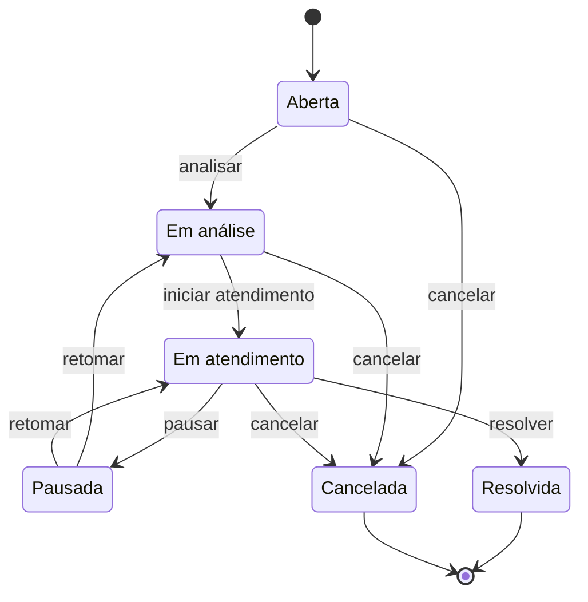

# O produto

O Resolve Aí registra e acompanha ocorrências de um lugar coletivo — um condomínio, uma empresa, um bairro
— até a resolução, com trilha auditável de cada mudança de estado.

## O problema

Hoje esse trabalho acontece em grupo de mensagens, e-mail e planilha. O pedido chega como texto solto,
alguém transcreve à mão, e é quando a ocorrência trava esperando por alguém que ela some: ninguém sabe em
que pé está, quem ficou de resolver, nem há quanto tempo parou. No fim do mês não existe um número sobre o
que aconteceu.

O produto troca isso por um registro com dono, estado e histórico. Quem abre acompanha sem precisar
perguntar; quem gere vê tudo numa lista só e responde pelos prazos; e cada mudança de estado fica gravada
com quem fez, quando e por quê.

## Quem usa

**Solicitante.** Mora, trabalha ou frequenta o lugar. Abre a ocorrência com foto e localização, acompanha
o andamento, conversa com quem gere e avalia a resolução.

**Gestor.** Responde pelo lugar: o síndico, o administrador, o responsável pela manutenção. Vê todas as
ocorrências, tria, define prioridade, atribui responsável, acompanha a execução e fecha.

**Encarregado.** Executa o trabalho: o zelador, o eletricista, a empresa terceirizada. Nesta versão ele
existe como cadastro e aparece como responsável; quem registra o andamento em nome dele é o Gestor.

**Uma pessoa pode pertencer a mais de uma organização**, com papel diferente em cada uma, e troca de
organização sem sair da sessão. Uma organização nunca vê o dado da outra.

## O que cada perfil faz

| O Solicitante | O Gestor |
|---|---|
| Cria conta e entra numa organização pelo código | Cria a organização e vira o primeiro Gestor |
| Registra a ocorrência com título, descrição, categoria, área e foto | Vê todas as ocorrências e filtra por categoria, estado e prioridade |
| Acompanha as próprias ocorrências e a linha do tempo de cada uma | Analisa, define prioridade e atribui um responsável |
| Conversa com quem gere, dentro da ocorrência | Inicia o atendimento, pausa com motivo e retoma |
| Avalia a resolução, com nota e comentário | Registra a solução aplicada e resolve |
| | Cancela com motivo, e aprova quem pede para entrar |
| | Lê os indicadores no painel |

## O ciclo de vida da ocorrência

A ocorrência nasce `Aberta` e caminha até `Resolvida`. `Cancelada` é alcançável enquanto o trabalho não
terminou.

As regras que governam o desenho, em linguagem de negócio:

- **Só o Gestor move a ocorrência adiante.** O Solicitante abre, comenta, avalia e cancela a própria.
- **Pausar exige motivo**, escolhido numa lista curta: esperando resposta do solicitante, esperando
  material, esperando autorização, esperando um terceiro. Retomar devolve a ocorrência ao estado anterior
  à pausa.
- **Cancelar exige motivo**, e cancelar não é resolver: as duas saídas são terminais, e a diferença fica
  registrada.
- **A avaliação não é um estado.** Ela é uma ação do autor sobre uma ocorrência já resolvida, com nota de
  1 a 5 e comentário opcional.
- **Toda mudança de estado grava um registro** com o estado anterior, o novo, a data e a hora, quem fez e
  a observação. O registro não se altera nem se apaga.
- **Não existe reabrir.** Problema que volta é ocorrência nova, ligada à original.

## O que o Gestor vê no painel

Cinco indicadores, numa tela só: o backlog por estado, o backlog por categoria, a média das avaliações, a
recorrência por categoria e por área, e o tempo médio de resolução mês a mês.

O que eles respondem é o que não se sabe hoje: **o que está parado, onde o problema se repete, e se quem
abriu ficou satisfeito.**

## O escopo desta versão

**Está entregue:** o ciclo de vida inteiro com trilha auditável, o registro com foto e localização, a
conversa dentro da ocorrência, a avaliação, o painel com os cinco indicadores, o cadastro de categorias,
áreas e pessoas, a entrada na organização por código com aprovação do Gestor, e várias organizações
isoladas na mesma instalação.

**Fora desta versão:**

- acesso próprio do Encarregado, e com ele a leitura sem rede, o reporte de execução e a recusa de
  atribuição;
- avisos automáticos de qualquer tipo — sem notificação, sem sino, sem alarme de ocorrência parada, sem
  e-mail ou mensagem;
- convite por link e página pública da organização;
- filtros rápidos salvos;
- aderir a uma ocorrência parecida em vez de abrir outra igual;
- nota interna entre Gestores;
- editar uma ocorrência depois de registrada.

**Nenhuma exigência do desafio ficou de fora.** Todo o corte recaiu sobre adições do projeto, e o
[Atendimento ao enunciado](atendimento-ao-enunciado.md) mostra exigência por exigência onde cada uma é
cumprida.

## O que a solução promete, com número

| | O alvo |
|---|---|
| Isolamento entre organizações | Nenhuma consulta devolve dado de outra organização, verificado por teste automatizado |
| Auditabilidade | Toda transição grava os cinco campos, e é impossível mudar o estado sem gerar o registro |
| Escala | 50 organizações, 200 pessoas por organização, 2.000 ocorrências e 20 pessoas usando ao mesmo tempo |
| Desempenho | Resposta em até 1 segundo em 95% das requisições, com a aplicação quente |
| Registro pelo celular | Menos de 1 minuto do toque no atalho à confirmação, com foto |
| Imagem | Uma por ocorrência, comprimida no próprio aparelho para no máximo 400 KB |
| Retenção | O histórico não expira: ele é o produto |
| Dados pessoais | Foto e localização ficam dentro da organização, e excluir a conta preserva a trilha com o autor anonimizado |

**A aplicação escala a zero para caber na franquia gratuita da nuvem**, e a primeira requisição depois de
um período ocioso demora: a medição foi de 20,7 segundos, contra 0,30 segundo com a aplicação quente. É
consequência declarada da escolha de custo zero, e não defeito.
