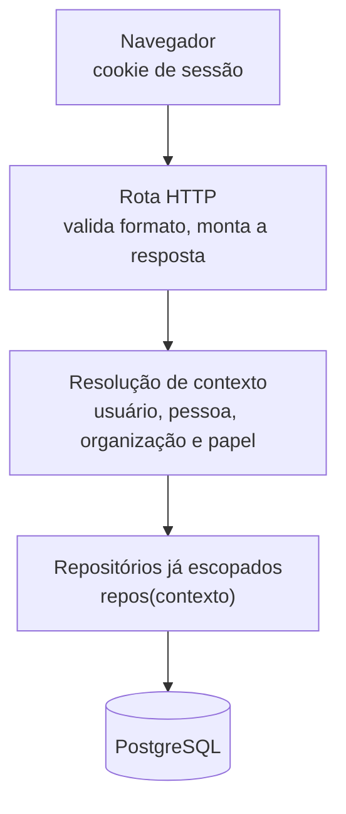

# Segurança

Atender várias organizações na mesma instalação é a decisão mais cara do produto, porque multiplica a
superfície de falha de autorização. Esta página mostra o que sustenta a promessa de que uma nunca vê o
dado da outra, e os demais controles em volta dela.

## O isolamento entre organizações

Toda requisição passa por um ponto só, e é ele quem descobre em qual organização se está operando.

A resolução acontece **uma vez por requisição** e produz o contexto com o usuário, a pessoa, a organização
ativa e o papel. Daí em diante nenhuma consulta é escrita com o filtro de organização repetido à mão:
quem consulta recebe repositórios que já nascem escopados, e o filtro é aplicado numa função só.

O funil é fechado por regra de lint: **nenhum arquivo fora da camada de infraestrutura importa o cliente
de banco**, e a regra é conferida a cada build. Quem quisesse escapar dele teria de escrever uma
importação que o portão recusa.

**Duas escritas acontecem sem sessão de onde tirar a organização, e as duas estão enumeradas.** Quem pede
entrada numa organização ainda não tem vínculo com ela, e quem cria uma organização está criando o próprio
escopo. Nos dois casos a origem do identificador é declarada: o Código da Organização apresentado na
requisição, no primeiro, e a organização recém-criada, no segundo. A lista é fechada, e um terceiro caso
exigiria alterar a [ADR-0003](adr/0003-isolamento-de-tenant-na-camada-de-aplicacao.md).

Duas leituras acontecem sem sessão nenhuma. A do convite por link devolve o nome e o código de uma
organização a partir do código, e mais nada. A do convite pessoal devolve, a partir do token, o nome da
pessoa que o Gestor cadastrou, o da organização e o papel, e nenhum contato. Só quatro arquivos podem
chamá-las, as rotas e as páginas dos dois convites, o que uma regra de lint confere. A razão está na
[ADR-0021](adr/0021-o-convite-pessoal-e-a-segunda-operacao-sem-sessao.md).

A garantia é exercida por teste. Cada consulta escopada entra numa suíte compartilhada que pergunta sempre
as mesmas três coisas, e as duas escritas de fora do funil têm caso próprio. O detalhe está em
[Testes](testes.md).

O navegador guarda uma coisa só desta aplicação: a casca que aparece enquanto o servidor inicia, que não
tem nome de organização, de pessoa nem conteúdo nenhum. Página renderizada nunca entra no cache, porque
levaria dado de uma organização para fora do ponto único, e a saída apaga o que houver. A razão está na
[ADR-0020](adr/0020-o-navegador-guarda-so-a-casca.md).

## Quem entra

Contas e sessões são do Supabase Auth, e o produto não guarda senha. O cadastro exige confirmação por
e-mail antes do primeiro acesso.

**O SDK do provedor roda no servidor, nunca no navegador.** Não existe variável `NEXT_PUBLIC_` neste
projeto, então nada do provedor é embutido no pacote que o navegador baixa. Entre o provedor e o resto do
sistema há uma camada de tradução que devolve apenas o identificador do usuário e o nome sugerido: token,
claim e objeto do SDK param ali e não alcançam o domínio.

A organização ativa viaja num cookie assinado pelo servidor, com segredo próprio. Trocar de organização é
trocar esse cookie, e a troca passa pela mesma resolução de contexto de qualquer outra requisição.

## O que cada um pode

A checagem pergunta **o que o vínculo pode**, e não qual é o papel dele. São dezoito permissões nomeadas,
e o mapa de papel para permissões é constante em código.

| Papel | O que recebe |
|---|---|
| Solicitante | registrar, ler as próprias e as compartilhadas com ele, comentar, cancelar a própria e avaliar |
| Gestor | tudo do Solicitante, mais ler todas, triar, atribuir, conduzir o atendimento, cancelar qualquer uma, configurar a organização, gerir vínculos e ler o painel |
| Encarregado | nenhuma permissão nesta versão |

O Encarregado com lista vazia é estado declarado: o vínculo autentica, e qualquer endereço de negócio
responde `403 PERMISSAO_INSUFICIENTE`. A diferença entre isso e um esquecimento é que o contrato o
descreve, e o teste o exerce.

Perguntar pela permissão, e não pelo papel, é o que permite ao Gestor que mora no prédio registrar a
própria ocorrência sem precisar de um segundo vínculo.

## O banco não conversa com o navegador

Todas as tabelas têm Row Level Security ligada e **nenhuma política escrita**. No PostgreSQL isso é
negação total: os papéis anônimo e autenticado não leem nem escrevem uma linha. A chave anônima é pública
por natureza, e neste esquema ela não alcança nada.

Quem fala com o banco é o servidor, com credencial que só existe como variável de ambiente do contêiner.
A divisão de responsabilidade é deliberada: o código responde *qual organização*, e o banco responde *quem
pode falar comigo*. Nenhuma das duas cobre a outra.

## A foto não passa pela aplicação

O servidor não transporta os bytes da imagem. Ele assina uma credencial de escrita temporária e restrita
àquele objeto, e o aparelho envia a foto direto para o armazenamento. A credencial de escrita vale quinze
minutos, e a de leitura, dez.

Junto com a credencial o servidor emite um comprovante assinado, que é o que torna o upload verificável na
hora de vinculá-lo à ocorrência. A chave da conta de armazenamento nunca sai do servidor, e a assinatura é
calculada localmente, sem ida ao provedor.

## Dados pessoais

O produto guarda foto, localização e contato de pessoas, e os controles são estes:

| O que | O controle |
|---|---|
| Alcance | foto, localização e contato só são legíveis dentro da organização do vínculo. O contato é da pessoa, e não do vínculo: quando um convite pessoal funde a pessoa cadastrada na da conta, os contatos que o Gestor cadastrou passam para a pessoa da conta, e com eles para as outras organizações de que ela participa |
| Envios de convite | o endereço de e-mail para onde cada convite saiu, quem enviou e quando. A linha fica depois de a pessoa ser removida, sem o elo com o convite, para o limite de um por dia continuar valendo |
| Envio de e-mail | um por dia por endereço na organização, dez por participante, vinte por vez, e só quem gere participantes envia. O provedor é outro que o da recuperação de senha, e um envio em massa não a derruba |
| Convite pessoal | o token do link fica em claro no banco, porque o Gestor recupera o link já gerado. Ele não concede acesso novo: liga uma conta a um vínculo que o Gestor já aprovou ao cadastrar. Gerar novo link invalida o anterior, o aceite o mata, revogar o vínculo o invalida, e só quem gere vínculos lê o token |
| Leitura de ocorrência | o autor lê as próprias, quem tem permissão de ler todas lê as dos outros, e uma ocorrência compartilhada é lida, sem poder de ação, por quem a recebeu. Um Solicitante não alcança a ocorrência de um vizinho que não a compartilhou com ele |
| Nomes de participantes | a busca de quem vai receber uma ocorrência devolve nome e papel, com mínimo de duas letras e teto de vinte, e não traz contato nem unidade. Ela limita, sem impedir, que um participante descubra os nomes dos outros |
| Retenção | o histórico não expira, porque apagá-lo destruiria a exigência central do desafio |
| Transporte | tudo por HTTPS, incluindo o envio direto da imagem ao armazenamento |
| Arquivo exportado | o arquivo de participantes leva e-mail e telefone, e sai só para quem tem `vinculo.gerir`, a mesma permissão de quem já vê esses contatos na tela. O arquivo sai do prédio, e por isso a exportação fica com quem gere |
| Fórmula na planilha | título e descrição são escritos por quem registra e abertos numa planilha por quem gere. No arquivo exportado, o texto que começa com `=`, `+`, `-` ou `@` sai com um apóstrofo na frente, e a planilha o mostra como texto em vez de executá-lo |

## Os segredos

Nenhum segredo entra na imagem. Não há `ARG` no Dockerfile, os arquivos de ambiente são excluídos antes de
qualquer cópia, e as sete variáveis de execução chegam do próprio Container App em tempo de execução. A
imagem publicada é pública, e não carrega configuração de ambiente nenhum.

Isso é conferido por máquina antes de a imagem ir para o registro: um verificador lê o histórico de
construção, e não apenas o sistema de arquivos final, porque uma camada guarda o que um comando de remoção
apagou depois. Ele tem canário positivo, então saída vazia por cegueira não passa como imagem limpa.

A esteira se autentica no Azure por credencial federada de curta duração, emitida para o emprego que
declara o ambiente de produção. Não há segredo do Azure guardado no repositório.

## O que a trilha garante

A auditabilidade é um controle de segurança, e não só um requisito funcional: como o estado da ocorrência
só muda por comando, e todo comando grava o registro na mesma operação, **não existe caminho de escrita
capaz de alterar uma ocorrência sem deixar rastro**. Quem fez, quando e a partir de qual estado ficam
gravados, e o registro não se altera nem se apaga. O mecanismo está em [Domínio e regras](dominio.md).

## Fora desta versão

Teste de intrusão, firewall de aplicação, criptografia por coluna, limite de requisições por cliente e
auditoria de acesso de leitura.
