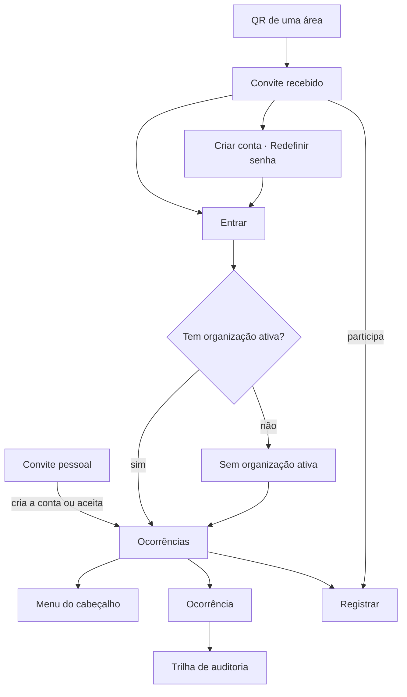

# Telas

Vinte telas. Cada uma existe porque responde a uma pergunta que nenhuma outra responde, e o critério
que as produziu é esse: **ação não é tela**. Um comando que a pessoa executa sem sair de onde está não
ganha endereço próprio.

## As vinte

| Tela | Endereço | A pergunta que ela responde | Quem vê |
|---|---|---|---|
| Entrar | `/entrar` | *Como eu entro?* | qualquer pessoa, sem sessão |
| Criar conta | `/criar-conta` | *Não tenho conta.* | qualquer pessoa, sem sessão |
| Redefinir senha | `/redefinir-senha` | *Esqueci a senha.* | qualquer pessoa, sem sessão |
| Definir nova senha | `/definir-senha` | *Recebi o link do e-mail. E agora?* | quem chegou pelo link |
| Sem organização ativa | `/organizacao` | *Onde eu trabalho?* | sessão válida, sem organização escolhida |
| Convite | `/convite/{codigo}` | *Me mandaram este link, ou li o QR de um lugar. Onde eu entro?* | qualquer pessoa, com ou sem sessão |
| Convite pessoal | `/convite-pessoal/{token}` | *Quem me convidou, e para onde?* | qualquer pessoa, com ou sem sessão |
| Ocorrências | `/ocorrencias` | *O que aconteceu com os meus pedidos?*, *o que me mostraram?* e *o que eu preciso resolver agora?* | quem pode ler as próprias ou todas |
| Registrar ocorrência | `/ocorrencias/nova` | *Preciso avisar de um problema.* | quem pode registrar |
| Ocorrência | `/ocorrencias/{id}` | *O que está acontecendo com esta, e o que eu faço com ela?* | quem pode ler aquela ocorrência |
| Trilha de auditoria | `/ocorrencias/{id}/auditoria` | *Prove o que aconteceu, campo por campo.* | quem pode ler aquela ocorrência |
| Painel | `/dashboard` | *Está melhorando ou piorando?* | quem pode ler o painel |
| Participantes | `/vinculos` | *Quem está aqui, e quem quer entrar?* | quem gere vínculos |
| Configuração | `/configuracao` | *O que desta organização eu posso ajustar?* | quem configura a organização |
| Categorias | `/configuracao/categorias` | *As categorias que o Solicitante escolhe estão certas?* | quem configura a organização |
| Áreas | `/configuracao/areas` | *As áreas descrevem este lugar?* | quem configura a organização |
| QR da área | `/configuracao/areas/{areaId}/qr` | *Como eu ponho o registro na parede?* | quem configura a organização |
| Meus dados | `/meus-dados` | *O que é meu, e como eu entro?* | qualquer vínculo ativo |
| Grupo | `/grupo` | *Quem fez isto?* | qualquer pessoa, sem sessão |
| Vínculo sem permissões | — | *Entrei. Por que não consigo fazer nada?* | vínculo sem permissão nenhuma |

A última não tem endereço próprio: é o que a aplicação mostra quando o vínculo existe e não autoriza nada,
que hoje é o caso do Encarregado.

## Como se navega

A lista de ocorrências é a tela inicial de todo papel que age, e a tela de ocorrência é onde os comandos
moram. Do menu do cabeçalho saem o Painel, os Participantes, a Configuração, que mostra as regras do
atendimento, os textos que quem abriu lê, as etiquetas, o convite e cada mudança, e abre as categorias e as áreas,
os Meus dados e a página do Grupo, que também responde sem sessão.

Na lista, um controle de escolha única diz qual conjunto está na tela. Quem lê todas escolhe entre *Todas as
ocorrências* e *Minhas ocorrências*, com a contagem de cada uma ao lado do rótulo. Quem só lê as próprias
escolhe entre *Minhas ocorrências* e *Compartilhadas comigo*.

Na aba *Compartilhadas comigo*, cada linha que a pessoa ainda não abriu desde que foi compartilhada leva a
palavra *Não vista*, ao lado do status. Quantas são é o sino que diz.

O convite chega por um link curto com o código, e a tela dele funciona antes de a pessoa ter conta. Criar a
conta ou entrar a devolve ao convite.

Quem cria uma organização chega à configuração, na aba dos participantes, onde estão o código, o link e o
QR, porque o passo seguinte é chamar gente. Quem participa de mais de uma e ainda não escolheu pode pedir entrada em outra
direto da escolha.

O QR de uma área leva à mesma tela, com a área no endereço. Quem participa e já entrou cai direto no
registro, com a área escolhida, e a organização ativa troca para a da área se for preciso. Quem não entrou
vê o nome da organização, entra e volta sozinho ao registro. Quem não participa vai para o pedido de
entrada.

A página do grupo e a documentação abrem em nova aba, a partir do pé de toda tela de entrada e do
menu, e nenhuma das duas pede sessão.

No menu do cabeçalho, **cada item só existe para quem tem a permissão correspondente** — por isso, na
navegação normal, ninguém esbarra numa recusa de permissão. Ela acontece por link recebido de fora, e tem
mensagem própria.

Trocar de organização é um menu no cabeçalho, com o nome da organização ativa sempre visível ao lado.
Numa aplicação em que a organização vem da sessão e não do endereço, a URL não diz onde você está, e é o
cabeçalho que diz.

No mesmo cabeçalho fica o sino. O número conta as ocorrências com novidade feita por outra pessoa que quem
olha ainda não leu, entre as que são dela: as que registrou, as de que é responsável e as compartilhadas
com ela. Para o Gestor, conta também as recém-registradas. O sino é da organização ativa: quem participa de
duas vê o de uma só, e o número muda ao trocar. Ele abre numa gaveta, que vem da direita na tela grande
e sobe de baixo no celular, com uma linha por ocorrência e a novidade mais recente dela. Abrir
a ocorrência, agir nela ou marcá-la como lida à mão a tira do número, e abrir o sino não zera nada. A tela
de registro fica sem ele, como fica sem a navegação lateral, para não convidar a sair do registro.

O produto abre no tema escuro. Quem prefere o claro troca no menu da pessoa, e quem ainda não entrou
troca no botão *Aparência*, no canto das telas de entrada. No mesmo grupo fica o alto contraste, que vence
o tema enquanto estiver ligado. As duas escolhas valem para todas as telas e ficam guardadas no navegador.
A documentação tem o próprio interruptor, e também começa escura.

## Duas telas carregam o produto

**Registrar ocorrência** é a única tela cronometrada. O alvo é menos de um minuto do toque no atalho à
confirmação, com foto, num celular em rede móvel — e o desenho inteiro dela serve a isso: a foto é o
primeiro alvo, os campos de digitar vêm antes dos de escolher para evitar trocas de teclado, e a área
tem busca com as usadas recentemente no topo.

Pelo QR de uma área, ela já vem com a área escolhida, e a pessoa pode trocá-la: o tipo segue a
área que ficar no fim. Se a área do QR foi desativada, ou não é desta organização, o campo abre vazio,
com um aviso para escolher onde é, sem dizer qual dos dois casos é. Um QR com código que não leva a
organização nenhuma mostra *QR não encontrado*.

**Ocorrência** é onde o trabalho acontece, e é o link que substitui a conversa em grupo. Os onze comandos
do agregado moram nela: analisar, atribuir, iniciar atendimento, pausar, retomar, resolver, cancelar,
alterar prioridade, registrar a solução, comentar e avaliar. Nenhum deles é uma tela.

Nela mora também o compartilhamento, que não é comando. Quem registrou e os Gestores veem um cartão
*Compartilhada com*, que lista quem recebeu, quem compartilhou e quando, com o desfazer só nas linhas que
quem olha pode desfazer. O botão de compartilhar abre uma busca de pessoas: tela cheia no celular, painel
lateral na tela grande. Tocar num nome compartilha na hora, uma pessoa por vez; quem já vê a ocorrência
aparece na lista com o motivo escrito, e não é escolhível.

Quem recebeu a ocorrência compartilhada vê o que o autor vê, e no lugar das ações do cabeçalho lê uma faixa
com quem a compartilhou. Ela não tem botão de ação nenhum, não tem o cartão *Compartilhada com* e não tem o
campo de mensagem — as mensagens continuam legíveis.

Onze telas de comando produziriam um produto em que o Gestor sai da ocorrência para agir sobre ela e volta
para ver o resultado — navegar em vez de trabalhar.

A lista tem um filtro de um clique para o que está esperando: ele recorta pelas ocorrências em curso sem
atividade há mais dias do que a organização tolera, e as que estão em espera com motivo não entram. Cada
linha recortada diz há quantos dias está assim, e o mesmo aviso aparece fora do filtro, para quem só
percorre a lista. Quantos dias a organização tolera é regra dela, de 1 a 90, e muda na Configuração.

## O que a tela desenha vem do servidor

A resposta que traz uma ocorrência traz também **a lista de ações disponíveis para quem está lendo**, já
cruzada com o estado e com as permissões. A interface desenha os botões a partir dela, sem manter uma
segunda cópia da máquina de estados.

A lista pode vir vazia, e isso não é erro: é uma ocorrência terminal, ou alguém sem permissão de agir
sobre ela. A tela mostra o histórico e não oferece ação nenhuma.

O mesmo vale para os rótulos: o texto de cada estado é calculado no servidor e depende de quem lê. Quem
abriu vê linguagem de gente, e a organização pode trocar esse texto na Configuração; quem gere vê o nome
com que opera a máquina, que não muda.

No painel, a API devolve o tempo de resolução em horas, e **a unidade que se lê é escolha da
tela**: abaixo de um minuto ela escreve *menos de 1 min*, abaixo de uma hora escreve minutos, de uma a 48
horas escreve horas inteiras, e acima disso escreve dias com uma casa. Assim uma ocorrência resolvida em
nove minutos aparece em minutos, e uma resolvida em dez segundos não aparece como zero.

O painel abre com três números, em coluna ao lado do primeiro quadro: quantas ocorrências estão em aberto
agora, o saldo do período e a idade da mais velha em aberto. Cada um traz embaixo o segundo termo que o
explica: quantas estavam em aberto no início do período, quantas entraram e quantas saíram, e o título da
mais velha. **O saldo responde à pergunta da página**, se a fila está crescendo ou encolhendo, pelo sinal
escrito e nunca pela cor, porque saldo positivo pode ser a organização começando a usar o produto. Saiu
quer dizer resolvida ou cancelada.

Abaixo vêm sete quadros, e cada um escreve a pergunta de decisão que responde:

| # | Quadro | A pergunta |
|---|---|---|
| 1 | Entradas e saídas por mês | Está melhorando ou piorando? |
| 2 | Em aberto por idade | O que está esperando demais, e qual ocorrência? |
| 3 | Tempo de resolução | Quanto demora, e quanto demora para quem espera mais? |
| 4 | O que está voltando | Onde vale atacar a causa em vez de abrir outra ordem de serviço? |
| 5 | Em aberto por categoria | Onde está o trabalho que não terminou? |
| 6 | Ocorrências por status | Como se distribui tudo o que já foi registrado? |
| 7 | Satisfação | Quem foi atendido ficou satisfeito? |

Cada gráfico tem a forma que a medida pede. Entradas e saídas e o tempo de resolução são linhas, mês a mês;
a idade, o que está voltando, a categoria e o status são barras com o número escrito na ponta; a satisfação
é a média em número grande, com as cinco notas em barras. Nenhuma cor diz nada sozinha.

Os dois quadros de linha e o da idade têm o botão *Ver dados*, que abre a tabela do quadro num modal. A
tabela é a alternativa em texto do gráfico, e a frase que resume o quadro fica fora dela, visível. Nos
outros quadros de barra cada barra já traz o número, e o leitor de tela lê as mesmas linhas numa lista.

No primeiro quadro, a linha de cima conta o que entrou e a de baixo o que saiu. Registradas acima das
saídas em meses seguidos é fila crescendo, e o contrário é fila encolhendo. A frase do quadro fala do
último mês completo do período. O mês que o período corta leva um asterisco no rótulo, e uma nota explica
que o número dele não se compara com o de um mês inteiro: sem isso, a janela de noventa dias exageraria a
rampa nas duas pontas.

O quadro da idade começa pelas mais velhas. A frase diz quantas esperam há mais de um mês e, quando há
alguma acima de três meses, quantas são; a lista mostra as cinco que esperam há mais tempo, com o estado e
a idade de cada uma; as quatro faixas vêm depois, sempre, mesmo a zero, para que uma organização que está
começando veja o que vai ser medido. O título de cada uma leva à ocorrência, e é a única navegação do
painel.

O tempo de resolução mostra, por mês, a mediana e o p90. A mediana diz como foi o caso do meio; o p90 diz
como foi o décimo pior atendimento, e é nele que há o que corrigir. Mês com três resoluções ou menos não
tem p90, porque um percentil sobre três pontos descreveria mais do que três pontos sustentam, e as
durações dele aparecem uma a uma na tabela.

O que está voltando mostra as duplas de área e categoria que se repetiram no período, da maior para a
menor, as cinco primeiras e as que empatam com a quinta. O que passa disso vira uma frase, e o corte nunca
separa um empate. Embaixo, o quadro diz de quantas ocorrências registradas no período as duplas são parte,
e o comprimento de cada barra é essa parte. Uma ocorrência não é recorrência, então a dupla só aparece da segunda em diante; sem
nenhuma, o quadro escreve o que vai aparecer ali.

O quadro por status conta todas as ocorrências da organização, inclusive as resolvidas e as canceladas, na
ordem do ciclo. O quadro por categoria conta só o que está em aberto, e escreve ao lado de cada número
quantas passaram de uma semana. Os dois não somam o mesmo número, e cada um diz na tela o que conta,
porque um leitor que somasse os dois chegaria a uma conclusão que os dados não sustentam.

O quadro da satisfação escreve o denominador ao lado da média, sempre: sem ele a média engana quando poucos
avaliam, porque a média de duas notas ocupa a mesma tela que a média de duzentas. Sem nenhuma avaliação no
período, o número grande fica num traço, nunca num zero, e a frase ao lado diz quantas resolvidas o período
tem e que nenhuma delas foi avaliada.

No painel, o período se escolhe num controle único, que mostra o intervalo aplicado e abre um calendário
com quatro atalhos de uso corrente: últimos 7, 30 e 90 dias, e este mês. O atalho do período aplicado
aparece marcado, e o rótulo do controle só muda depois de aplicar. Se a data de início vier depois da
de fim, a tela troca as duas e diz que trocou, em vez de recusar o pedido. A API continua recusando a
mesma consulta, porque para um programa a ordem errada é defeito de quem chamou.

Ocorrências, Participantes, Áreas e Categorias exportam a lista pelo botão *Exportar CSV*. O arquivo traz
tudo o que a pessoa alcança naquela tela, ignorando o filtro e a página que estão abertos, e abre no Excel
com os acentos e as colunas no lugar. O de participantes leva o contato de cada um, e-mail e telefone. O
botão só aparece para quem tem a permissão daquela lista, e some quando a lista está vazia.

## A configuração da organização

A identidade da organização fica no alto, com o nome e o código, e o resto se divide em três abas. Em
Configurações de ocorrências ficam as regras do atendimento, os textos que quem abriu lê em cada status e
as duas listas do formulário de registro. Em Configurações de participantes ficam as etiquetas e o
convite, com o código, o link para copiar e o QR, lado a lado na tela grande. Em Histórico ficam as
mudanças de configuração. A aba escolhida fica no endereço, e quem recarrega volta a ela.

## As etiquetas dos participantes

Quem gere participantes pode dar a cada um etiquetas livres, como eletricista ou contratado. A lista de
participantes ganha a coluna Etiquetas, que mostra as duas primeiras em ordem alfabética e um *+N* com as
demais; no celular, a mesma regra vale numa linha abaixo do papel, e a lista não rola de lado. A coluna só
aparece quando a organização tem alguma etiqueta.

Na linha da busca por nome entra o filtro por etiqueta, com uma etiqueta por vez, busca dentro e o estado
no endereço. Ele se combina com o filtro por papel, e as contagens dos dois são da lista inteira.

As etiquetas da organização ficam na configuração, num cartão próprio: cada uma com quantos participantes
a têm, uma busca pelo nome e o botão de apagar, que confirma dizendo em quantas pessoas ela está. Uma
etiqueta nasce ali, num modal só com o nome, ou no detalhe de um participante.

No detalhe do participante, o cartão Etiquetas vem depois de Contatos e grava a cada gesto. É uma seleção
múltipla com busca: escolher uma etiqueta ou escrever uma nova acrescenta, e o botão de cada ficha a tira.
Na escolha do responsável de uma ocorrência, as etiquetas aparecem ao lado do nome, sem filtro.

## O convite pessoal

No detalhe de um participante que o Gestor cadastrou sem conta, Solicitante ou Gestor, o botão Convidar
abre um modal com o link pessoal dessa pessoa. A frase de cima diz o que o link faz: quem o abrir entra na
organização com aquele papel, sem precisar de aprovação. O link aparece inteiro, num campo só de leitura
que quebra linha no celular, com Copiar, que vira Compartilhar onde o aparelho tem a folha do sistema, e
Gerar novo link, que pede confirmação porque o link anterior deixa de funcionar. Embaixo, quando e por quem
o link foi gerado. Abrir o modal de novo mostra o mesmo link.

Quem não recebe convite não vê o botão. No lugar dele, uma frase diz o porquê: *Encarregados não usam o
aplicativo.*, ou *Já usa o aplicativo.* para quem já tem conta.

A página do convite pessoal tem quatro faces, e a situação vem decidida do servidor:

| Situação | Face |
|---|---|
| sem sessão | o nome da pessoa e a frase da organização que convida, com o formulário de criar conta já com o nome preenchido, e o caminho para quem já tem conta |
| com outra conta | *Entrar no {organização} como {papel}?*, a conta em uso e o caminho de sair, com o botão Entrar |
| já participa | *Você já participa do {organização}.*, com o caminho para entrar nela |
| não vale | *Este convite não vale mais.*, sem dizer por quê |

O e-mail não vem preenchido no formulário: a página roda sem sessão, e contato só é legível dentro da
organização. Qualquer e-mail é aceito, porque a prova é o link. Se a fusão com a conta em uso falhar, a
mesma face mostra *Não foi possível concluir o convite. Tente de novo.* acima do botão.

## O convite por e-mail

Na lista de participantes, cada linha de participante tem uma caixa de seleção à esquerda do nome, e as
linhas de pedido de entrada não têm. A caixa do cabeçalho marca e desmarca as linhas da página visível,
com o estado intermediário quando parte delas está marcada. A seleção sobrevive a trocar de página, de
filtro, de etiqueta e à busca, e some ao recarregar. Com ao menos uma marcada, aparece acima da tabela a
faixa *3 selecionados · Limpar*, e no cabeçalho, à esquerda de *Cadastrar participante*, o botão
*Convidar por e-mail (3)*.

O botão abre um diálogo em três fases. A pergunta diz para quantos vai; acima de vinte, ela pede para
desmarcar o excesso e oferece só *Voltar*. Enquanto envia, o diálogo não fecha. O resumo mostra os
enviados, com nome e endereço, e os não enviados, com nome e o motivo, e *Fechar* limpa a seleção.

No modal do convite, entre o link e os botões, o bloco de e-mail diz para onde vai, quando foi o último
envio, e o impedimento como texto, quando há: sem e-mail, com o caminho para os Contatos; limite do dia,
com quando o próximo pode sair; ou limite do participante. Quando nada impede, *Enviar convite por e-mail*
é o botão principal e *Copiar* passa a secundário; com impedimento, o botão de e-mail não aparece e *Copiar*
continua o principal.

## Celular primeiro, e o que muda na tela grande

Toda tela é desenhada para funcionar completa no celular e na tela grande, para qualquer papel. O registro,
a leitura e a conversa nasceram no celular, porque é onde o morador está.

Na tela grande a lista de ocorrências ganha colunas e o detalhe ganha uma coluna lateral; no celular os
dois viram pilha, e as ações que na tela grande abrem um painel ancorado abrem uma gaveta inferior, que é
onde o polegar alcança. A exceção é a busca de pessoas para compartilhar, que abre em tela cheia no
celular: ela tem teclado, e uma gaveta inferior com o teclado aberto some atrás dele. A seleção de
etiquetas no detalhe do participante abre ancorada ao campo nas duas larguras.

## Os estados que não são telas

| Estado | O que a aplicação faz |
|---|---|
| Sem organização ativa | leva à tela de escolher organização, guardando o destino pretendido, o que cobre o link recebido antes de a pessoa pertencer a algum lugar |
| Sem permissão para aquela tela | mensagem própria, com o caminho de volta. Só acontece por link recebido |
| Lista vazia | texto que diz o que fazer em seguida, e não uma área em branco |
| Carregando | esqueleto do conteúdo, e não um indicador girando sobre o nada |
| Erro | a frase em português que vem da resposta, com a ação que a pessoa pode tentar |
| Endereço que não existe | página própria, com o caminho para a aplicação e para esta documentação |
| Um bloco que não carregou | a falha fica naquele cartão, com a ação de tentar de novo, e o resto da tela continua |
| Abrindo depois de um tempo sem uso | a casca da aplicação na hora, com a marca e o esqueleto, e a tela no lugar dela assim que o servidor responde |

## Acessibilidade

Três compromissos são presos por teste. O contraste do texto é medido contra os três fundos do tema, o
contorno de foco do teclado não pode ser apagado por nenhum componente, e os gráficos do painel ficam fora
da tabulação, porque a informação deles está na tabela ao lado. Toda tela da casca e da documentação começa
com o link *Pular para o conteúdo*, visível quando recebe o foco.

O resto é compromisso de construção, conferido a olho: todo campo tem rótulo associado ao controle, nenhum
alvo de toque é menor que cerca de 44 px, e nada é comunicado só por cor. Prioridade, estado e motivo de
pausa sempre carregam a palavra.

O piso vem da biblioteca de componentes, escolhida por isso, e a decisão está na
[ADR-0007](adr/0007-camada-de-interface-com-shadcn-ui.md).

## Fora desta versão

Não há tela para o Encarregado, nem tela de avisos, nem filtros salvos.
O que cada ausência custa está em [O produto](produto.md).
