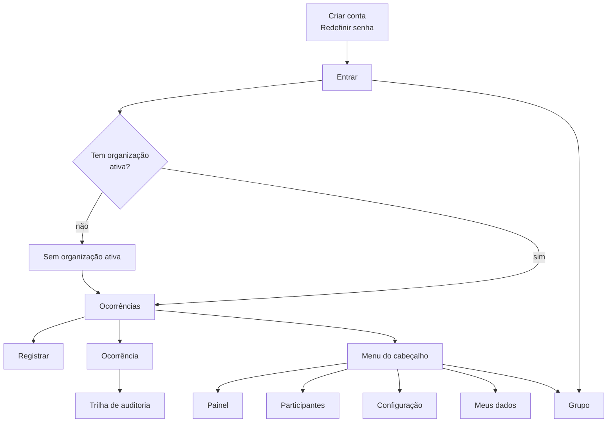

# Telas

Dezessete telas. Cada uma existe porque responde a uma pergunta que nenhuma outra responde, e o critério
que as produziu é esse: **ação não é tela**. Um comando que a pessoa executa sem sair de onde está não
ganha endereço próprio.

## As dezessete

| Tela | Endereço | A pergunta que ela responde | Quem vê |
|---|---|---|---|
| Entrar | `/entrar` | *Como eu entro?* | qualquer pessoa, sem sessão |
| Criar conta | `/criar-conta` | *Não tenho conta.* | qualquer pessoa, sem sessão |
| Redefinir senha | `/redefinir-senha` | *Esqueci a senha.* | qualquer pessoa, sem sessão |
| Definir nova senha | `/definir-senha` | *Recebi o link do e-mail. E agora?* | quem chegou pelo link |
| Sem organização ativa | `/organizacao` | *Onde eu trabalho?* | sessão válida, sem organização escolhida |
| Ocorrências | `/ocorrencias` | *O que aconteceu com os meus pedidos?* e *o que eu preciso resolver agora?* | quem pode ler as próprias ou todas |
| Registrar ocorrência | `/ocorrencias/nova` | *Preciso avisar de um problema.* | quem pode registrar |
| Ocorrência | `/ocorrencias/{id}` | *O que está acontecendo com esta, e o que eu faço com ela?* | quem pode ler aquela ocorrência |
| Trilha de auditoria | `/ocorrencias/{id}/auditoria` | *Prove o que aconteceu, campo por campo.* | quem pode ler aquela ocorrência |
| Painel | `/dashboard` | *Está melhorando ou piorando?* | quem pode ler o painel |
| Participantes | `/vinculos` | *Quem está aqui, e quem quer entrar?* | quem gere vínculos |
| Configuração | `/configuracao` | *O que desta organização eu posso ajustar?* | quem configura a organização |
| Categorias | `/configuracao/categorias` | *As categorias que o Solicitante escolhe estão certas?* | quem configura a organização |
| Áreas | `/configuracao/areas` | *As áreas descrevem este lugar?* | quem configura a organização |
| Meus dados | `/meus-dados` | *O que é meu, e como eu entro?* | qualquer vínculo ativo |
| Grupo | `/grupo` | *Quem fez isto?* | qualquer pessoa, sem sessão |
| Vínculo sem permissões | — | *Entrei. Por que não consigo fazer nada?* | vínculo sem permissão nenhuma |

A última não tem endereço próprio: é o que a aplicação mostra quando o vínculo existe e não autoriza nada,
que hoje é o caso do Encarregado.

## Como se navega

A lista de ocorrências é a tela inicial de todo papel que age, e a tela de ocorrência é onde os comandos
moram. A configuração abre as categorias e as áreas.

A página do grupo e a documentação abrem em nova aba, a partir de Entrar e do menu, e nenhuma das duas
pede sessão.

No menu do cabeçalho, **cada item só existe para quem tem a permissão correspondente** — por isso, na
navegação normal, ninguém esbarra numa recusa de permissão. Ela acontece por link recebido de fora, e tem
mensagem própria.

Trocar de organização é um menu no cabeçalho, com o nome da organização ativa sempre visível ao lado.
Numa aplicação em que a organização vem da sessão e não do endereço, a URL não diz onde você está, e é o
cabeçalho que diz.

O produto abre no tema escuro. Quem prefere o claro troca no menu da pessoa, e a escolha vale para todas
as telas e fica guardada no navegador. A documentação tem o próprio interruptor, e também começa escura.

## Duas telas carregam o produto

**Registrar ocorrência** é a única tela cronometrada. O alvo é menos de um minuto do toque no atalho à
confirmação, com foto, num celular em rede móvel — e o desenho inteiro dela serve a isso: a foto é o
primeiro alvo, os campos de digitar vêm antes dos de escolher para evitar trocas de teclado, e a área
tem busca com as usadas recentemente no topo.

**Ocorrência** é onde o trabalho acontece, e é o link que substitui a conversa em grupo. Os onze comandos
do agregado moram nela: analisar, atribuir, iniciar atendimento, pausar, retomar, resolver, cancelar,
alterar prioridade, registrar a solução, comentar e avaliar. Nenhum deles é uma tela.

Onze telas de comando produziriam um produto em que o Gestor sai da ocorrência para agir sobre ela e volta
para ver o resultado — navegar em vez de trabalhar.

## O que a tela desenha vem do servidor

A resposta que traz uma ocorrência traz também **a lista de ações disponíveis para quem está lendo**, já
cruzada com o estado e com as permissões. A interface desenha os botões a partir dela, sem manter uma
segunda cópia da máquina de estados.

A lista pode vir vazia, e isso não é erro: é uma ocorrência terminal, ou alguém sem permissão de agir
sobre ela. A tela mostra o histórico e não oferece ação nenhuma.

O mesmo vale para os rótulos: o texto de cada estado é calculado no servidor e depende de quem lê. Quem
abriu vê linguagem de gente; quem gere vê o nome com que opera a máquina.

No painel, a API devolve o tempo de resolução em horas, e **a unidade que se lê é escolha da
tela**: abaixo de um minuto ela escreve *menos de 1 min*, abaixo de uma hora escreve minutos, de uma a 48
horas escreve horas inteiras, e acima disso escreve dias com uma casa. Assim uma ocorrência resolvida em
nove minutos aparece em minutos, e uma resolvida em dez segundos não aparece como zero.

O quadro *Tempo de resolução* do painel mostra, por mês, a mediana e o p90 das resoluções daquele mês, com
quantas foram. A mediana diz como foi o caso do meio; o p90 diz como foi o décimo pior atendimento, e é
nele que há o que corrigir. Mês com três resoluções ou menos aparece com as durações escritas uma a uma,
porque um percentil sobre três pontos descreveria mais do que três pontos sustentam. A barra de cada mês
desenha a mediana, também no mês que mostra as durações uma a uma, e o próprio quadro diz isso no rodapé.

No painel, o quadro por status conta todas as ocorrências da organização, inclusive as resolvidas e as
canceladas, e o quadro por categoria conta só o que está em aberto. **Os dois não somam o mesmo número**,
e cada um diz na tela o que conta, porque um leitor que somasse os dois quadros chegaria a uma conclusão
que os dados não sustentam.

No painel, o período se escolhe num controle único, que mostra o intervalo aplicado e abre um calendário
com quatro atalhos de uso corrente: últimos 7, 30 e 90 dias, e este mês. O atalho fica apagado quando o
período já é o dele, e o rótulo do controle só muda depois de aplicar. Se a data de início vier depois da
de fim, a tela troca as duas e diz que trocou, em vez de recusar o pedido. A API continua recusando a
mesma consulta, porque para um programa a ordem errada é defeito de quem chamou.

O mesmo painel desenha, mês a mês, quantas ocorrências foram registradas e quantas foram resolvidas. Os
dois números já vêm na resposta: a soma das séries de recorrência é o que entrou, e o denominador do tempo
de resolução é o que saiu, e é a tela que os cruza. **Registradas acima de resolvidas em meses seguidos é
fila crescendo**, e o contrário é fila encolhendo.

No quadro de recorrência, além das duas listas de volume, o painel escreve as duplas de área e categoria
que se repetiram no período, da maior para a menor. As listas respondem onde há mais volume, cada uma por
uma dimensão; a dupla responde o que está voltando, que é a pergunta que a frase do quadro faz. Uma
ocorrência não é recorrência, então a dupla só aparece da segunda em diante; sem nenhuma, o quadro escreve
uma linha dizendo o que vai aparecer ali.

O painel mostra ainda, agora, quantas ocorrências em aberto estão em cada faixa de idade — até uma
semana, até um mês, até três meses, e acima disso. **As quatro faixas aparecem sempre, mesmo a zero**,
para que uma organização que está começando veja o que vai ser medido. Quando há alguma na faixa mais
antiga, o quadro escreve quantas são: é o único número do painel que aponta um caso enquanto ainda dá para
agir, porque o tempo de resolução só existe depois que a ocorrência acabou.

## Celular primeiro, e o que muda na tela grande

O registro, a leitura e a conversa são desenhados para o celular, porque é onde o morador está. O painel,
a trilha de auditoria, os participantes e a configuração são desenhados para a tela grande, porque são
trabalho de quem senta para administrar.

Na tela grande a lista de ocorrências ganha colunas e o detalhe ganha uma coluna lateral; no celular os
dois viram pilha, e as ações que na tela grande abrem um painel ancorado abrem uma gaveta inferior, que é
onde o polegar alcança.

## Os estados que não são telas

| Estado | O que a aplicação faz |
|---|---|
| Sem organização ativa | leva à tela de escolher organização, guardando o destino pretendido, o que cobre o link recebido antes de a pessoa pertencer a algum lugar |
| Sem permissão para aquela tela | mensagem própria, com o caminho de volta. Só acontece por link recebido |
| Lista vazia | texto que diz o que fazer em seguida, e não uma área em branco |
| Carregando | esqueleto do conteúdo, e não um indicador girando sobre o nada |
| Erro | a frase em português que vem da resposta, com a ação que a pessoa pode tentar |

## Acessibilidade

Não há teste de acessibilidade neste projeto. O que existe é compromisso de construção, conferido a olho,
e três deles não dependem de ferramenta: todo campo tem rótulo associado ao controle, nenhum alvo de toque
é menor que cerca de 44 px no celular, e nada é comunicado só por cor — prioridade, estado e motivo de
pausa sempre carregam a palavra.

O piso vem da biblioteca de componentes, escolhida por isso, e a decisão está na
[ADR-0007](adr/0007-camada-de-interface-com-shadcn-ui.md).

## Fora desta versão

Não há tela para o Encarregado, nem tela de avisos, nem filtros salvos, nem página pública da organização.
O que cada ausência custa está em [O produto](produto.md).
