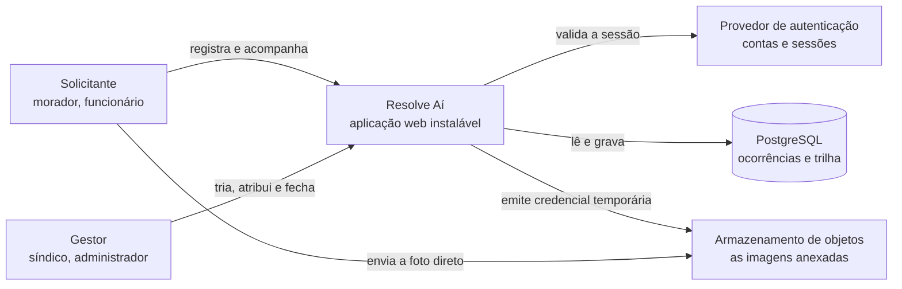
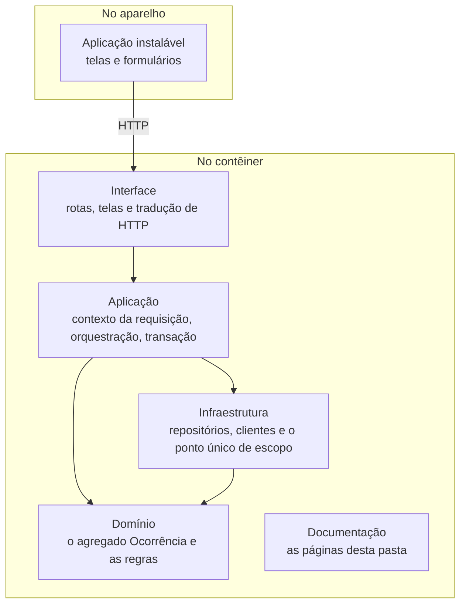
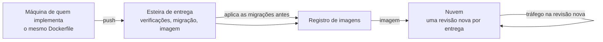

# Visão geral da arquitetura

Uma aplicação Next.js em contêiner, com PostgreSQL e autenticação gerenciados, publicada no Azure
Container Apps. A interface e a API sobem no mesmo contêiner, e a documentação que você está lendo é
servida por ele.

## O sistema no contexto

**A foto não passa pela aplicação.** O servidor emite uma credencial de escrita temporária e restrita, e o
aparelho envia a imagem direto para o armazenamento. Os bytes nunca atravessam o contêiner, o que preserva
a franquia gratuita de processamento, e a chave da conta de armazenamento nunca sai do servidor.

## Os blocos que compõem a aplicação

As setas são a **regra de dependência**: tudo aponta para dentro, e o Domínio não aponta para nada. A
Infraestrutura depende do Domínio porque implementa portas que o Domínio declara, e não o contrário.

| Camada | O que pode | O que não pode |
|---|---|---|
| Interface | traduzir HTTP, validar formato, montar a resposta | conter regra de negócio, tocar o banco |
| Aplicação | resolver o contexto, orquestrar, transacionar | conter regra de negócio |
| Domínio | todas as regras, incluindo a máquina de estados | persistir, conhecer HTTP, token ou SQL |
| Infraestrutura | persistência, armazenamento, chamada externa | decidir regra |

**A regra é conferida por máquina.** Cinco regras de importação no `eslint.config.mjs` recusam o que a
tabela proíbe: importação só para dentro e só pela superfície pública do módulo, nenhum pacote de terceiro
fora da pasta de clientes, e o escopo por organização alcançável apenas pelos quatro endereços de uma
lista fechada. Um desenho que depende de disciplina se desfaz na primeira semana apertada; este falha o
build.

## Os dois contextos do domínio

| Contexto | O que abriga | Por que é separado |
|---|---|---|
| **Ocorrências** | a `Ocorrência` com o ciclo de vida e a trilha, a conversa, a notificação | é o coração do produto, e onde toda a modelagem foi gasta |
| **Organização e acesso** | a `Organização`, a `Pessoa`, o vínculo entre as duas, e o usuário do provedor | resolve quem é quem e o que cada um pode, sem valor próprio |

A fronteira entre os dois é o momento em que a ocorrência é registrada. Antes dele a pergunta é *quem é
você e onde você está*; depois, *o que acontece com este problema*.

São dois, e não seis, porque um contexto é trabalhado por um time, e aqui há um implementador. Fatiar mais
seria desenho de enfeite. O detalhe do modelo está em [Domínio e regras](dominio.md).

## A stack, contra o requisito que a escolheu

| Tecnologia | O requisito que a justifica |
|---|---|
| Next.js com TypeScript | uma entrega só, sem CORS nem tipos duplicados, para um implementador em seis semanas |
| Aplicação instalável, com service worker | leitura sem rede, e registro rápido em rede ruim |
| Rotas de API próprias | as APIs são entregável, e o mesmo servidor as serve à interface |
| PostgreSQL | a auditabilidade exige gravar a transição e o registro na mesma transação |
| Autenticação gerenciada | problema resolvido por terceiros, comprado em vez de construído |
| Armazenamento de objetos | a imagem por ocorrência, sem teto de arquivo e sem custo relevante |
| Contêiner, e a mesma imagem em produção | a conteinerização que o desafio exige, sem ambiente de desenvolvimento diferente do publicado |
| Nuvem com escala a zero | publicação em nuvem dentro de uma franquia gratuita permanente |
| Tailwind e biblioteca de componentes | o risco de usabilidade: foco, teclado e leitores de tela corretos sem construí-los |
| Vitest e Playwright | a máquina de estados testável em milissegundos, e o caminho crítico exercido num navegador |

Cada escolha tem alternativa rejeitada registrada nas
[decisões de arquitetura](adr/), que são a leitura seguinte para quem quer o porquê.

## Da máquina ao ar

**Publicar é mesclar.** A esteira verifica, aplica as migrações do banco, constrói a imagem, publica e cria
uma revisão nova, nessa ordem — porque voltar atrás na aplicação é imediato e no banco não é. Voltar atrás
é reapontar o tráfego para a revisão anterior, sem reconstruir nada.

**O ambiente local sobe a pilha inteira em contêiner**, com o mesmo `Dockerfile` que vai para a produção. O
que roda na máquina de quem desenvolve é o que roda no ar, e é a esteira quem prova isso, subindo a pilha
do zero num servidor limpo a cada entrega.

O passo a passo de como rodar está no
[README do repositório](https://github.com/natanjunior/8FSDT-Hackathon#como-rodar).
